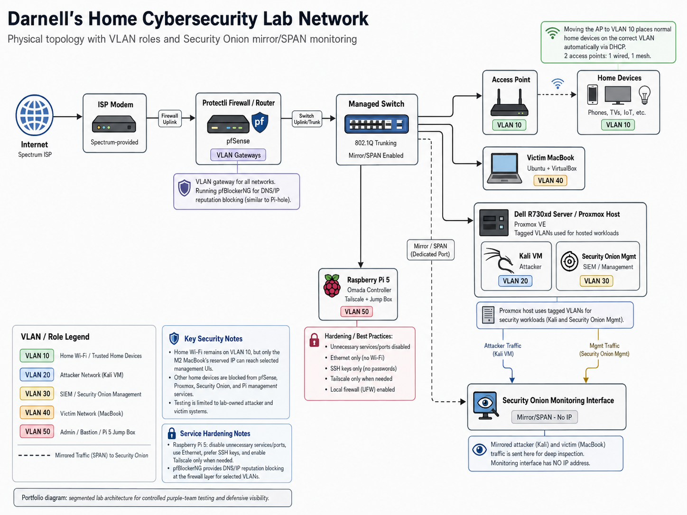
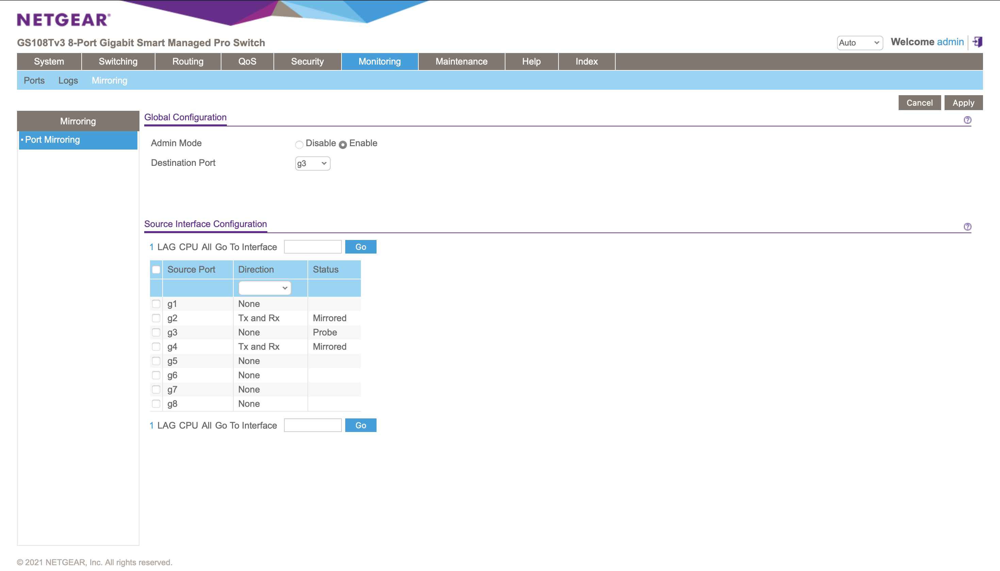
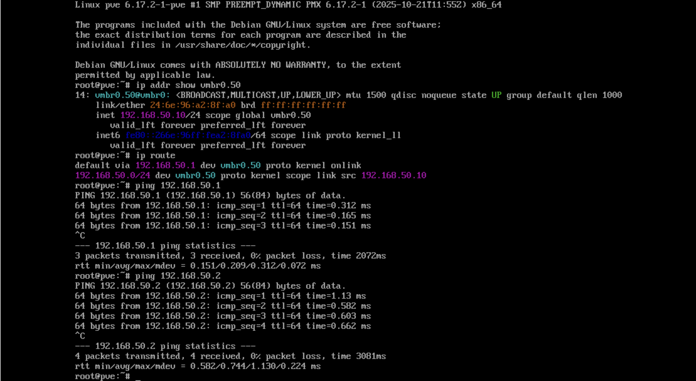
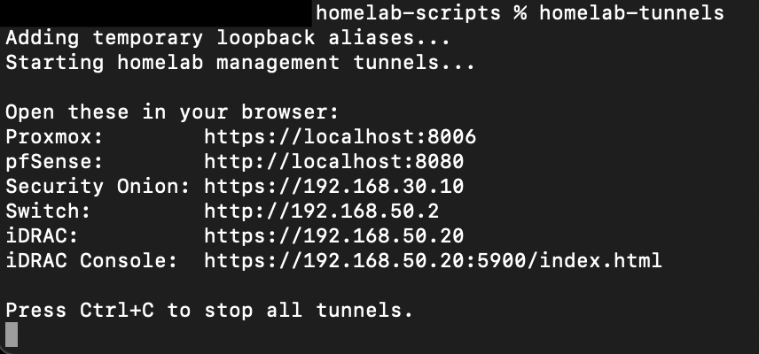

# Project 01: Homelab Architecture and Network Segmentation

## Overview

This project documents the design and baseline architecture of a segmented cybersecurity homelab built to support controlled purple-team exercises. The lab was designed to demonstrate both offensive and defensive security workflows, including adversary simulation, network monitoring, firewall validation, SIEM analysis, endpoint visibility, secure administrative access, and incident response documentation.

The purpose of this project was to establish a secure and repeatable lab environment where attacker activity can be generated from an isolated network, monitored by Security Onion, and analyzed using firewall, network, and endpoint telemetry.

## Lab Environment

| Component | Purpose |
|---|---|
| pfSense | Firewall, VLAN routing, DHCP/DNS, segmentation, and rule enforcement |
| Proxmox | Virtualization platform for Kali Linux, Security Onion, and lab workloads |
| Security Onion | SIEM and network security monitoring platform for alerts, Hunt, Zeek, Suricata, and PCAP visibility |
| Kali Linux | Authorized attacker workstation used for controlled offensive testing |
| Ubuntu Victim Host | Approved victim system on the Victim VLAN and VirtualBox host for the Windows victim VM |
| Windows Victim VM | Approved Windows endpoint target hosted in VirtualBox on the victim system |
| Raspberry Pi 5 | Admin/Bastion host, Omada Controller, Tailscale node, and SSH tunnel endpoint |
| Managed Switch | VLAN tagging, trunking, access ports, PVID assignment, and mirror/SPAN traffic forwarding |
| Dell iDRAC | Out-of-band server management interface for the Dell PowerEdge server |
| M2 MacBook Air | Primary workstation for administration, documentation, screenshots, and GitHub updates |

## Objectives

- Design a segmented cybersecurity homelab using dedicated VLANs for home, attacker, SIEM, victim, and administrative systems.
- Establish pfSense as the central routing, DHCP/DNS, firewall, and segmentation enforcement point.
- Place Security Onion in the environment for network security monitoring and investigation workflows.
- Build a controlled attacker-to-victim testing path that supports future detection and response projects.
- Isolate administrative services behind an Admin/Bastion VLAN and Raspberry Pi 5 access model.
- Document the architecture, scope, rules of engagement, evidence, and security value in a professional portfolio format.

## Network / System Scope

| Item | Details |
|---|---|
| Home VLAN | VLAN 10 / `192.168.10.0/24` for trusted personal devices and normal home network traffic |
| Attacker VLAN | VLAN 20 / `192.168.20.0/24` for Kali Linux and controlled offensive testing |
| SIEM VLAN | VLAN 30 / `192.168.30.0/24` for Security Onion management and monitoring infrastructure |
| Victim VLAN | VLAN 40 / `192.168.40.0/24` for Ubuntu, Windows, and approved target systems |
| Admin/Bastion VLAN | VLAN 50 / `192.168.50.0/24` for Raspberry Pi 5, Tailscale, Omada, Proxmox management, iDRAC, switch management, and administrative access |
| Primary Firewall | Protectli running pfSense |
| Virtualization Host | Dell PowerEdge R730xd running Proxmox VE |
| Monitoring Platform | Security Onion VM with management and monitoring interfaces |
| Validation Method | Review of network topology, VLAN design, pfSense configuration, switch configuration, Proxmox placement, Security Onion access, and bastion-based management paths |

## Implementation Summary

The homelab was built around pfSense as the central firewall and routing point. VLANs were created to isolate home devices, attacker systems, victim systems, SIEM infrastructure, and administrative services. This segmentation allows offensive activity to be generated safely from Kali while limiting unnecessary access to sensitive systems and preserving a realistic enterprise-style network model.

Proxmox runs on a Dell PowerEdge R730xd and hosts core lab workloads such as Kali Linux and Security Onion. The Proxmox host management interface was migrated to the Admin/Bastion VLAN using `vmbr0.50`, while the main VLAN-aware bridge continues to carry tagged VM traffic. Security Onion uses a management interface for access and a monitoring interface for mirrored traffic from the managed switch.

Administrative access is centralized through the Raspberry Pi 5 on VLAN 50. The Pi supports Tailscale and SSH tunneling so that pfSense, Proxmox, Security Onion, iDRAC, and the managed switch can be reached through an approved management path instead of direct Home VLAN access or public internet exposure.

## Scope and Rules of Engagement

This project is limited to a personally owned cybersecurity homelab environment. All testing, scanning, monitoring, and documentation activities are performed only against systems and networks that I own and control.

### In-Scope Assets

| Asset | Role | Scope Status |
|---|---|---|
| Protectli running pfSense | Firewall, routing, DHCP, DNS, VLAN segmentation | In scope |
| Managed switch | VLAN tagging, trunking, access ports, SPAN/mirror traffic | In scope |
| Dell PowerEdge R730xd running Proxmox | Virtualization host for lab workloads | In scope |
| Dell iDRAC | Out-of-band server management interface | In scope |
| Kali Linux VM | Authorized attacker workstation | In scope |
| Security Onion VM | SIEM/network security monitoring platform | In scope |
| 2016 MacBook Air running Ubuntu | Victim host, VirtualBox target platform, and Windows victim VM host | In scope |
| Raspberry Pi 5 | Admin device, Omada Controller, Tailscale/bastion host | In scope |
| M2 MacBook Air | Primary administration and documentation workstation | In scope |

### Out-of-Scope Assets

| Asset Type | Reason |
|---|---|
| Personal home devices | Not part of attack simulations |
| Family/guest devices | Not authorized for testing |
| Employer-owned systems or data | Strictly excluded |
| Public internet targets | Not authorized |
| ISP equipment beyond normal connectivity | Not part of lab testing |
| Production accounts, passwords, or tokens | Must not be used in lab exercises |

### Rules of Engagement

- All offensive activity must remain inside the homelab environment.
- Scanning and testing must only target approved lab systems.
- No testing will be performed against employer systems, public systems, or third-party services.
- Screenshots must be sanitized before publishing.
- Public IP addresses, passwords, tokens, serial numbers, private keys, and sensitive account information must not be included in public documentation.
- Commands should be documented with timestamps when they are used for future detection or investigation work.
- Each offensive action should have a defensive learning purpose, such as validating logs, alerts, firewall behavior, or detection coverage.

## Network Architecture

The network diagram below illustrates the segmented homelab architecture used for controlled purple-team exercises. The lab is built around pfSense for routing and firewall enforcement, a managed switch for VLAN transport and traffic mirroring, Proxmox for virtualized security workloads, and Security Onion for network security monitoring.



The diagram shows the primary segmented lab architecture. Additional victim workloads, including the Windows victim VM, are hosted under the 2016 MacBook Air / VirtualBox target platform on VLAN 40 and are documented in the inventory and evidence sections below.

| VLAN | Name | Subnet | Gateway | Primary Purpose |
|---:|---|---|---|---|
| 10 | Home | `192.168.10.0/24` | `192.168.10.1` | Trusted home devices, Wi-Fi clients, and normal user devices |
| 20 | Attacker | `192.168.20.0/24` | `192.168.20.1` | Kali Linux and offensive security tools |
| 30 | SIEM | `192.168.30.0/24` | `192.168.30.1` | Security Onion management and monitoring infrastructure |
| 40 | Victim | `192.168.40.0/24` | `192.168.40.1` | Ubuntu victim host, Windows victim VM, and vulnerable lab targets |
| 50 | Admin/Bastion | `192.168.50.0/24` | `192.168.50.1` | Raspberry Pi 5, Tailscale, Omada Controller, Proxmox host management, iDRAC, managed switch, and administrative access |

The design separates attacker, victim, monitoring, home, and administrative systems to reduce risk and support realistic security monitoring. Kali generates controlled test traffic from the Attacker VLAN, victim systems receive approved testing activity, and Security Onion receives mirrored traffic for analysis.

## Device Inventory

| Device/System | Role | OS/Platform | VLAN | IP Method | Security Purpose |
|---|---|---|---:|---|---|
| Protectli Vault | Firewall/router | pfSense | All VLAN gateways | Static | Routes traffic, enforces firewall rules, provides DHCP/DNS, and logs allowed and blocked flows |
| Netgear Managed Switch | Switching/VLAN transport | Switch firmware | Multiple | Static/DHCP reservation | Provides VLAN tagging, access ports, trunks, and SPAN/mirror traffic for monitoring |
| Dell PowerEdge R730xd | Virtualization host | Proxmox VE | 50 + trunked VM VLANs | Static | Hosts lab VMs for attacker, SIEM, and future target systems; Proxmox host management is placed on Admin VLAN 50 |
| Dell iDRAC | Out-of-band management interface | iDRAC firmware | 50 | Static/DHCP reservation | Provides remote console access, power control, and hardware management through the Admin/Bastion VLAN |
| Kali Linux VM | Attacker workstation | Kali Linux | 20 | DHCP/reservation | Generates controlled offensive activity for detection and investigation practice |
| Security Onion VM | SIEM/NSM platform | Security Onion | 30 + monitor interface | Static for management | Provides Zeek, Suricata, Hunt, alerts, PCAP, and network telemetry |
| 2016 MacBook Air | Victim host with endpoint telemetry | Ubuntu Linux | 40 | DHCP/reservation | Approved lab target with authentication logs, x11vnc access through SSH tunneling, and VirtualBox target platform |
| Windows Victim VM | Windows endpoint target | Windows 10 VM on VirtualBox | 40 | DHCP/reservation | Approved Windows target used to validate attacker-to-victim connectivity and host firewall behavior |
| Raspberry Pi 5 | Admin/Bastion device | Raspberry Pi OS/Linux | 50 | Static/DHCP reservation | Runs Omada Controller, supports Tailscale, and serves as a jump/bastion host |
| M2 MacBook Air | Primary workstation | macOS | 10 or approved admin path | DHCP | Used for administration, SSH, screenshots, documentation, and GitHub updates |
| TP-Link Omada AP | Wireless access point | Omada firmware | 10 / managed by controller | DHCP/reservation | Provides wireless connectivity and supports managed WLAN design |
| Home Devices | Normal user devices | Various | 10 | DHCP | Represents trusted home network devices excluded from attack testing |

## Monitoring and Visibility Design

Security Onion provides the primary monitoring and detection capability for the lab. Its purpose is to collect and analyze network security telemetry generated during controlled purple-team exercises.

| Function | Purpose |
|---|---|
| Zeek Logs | Provides detailed protocol and connection metadata |
| Suricata Alerts | Detects suspicious or known-bad network activity |
| PCAP | Allows packet-level review of selected traffic |
| Hunt Interface | Supports searching by IP, port, protocol, timestamp, and event type |
| Dashboards | Provides visual summaries of alerts, traffic, and network activity |

Security Onion is configured with a management interface for administration and a monitoring interface for mirrored/SPAN traffic. This design allows the SIEM to be managed through the SIEM VLAN while passively inspecting copied traffic from selected switch ports.

Network monitoring shows communication between systems, while endpoint telemetry helps explain what happened on the host itself. Together, these sources support multi-source investigations that answer what happened on the network, what happened on the endpoint, and how those events correlate in a timeline.

## Administrative Access Model

Administrative services are intentionally separated from normal attacker, victim, and home network activity. VLAN 50 is used as the administrative control plane for the lab and hosts systems that manage or provide secure access to other infrastructure.

| Service | System | Purpose | Recommended Access Path |
|---|---|---|---|
| pfSense Web UI | Protectli firewall | Firewall and VLAN management | Admin VLAN through the Raspberry Pi 5 bastion path |
| Proxmox Web UI | Dell R730xd | VM and host management | Admin VLAN through the Raspberry Pi 5 bastion path to `192.168.50.10:8006` |
| Dell iDRAC Web UI / Remote Console | Dell R730xd | Out-of-band server management, power control, and remote console access | Admin VLAN through the Raspberry Pi 5 bastion path |
| Security Onion Web UI | Security Onion VM | SIEM alerts, Hunt, dashboards, and PCAP | Admin VLAN through the Raspberry Pi 5 bastion path |
| Managed Switch Web UI | Managed switch | VLAN, port, and mirror/SPAN management | Admin VLAN through the Raspberry Pi 5 bastion path |
| Raspberry Pi SSH | Raspberry Pi 5 | Bastion/admin access and service management | Admin VLAN and/or Tailscale |
| Omada Controller | Raspberry Pi 5 | Wireless/AP management | Admin VLAN or approved management source |

The M2 MacBook Air remains on the Home VLAN for normal use, documentation, GitHub updates, screenshots, and research. Direct access from the Home VLAN to lab management services is blocked as part of the segmentation model. Administrative access is performed through the Raspberry Pi 5 on the Admin/Bastion VLAN using Tailscale and SSH tunneling.

The current access model is:

```text
MacBook on external network
↓
Tailscale
↓
Raspberry Pi 5 on Admin/Bastion VLAN
↓
SSH tunnel
↓
Internal management interface
```

This design keeps sensitive management services private and avoids direct WAN exposure. Instead of exposing Proxmox, pfSense, Security Onion, iDRAC, or the managed switch to the public internet, remote access is routed through a controlled bastion path.

## Firewall Boundary Summary

pfSense is the primary enforcement point between VLANs. Each VLAN has a dedicated purpose, and traffic between VLANs is allowed only when there is a clear administrative or lab requirement.

| Source | Destination | Expected Access |
|---|---|---|
| VLAN 20 Attacker | VLAN 40 Victim | Allowed for controlled testing |
| VLAN 20 Attacker | VLAN 50 Admin/Bastion | Blocked |
| VLAN 20 Attacker | VLAN 10 Home | Blocked |
| VLAN 40 Victim | VLAN 50 Admin/Bastion | Blocked |
| VLAN 40 Victim | VLAN 10 Home | Blocked |
| VLAN 50 Admin/Bastion | Management interfaces, including Proxmox at `192.168.50.10:8006` | Allowed as needed |
| M2 MacBook through Raspberry Pi 5 bastion path | pfSense, Proxmox, Security Onion, iDRAC, managed switch | Allowed through approved tunnels |
| VLAN 10 Home devices | Lab management services | Blocked |

The goal of these firewall boundaries is to reduce lateral movement risk, protect administrative services, and keep offensive testing isolated to approved lab systems.

Detailed VLAN firewall rule hardening and validation evidence is documented in Project 02: VLAN Segmentation and Firewall Rule Validation. Project 01 establishes the baseline architecture, while Project 02 focuses on proving that pfSense rules and switch VLAN configuration enforce the intended segmentation model.

## Evidence

| # | Evidence | Description |
|---|---|---|
| 01 | [Network Topology Diagram](../Diagrams/network-topology.png) | Shows the segmented homelab architecture, VLAN zones, core infrastructure, and monitoring placement. |
| 02 | [Windows Victim Default Firewall Behavior](screenshots/windows-victim-default-firewall-filtered.png) | Shows Kali identifying the Windows VM as online with `nmap -Pn` while ping and common Windows ports are filtered by default Windows Firewall behavior. |
| 03 | [VirtualBox Windows VM Bridged Adapter](screenshots/virtualbox-windows-vm-bridged-adapter.png) | Shows the Windows victim VM using bridged networking through the wired victim VLAN adapter. |
| 04 | [Windows Victim IP and ICMP Rule](screenshots/windows-victim-ipconfig-icmp-rule.png) | Shows the Windows VM receiving a VLAN 40 IP address and the lab ICMP firewall rule being created. |
| 05 | [Switch Port Mirroring](screenshots/switch-port-mirroring.png) | Shows the Security Onion monitoring interface configured as the mirror/SPAN destination port. |
| 06 | [Switch VLAN 1 Membership](screenshots/switch-vlan-membership-vlan1.png) | Shows default VLAN membership and remaining untagged/default port behavior. |
| 07 | [Switch VLAN 10 Membership](screenshots/switch-vlan-membership-vlan10.png) | Shows Home VLAN membership for normal home network devices and access point connectivity. |
| 08 | [Switch VLAN 20 Membership](screenshots/switch-vlan-membership-vlan20.png) | Shows Attacker VLAN membership used for Kali/offensive testing traffic. |
| 09 | [Switch VLAN 30 Membership](screenshots/switch-vlan-membership-vlan30.png) | Shows SIEM VLAN membership for Security Onion management traffic. |
| 10 | [Switch VLAN 40 Membership](screenshots/switch-vlan-membership-vlan40.png) | Shows Victim VLAN membership for the Ubuntu victim MacBook and approved target systems. |
| 11 | [Switch VLAN 50 Membership](screenshots/switch-vlan-membership-vlan50.png) | Shows Admin/Bastion VLAN membership for Raspberry Pi 5 and management access. |
| 12 | [Switch PVID Configuration](screenshots/switch-pvid-configuration.png) | Shows how untagged traffic is assigned to the correct VLAN on access ports. |
| 13 | [Switch Port Configuration](screenshots/switch-port-configuration.png) | Shows port link status, port role, speed, duplex, and mirror/probe designation. |
| 14 | [Proxmox VM List](screenshots/proxmox-vm-list.png) | Shows the core lab VMs, including Kali Linux and Security Onion. |
| 15 | [Proxmox Node Summary](screenshots/proxmox-node-summary.png) | Shows the Proxmox host running as the virtualization platform for the lab. |
| 16 | [Proxmox Network Configuration](screenshots/proxmox-network-config.png) | Shows the host bridge/NIC configuration used for VM networking. |
| 17 | [Proxmox Admin VLAN Management](screenshots/proxmox-management-vlan50-vmbr0-50.png) | Shows Proxmox host management migrated to Admin VLAN 50 using `vmbr0.50`. |
| 18 | [Kali VM VLAN 20 Placement](screenshots/kali-vm-hardware-vlan20.png) | Shows the Kali VM assigned to VLAN 20 for controlled attacker traffic. |
| 19 | [Security Onion VM Hardware](screenshots/security-onion-vm-hardware.png) | Shows Security Onion resources and separate management and monitoring interfaces. |
| 20 | [Tailscale Status](screenshots/pi-tailscale-status.png) | Shows the Raspberry Pi 5 and approved MacBook active on the Tailscale network. |
| 21 | [Raspberry Pi VLAN 50 IP Address](screenshots/pi-vlan50-ip-address.png) | Shows the Raspberry Pi connected by Ethernet on the Admin/Bastion VLAN. |
| 22 | [Raspberry Pi Routing Table](screenshots/pi-routing-table.png) | Shows the Pi using the Admin/Bastion VLAN gateway for normal network routing. |
| 23 | [Homelab Management Tunnels](screenshots/homelab-tunnels-running.png) | Shows SSH tunnels for Proxmox, pfSense, Security Onion, managed switch, iDRAC, and the iDRAC virtual console. |
| 24 | [Victim VNC Tunnel](screenshots/victim-vnc-tunnel-working.png) | Shows VNC access to the Ubuntu victim host through the Raspberry Pi 5 jump-host path. |
| 25 | [iDRAC Virtual Console Access](screenshots/idrac-virtual-console-working.png) | Shows out-of-band iDRAC access and virtual console preview through the approved management path. |
| 26 | [Security Onion Login Page](screenshots/security-onion-login-page.png) | Shows that the Security Onion web interface is reachable through the approved access path. |
| 27 | [Security Onion Dashboard](screenshots/security-onion-dashboard.png) | Shows the dashboard interface used for baseline monitoring and telemetry review. |
| 28 | [Security Onion Alerts Page](screenshots/security-onion-alerts-page.png) | Shows the alert triage interface used to review detections and alert status. |
| 29 | [Security Onion Hunt Page](screenshots/security-onion-hunt-page.png) | Shows the investigation interface used to search and review event data. |
| 30 | [pfSense Dashboard](screenshots/pfsense-dashboard.png) | Shows pfSense running as the lab firewall/router with active VLAN interfaces. |
| 31 | [pfSense Interface Assignments](screenshots/pfsense-interface-assignments.png) | Shows WAN, LAN, Home, Attacker, SIEM, Victim, and Admin interface assignments. |
| 32 | [pfSense VLAN Interfaces](screenshots/pfsense-vlan-interfaces.png) | Shows VLAN 10, 20, 30, 40, and 50 configured on the LAN parent interface. |
| 33 | [pfSense Admin Firewall Rules](screenshots/pfsense-firewall-rules-admin.png) | Shows the final Admin/Bastion firewall rules controlling access to management services. |

## Key Evidence

### Network Topology


This diagram shows the segmented homelab architecture, including pfSense, Proxmox, Security Onion, Kali, victim systems, the managed switch, and the Admin/Bastion access path.

### Switch Mirror/SPAN Configuration



This screenshot shows the managed switch mirror/SPAN configuration used to forward selected traffic to the Security Onion monitoring interface.

### Proxmox Admin VLAN Management



This screenshot shows Proxmox host management migrated to Admin VLAN 50 using `vmbr0.50`, which places the hypervisor management plane with the rest of the protected administrative services.

### Homelab Management Tunnels



This screenshot shows the repeatable SSH tunnel workflow used to access internal management services through the Raspberry Pi 5 bastion path.

## Validation

The project was validated by reviewing the network topology, VLAN layout, device inventory, pfSense interface configuration, switch VLAN membership, Proxmox VM placement, Security Onion access, Raspberry Pi 5 Admin/Bastion placement, Tailscale status, SSH tunnel behavior, and iDRAC remote console access.

Validation confirmed the following:

- VLANs were assigned for home, attacker, SIEM, victim, and administrative functions.
- pfSense provided the gateway, DHCP/DNS, routing, and firewall enforcement point for the segmented lab.
- The managed switch supported VLAN transport and mirror/SPAN forwarding for Security Onion visibility.
- Kali Linux was placed in the Attacker VLAN for controlled offensive testing.
- Victim systems were placed in the Victim VLAN for approved testing activity.
- Security Onion was reachable through its management path and positioned to receive monitored traffic.
- Proxmox host management was isolated on the Admin/Bastion VLAN using `vmbr0.50`.
- Administrative access was performed through the Raspberry Pi 5 bastion workflow instead of broad Home VLAN access.
- iDRAC web and virtual console access were reachable through the approved management path.

## Challenges and Lessons Learned

This project established the baseline architecture for a segmented purple-team homelab. The design separates home, attacker, victim, SIEM, and administrative systems into dedicated VLANs, allowing controlled testing while reducing unnecessary exposure.

Key lessons from this phase included the importance of isolating the management plane, validating VLAN placement at both the firewall and switch layers, and documenting how each system supports the overall security model. Proxmox required special attention because the host management interface needed to be separated from VM traffic while still allowing VLAN-tagged workloads to function through the trunked bridge.

This project also reinforced that network visibility and endpoint visibility answer different questions. Security Onion helps explain what happened on the network, while endpoint telemetry and host-level logs help explain what happened on the system itself.

## Security Relevance

This project demonstrates how segmentation, secure administrative access, and centralized monitoring support real-world cybersecurity operations. Enterprise networks rely on similar concepts to separate user systems, security tools, servers, management interfaces, and high-risk testing or production environments.

The architecture also supports practical security workflows such as firewall validation, attacker-to-victim testing, SIEM investigation, endpoint telemetry review, remote administration, and incident response documentation. By defining scope and rules of engagement, the lab models the type of control required for safe and authorized security testing.

## Business Value

This project provides business value by showing how a well-documented segmented architecture can reduce risk, improve visibility, and support repeatable security operations. Separating attacker, victim, SIEM, home, and administrative systems reduces unnecessary exposure and helps limit lateral movement risk.

In an enterprise environment, this type of design helps teams:

- Protect sensitive administrative interfaces from broad user-network access.
- Validate that monitoring tools are placed where they can collect useful telemetry.
- Reduce the chance of accidental testing against unauthorized systems.
- Support troubleshooting by clearly documenting VLANs, IP ranges, and system roles.
- Create reusable documentation for audits, handoffs, incident response, and future security engineering work.

## Portfolio Summary

This project demonstrates the ability to design and document a segmented cybersecurity homelab using pfSense, Proxmox, Security Onion, Kali Linux, Linux and Windows victim endpoints, iDRAC out-of-band management, and a Raspberry Pi 5 bastion model.

The project highlights hands-on experience with network segmentation, virtualization, SIEM placement, VLAN design, secure administrative access, evidence collection, scope definition, and professional technical documentation.
