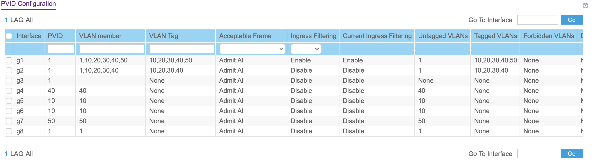
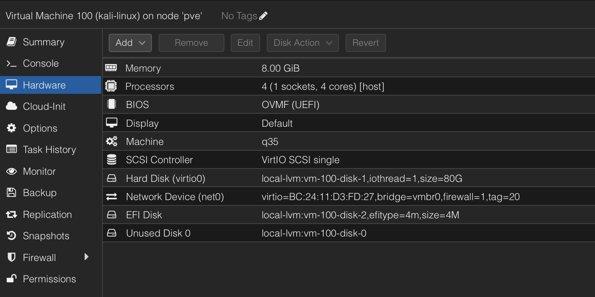
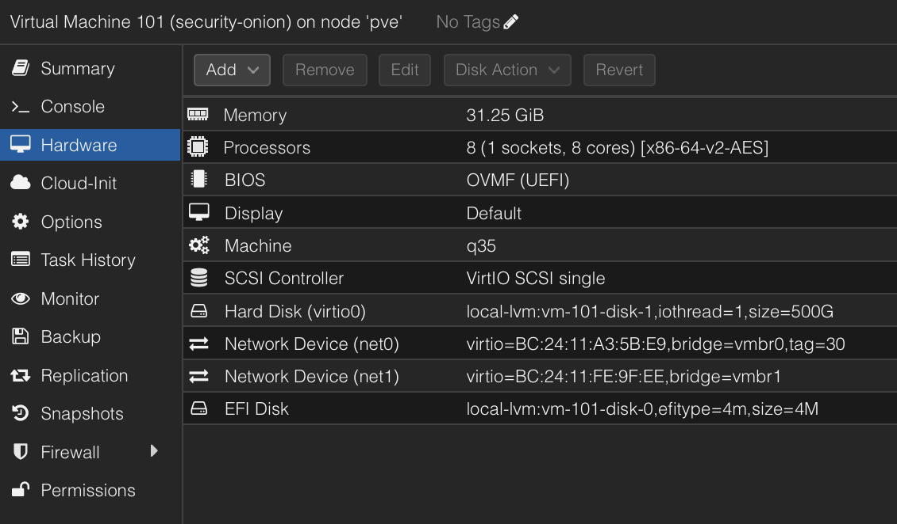

# Homelab Architecture and Segmentation

## Objective

This project documents the design and baseline architecture of a segmented cybersecurity homelab built to support controlled purple-team exercises. The lab is designed to demonstrate both offensive and defensive security workflows, including adversary simulation, network monitoring, firewall validation, SIEM analysis, endpoint visibility, and incident response documentation.

The purpose of this project is to establish a secure and repeatable lab environment where attacker activity can be generated from an isolated network, monitored by Security Onion, and analyzed using firewall, network, and endpoint telemetry.

## Business and Security Value

Enterprise environments rely on segmentation, centralized monitoring, controlled administrative access, and documented asset ownership to reduce risk and improve incident response. This homelab models those same concepts at a smaller scale by separating home devices, attacker systems, victim systems, SIEM infrastructure, and administrative access into dedicated VLANs.

This design helps demonstrate practical knowledge of network security architecture, firewall rule design, SIEM placement, virtualization, secure remote access, and blue-team investigation workflows.

## Scope and Rules of Engagement

This project is limited to a personally owned cybersecurity homelab environment. All testing, scanning, monitoring, and documentation activities are performed only against systems and networks that I own and control.

### In-Scope Assets

The following systems are considered in scope for this project:

| Asset | Role | Scope Status |
|---|---|---|
| Protectli running pfSense | Firewall, routing, DHCP, DNS, VLAN segmentation | In scope |
| Managed switch | VLAN tagging, trunking, access ports, SPAN/mirror traffic | In scope |
| Dell PowerEdge R730xd running Proxmox | Virtualization host for lab workloads | In scope |
| Kali Linux VM | Authorized attacker workstation | In scope |
| Security Onion VM | SIEM/network security monitoring platform | In scope |
| 2016 MacBook Air running Ubuntu | Victim host and VirtualBox target platform | In scope |
| Raspberry Pi 5 | Admin device, Omada Controller, Tailscale/bastion host | In scope |
| M2 MacBook Air | Primary administration and documentation workstation | In scope |

### Out-of-Scope Assets

The following systems are not approved targets for offensive testing:

| Asset Type | Reason |
|---|---|
| Personal home devices | Not part of attack simulations |
| Family/guest devices | Not authorized for testing |
| Employer-owned systems or data | Strictly excluded |
| Public internet targets | Not authorized |
| ISP equipment beyond normal connectivity | Not part of lab testing |
| Production accounts, passwords, or tokens | Must not be used in lab exercises |

### Rules of Engagement

- All offensive activity must remain inside the homelab environment.
- Scanning and testing must only target approved lab systems.
- No testing will be performed against employer systems, public systems, or third-party services.
- Screenshots must be sanitized before publishing.
- Public IP addresses, passwords, tokens, serial numbers, private keys, and sensitive account information must not be included in public documentation.
- Commands must be documented with timestamps when they are used for future detection or investigation work.
- Each offensive action should have a defensive learning purpose, such as validating logs, alerts, firewall behavior, or detection coverage.

### Testing Philosophy

This lab is designed for controlled purple-team learning. Red-team activity is used to safely generate realistic security events, while blue-team activity focuses on visibility, investigation, detection improvement, and professional reporting.

## Lab Environment Overview

The homelab is designed as a small enterprise-style purple-team environment. It separates trusted home devices, attacker systems, victim systems, monitoring infrastructure, and administrative access into different VLANs. This allows offensive activity to be generated in a controlled way while defensive tools capture and analyze the resulting traffic.

### Core Infrastructure

| Component | Role | Security Purpose |
|---|---|---|
| Protectli running pfSense | Firewall, router, DHCP/DNS, VLAN gateway | Enforces segmentation and logs allowed/blocked traffic |
| Managed Switch | VLAN trunking, access ports, mirror/SPAN port | Connects physical devices and forwards mirrored traffic to Security Onion |
| Dell PowerEdge R730xd | Proxmox virtualization host | Runs core lab VMs such as Kali and Security Onion |
| Raspberry Pi 5 | Admin/Bastion device, Omada Controller, Tailscale node | Provides controlled administrative access and network management |
| TP-Link Omada AP | Wireless access point | Provides wireless connectivity for approved home/admin devices |

### Security and Testing Systems

| System | Role | Security Purpose |
|---|---|---|
| Kali Linux VM | Authorized attacker workstation | Used for controlled scanning, enumeration, and adversary simulation |
| Security Onion VM | SIEM/Network Security Monitoring platform | Provides Zeek, Suricata, alert triage, Hunt, and PCAP visibility |
| 2016 MacBook Air running Ubuntu | Victim host / VirtualBox platform | Serves as an approved target system for lab testing |
| M2 MacBook Air | Primary admin workstation | Used for documentation, SSH, screenshots, GitHub updates, and lab administration |

### Design Summary

The lab uses pfSense as the central firewall and routing point. VLANs are used to isolate systems by function. The attacker environment is separated from the victim environment, while Security Onion is positioned to monitor relevant traffic. Administrative access is limited to trusted paths through the Admin/Bastion network.

This structure allows the lab to support both red-team and blue-team workflows:

- Red-team activity can be launched from Kali in a controlled attacker VLAN.
- Victim systems can be safely tested without exposing home devices.
- Security Onion can monitor traffic and provide defender visibility.
- pfSense can enforce access control and provide firewall log evidence.
- The Raspberry Pi 5 can support secure administrative access through Tailscale and SSH.

## High-Level Traffic Flow

At a high level, traffic moves through the lab in the following way:

1. The Protectli firewall running pfSense connects to the internet modem and acts as the main routing and security control point.
2. The managed switch connects to pfSense and carries VLAN-tagged traffic to lab devices and virtualized workloads.
3. The Dell PowerEdge R730xd runs Proxmox and hosts virtual machines such as Kali Linux and Security Onion.
4. Kali Linux generates controlled attacker traffic from the attacker VLAN.
5. Victim systems receive approved test traffic on the victim VLAN.
6. Security Onion receives monitored traffic through its management and monitoring interfaces.
7. The Raspberry Pi 5 supports administrative access, Omada Controller services, and Tailscale-based remote access.
8. The M2 MacBook Air is used as the main workstation for administration, documentation, and evidence collection.

## VLAN and IP Plan

The lab uses VLANs to separate systems by purpose. This segmentation helps reduce unnecessary access between trusted home devices, attacker systems, victim systems, monitoring infrastructure, and administrative services.

| VLAN | Name | Subnet | Gateway | Primary Purpose |
|---:|---|---|---|---|
| 10 | Home | 192.168.10.0/24 | 192.168.10.1 | Trusted home devices, Wi-Fi clients, normal user devices |
| 20 | Attacker | 192.168.20.0/24 | 192.168.20.1 | Kali Linux and offensive security tools |
| 30 | SIEM | 192.168.30.0/24 | 192.168.30.1 | Security Onion management and monitoring infrastructure |
| 40 | Victim | 192.168.40.0/24 | 192.168.40.1 | Ubuntu victim host and vulnerable lab targets |
| 50 | Admin/Bastion | 192.168.50.0/24 | 192.168.50.1 | Raspberry Pi 5, Tailscale, Omada Controller, administrative access |

### VLAN Purpose and Security Role

| VLAN | Security Role | Example Systems |
|---:|---|---|
| 10 | Normal trusted home network | Personal devices, home Wi-Fi clients|
| 20 | Controlled attacker network | Kali Linux VM |
| 30 | Monitoring and SIEM network | Security Onion VM |
| 40 | Approved target network | Ubuntu victim host, vulnerable VMs |
| 50 | Administrative control plane | Raspberry Pi 5, Tailscale, Omada Controller |

### IP Assignment Strategy

Most endpoint systems receive IP addresses from pfSense DHCP pools. Infrastructure systems that require consistent access should use static IP addresses or DHCP reservations.

| Device/System | VLAN | Suggested IP Method | Notes |
|---|---:|---|---|
| pfSense VLAN gateways | 10, 20, 30, 40, 50 | Static | Each VLAN interface uses a static gateway IP |
| Proxmox host | Admin or server trunk path | Static/DHCP reservation | Should have a predictable management address |
| Kali Linux VM | 20 | DHCP or reservation | Attacker source IP should be documented before testing |
| Security Onion management interface | 30 | Static | SIEM web UI and management should remain predictable |
| Security Onion monitoring interface | Mirror/SPAN feed | No IP or monitoring-only | Used to observe mirrored traffic |
| Ubuntu victim host | 40 | DHCP or reservation | Target IP should be documented before simulations |
| Raspberry Pi 5 | 50 | Static or DHCP reservation | Admin/Bastion, Tailscale, and Omada Controller |
| M2 MacBook Air | 10 or approved admin path | DHCP | Primary workstation for administration and documentation |

### Static Addressing Notes

The VLAN gateways are statically assigned on pfSense because they serve as the default gateway for each subnet. Endpoints can still use DHCP because pfSense manages address assignment inside each VLAN.

For example:

- Devices in VLAN 10 use `192.168.10.1` as their gateway.
- Devices in VLAN 20 use `192.168.20.1` as their gateway.
- Devices in VLAN 30 use `192.168.30.1` as their gateway.
- Devices in VLAN 40 use `192.168.40.1` as their gateway.
- Devices in VLAN 50 use `192.168.50.1` as their gateway.

### Management Access Design

Administrative interfaces should not be reachable from every VLAN. Management access should be limited to trusted systems and approved paths.

Examples of management services include:

| Service | Recommended Access |
|---|---|
| pfSense web UI | Admin VLAN or approved admin workstation only |
| Proxmox web UI | Admin VLAN or approved bastion path only |
| Security Onion web UI | Admin VLAN or approved admin workstation only |
| Raspberry Pi SSH | Admin VLAN and/or Tailscale only |
| Omada Controller | Admin VLAN or approved management source only |

### Segmentation Goal

The goal of this VLAN design is to ensure that compromise or testing activity in one area of the lab does not automatically expose the rest of the environment. Kali can be used to generate attacker traffic, victim systems can be safely tested, Security Onion can monitor activity, and administrative services remain protected behind stricter access controls.

## Device Inventory

The following table documents the major systems used in the homelab, their assigned roles, VLAN placement, and security purpose. This inventory helps establish asset ownership, scope, and expected telemetry sources for future purple-team exercises.

| Device/System | Role | OS/Platform | VLAN | IP Method | Security Purpose |
|---|---|---|---:|---|---|
| Protectli Vault | Firewall/router | pfSense | All VLAN gateways | Static | Routes traffic, enforces firewall rules, provides DHCP/DNS, logs allowed and blocked flows |
| Netgear Managed Switch | Switching/VLAN transport | Switch firmware | Multiple | Static/DHCP reservation | Provides VLAN tagging, access ports, trunks, and SPAN/mirror traffic for monitoring |
| Dell PowerEdge R730xd | Virtualization host | Proxmox VE | Management/trunked VLANs | Static/DHCP reservation | Hosts lab VMs for attacker, SIEM, and future target systems |
| Kali Linux VM | Attacker workstation | Kali Linux | 20 | DHCP/reservation | Generates controlled offensive activity for detection and investigation practice |
| Security Onion VM | SIEM/NSM platform | Security Onion | 30 + monitor interface | Static for management | Provides Zeek, Suricata, Hunt, alerts, PCAP, and network telemetry |
| 2016 MacBook Air | Victim host with endpoint telemetry | Ubuntu Linux | 40 | DHCP/reservation | Approved lab target with Elastic Agent, Sysmon-style telemetry, authentication logs, and VirtualBox target platform |
| Raspberry Pi 5 | Admin/Bastion device | Raspberry Pi OS/Linux | 50 | Static/DHCP reservation | Runs Omada Controller, supports Tailscale, and can serve as a jump/bastion host |
| M2 MacBook Air | Primary workstation | macOS | 10 or approved admin path | DHCP | Used for administration, SSH, screenshots, documentation, and GitHub updates |
| TP-Link Omada AP | Wireless access point | Omada firmware | 10 / managed by controller | DHCP/reservation | Provides wireless connectivity and supports managed WLAN design |
| Home Devices | Normal user devices | Various | 10 | DHCP | Represents trusted home network devices excluded from attack testing |

### Inventory Notes

This inventory separates systems by function so that each device has a clear role in the lab. The attacker system, victim systems, SIEM platform, home devices, and administrative services are intentionally separated to support controlled testing and reduce unnecessary exposure.

The device inventory will be updated as additional lab systems are added, such as Windows targets, vulnerable Linux VMs, Active Directory systems, honeypots, or additional endpoint logging agents.

## Monitoring and Visibility Design

Security Onion provides the primary monitoring and detection capability for the lab. Its purpose is to collect and analyze network security telemetry generated during controlled purple-team exercises.

The monitoring design is intended to answer the following questions:

- What traffic crossed the network?
- Which systems communicated?
- Which ports, protocols, and services were involved?
- Did any activity trigger Suricata alerts?
- Can Zeek logs help reconstruct the activity?
- Are there visibility gaps that require endpoint telemetry?

### Security Onion Role

| Function | Purpose |
|---|---|
| Zeek Logs | Provides detailed protocol and connection metadata |
| Suricata Alerts | Detects suspicious or known-bad network activity |
| PCAP | Allows packet-level review of selected traffic |
| Hunt Interface | Supports searching by IP, port, protocol, timestamp, and event type |
| Dashboards | Provides visual summaries of alerts, traffic, and network activity |

### Monitoring Placement

Security Onion is placed in the lab to monitor traffic from controlled test scenarios. The Security Onion VM uses a management interface for administration and a monitoring interface for mirrored/SPAN traffic from the managed switch.

| Interface Type | Purpose |
|---|---|
| Management Interface | Used to access the Security Onion web UI and manage the platform |
| Monitoring Interface | Receives mirrored traffic from the switch for analysis |
| SIEM VLAN Placement | Keeps Security Onion logically separated from attacker and victim systems |

### Expected Visibility

The lab should provide visibility into the following activity:

| Activity Type | Expected Visibility Source |
|---|---|
| Ping/ICMP tests | Zeek connection logs, possible packet captures |
| DNS lookups | Zeek DNS logs |
| HTTP requests | Zeek HTTP logs, possible Suricata alerts |
| HTTPS connections | Zeek SSL/TLS metadata, connection logs |
| Nmap scans | Zeek connection logs, Suricata alerts, traffic bursts |
| SSH attempts | Zeek connection logs, victim authentication logs, pfSense logs |
| Blocked cross-VLAN access | pfSense firewall logs |
| Administrative access attempts | pfSense logs, service logs, endpoint logs |

### Endpoint Telemetry Integration

In addition to network visibility from Security Onion, the victim system is being configured with endpoint telemetry tools. This provides host-level evidence that network monitoring alone may not capture.

The victim host will include Elastic Agent and Sysmon-style telemetry so that future investigations can combine network events with endpoint activity.

| Telemetry Source | Purpose |
|---|---|
| Elastic Agent | Forwards endpoint logs and security telemetry for analysis |
| Sysmon / Sysmon for Linux | Captures detailed system activity such as process creation, network connections, and file activity |
| Linux authentication logs | Tracks SSH logins, failed authentication, sudo attempts, and account activity |
| System logs / journalctl | Provides operating system and service-level evidence |
| Security Onion | Provides network visibility through Zeek, Suricata, Hunt, alerts, and PCAP |

### Network vs Endpoint Visibility

Network monitoring helps show communication between systems, but endpoint telemetry helps explain what happened on the host itself.

| Activity | Network Visibility | Endpoint Visibility |
|---|---|---|
| Ping or scan traffic | Security Onion, Zeek, Suricata | May show related network connections |
| SSH connection attempt | Security Onion, pfSense logs | Auth logs, Elastic Agent, Sysmon |
| Successful login | Limited network evidence | Strong endpoint evidence |
| Command execution | Usually not visible on the network | Elastic Agent, Sysmon, shell/system logs |
| Sudo attempt | Not visible in network traffic | Linux auth logs, journalctl |
| File access | Usually not visible on the network | Sysmon/audit-style endpoint logs |
| Web request | Zeek HTTP logs, Suricata, PCAP | Browser/process activity if endpoint logging captures it |

### Visibility Design Summary

This lab is designed to support multi-source investigation. Security Onion provides network security monitoring, while Elastic Agent and Sysmon-style endpoint telemetry provide host-level evidence from the victim system.

Together, these sources allow future projects to answer three important analyst questions:

1. What happened on the network?
2. What happened on the endpoint?
3. How do the network and endpoint events correlate in a timeline?

## Baseline Evidence to Capture

The following screenshots and notes should be captured for this project before moving into active testing:

| Evidence | Purpose |
|---|---|
| pfSense VLAN interfaces | Proves VLAN gateways and segmentation are configured |
| pfSense firewall rules | Shows traffic control between networks |
| Managed switch VLAN membership | Shows access/trunk port assignments |
| Managed switch mirror/SPAN configuration | Shows how traffic is forwarded to Security Onion |
| Proxmox VM list | Shows virtual lab workloads |
| Kali VM network settings | Shows attacker VLAN placement |
| Security Onion VM network settings | Shows management and monitoring interface design |
| Security Onion login/dashboard | Proves the monitoring platform is reachable |
| Raspberry Pi 5 network settings | Shows admin/bastion VLAN placement |
| Network topology diagram | Explains the full architecture visually |
| Elastic Agent status on victim | Shows endpoint telemetry collection is installed and active |
| Sysmon/Sysmon for Linux status on victim | Shows host-level activity logging is configured |
| Sample victim endpoint logs | Proves endpoint activity can be reviewed during investigations |

Screenshots should be sanitized before publishing. Passwords, public IP addresses, serial numbers, private keys, tokens, and unrelated personal or employer information should not be included.

## Administrative Access Model

Administrative services are intentionally separated from normal attacker, victim, and home network activity. The goal is to protect the lab management plane while still allowing approved access for administration, monitoring, and documentation.

### Management Services

| Service | System | Purpose | Recommended Access Path |
|---|---|---|---|
| pfSense Web UI | Protectli firewall | Firewall and VLAN management | Admin VLAN or approved workstation path |
| Proxmox Web UI | Dell R730xd | VM and host management | Admin VLAN or bastion path |
| Security Onion Web UI | Security Onion VM | SIEM alerts, Hunt, dashboards, PCAP | Admin VLAN or approved workstation path |
| Raspberry Pi SSH | Raspberry Pi 5 | Bastion/admin access and service management | Admin VLAN and/or Tailscale |
| Omada Controller | Raspberry Pi 5 | Wireless/AP management | Admin VLAN or approved management source |

### Admin/Bastion VLAN

VLAN 50 is used as the administrative control plane for the lab. It is intended to host systems that manage or provide secure access to other infrastructure.

| VLAN | Name | Role |
|---:|---|---|
| 50 | Admin/Bastion | Management access, Raspberry Pi 5, Tailscale, Omada Controller, SSH jump path |

The Raspberry Pi 5 is placed in this VLAN because it performs multiple administrative functions. It can serve as a local management device, a Tailscale node, and a controlled access point into the lab.

### Access Control Goals

The management model is designed around the following goals:

- Prevent attacker and victim VLANs from directly accessing administrative interfaces.
- Limit access to pfSense, Proxmox, and Security Onion management interfaces.
- Use the Raspberry Pi 5 as a controlled administrative point where appropriate.
- Avoid exposing lab management services directly to the public internet.
- Allow remote access through Tailscale instead of direct WAN port forwarding.
- Preserve firewall log evidence for both allowed and blocked management attempts.

### Example Approved Access

| Source | Destination | Expected Result |
|---|---|---|
| Raspberry Pi 5 on VLAN 50 | Proxmox Web UI | Allowed |
| Raspberry Pi 5 on VLAN 50 | Security Onion Web UI | Allowed |
| Raspberry Pi 5 on VLAN 50 | pfSense Web UI | Allowed |
| M2 MacBook through approved admin path | Proxmox/Security Onion/pfSense | Allowed |
| Kali on VLAN 20 | Proxmox Web UI | Blocked |
| Victim host on VLAN 40 | pfSense Web UI | Blocked |
| Home devices on VLAN 10 | Lab management services | Blocked or restricted |

### Approved Workstation Exception

Although the primary administrative network is VLAN 50, the M2 MacBook Air may remain on the Home VLAN for normal use. To support secure administration without giving all home devices access to management services, the MacBook is assigned a DHCP reservation and treated as an approved administrative source.

Firewall rules allow the MacBook's reserved IP address to reach only specific management interfaces, such as pfSense, Proxmox, Security Onion, and the Raspberry Pi. Other Home VLAN devices remain blocked from accessing lab management services.

This design allows convenient administration from the primary workstation while still maintaining least-privilege access controls.

### Remote Access Design

Remote access should be performed through a secure overlay or bastion model rather than direct exposure of management ports.

The preferred design is:

1. Connect to Tailscale from an approved personal device.
2. Reach the Raspberry Pi 5 on the Admin/Bastion VLAN.
3. Use SSH tunnels or approved web access paths to reach internal management services.
4. Keep pfSense, Proxmox, and Security Onion management interfaces private.

This design demonstrates secure remote administration without exposing sensitive lab services directly to the internet.

## Network Diagram

The network diagram below illustrates the segmented homelab architecture used for controlled purple-team exercises. The lab is built around pfSense for routing and firewall enforcement, a managed switch for VLAN transport and traffic mirroring, Proxmox for virtualized security workloads, and Security Onion for network security monitoring.

The diagram highlights the five primary VLAN zones:

| VLAN | Name | Purpose |
|---:|---|---|
| 10 | Home | Trusted personal devices and normal home network traffic |
| 20 | Attacker | Kali Linux and controlled offensive testing |
| 30 | SIEM | Security Onion management and monitoring |
| 40 | Victim | Approved target systems and vulnerable lab hosts |
| 50 | Admin/Bastion | Raspberry Pi 5, Tailscale, Omada Controller, and management access |

The design separates attacker, victim, monitoring, home, and administrative systems to reduce risk and support realistic security monitoring. Kali generates controlled test traffic from the attacker VLAN, victim systems receive approved testing activity, and Security Onion receives mirrored traffic for analysis.

Administrative access is restricted through VLAN 50 and approved workstation firewall rules. The M2 MacBook Air may access specific management interfaces from its reserved Home VLAN IP, while other home devices remain blocked from lab management services.

## Firewall Boundary Summary

pfSense is the primary enforcement point between VLANs. Each VLAN has a dedicated purpose, and traffic between VLANs should be allowed only when there is a clear administrative or lab requirement.

| Source | Destination | Expected Access |
|---|---|---|
| VLAN 20 Attacker | VLAN 40 Victim | Allowed for controlled testing |
| VLAN 20 Attacker | VLAN 50 Admin/Bastion | Blocked |
| VLAN 20 Attacker | VLAN 10 Home | Blocked |
| VLAN 40 Victim | VLAN 50 Admin/Bastion | Blocked |
| VLAN 40 Victim | VLAN 10 Home | Blocked |
| VLAN 50 Admin/Bastion | Management interfaces | Allowed as needed |
| Approved M2 MacBook IP | pfSense, Proxmox, Security Onion, Pi | Allowed to specific ports only |
| Other VLAN 10 Home devices | Lab management services | Blocked or restricted |

The goal of these firewall boundaries is to reduce lateral movement risk, protect administrative services, and keep offensive testing isolated to approved lab systems.

## Baseline Evidence Checklist

The following screenshots and evidence should be captured for this project before moving into active testing:

| Evidence | Purpose | Status |
|---|---|---|
| Network topology diagram | Shows the full lab architecture | Complete |
| pfSense VLAN interfaces | Proves VLAN gateways are configured | Pending |
| pfSense firewall rules | Shows segmentation and access control | Pending |
| Managed switch VLAN membership | Shows trunk/access VLAN assignments | Pending |
| Managed switch mirror/SPAN settings | Shows traffic mirroring to Security Onion | Pending |
| Proxmox VM list | Shows hosted lab workloads | Pending |
| Kali VM VLAN/network settings | Shows attacker placement | Pending |
| Security Onion VM interfaces | Shows management and monitor interfaces | Pending |
| Security Onion dashboard/login | Shows SIEM access is functional | Pending |
| Raspberry Pi 5 network settings | Shows Admin/Bastion VLAN placement | Pending |
| Elastic Agent/Sysmon status on victim | Shows endpoint telemetry setup | Pending |

Screenshots will be sanitized before publishing. Sensitive information such as public IP addresses, passwords, serial numbers, tokens, and unrelated personal or employer information will not be included.

## Evidence: Managed Switch VLAN and Mirror/SPAN Configuration

The managed switch is responsible for carrying VLAN-tagged traffic between pfSense, Proxmox, the victim network, home devices, and the Admin/Bastion network. It also provides the mirror/SPAN feed used by Security Onion for passive network monitoring.

### Switch Evidence Summary

| Evidence | Screenshot | What It Shows |
|---|---|---|
| Port mirroring configuration | [switch-port-mirroring.png](screenshots/switch-port-mirroring.png) | Shows the Security Onion monitoring interface configured as the probe/destination port and selected attacker/victim ports configured as mirrored sources |
| VLAN 1 membership | [switch-vlan-membership-vlan1.png](screenshots/switch-vlan-membership-vlan1.png) | Shows default VLAN membership and remaining untagged/default port behavior |
| VLAN 10 membership | [switch-vlan-membership-vlan10.png](screenshots/switch-vlan-membership-vlan10.png) | Shows Home VLAN membership for normal home network devices and access point connectivity |
| VLAN 20 membership | [switch-vlan-membership-vlan20.png](screenshots/switch-vlan-membership-vlan20.png) | Shows Attacker VLAN membership used for Kali/offensive testing traffic |
| VLAN 30 membership | [switch-vlan-membership-vlan30.png](screenshots/switch-vlan-membership-vlan30.png) | Shows SIEM VLAN membership for Security Onion management traffic |
| VLAN 40 membership | [switch-vlan-membership-vlan40.png](screenshots/switch-vlan-membership-vlan40.png) | Shows Victim VLAN membership for the Ubuntu victim MacBook and approved target systems |
| VLAN 50 membership | [switch-vlan-membership-vlan50.png](screenshots/switch-vlan-membership-vlan50.png) | Shows Admin/Bastion VLAN membership for Raspberry Pi 5 and management access |
| PVID configuration | [switch-pvid-configuration.png](screenshots/switch-pvid-configuration.png) | Shows how untagged traffic is assigned to the correct VLAN on access ports |
| Port configuration | [switch-port-configuration.png](screenshots/switch-port-configuration.png) | Shows port link status, port role, speed, duplex, and mirror/probe designation |

### Switch Configuration Notes

The switch uses VLAN membership and PVID settings to separate traffic by role. Trunk/tagged ports carry multiple VLANs where needed, while access ports place untagged endpoint traffic into the appropriate VLAN.

The mirror/SPAN configuration sends selected traffic to the Security Onion monitoring interface. The monitoring interface is configured as the probe/destination port and does not require an IP address because it passively receives copied traffic for inspection.

At the time of evidence capture, the victim port was configured for mirroring but may appear as link down if the victim MacBook was not physically connected. This does not invalidate the configuration; it simply reflects the port state during the screenshot.

### Key Switch Screenshots

**Mirror/SPAN Configuration**

**PVID Configuration**

## Evidence: Proxmox Virtualization and VM Placement

Proxmox VE is running on the Dell PowerEdge R730xd and hosts the core lab workloads used for controlled purple-team testing. The Kali Linux VM is assigned to the attacker VLAN, while the Security Onion VM uses separate interfaces for management and monitoring.

### Proxmox Evidence Summary

| Evidence | Screenshot | What It Shows |
|---|---|---|
| Proxmox VM list | [proxmox-vm-list.png](screenshots/proxmox-vm-list.png) | Shows the core lab VMs, including Kali Linux and Security Onion |
| Proxmox node summary | [proxmox-node-summary.png](screenshots/proxmox-node-summary.png) | Shows the Proxmox host running as the virtualization platform for the lab |
| Proxmox network configuration | [proxmox-network-config.png](screenshots/proxmox-network-config.png) | Shows the host bridge/NIC configuration used for VM networking |
| Kali VM hardware | [kali-vm-hardware-vlan20.png](screenshots/kali-vm-hardware-vlan20.png) | Shows the Kali VM assigned to VLAN 20 for controlled attacker traffic |
| Security Onion VM hardware | [security-onion-vm-hardware.png](screenshots/security-onion-vm-hardware.png) | Shows Security Onion resources and its separate management and monitoring interfaces |

### Proxmox Configuration Notes

Proxmox is used as the virtualization platform for the lab’s security workloads. The Kali Linux VM is assigned to VLAN 20, which places it in the attacker network for controlled offensive testing.

Security Onion is configured with two network interfaces. The first interface is assigned to VLAN 30 for SIEM management access. The second interface is connected to the monitoring bridge and is used to receive mirrored/SPAN traffic from the managed switch. This separation allows Security Onion to be managed through one interface while passively inspecting copied network traffic through another.

### Key Proxmox Screenshots

**Kali VM VLAN 20 Placement**

**Security Onion VM Interfaces**

## Lessons Learned

This project established the baseline architecture for a segmented purple-team homelab. The design separates home, attacker, victim, SIEM, and administrative systems into dedicated VLANs, allowing controlled testing while reducing unnecessary exposure.

Key lessons from this phase include:

- VLAN segmentation improves control and limits unnecessary communication between systems.
- pfSense acts as the central enforcement point for routing, firewall rules, DHCP, and logging.
- Security Onion requires both management access and a dedicated monitoring path to inspect mirrored traffic.
- Administrative interfaces should be restricted to approved sources instead of being reachable from every VLAN.
- Documentation is a major part of building a professional cybersecurity portfolio, not just the technical configuration.

## Resume Bullet

Designed and documented a segmented enterprise-style cybersecurity homelab using pfSense, Proxmox, Security Onion, Kali Linux, Linux endpoints, endpoint telemetry, and a Raspberry Pi-based administrative access model.
