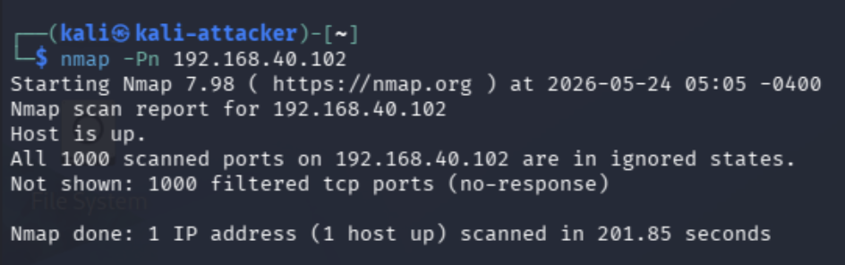
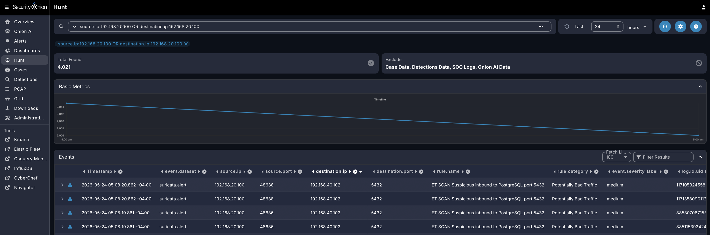
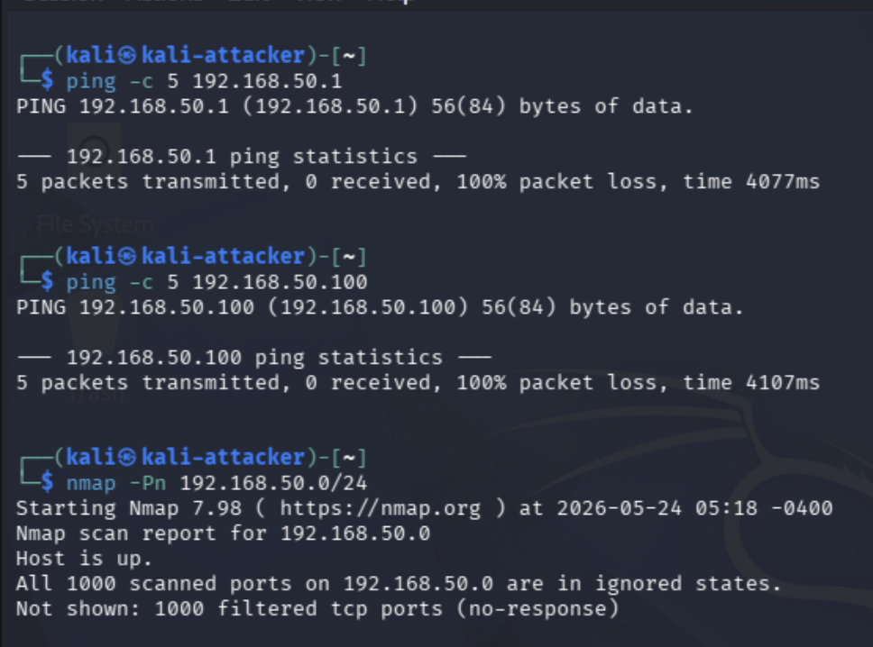
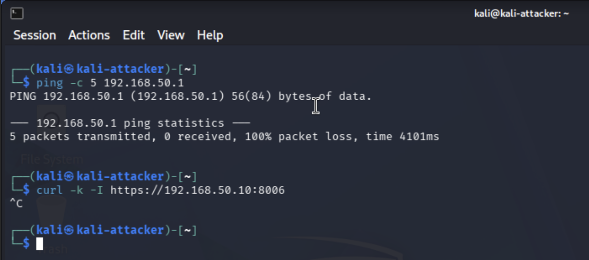

# Project 2: VLAN Segmentation and Firewall Rule Validation

## Project Status

**Status:** Complete  
**Related Project:** Project 1 - Home Cybersecurity Lab Network Architecture

This project validates the VLAN segmentation and firewall rule design used in my cybersecurity homelab. The goal was to confirm that each network segment is isolated by default, that only explicitly approved traffic is allowed between VLANs, and that allowed and blocked traffic can be validated through pfSense logs, live connectivity testing, and Security Onion visibility.

Project 1 documented the overall lab architecture. Project 2 focuses on proving that the architecture enforces the intended access control model through pfSense firewall rules, managed switch VLAN configuration, Proxmox VLAN tagging, and live validation testing.

As part of this project, pfSense rules were hardened to enforce a dedicated Admin/Bastion workflow through the Raspberry Pi 5 on VLAN 50. Validation confirmed that Kali-to-victim traffic was allowed by policy and visible in Security Onion Hunt, Kali-to-Admin access was blocked and logged by pfSense, Admin/Bastion access from the Raspberry Pi 5 to pfSense and Proxmox was allowed, and Proxmox host management was successfully migrated to the Admin VLAN using `vmbr0.50`.

---

## Objective

The objective of this project is to validate that my pfSense firewall rules, managed switch VLAN configuration, and Proxmox VLAN tagging work together to enforce segmentation across the lab environment.

This project confirmed that:

- The attacker VLAN can reach only the intended victim systems during lab simulations.
- The victim VLAN cannot access administrative systems.
- The SIEM VLAN remains protected while still receiving required monitoring traffic.
- The admin VLAN can access management interfaces such as Proxmox, pfSense, Security Onion, and the Raspberry Pi 5.
- Default-deny firewall behavior is enforced wherever possible.
- Allowed traffic is intentional, documented, and tied to a specific lab purpose.

---

## Lab Environment Overview

This homelab uses a segmented network design built around pfSense, a managed switch, Proxmox, Security Onion, Kali Linux, and a separate victim endpoint.

### Core Components

| Component | Role |
|---|---|
| Protectli Vault | Runs pfSense and provides routing/firewalling between VLANs |
| Netgear GS108T Managed Switch | Provides VLAN tagging, access ports, trunk ports, and port mirroring/SPAN |
| Dell PowerEdge R730xd | Runs Proxmox VE and hosts lab VMs |
| Proxmox VE | Virtualization platform for Kali, Security Onion, and future lab VMs; host management migrated to Admin VLAN 50 |
| Kali Linux VM | Attacker system used for controlled testing |
| Security Onion VM | SIEM/NDR platform for network visibility and detection |
| 2016 MacBook Air running Ubuntu | Physical victim endpoint / victim virtualization host |
| Raspberry Pi 5 | Admin services, Omada Controller, and Tailscale/bastion role |
| M2 MacBook Air | Primary workstation used for management and documentation |

### Management Access Model

Management access is intentionally centralized through the Admin VLAN. The Raspberry Pi 5 acts as the primary bastion/jump host and provides access to internal management interfaces through controlled SSH tunnels and Tailscale remote access.


Proxmox host management was moved from the LAN network to the Admin VLAN by removing the management IP from `vmbr0` and assigning it to `vmbr0.50`. The new Proxmox management address is `192.168.50.10/24`, with the Admin VLAN gateway set to `192.168.50.1`. This keeps the hypervisor management plane aligned with the rest of the Admin/Bastion network while preserving VLAN-aware trunking for lab VMs on `vmbr0`.

---

## VLAN Design

| VLAN | Name | Purpose | Example Systems |
|---|---|---|---|
| VLAN 10 | Home / Trusted | Normal home network and trusted workstation access | M2 MacBook, home devices, PS5, phones, laptops |
| VLAN 20 | Attacker | Controlled offensive security testing | Kali Linux VM |
| VLAN 30 | SIEM / Monitoring | Security Onion management and monitoring | Security Onion VM |
| VLAN 40 | Victim | Target endpoint network | 2016 MacBook Air, vulnerable VMs |
| VLAN 50 | Admin / Management | Administrative access and remote management | Raspberry Pi 5, Tailscale, Omada Controller, Proxmox host management, iDRAC, managed switch |

---

## Security Goals

The security goal of this project is to move away from a flat network and demonstrate controlled segmentation similar to what would be expected in a small enterprise or security lab environment.

The main design principles are:

- **Least privilege:** VLANs only communicate when there is a specific security or lab requirement.
- **Default deny:** Inter-VLAN traffic is blocked unless explicitly allowed.
- **Administrative isolation:** Management interfaces are isolated from attacker and victim networks.
- **Controlled attack paths:** Kali can reach approved victim systems for testing but cannot freely access the rest of the lab.
- **Monitoring visibility:** Security Onion observes mirrored traffic without requiring broad management exposure.
- **Documented exceptions:** Allowed rules are tied to clear operational or lab purposes.

---

## Expected Firewall Policy

| Source VLAN | Destination | Expected Result | Reason |
|---|---|---|---|
| VLAN 10 Home | pfSense DNS | Allowed | Home devices need name resolution through pfSense |
| VLAN 10 Home | Internet | Allowed | Normal home internet access |
| VLAN 10 Home | pfSense firewall services | Blocked | Home devices should not directly administer the firewall |
| VLAN 10 Home | Private/internal lab networks | Blocked | Home devices should not directly manage or access lab VLANs |
| VLAN 20 Attacker | pfSense DNS | Allowed | Kali may need DNS resolution for updates and testing |
| VLAN 20 Attacker | VLAN 40 Victim | Allowed | Required for controlled lab scans and attack simulations |
| VLAN 20 Attacker | pfSense firewall services | Blocked | The attacker VLAN should not administer or interact with the firewall |
| VLAN 20 Attacker | Private/internal networks | Blocked | Prevent unauthorized lateral movement from the attacker VLAN |
| VLAN 30 SIEM | pfSense DNS | Allowed | Security Onion may need DNS resolution |
| VLAN 30 SIEM | Internet | Allowed | Security Onion may need updates and package access |
| VLAN 30 SIEM | Private/internal networks | Blocked | The SIEM should not initiate unnecessary internal access |
| VLAN 40 Victim | pfSense DNS | Allowed | Victim systems may need DNS resolution |
| VLAN 40 Victim | Internet | Allowed | Victim systems may need updates and package access |
| VLAN 40 Victim | Private/internal networks | Blocked | Victim systems should not initiate lateral movement |
| VLAN 50 Admin | Specific management services | Allowed | The Raspberry Pi 5 bastion requires controlled access to pfSense, Proxmox, Security Onion, the managed switch, and victim SSH |
| VLAN 50 Admin | All other traffic | Blocked | The admin VLAN should follow least privilege instead of broad access |

---

## Validation and Evidence

The following validation tests confirm the firewall, VLAN, management-plane, and monitoring behavior of the lab.

| Test ID | Source | Destination | Validation Method | Result | Evidence |
|---|---|---|---|---|---|
| T01 | VLAN 20 Attacker | VLAN 40 Victim | `nmap -Pn 192.168.40.102` | Passed - Kali identified the victim host as up while ports were filtered by the Windows host firewall | [01-kali-to-victim-nmap-allowed.png](screenshots/01-kali-to-victim-nmap-allowed.png) |
| T02 | VLAN 20 Attacker | Security Onion Hunt | Hunt query for Kali/victim scan traffic | Passed - Security Onion displayed Suricata alerts for Kali-to-victim scan traffic | [02-security-onion-hunt-kali-to-victim-nmap.png](screenshots/02-security-onion-hunt-kali-to-victim-nmap.png) |
| T03 | Security Onion Hunt | VLAN 20 to VLAN 40 ICMP traffic | Hunt query for Kali/victim ICMP traffic | Passed - Security Onion displayed ICMP-related Suricata alerts from Kali `192.168.20.100` to victim `192.168.40.102` | [03-security-onion-hunt-icmp-alerts.png](screenshots/03-security-onion-hunt-icmp-alerts.png) |
| T04 | Security Onion sensor interface | VLAN 20/VLAN 40 mirrored traffic | `tcpdump` on `enp6s19` | Passed - Security Onion observed mirrored ICMP traffic between Kali and the victim network | [04-security-onion-tcpdump-observed-icmp-traffic.png](screenshots/04-security-onion-tcpdump-observed-icmp-traffic.png) |
| T05 | VLAN 20 Attacker | VLAN 50 Admin | Ping and scan tests | Passed - Kali could not reach the Admin VLAN gateway or Admin VLAN host | [05-kali-to-admin-vlan-blocked.png](screenshots/05-kali-to-admin-vlan-blocked.png) |
| T06 | VLAN 20 Attacker | pfSense/Proxmox management services | `curl` and connectivity tests | Passed - Kali could not reach pfSense management or Proxmox management services directly | [06-kali-to-pfsense-management-blocked.png](screenshots/06-kali-to-pfsense-management-blocked.png) |
| T07 | VLAN 50 Admin/Bastion | pfSense Web UI | `ping` and `curl` from Raspberry Pi 5 | Passed - Raspberry Pi 5 reached pfSense at `192.168.50.1` and received an HTTP 200 response | [07-admin-to-pfsense-allowed.png](screenshots/07-admin-to-pfsense-allowed.png) |
| T08 | VLAN 50 Admin/Bastion | Proxmox Web UI | `ping` and `curl` from Raspberry Pi 5 | Passed - Raspberry Pi 5 reached Proxmox at `192.168.50.10:8006` and received the Proxmox web interface HTML | [08-admin-to-proxmox-allowed.png](screenshots/08-admin-to-proxmox-allowed.png) |
| T09 | Proxmox host | Admin VLAN gateway and switch | `ip addr`, `ip route`, and `ping` | Passed - Proxmox used `vmbr0.50` with IP `192.168.50.10/24`, default route `192.168.50.1`, and successful connectivity to Admin VLAN services | [09-proxmox-admin-vlan50-validation.png](screenshots/09-proxmox-admin-vlan50-validation.png) |
| T10 | pfSense firewall logs | Blocked Kali-to-Admin traffic | Firewall log review | Passed - pfSense logs captured blocked Kali-to-Admin traffic attempts | [10-pfsense-blocked-traffic-logs.png](screenshots/10-pfsense-blocked-traffic-logs.png) |

### Current Firewall Rule Evidence

The pfSense firewall rules have been updated, documented, and validated for each VLAN. Final live validation confirmed the intended allowed attacker-to-victim path, blocked attacker-to-admin behavior, Admin/Bastion management access, and Security Onion visibility.

| VLAN | Purpose | Final Rule Evidence |
|---|---|---|
| VLAN 10 HOME | Home network internet access with private/internal network restrictions | [rules-vlan10-home-final.png](evidence/pfsense-rules/rules-vlan10-home-final.png) |
| VLAN 20 ATTACK | Controlled attacker access to the victim VLAN only | [rules-vlan20-attacker-final.png](evidence/pfsense-rules/rules-vlan20-attacker-final.png) |
| VLAN 30 SIEM | SIEM internet/DNS access while preventing unnecessary initiated internal access | [rules-vlan30-siem-final.png](evidence/pfsense-rules/rules-vlan30-siem-final.png) |
| VLAN 40 VICTIM | Victim internet/DNS access while preventing lateral movement | [rules-vlan40-victim-final.png](evidence/pfsense-rules/rules-vlan40-victim-final.png) |
| VLAN 50 ADMIN | Raspberry Pi 5 bastion access to specific management services only | [rules-vlan50-admin-final.png](evidence/pfsense-rules/rules-vlan50-admin-final.png) |

### pfSense VLAN and DHCP Evidence

The following screenshots document the pfSense VLAN interface assignments, VLAN tags, DHCP scopes, and firewall aliases used to support the segmentation design.

| Evidence | Description | Screenshot |
|---|---|---|
| Interface assignments | Shows WAN, LAN, HOME, ATTACK, SIEM, VICTIM, and ADMIN interface assignments | [pfsense-interface-assignments.png](evidence/pfsense-vlan-config/pfsense-interface-assignments.png) |
| VLAN assignments | Shows VLAN 10, 20, 30, 40, and 50 configured on the pfSense LAN interface | [pfsense-vlan-assignments.png](evidence/pfsense-vlan-config/pfsense-vlan-assignments.png) |
| RFC1918 alias | Shows the private/internal network alias used to block unauthorized lateral movement | [pfsense-firewall-aliases.png](evidence/pfsense-vlan-config/pfsense-firewall-aliases.png) |
| HOME DHCP scope | Shows DHCP configuration for VLAN 10 HOME | [dhcp-vlan10-home-range.png](evidence/pfsense-vlan-config/dhcp-vlan10-home-range.png) |
| ATTACK DHCP scope | Shows DHCP configuration for VLAN 20 ATTACK | [dhcp-vlan20-attack-range.png](evidence/pfsense-vlan-config/dhcp-vlan20-attack-range.png) |
| SIEM DHCP scope | Shows DHCP configuration status for VLAN 30 SIEM | [dhcp-vlan30-siem-range.png](evidence/pfsense-vlan-config/dhcp-vlan30-siem-range.png) |
| VICTIM DHCP scope | Shows DHCP configuration for VLAN 40 VICTIM | [dhcp-vlan40-victim-range.png](evidence/pfsense-vlan-config/dhcp-vlan40-victim-range.png) |
| ADMIN DHCP scope | Shows DHCP configuration for VLAN 50 ADMIN | [dhcp-vlan50-admin-range.png](evidence/pfsense-vlan-config/dhcp-vlan50-admin-range.png) |

### Managed Switch Evidence

The following screenshots document the managed switch configuration supporting the VLAN design. These screenshots show VLAN membership, PVID assignments, port configuration, and port mirroring/SPAN configuration used for Security Onion visibility.

| Evidence | Description | Screenshot |
|---|---|---|
| Switch port configuration | Shows physical switch port configuration and device placement | [switch-port-configuration.png](evidence/switch-vlan-config/switch-port-configuration.png) |
| Switch port mirroring | Shows mirror/SPAN configuration for Security Onion monitoring | [switch-port-mirroring.png](evidence/switch-vlan-config/switch-port-mirroring.png) |
| Switch PVID configuration | Shows untagged VLAN assignment behavior for access ports | [switch-pvid-configuration.png](evidence/switch-vlan-config/switch-pvid-configuration.png) |
| VLAN 1 membership | Shows default/native VLAN membership state | [switch-vlan-membership-vlan1.png](evidence/switch-vlan-config/switch-vlan-membership-vlan1.png) |
| VLAN 10 membership | Shows HOME VLAN membership | [switch-vlan-membership-vlan10.png](evidence/switch-vlan-config/switch-vlan-membership-vlan10.png) |
| VLAN 20 membership | Shows ATTACK VLAN membership | [switch-vlan-membership-vlan20.png](evidence/switch-vlan-config/switch-vlan-membership-vlan20.png) |
| VLAN 30 membership | Shows SIEM VLAN membership | [switch-vlan-membership-vlan30.png](evidence/switch-vlan-config/switch-vlan-membership-vlan30.png) |
| VLAN 40 membership | Shows VICTIM VLAN membership | [switch-vlan-membership-vlan40.png](evidence/switch-vlan-config/switch-vlan-membership-vlan40.png) |
| VLAN 50 membership | Shows ADMIN VLAN membership | [switch-vlan-membership-vlan50.png](evidence/switch-vlan-config/switch-vlan-membership-vlan50.png) |

---

### Evidence Summary

| Evidence | Screenshot | What It Demonstrates |
|---|---|---|
| Kali-to-victim Nmap allowed | [01-kali-to-victim-nmap-allowed.png](screenshots/01-kali-to-victim-nmap-allowed.png) | Shows Kali on VLAN 20 identifying the victim host `192.168.40.102` as up while ports are filtered by the endpoint firewall |
| Security Onion Hunt scan alerts | [02-security-onion-hunt-kali-to-victim-nmap.png](screenshots/02-security-onion-hunt-kali-to-victim-nmap.png) | Shows Security Onion Hunt displaying Suricata scan alerts for Kali-to-victim traffic |
| Security Onion Hunt ICMP alerts | [03-security-onion-hunt-icmp-alerts.png](screenshots/03-security-onion-hunt-icmp-alerts.png) | Shows Security Onion Hunt displaying ICMP-related Suricata alerts from Kali `192.168.20.100` to victim `192.168.40.102` |
| Security Onion sensor tcpdump | [04-security-onion-tcpdump-observed-icmp-traffic.png](screenshots/04-security-onion-tcpdump-observed-icmp-traffic.png) | Shows the active Security Onion sensor interface `enp6s19` observing mirrored VLAN 20/VLAN 40 traffic |
| Kali-to-Admin VLAN blocked | [05-kali-to-admin-vlan-blocked.png](screenshots/05-kali-to-admin-vlan-blocked.png) | Shows Kali unable to reach Admin VLAN systems, confirming segmentation between the attacker and management networks |
| Kali-to-management blocked | [06-kali-to-pfsense-management-blocked.png](screenshots/06-kali-to-pfsense-management-blocked.png) | Shows Kali unable to reach pfSense/Proxmox management services directly |
| Admin-to-pfSense allowed | [07-admin-to-pfsense-allowed.png](screenshots/07-admin-to-pfsense-allowed.png) | Shows the Raspberry Pi 5 on VLAN 50 reaching pfSense at `192.168.50.1` and receiving an HTTP 200 response |
| Admin-to-Proxmox allowed | [08-admin-to-proxmox-allowed.png](screenshots/08-admin-to-proxmox-allowed.png) | Shows the Raspberry Pi 5 on VLAN 50 reaching Proxmox at `192.168.50.10:8006` and receiving the Proxmox web interface HTML |
| Proxmox Admin VLAN migration | [09-proxmox-admin-vlan50-validation.png](screenshots/09-proxmox-admin-vlan50-validation.png) | Shows Proxmox using `vmbr0.50` with IP `192.168.50.10/24`, default route through `192.168.50.1`, and successful connectivity to Admin VLAN services |
| pfSense blocked traffic logs | [10-pfsense-blocked-traffic-logs.png](screenshots/10-pfsense-blocked-traffic-logs.png) | Shows pfSense firewall logs for blocked Kali-to-Admin traffic, proving policy enforcement at the firewall boundary |

### Key Evidence

The screenshots below highlight the most important validation results while the evidence table preserves links to the full evidence set.

**Allowed Kali-to-Victim Testing**



**Security Onion Visibility**



**Blocked Kali-to-Admin Testing**



**pfSense Blocked Traffic Logs**



---


## Rule Design Notes

The firewall rule design should follow a top-down order:

1. Allow required admin access from VLAN 50.
2. Allow specific lab traffic between attacker and victim VLANs.
3. Allow required internet access.
4. Block access to protected management networks.
5. Block all other unauthorized inter-VLAN traffic.

Rule order matters because pfSense evaluates rules from top to bottom. Specific allow or block rules should be placed before broader catch-all rules.

The updated rule design uses an `RFC1918_Private_Networks` alias to block unauthorized access to private/internal address space. This simplifies the firewall policy because new private VLANs will be blocked by default unless an explicit allow rule is added above the RFC1918 block rule.

For example, the ATTACK VLAN allows traffic to the VICTIM VLAN before blocking access to `RFC1918_Private_Networks`. This creates a controlled attack path while still preventing the attacker network from reaching HOME, ADMIN, SIEM, or other private/internal networks.

---

## Implementation Summary

The completed implementation includes the following validated configuration outcomes:

- pfSense VLAN interfaces, DHCP pools, firewall rules, and aliases have been configured for the segmented lab design.
- The managed switch VLAN membership, PVID settings, trunk ports, and mirror/SPAN configuration have been validated.
- Proxmox uses a VLAN-aware bridge for lab VM traffic, and Proxmox host management has been migrated from LAN `192.168.1.185/24` to Admin VLAN 50 using `vmbr0.50` with address `192.168.50.10/24` and gateway `192.168.50.1`.
- Kali on VLAN 20 successfully reached the victim host on VLAN 40 during approved testing.
- Security Onion observed Kali-to-victim ICMP and scan traffic after the active sensor interface was corrected from `bond0` to `enp6s19`.
- Kali-to-Admin VLAN access was blocked, and pfSense firewall logs captured blocked management access attempts.
- Raspberry Pi 5 Admin/Bastion access to pfSense and Proxmox was validated from VLAN 50.
- Project 2 validation evidence has been captured and the project is complete.

### Firewall Rule Hardening

The VLAN firewall rules were updated to enforce a cleaner segmented design.

- VLAN 10 HOME is allowed DNS and internet access but is blocked from directly reaching pfSense services and private/internal lab networks.
- VLAN 20 ATTACK is allowed to reach the VLAN 40 VICTIM network for controlled lab testing, but is blocked from pfSense services and unauthorized private/internal networks.
- VLAN 30 SIEM is allowed DNS and internet access but is blocked from initiating unauthorized private/internal network connections.
- VLAN 40 VICTIM is allowed DNS and internet access but is blocked from initiating unauthorized private/internal network connections.
- VLAN 50 ADMIN is restricted to specific Raspberry Pi 5 bastion management access rules for pfSense, Proxmox, Security Onion, the managed switch, and victim SSH.

Remote access through the Raspberry Pi 5/Admin VLAN path remained functional after applying the updated rules.

### Proxmox Management VLAN Migration

Proxmox host management was moved from the LAN network to the dedicated Admin VLAN to better align the hypervisor with the lab's management-plane isolation model. The original Proxmox management address was `192.168.1.185/24` on `vmbr0`. The management IP was removed from `vmbr0`, and a VLAN subinterface, `vmbr0.50`, was created for Admin VLAN access.

The updated Proxmox network configuration uses `vmbr0` as a VLAN-aware trunk bridge on `nic2`, while `vmbr0.50` carries the Proxmox host management address:

```bash
auto vmbr0
iface vmbr0 inet manual
        bridge-ports nic2
        bridge-stp off
        bridge-fd 0
        bridge-vlan-aware yes
        bridge-vids 2-4094

auto vmbr0.50
iface vmbr0.50 inet static
        address 192.168.50.10/24
        gateway 192.168.50.1
```

Validation confirmed that Proxmox successfully received the new Admin VLAN address and default route. From the Proxmox console, `vmbr0.50` showed `192.168.50.10/24`, the default route pointed to `192.168.50.1`, and pings to the pfSense Admin VLAN gateway `192.168.50.1` and managed switch `192.168.50.2` succeeded. From the Raspberry Pi 5 bastion on VLAN 50, `ping 192.168.50.10` succeeded, and `curl -k https://192.168.50.10:8006` returned the Proxmox web interface HTML. This confirms that Proxmox management is now reachable from the Admin VLAN while no longer relying on the old LAN management address.

### Security Onion Monitoring Path Validation

During live validation, Kali on VLAN 20 successfully reached the victim endpoint on VLAN 40. The Kali attacker IP was `192.168.20.100`, and the victim endpoint IP was `192.168.40.102`. ICMP echo requests and replies confirmed that the allowed attacker-to-victim firewall path was functioning as intended.

Security Onion initially observed only broadcast, multicast, and unrelated VLAN traffic on its sniffing interface. Proxmox confirmed that the mirrored VLAN 20/VLAN 40 traffic was visible on the monitor bridge, but the traffic was not initially reaching the Security Onion VM tap interface.

The root cause was that the live Linux bridge aging value for the Proxmox monitor bridge `vmbr1` was still set to `30000`, even though the Proxmox network configuration file included `bridge-ageing 0`. After applying the live bridge aging value of `0`, the mirrored unicast traffic reached the Security Onion VM tap interface and became visible on Security Onion's sniffing interface `enp6s19`.

Validation commands used during troubleshooting included:

```bash
cat /sys/class/net/vmbr1/bridge/ageing_time
ip link set dev vmbr1 type bridge ageing_time 0
tcpdump -i vmbr1 -nn -e 'icmp or host 192.168.40.102'
tcpdump -i tap101i1 -nn -e 'icmp or host 192.168.40.102'
sudo tcpdump -i enp6s19 -nn -e 'icmp or host 192.168.40.102'
```


After this correction, Security Onion observed VLAN 20/VLAN 40 ICMP traffic between Kali and the victim endpoint at the packet-capture level. However, the traffic initially did not appear in the Security Onion Hunt dashboard. Additional troubleshooting showed that Security Onion was configured to use `bond0` as the sensor interface, while the mirrored attacker-to-victim traffic was actually arriving on `enp6s19`. The `bond0` interface was down and was not processing the mirrored traffic.

The Security Onion local pillar configuration was updated so the sensor interface used `enp6s19` instead of `bond0`:

```bash
sudo sed -i "s/interface: 'bond0'/interface: 'enp6s19'/" /opt/so/saltstack/local/pillar/minions/so_standalone.sls
sudo grep -n -A5 -B2 "sensor:" /opt/so/saltstack/local/pillar/minions/so_standalone.sls
sudo /usr/sbin/so-restart zeek
sudo /usr/sbin/so-restart suricata
```

After Zeek and Suricata were restarted, Security Onion Hunt displayed Suricata alerts for ICMP traffic from Kali `192.168.20.100` to victim `192.168.40.102`. This validated that the monitoring path can observe attacker-to-victim traffic without giving the attacker direct access to the SIEM management interface.

---

## Key Findings

Final validation confirmed that the segmentation model is functioning as intended. The approved attacker-to-victim path from Kali on VLAN 20 to the victim on VLAN 40 worked and was visible in Security Onion Hunt as Suricata events. The Security Onion sensor interface `enp6s19` also observed mirrored ICMP traffic directly with `tcpdump`, confirming that the monitoring path was operational. Attempts from Kali to reach Admin VLAN 50 and management services were blocked, while the Raspberry Pi 5 on VLAN 50 successfully reached approved management services such as pfSense and Proxmox. pfSense firewall logs provided additional evidence that blocked Kali-to-Admin traffic was enforced at the firewall boundary.

---

## Lessons Learned

- pfSense rule order directly affects segmentation behavior because rules are evaluated from top to bottom.
- VLAN tagging, untagged access ports, and PVID settings must align across pfSense, the managed switch, and Proxmox.
- Management interfaces should be isolated from attacker and victim networks and reachable only through approved administrative paths.
- Port mirroring supports network detection without exposing the SIEM management interface to attacker systems.
- A dedicated Admin/Bastion VLAN creates a cleaner management model than allowing broad access from the home network.
- RFC1918 aliases simplify firewall policy by blocking unauthorized access to private/internal networks with a reusable object.
- Proxmox bridge settings should be validated live, not only reviewed in `/etc/network/interfaces`.
- Security Onion visibility should be validated at multiple layers, including packet capture, sensor interface configuration, and Hunt events.
- Successful segmentation validation requires both allowed-path testing and blocked-path testing.
- Firewall logs provide important evidence that blocked traffic was denied by policy rather than failing silently.
- Moving Proxmox management to `vmbr0.50` improved management-plane isolation while preserving VLAN-aware VM networking.

---

## Skills Demonstrated

- Network segmentation
- VLAN design
- pfSense firewall rule creation
- Managed switch VLAN configuration
- DHCP scope documentation
- Firewall alias design
- Trunk and access port planning
- Proxmox VLAN tagging
- Proxmox management interface migration to a dedicated Admin VLAN
- Security Onion monitoring architecture
- Security Onion sensor interface troubleshooting
- Suricata alert validation in Security Onion Hunt
- Proxmox bridge troubleshooting
- Linux bridge aging validation
- Packet capture analysis with tcpdump
- Connectivity testing
- Firewall validation
- Defensive network design documentation

---

## Portfolio Summary

This project validates the firewall, VLAN, management-plane, and monitoring controls used in the segmented cybersecurity homelab. pfSense enforces least-privilege access between the attacker, victim, SIEM, home, and Admin/Bastion networks. Kali-to-victim traffic was confirmed as allowed for controlled testing, while Kali-to-Admin traffic was blocked and logged. Security Onion visibility was validated through Hunt alerts and direct `tcpdump` evidence from the active sensor interface. The Raspberry Pi 5 bastion model was validated for approved management access to pfSense and Proxmox, and Proxmox host management was migrated to Admin VLAN 50 using `vmbr0.50`. Together, the evidence demonstrates that the lab's segmentation and monitoring architecture is working as intended.

---

## Resume Bullet

Validated VLAN segmentation and firewall enforcement in a segmented cybersecurity homelab by testing allowed attacker-to-victim paths, blocked attacker-to-admin paths, pfSense firewall logging, Security Onion Hunt/Suricata visibility, active sensor packet capture, Raspberry Pi 5 bastion access, and Proxmox host management isolation on Admin VLAN 50.