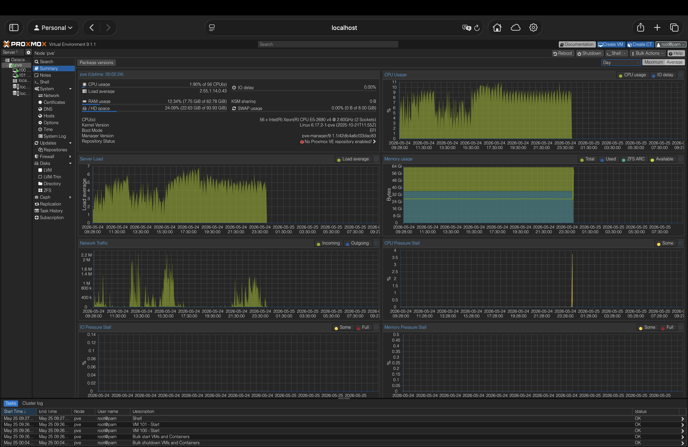
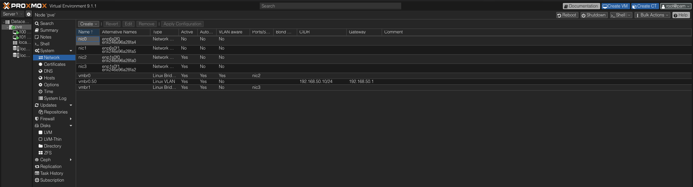
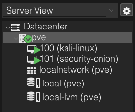
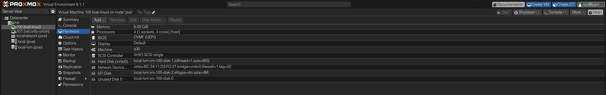
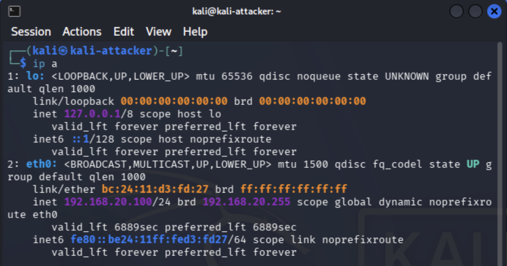
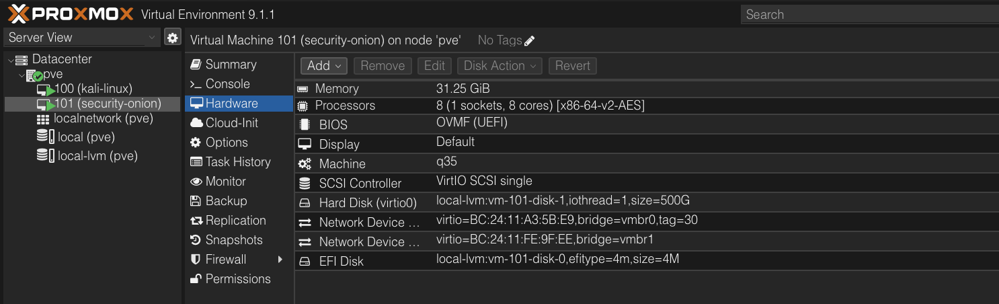
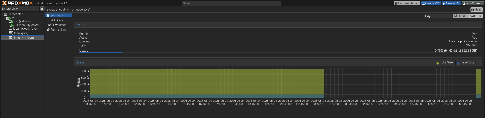
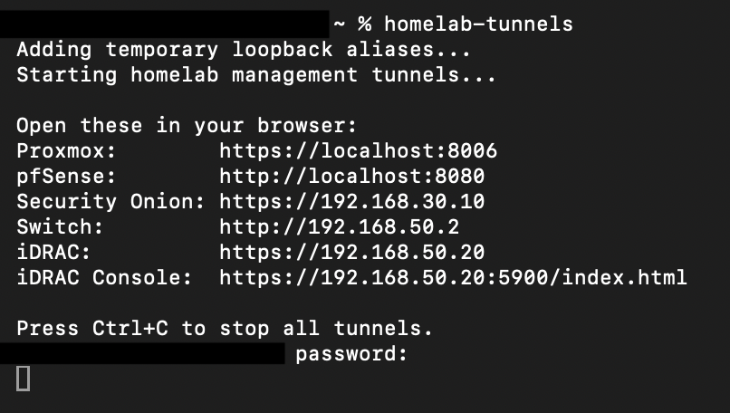

# Project 3: Proxmox Virtualization Build

## Objective

This project documents the completed virtualization layer of my cybersecurity homelab using **Proxmox VE** on a **Dell PowerEdge R730xd**. The purpose of this project was to build a scalable compute platform capable of hosting segmented attacker, monitoring, victim, and management systems while keeping administrative access restricted through the Admin VLAN and Raspberry Pi 5 bastion host.

Project 1 established the segmented network foundation by separating home, attacker, victim, SIEM, and management traffic into controlled VLANs. Project 2 validated firewall segmentation and monitoring visibility. Project 3 completes the next layer of the lab by documenting how Proxmox hosts and connects the virtual systems used for future red-team, blue-team, and detection-engineering projects.

## Business and Security Value

Virtualization is a core skill in enterprise security environments because many security tools, test systems, and lab networks depend on controlled compute infrastructure. This project demonstrates the ability to design and operate a segmented virtualization environment that supports both offensive and defensive security workflows.

From a business and security perspective, this project shows how to centralize lab workloads on dedicated server hardware, isolate hypervisor management on a restricted Admin VLAN, separate attacker and monitoring systems by trust zone, support blue-team visibility through Security Onion, and preserve scalability for future enterprise-style projects such as Active Directory, honeypots, detection engineering, and adversary emulation.

## Scope and Rules of Engagement

This project was limited to the Proxmox virtualization layer and its role in supporting the segmented homelab. Validation focused on Proxmox host management, VLAN-aware networking, core VM placement, Security Onion interface separation, storage availability, and bastion-based administrative access.

Out of scope:

- Public internet targets
- Third-party systems
- Production workloads
- Unauthorized access attempts
- Exploitation or attack simulation beyond VM placement and infrastructure validation

## Lab Environment

| Component | Purpose | Details |
|---|---|---|
| Dell PowerEdge R730xd | Virtualization host | Runs Proxmox VE |
| Proxmox VE | Hypervisor | Hosts Kali Linux, Security Onion, and future lab VMs |
| pfSense / Protectli Vault | Firewall and routing | Provides VLAN gateways, DHCP, firewall rules, and segmentation |
| Netgear GS108T | Managed switch | Carries VLANs and supports port mirroring for Security Onion |
| Raspberry Pi 5 | Bastion / admin host | Provides SSH tunnel access into the Admin VLAN |
| Kali Linux VM | Attacker system | Placed on VLAN 20 |
| Security Onion VM | SIEM / monitoring platform | Management on VLAN 30 with a separate sniffing interface |
| M2 MacBook Air | Admin workstation | Accesses lab services through SSH tunnels |

## VLAN Design

| VLAN | Name / Function | Example Systems | Purpose |
|---|---|---|---|
| VLAN 10 | Home | Personal/home devices | Normal home network traffic |
| VLAN 20 | Attacker | Kali Linux VM | Offensive testing and attack simulation |
| VLAN 30 | SIEM | Security Onion management interface | SIEM access and management |
| VLAN 40 | Victim | Windows/Linux victim systems | Target systems for testing and detection |
| VLAN 50 | Admin / Management | Raspberry Pi 5, Proxmox host, iDRAC, management interfaces | Restricted administrative access |

## Proxmox Host Management

The Proxmox host is managed through the Admin VLAN rather than the general home network or attacker/victim networks.

| Setting | Value |
|---|---|
| Proxmox host | Dell PowerEdge R730xd |
| Management VLAN | VLAN 50 |
| Proxmox management IP | `192.168.50.10` |
| Management bridge/interface | `vmbr0.50` |
| Access method | SSH tunnel through Raspberry Pi 5 bastion |

Restricting Proxmox management to VLAN 50 helps protect the hypervisor from unnecessary exposure. Since the hypervisor controls multiple security lab VMs, it is treated as a high-value management asset.

## Virtual Network Design

Proxmox uses virtual bridges and VLAN tagging to connect lab VMs to the correct network segments.

### Management Bridge

`vmbr0` provides the primary physical bridge connected to the lab network trunk.

The Proxmox management address is assigned to:

```text
vmbr0.50
192.168.50.10
```

This places the Proxmox web interface and host management plane on the Admin VLAN.

### Kali Linux VM

Kali Linux is attached to the attacker network:

```text
VLAN 20
```

This allows Kali to generate controlled attack traffic toward victim systems while remaining isolated from management services.

### Security Onion VM

Security Onion uses two main network paths:

1. **Management interface** on VLAN 30
2. **Sniffing interface** connected to mirrored traffic

The management interface allows administrative access to Security Onion, while the sniffing interface receives monitored traffic from the switch mirror configuration.

This separation is important because Security Onion should not rely on its management interface for packet inspection. Monitoring traffic should enter through the dedicated sniffing interface.

## Access Model

Administrative access follows a bastion host model.

```text
M2 MacBook Air
    |
    | SSH / Tailscale
    v
Raspberry Pi 5 Bastion - VLAN 50
    |
    | SSH tunnels
    v
Proxmox / Security Onion / pfSense / iDRAC / Switch Management
```

The Raspberry Pi 5 sits on the Admin VLAN and acts as the trusted jump point into the lab. Instead of exposing management interfaces directly to the home network or the internet, access is tunneled through the Pi.

This model helps reduce exposure of sensitive services such as:

- Proxmox web interface
- pfSense web interface
- Security Onion console
- iDRAC
- Switch management UI

## Implementation Summary

### 1. Installed Proxmox VE on the Dell R730xd

Proxmox VE was installed on the Dell PowerEdge R730xd to provide the main virtualization platform for the homelab.

The server provides enough compute capacity to run multiple security lab systems, including:

- Kali Linux
- Security Onion
- Future Windows victim systems
- Future Linux victim systems
- Future Active Directory infrastructure
- Future honeypot or deception systems

### 2. Configured Admin VLAN Management

The Proxmox host management plane was placed on Admin VLAN 50 using `vmbr0.50`.

This keeps hypervisor administration separate from the attacker, victim, and monitoring networks.

Expected management configuration:

```text
Proxmox Management IP: 192.168.50.10
Management VLAN: 50
Management Interface: vmbr0.50
```

### 3. Configured VLAN-Aware Networking

The Proxmox bridge was configured to support VLAN-tagged virtual machine traffic.

This allows individual VMs to be assigned to the correct network segment while using the same physical server uplink.

Examples:

| VM | VLAN | Role |
|---|---|---|
| Kali Linux | 20 | Attacker |
| Security Onion management | 30 | SIEM management |
| Future victim VM | 40 | Target system |
| Future admin VM | 50 | Management/admin testing |

### 4. Deployed Kali Linux VM

Kali Linux was deployed as the attacker VM and placed on VLAN 20.

The purpose of this VM is to generate controlled attack traffic for future detection and monitoring projects.

Example use cases:

- Nmap scanning
- Web application testing
- Vulnerability validation
- Controlled exploitation in isolated lab environments
- MITRE ATT&CK-aligned simulations

### 5. Deployed Security Onion VM

Security Onion was deployed as the lab SIEM and monitoring platform.

Security Onion uses:

- VLAN 30 for management
- A separate sniffing interface for mirrored traffic ingestion

This design allows the SIEM to be managed securely while still receiving network telemetry from the lab switch.

### 6. Validated Remote Access Through the Bastion Host

Remote management is performed through the Raspberry Pi 5 bastion on VLAN 50.

The bastion model allows access to management interfaces without exposing them broadly.

Example management targets:

| Service | Access Method |
|---|---|
| Proxmox | SSH tunnel through Pi 5 |
| Security Onion | SSH tunnel through Pi 5 |
| pfSense | SSH tunnel through Pi 5 |
| iDRAC | SSH tunnel through Pi 5 |
| Switch UI | SSH tunnel through Pi 5 |

## Validation and Evidence

The Proxmox virtualization build was validated through host configuration review, VM placement checks, VLAN assignment verification, storage review, and bastion-based access testing.

| Validation Area | Result | Evidence |
|---|---|---|
| Proxmox host health | Passed - The Dell R730xd was running Proxmox with visible CPU, memory, storage, uptime, and node health details | [01-proxmox-node-summary.png](evidence/01-proxmox-node-summary.png) |
| Admin VLAN management | Passed - Proxmox management was assigned to `vmbr0.50` with IP `192.168.50.10/24` and gateway `192.168.50.1` | [02-proxmox-network-config.png](evidence/02-proxmox-network-config.png) |
| VM inventory | Passed - Kali Linux and Security Onion were deployed as core lab VMs on the Proxmox host | [03-proxmox-vm-list.png](evidence/03-proxmox-vm-list.png) |
| Kali VLAN placement | Passed - Kali was attached to `vmbr0` with VLAN tag 20 and received an attacker VLAN address | [04-kali-vlan20-hardware.png](evidence/04-kali-vlan20-hardware.png), [05-kali-vlan20-ip-validation.png](evidence/05-kali-vlan20-ip-validation.png) |
| Security Onion interface separation | Passed - Security Onion used VLAN 30 for management and a separate interface on `vmbr1` for sniffing/monitoring traffic | [06-security-onion-vlan30-and-sniffing-hardware.png](evidence/06-security-onion-vlan30-and-sniffing-hardware.png) |
| Virtualization storage | Passed - `local-lvm` storage was available for current and future lab workloads | [07-proxmox-storage-summary.png](evidence/07-proxmox-storage-summary.png) |
| Bastion access workflow | Passed - Proxmox and other management interfaces were accessed through SSH tunnels using the Raspberry Pi 5 bastion | [08-pi-bastion-tunnel-validation.png](evidence/08-pi-bastion-tunnel-validation.png) |

## Evidence Summary

The following evidence documents the completed Proxmox virtualization build and provides clickable links to each evidence file.

| ID | Evidence | What It Demonstrates |
|---|---|---|
| 01 | [Proxmox Node Summary](evidence/01-proxmox-node-summary.png) | Confirms the Dell R730xd is running Proxmox and shows node health, resource usage, uptime, and storage status. |
| 02 | [Proxmox Network Configuration](evidence/02-proxmox-network-config.png) | Confirms `vmbr0`, `vmbr0.50`, the Admin VLAN 50 management address, the VLAN 50 gateway, VLAN-aware networking, and the dedicated `vmbr1` monitoring bridge. |
| 03 | [Proxmox VM List](evidence/03-proxmox-vm-list.png) | Shows Kali Linux and Security Onion deployed as VMs on the Proxmox host. |
| 04 | [Kali VLAN 20 Hardware](evidence/04-kali-vlan20-hardware.png) | Shows the Kali VM attached to `vmbr0` with VLAN tag 20 for the attacker network. |
| 05 | [Kali VLAN 20 IP Validation](evidence/05-kali-vlan20-ip-validation.png) | Confirms Kali received `192.168.20.100/24` on the attacker VLAN. |
| 06 | [Security Onion VLAN 30 and Sniffing Hardware](evidence/06-security-onion-vlan30-and-sniffing-hardware.png) | Shows Security Onion management on VLAN 30 and a second interface on `vmbr1` for sniffing/monitoring traffic. |
| 07 | [Proxmox Storage Summary](evidence/07-proxmox-storage-summary.png) | Shows `local-lvm` storage capacity available for current and future lab workloads. |
| 08 | [Pi Bastion Tunnel Validation](evidence/08-pi-bastion-tunnel-validation.png) | Shows the tunnel workflow used to access Proxmox, pfSense, Security Onion, the switch, and iDRAC through the Raspberry Pi 5 bastion. |

## Key Evidence

The screenshots below highlight the most important Proxmox virtualization evidence while the table above preserves links to the full evidence set.

**Proxmox Node Summary**



This screenshot confirms that the Dell R730xd is running Proxmox and provides a completed host-level view of CPU usage, memory usage, storage usage, uptime, and node health. The Proxmox web interface is accessed through the local tunneled management workflow, supporting the secure access model used throughout the lab.

**Proxmox Network Configuration**



This screenshot validates the Proxmox network design. The management interface is assigned to `vmbr0.50` with `192.168.50.10/24` and gateway `192.168.50.1`, placing Proxmox management on Admin VLAN 50. The screenshot also shows `vmbr0` as the VLAN-aware bridge and `vmbr1` as a separate bridge used for Security Onion monitoring traffic.

**Virtual Machine Inventory**



This screenshot confirms that the core lab VMs are deployed on the Proxmox host, including Kali Linux for attacker activity and Security Onion for monitoring and detection work.

**Kali VLAN 20 Hardware Configuration**



This screenshot shows the Kali VM network device attached to `vmbr0` with VLAN tag 20. This places Kali on the attacker VLAN and supports controlled offensive testing against approved lab targets.

**Kali VLAN 20 IP Validation**



This screenshot confirms Kali's network placement by showing the VM receiving `192.168.20.100/24` on `eth0`. This validates that the Proxmox VLAN tag and pfSense DHCP configuration are working together correctly.

**Security Onion Management and Sniffing Interfaces**



This screenshot shows Security Onion configured with a management interface on `vmbr0` using VLAN tag 30 and a second interface on `vmbr1` for sniffing/monitoring. This confirms that management traffic and monitored traffic are separated.

**Proxmox Storage Summary**



This screenshot documents the `local-lvm` storage pool and confirms that the Proxmox host has available virtualization capacity for current and future workloads.

**Pi Bastion Tunnel Validation**



This screenshot confirms the bastion-based access workflow. Proxmox, pfSense, Security Onion, the switch, and iDRAC are accessed through SSH tunnels using the Raspberry Pi 5 on Admin VLAN 50 instead of exposing management interfaces directly to the general home network.

## Key Findings

This build intentionally separates management access from lab activity.

Important security decisions include:

- Proxmox management is placed on Admin VLAN 50
- Administrative access is tunneled through the Raspberry Pi 5 bastion
- Kali is isolated on VLAN 20
- Security Onion management is separated from packet ingestion
- Sniffing traffic uses a dedicated interface instead of the management NIC
- pfSense firewall rules control traffic between VLANs
- Management interfaces are not broadly exposed to the home network

These decisions reduce the chance that attacker or victim activity can directly reach the hypervisor management plane.

---

## Project Status

| Area | Status |
|---|---|
| Project 1 network segmentation foundation | Complete |
| Project 2 firewall and monitoring validation | Complete |
| Proxmox installed on Dell R730xd | Complete |
| Proxmox management isolated on Admin VLAN 50 | Complete |
| Kali VM placed on VLAN 20 | Complete |
| Security Onion management placed on VLAN 30 | Complete |
| Security Onion sniffing interface configured | Complete |
| Bastion-based management access validated | Complete |
| Evidence screenshots collected and linked | Complete |

---

## Lessons Learned

This project reinforced several important virtualization and security engineering concepts:

- Hypervisor management should be treated as a sensitive administrative function
- VLAN-aware bridges allow multiple isolated networks to share a physical uplink
- Management traffic and monitoring traffic should be separated where possible
- A bastion host can reduce exposure of internal management interfaces
- Security Onion benefits from a dedicated sniffing interface for mirrored traffic
- Virtualization makes it easier to scale a cybersecurity lab without adding separate physical machines for every workload

---

## Future Enhancements

With the Proxmox virtualization foundation documented and validated, future projects can build directly on this platform. Potential enhancements include:

- Deploy additional Windows and Linux victim systems for endpoint telemetry and detection testing.
- Build an Active Directory environment for identity-based attacks and detections.
- Add vulnerable Linux or web application targets for repeatable testing.
- Create Security Onion detections mapped to MITRE ATT&CK techniques.
- Add Sysmon and Elastic Agent telemetry from Windows victims.
- Create a honeypot or honeynet segment for threat-intelligence collection.
- Integrate adversary emulation tooling such as MITRE Caldera.
- Document full red-team/blue-team detection engineering workflows.

---

## Portfolio Summary

Project 3 documents the completed virtualization layer that supports the broader cybersecurity homelab portfolio. With Proxmox running on the Dell R730xd, the lab now has a scalable foundation for attacker, victim, monitoring, and enterprise-style infrastructure projects.

Combined with Project 1 and Project 2, this project shows a clear progression from network design to visibility validation to virtualization:

- Build the segmented network.
- Validate network visibility.
- Build the virtualization platform.
- Deploy attacker, victim, monitoring, and management workloads.
- Correlate network and endpoint telemetry.
- Create and tune detections.
- Expand into Active Directory, honeypots, adversary emulation, and automation.