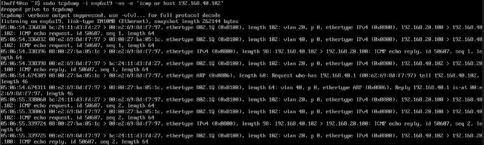
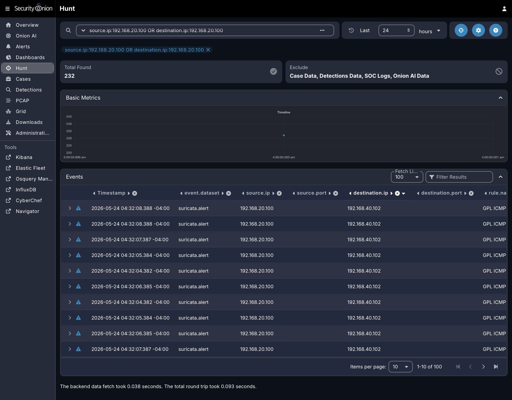

# Project 4: Security Onion Visibility Baseline

## Objective

This project establishes a baseline for network visibility inside the homelab by validating that Security Onion can observe and investigate traffic generated between the attacker and victim environments.

The goal is not to create advanced detections yet. The goal is to prove that the monitoring architecture works, that traffic from the lab VLANs reaches the Security Onion sensor, and that basic network activity can be reviewed from the Security Onion interface.

## Business & Security Value

Security tools are only useful when they have reliable visibility into the systems they are expected to monitor. In enterprise environments, poor sensor placement, missing endpoint telemetry, incorrect SPAN/mirror configuration, or firewall segmentation gaps can leave defenders blind to attacker activity.

This project demonstrates the ability to:

- Validate Security Onion sensor visibility
- Confirm that attacker-to-victim traffic is observable
- Use packet capture evidence to troubleshoot monitoring gaps
- Document a repeatable visibility baseline before building detections
- Separate visibility validation from later alert tuning and detection engineering work

## Lab Environment

| Component | Purpose |
|---|---|
| pfSense | Firewall, VLAN routing, segmentation, and DHCP services |
| Netgear GS108T | Managed switch used for VLANs and port mirroring |
| Proxmox | Hypervisor hosting lab VMs |
| Kali Linux | Attacker system used to generate test traffic |
| Victim System | Target system used to validate observed traffic |
| Security Onion | Network security monitoring platform and investigation interface |
| Raspberry Pi 5 | Admin jump host used for secure remote access and SSH tunneling |

## Relevant VLANs

| VLAN | Name | Purpose |
|---|---|---|
| 20 | Attacker | Kali / offensive testing network |
| 30 | SIEM | Security Onion management network |
| 40 | Victim | Victim system network |
| 50 | Admin | Management and jump-host access |

## Scope

This project focuses on validating Security Onion visibility across the lab environment.

In scope:

- Confirming Security Onion management access
- Confirming Security Onion sensor health
- Validating that attacker-to-victim traffic is observable
- Capturing packet-level evidence with `tcpdump`
- Reviewing Security Onion dashboards or hunt views for network activity
- Documenting known limitations and troubleshooting results

Out of scope:

- Advanced detection engineering
- Custom Sigma/YARA/Suricata rule writing
- Full incident response workflow
- Endpoint telemetry tuning
- Active Directory attack simulations
- Malware execution

## Rules of Engagement

All testing is performed inside an isolated homelab environment owned and controlled by the project author.

Traffic generation is limited to internal lab systems, including the attacker VLAN, victim VLAN, and Security Onion monitoring environment. No testing is performed against public systems or third-party networks.

## Architecture Summary

Security Onion receives management access through the SIEM VLAN and monitoring traffic through the configured sensor/sniffing interface. The managed switch is used to mirror traffic from selected lab ports toward the Security Onion monitoring interface.

For baseline validation, ports `g1`, `g2`, and `g4` were mirrored to destination port `g3`. This provided broad visibility across the pfSense trunk/uplink, Proxmox-hosted lab systems, and the victim-side connection. Multiple mirror sources may create duplicate packet observations, but this was acceptable for the initial visibility baseline because the goal was to prove that Security Onion could observe controlled attacker-to-victim traffic.

The expected visibility path is:

```text
Kali / Attacker VLAN 20
        |
        |  test traffic
        v
Victim VLAN 40
        |
        |  mirrored traffic from switch
        v
Security Onion sensor interface
        |
        v
Security Onion dashboards / hunt interface
```

## Implementation and Validation Summary

### 1. Security Onion Access Confirmed

Security Onion was accessed through the approved management workflow and confirmed to be reachable from the administrative access path.

Evidence:

- [E01 - Security Onion Dashboard](evidence/E01-security-onion-dashboard.png)

### 2. Sensor Health Confirmed

Security Onion service health was validated with `so-status`. The output showed the core Security Onion containers running successfully.

Evidence:

- [E02 - Security Onion Status Output](evidence/E02-so-status-output.png)

### 3. Management and Monitoring Interfaces Verified

The Security Onion VM was configured with separate network interfaces for management and monitoring. The management interface was attached to the SIEM VLAN, while the sniffing interface was connected to the mirror destination path.

Evidence:

- [E03 - Security Onion Proxmox Interfaces](evidence/E03-security-onion-proxmox-interfaces.png)

### 4. Switch Mirroring Validated

The managed switch was configured to mirror traffic from `g1`, `g2`, and `g4` to destination port `g3`. This allowed Security Onion to observe traffic across the pfSense trunk/uplink, Proxmox-hosted lab systems, and victim-side connection.

Evidence:

- [E04 - Switch Mirror Configuration](evidence/E04-switch-mirror-configuration.png)

### 5. Controlled Test Traffic Generated

Kali generated controlled ICMP traffic from the attacker VLAN to the victim system on the victim VLAN. This provided safe internal traffic for Security Onion visibility validation.

Evidence:

- [E05 - Kali Test Traffic](evidence/E05-kali-test-traffic.png)

### 6. Packet-Level Visibility Confirmed

Security Onion confirmed packet-level visibility with `tcpdump`. The capture showed mirrored VLAN traffic from the attacker and victim networks reaching the Security Onion sensor interface.

Evidence:

- [E06 - Security Onion tcpdump Traffic](evidence/E06-security-onion-tcpdump-traffic.png)

### 7. Security Onion Hunt Visibility Confirmed

Security Onion Hunt displayed Suricata ICMP events for the controlled Kali-to-victim traffic. This confirmed that the observed packets were processed into searchable security telemetry.

Evidence:

- [E07 - Security Onion Hunt Results](evidence/E07-security-onion-hunt-results.png)

## Evidence Checklist

| ID | Evidence Item | Status |
|---|---|---|
| [E01](evidence/E01-security-onion-dashboard.png) | Security Onion dashboard showing populated network telemetry | Complete |
| [E02](evidence/E02-so-status-output.png) | Security Onion service/status output showing healthy containers | Complete |
| [E03](evidence/E03-security-onion-proxmox-interfaces.png) | Security Onion VM network interface layout in Proxmox | Complete |
| [E04](evidence/E04-switch-mirror-configuration.png) | Switch mirror/SPAN configuration showing `g1`, `g2`, and `g4` mirrored to `g3` | Complete |
| [E05](evidence/E05-kali-test-traffic.png) | Kali attacker test traffic to victim system | Complete |
| [E06](evidence/E06-security-onion-tcpdump-traffic.png) | `tcpdump` showing mirrored VLAN traffic on Security Onion | Complete |
| [E07](evidence/E07-security-onion-hunt-results.png) | Security Onion Hunt results showing Suricata ICMP events | Complete |

## Screenshots

The following evidence files are stored in the [`evidence/`](evidence/) folder:

- [E01 - Security Onion Dashboard](evidence/E01-security-onion-dashboard.png)
- [E02 - Security Onion Status Output](evidence/E02-so-status-output.png)
- [E03 - Security Onion Proxmox Interfaces](evidence/E03-security-onion-proxmox-interfaces.png)
- [E04 - Switch Mirror Configuration](evidence/E04-switch-mirror-configuration.png)
- [E05 - Kali Test Traffic](evidence/E05-kali-test-traffic.png)
- [E06 - Security Onion tcpdump Traffic](evidence/E06-security-onion-tcpdump-traffic.png)
- [E07 - Security Onion Hunt Results](evidence/E07-security-onion-hunt-results.png)

## Key Evidence

### Switch Mirroring Configuration

The managed switch was configured to mirror traffic from `g1`, `g2`, and `g4` to destination port `g3`, which connects to the Security Onion sniffing interface.


### Packet-Level Validation

Security Onion confirmed packet-level visibility with `tcpdump`, showing mirrored VLAN traffic from the attacker and victim networks reaching the sensor interface.



### Security Onion Hunt Results

Security Onion Hunt displayed Suricata ICMP events for the controlled Kali-to-victim traffic, confirming that the observed packets were processed into searchable security telemetry.



## Findings

The visibility baseline was successful. Security Onion was reachable through the approved management workflow, core Security Onion containers were running, and the VM had separate interfaces for management and monitoring.

The switch mirror configuration sent traffic from `g1`, `g2`, and `g4` to destination port `g3`, where the Security Onion sniffing interface could observe mirrored traffic. Kali generated controlled ICMP traffic from the attacker VLAN to the victim system on the victim VLAN. Security Onion confirmed this traffic at two levels:

1. `tcpdump` showed mirrored VLAN 20 and VLAN 40 traffic arriving on the Security Onion sensor interface.
2. Security Onion Hunt displayed Suricata ICMP events from the attacker IP to the victim IP.

This confirms that the lab has a working network visibility baseline and is ready for future detection-focused projects.

## Troubleshooting Notes

If Security Onion does not show traffic in the UI, validate visibility in this order:

1. Confirm the attacker and victim can communicate.
2. Confirm the correct switch ports are mirrored.
3. Confirm the Security Onion sniffing interface is connected to the mirror destination.
4. Confirm the Security Onion sniffing interface is not being used as the management interface.
5. Confirm `tcpdump` sees the traffic on the sensor interface.
6. Confirm Security Onion services are healthy.
7. Confirm the Security Onion UI query uses the correct time range, IP address, protocol, or event type.

## Current Status

Project 4 is complete.

The Security Onion visibility baseline was successfully validated. Security Onion observed controlled Kali-to-victim traffic through packet-level `tcpdump` validation and searchable Suricata ICMP events in the Hunt interface.

## Skills Demonstrated

- Network security monitoring validation
- VLAN-aware lab architecture
- Sensor placement troubleshooting
- Packet capture analysis
- Security Onion investigation workflow
- Documentation of defensive visibility controls
- Evidence-based troubleshooting

## Next Steps

With baseline visibility confirmed, the next phase is detection-focused work, including custom alert validation, attack simulation mapping, and MITRE ATT&CK-aligned detection engineering.