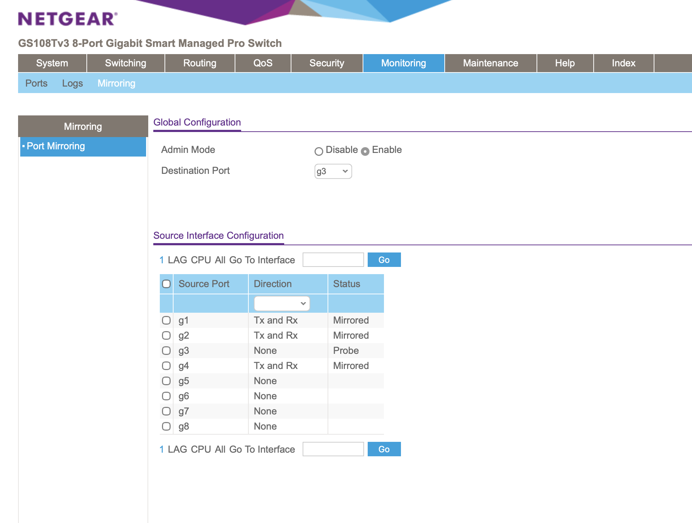

# Project 04: Security Onion Visibility Baseline

## Overview

This project established a baseline for network visibility inside the homelab by validating that Security Onion can observe and investigate traffic generated between the attacker and victim environments. The goal was to prove that the monitoring architecture works, that traffic from the lab VLANs reaches the Security Onion sensor, and that basic network activity can be reviewed from the Security Onion interface.

This project separates visibility validation from later detection engineering work. Before building advanced detections, tuning alerts, or creating incident response workflows, the lab needed a reliable baseline showing that Security Onion could receive, process, and display controlled attacker-to-victim traffic.

The project reinforces practical skills related to network security monitoring, sensor placement, switch mirroring, packet capture validation, Security Onion Hunt, Suricata event review, and evidence-based troubleshooting.

## Lab Environment

| Component | Purpose |
|---|---|
| pfSense | Firewall, VLAN routing, segmentation, and DHCP services |
| Netgear GS108T | Managed switch used for VLANs and port mirroring |
| Proxmox | Hypervisor hosting lab VMs |
| Kali Linux | Attacker system used to generate controlled test traffic |
| Victim System | Target system used to validate observed traffic |
| Security Onion | Network security monitoring platform and investigation interface |
| Raspberry Pi 5 | Admin jump host used for secure remote access and SSH tunneling |

## Objectives

- Confirm that Security Onion management access is functional.
- Confirm that core Security Onion services are healthy.
- Validate that Security Onion has separate management and monitoring interfaces.
- Confirm that the managed switch mirror/SPAN configuration forwards lab traffic to Security Onion.
- Generate controlled Kali-to-victim traffic for visibility testing.
- Validate packet-level visibility using `tcpdump`.
- Confirm that Security Onion Hunt displays searchable Suricata events from the observed traffic.

## Network / System Scope

| Item | Details |
|---|---|
| Attacker VLAN | VLAN 20 / Kali Linux offensive testing network |
| SIEM VLAN | VLAN 30 / Security Onion management network |
| Victim VLAN | VLAN 40 / victim system network |
| Admin VLAN | VLAN 50 / management and jump-host access |
| Mirror Sources | Switch ports `g1`, `g2`, and `g4` |
| Mirror Destination | Switch port `g3` connected to the Security Onion sniffing interface |
| Monitoring Platform | Security Onion |
| Test Traffic | Controlled ICMP traffic from Kali to the victim system |
| Validation Method | Security Onion dashboard review, `so-status`, Proxmox interface review, switch mirror review, Kali traffic generation, `tcpdump`, and Security Onion Hunt |

## Implementation Summary

Security Onion was validated as the primary network security monitoring platform for the homelab. The platform was accessed through the approved administrative workflow, and core Security Onion service health was confirmed with `so-status`.

The Security Onion VM was configured with separate management and monitoring interfaces. The management interface provided access to the Security Onion interface, while the sniffing interface received mirrored traffic from the managed switch.

The managed switch was configured to mirror traffic from `g1`, `g2`, and `g4` to destination port `g3`. This provided visibility across the pfSense trunk/uplink, Proxmox-hosted lab systems, and the victim-side connection. Kali then generated controlled ICMP traffic from the attacker VLAN to the victim system on the victim VLAN.

Visibility was validated at two levels. First, `tcpdump` confirmed that mirrored traffic was reaching the Security Onion sensor interface. Second, Security Onion Hunt displayed Suricata ICMP events for the controlled Kali-to-victim traffic, confirming that the observed packets were processed into searchable security telemetry.

## Architecture Summary

Security Onion receives management access through the SIEM VLAN and monitoring traffic through the configured sensor/sniffing interface. The managed switch is used to mirror traffic from selected lab ports toward the Security Onion monitoring interface.

For baseline validation, ports `g1`, `g2`, and `g4` were mirrored to destination port `g3`. This provided broad visibility across the pfSense trunk/uplink, Proxmox-hosted lab systems, and the victim-side connection. Multiple mirror sources may create duplicate packet observations, but this was acceptable for the initial visibility baseline because the goal was to prove that Security Onion could observe controlled attacker-to-victim traffic.

The expected visibility path is:

```text
Kali / Attacker VLAN 20
        |
        |  test traffic
        v
Victim VLAN 40
        |
        |  mirrored traffic from switch
        v
Security Onion sensor interface
        |
        v
Security Onion dashboards / Hunt interface
```

## Visibility Validation

Security Onion visibility was validated through a sequence of checks that moved from platform access to packet-level visibility and then to searchable event data.

| Validation Area | Result | Evidence |
|---|---|---|
| Security Onion access | Security Onion dashboard was reachable through the approved management workflow | [01 - Security Onion Dashboard](evidence/01-security-onion-dashboard.png) |
| Service health | `so-status` showed core Security Onion containers running successfully | [02 - Security Onion Status Output](evidence/02-so-status-output.png) |
| Interface layout | Security Onion had separate management and sniffing interfaces in Proxmox | [03 - Security Onion Proxmox Interfaces](evidence/03-security-onion-proxmox-interfaces.png) |
| Switch mirroring | Managed switch mirrored `g1`, `g2`, and `g4` to destination port `g3` | [04 - Switch Mirror Configuration](evidence/04-switch-mirror-configuration.png) |
| Test traffic | Kali generated controlled ICMP traffic to the victim system | [05 - Kali Test Traffic](evidence/05-kali-test-traffic.png) |
| Packet visibility | `tcpdump` showed mirrored VLAN traffic reaching Security Onion | [06 - Security Onion tcpdump Traffic](evidence/06-security-onion-tcpdump-traffic.png) |
| Hunt visibility | Security Onion Hunt showed Suricata ICMP events for Kali-to-victim traffic | [07 - Security Onion Hunt Results](evidence/07-security-onion-hunt-results.png) |

## Evidence

| # | Evidence | Description |
|---|---|---|
| 01 | [Security Onion Dashboard](evidence/01-security-onion-dashboard.png) | Shows Security Onion reachable through the approved management workflow with populated network telemetry. |
| 02 | [Security Onion Status Output](evidence/02-so-status-output.png) | Shows Security Onion service health and running containers using `so-status`. |
| 03 | [Security Onion Proxmox Interfaces](evidence/03-security-onion-proxmox-interfaces.png) | Shows the Security Onion VM interface layout in Proxmox, including management and monitoring interfaces. |
| 04 | [Switch Mirror Configuration](evidence/04-switch-mirror-configuration.png) | Shows switch mirror/SPAN configuration with `g1`, `g2`, and `g4` mirrored to `g3`. |
| 05 | [Kali Test Traffic](evidence/05-kali-test-traffic.png) | Shows Kali generating controlled test traffic toward the victim system. |
| 06 | [Security Onion tcpdump Traffic](evidence/06-security-onion-tcpdump-traffic.png) | Shows `tcpdump` confirming mirrored VLAN traffic on the Security Onion sensor interface. |
| 07 | [Security Onion Hunt Results](evidence/07-security-onion-hunt-results.png) | Shows Security Onion Hunt displaying Suricata ICMP events from the controlled Kali-to-victim traffic. |

## Key Evidence

### Switch Mirroring Configuration



This screenshot shows the managed switch mirror/SPAN configuration used to send traffic from `g1`, `g2`, and `g4` to destination port `g3`, which connects to the Security Onion sniffing interface.

### Packet-Level Validation


This screenshot shows `tcpdump` confirming packet-level visibility on Security Onion. The capture validates that mirrored VLAN traffic from the attacker and victim networks reached the sensor interface.

### Security Onion Hunt Results


This screenshot shows Security Onion Hunt displaying Suricata ICMP events for the controlled Kali-to-victim traffic. This confirms that the observed packets were processed into searchable security telemetry.

## Validation

The Security Onion visibility baseline was validated by confirming platform access, service health, interface separation, switch mirroring, controlled traffic generation, packet-level capture, and searchable event visibility.

Validation confirmed the following:

- Security Onion was reachable through the approved management workflow.
- Core Security Onion containers were running successfully.
- Security Onion had separate interfaces for management and monitoring.
- The managed switch mirrored traffic from `g1`, `g2`, and `g4` to destination port `g3`.
- Kali generated controlled ICMP traffic from the attacker VLAN to the victim system on the victim VLAN.
- `tcpdump` showed mirrored VLAN 20 and VLAN 40 traffic reaching the Security Onion sensor interface.
- Security Onion Hunt displayed Suricata ICMP events from the attacker IP to the victim IP.

## Challenges and Lessons Learned

This project reinforced that a monitoring platform must be validated before it can be trusted for detection engineering. Security Onion may be installed and reachable through the web interface, but that alone does not prove that it is receiving the right traffic.

The project also showed why visibility should be tested in layers. Management access, service health, switch mirroring, sensor interface placement, packet capture, and Hunt results each answer a different part of the visibility question. A failure at any one layer could prevent defenders from seeing attacker activity.

The switch mirror design provided broad baseline visibility, but multiple mirrored sources can create duplicate packet observations. For this project, that was acceptable because the goal was to confirm visibility. Future detection tuning can refine mirror scope and reduce duplicate observations if needed.

## Security Relevance

This project demonstrates how network security monitoring visibility supports real-world cybersecurity operations. SIEM and NDR tools are only useful when they receive the traffic they are expected to analyze. Poor sensor placement, incorrect SPAN/mirror configuration, interface misconfiguration, or missing packet visibility can leave defenders blind to attacker activity.

The project also demonstrates an important defensive workflow: validate that telemetry exists before building detections. By proving that Security Onion can observe and process controlled attacker-to-victim traffic, the lab establishes a trustworthy foundation for later alert validation, hunt workflows, detection engineering, and incident response projects.

## Business Value

This project provides business value by showing how visibility validation can reduce operational risk and improve confidence in security monitoring. Security teams need evidence that their monitoring tools are placed correctly, receiving the expected data, and producing searchable telemetry.

In an enterprise environment, this type of work helps teams:

- Confirm that monitoring tools are receiving relevant network traffic.
- Reduce blind spots caused by incorrect sensor placement or SPAN configuration.
- Troubleshoot visibility issues before relying on detections.
- Support incident response by ensuring traffic can be reviewed after suspicious activity occurs.
- Improve communication between networking, infrastructure, and security teams.
- Document a repeatable visibility baseline for audits, handoffs, and future engineering work.

## Portfolio Summary

This project demonstrates the ability to validate network security monitoring visibility using Security Onion in a segmented cybersecurity homelab. The project confirmed that Security Onion was accessible, healthy, properly connected, and able to observe controlled Kali-to-victim traffic through both packet-level `tcpdump` validation and searchable Suricata events in Hunt.

The project highlights hands-on experience with Security Onion, switch mirroring, VLAN-aware lab architecture, packet capture validation, sensor placement troubleshooting, and professional evidence-based documentation.