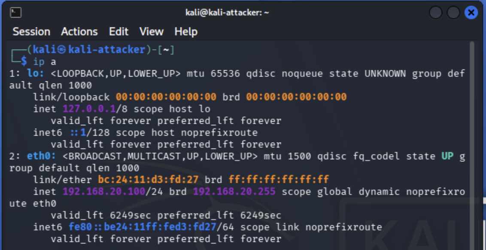
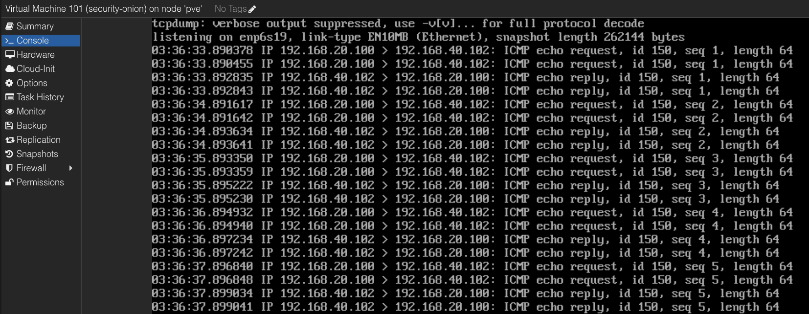
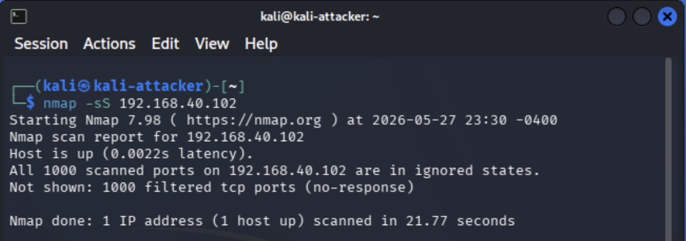

# Project 05: Network Reconnaissance Detection

## Overview

This project documents the detection of network reconnaissance activity inside the segmented cybersecurity homelab. The goal was to generate controlled scan traffic from the Attacker VLAN, observe the activity from the Security Onion sensor, and validate that reconnaissance behavior could be investigated using packet captures, Security Onion Hunt, and supporting evidence.

This project builds on the previous homelab projects by moving from infrastructure validation into active security monitoring. Instead of only proving that VLANs, firewall rules, and port mirroring are configured correctly, this project demonstrates how the lab can be used to simulate attacker behavior and investigate that behavior from a defender perspective.

The project reinforces practical skills related to Nmap scanning, reconnaissance detection, VLAN-aware testing, Security Onion investigation, Zeek connection log review, packet capture validation, and evidence-based documentation.

## Lab Environment

| Component | Purpose |
|---|---|
| pfSense / Protectli | Firewall, routing, VLAN enforcement, and DHCP services |
| Netgear GS108T | Managed switch used for VLAN tagging and port mirroring |
| Proxmox / Dell R730xd | Virtualization host for Kali Linux and Security Onion |
| Kali Linux | Attacker system used to generate controlled reconnaissance traffic |
| Windows Victim | Target system used to receive scan traffic on the Victim VLAN |
| Security Onion | Network security monitoring platform used for packet capture and Hunt review |
| Raspberry Pi 5 | Admin jump host and secure remote access point |

## Objectives

- Confirm Kali attacker placement on VLAN 20.
- Confirm Windows victim placement on VLAN 40.
- Validate Security Onion sensor health before testing.
- Confirm the Proxmox sniffing bridge forwards mirrored traffic into the Security Onion VM.
- Generate controlled reconnaissance traffic using Nmap from Kali to the victim system.
- Validate packet visibility using `tcpdump` on the Security Onion monitoring interface.
- Review Security Onion Hunt results for Zeek connection logs related to the reconnaissance activity.

## Network / System Scope

| Item | Details |
|---|---|
| Attacker System | Kali Linux VM |
| Attacker VLAN | VLAN 20 |
| Attacker IP | `192.168.20.100` |
| Victim System | Windows victim system |
| Victim VLAN | VLAN 40 |
| Victim IP | `192.168.40.102` |
| Monitoring Platform | Security Onion |
| Monitoring Interface | `enp6s19` |
| Proxmox Monitoring Bridge | `vmbr1` with `bridge-ageing 0` |
| Test Traffic | ICMP discovery and TCP SYN scan traffic |
| Validation Method | IP validation, `so-status`, Proxmox bridge review, `tcpdump`, Nmap, and Security Onion Hunt |

## Implementation Summary

The test workflow began by confirming the Kali attacker VM on VLAN 20 and the Windows victim system on VLAN 40. This ensured the scan source and target were both correctly placed inside the segmented lab environment before reconnaissance traffic was generated.

Security Onion sensor health was validated with `so-status`, and the Proxmox `vmbr1` sniffing bridge was confirmed with `bridge-ageing 0` so mirrored/SPAN traffic would pass into the Security Onion VM. Packet visibility was then validated with `tcpdump` on the Security Onion monitoring interface `enp6s19`.

After visibility was confirmed, Kali performed a controlled Nmap TCP SYN scan against the Windows victim at `192.168.40.102`. Security Onion Hunt was then used to review Zeek connection logs involving the attacker IP `192.168.20.100` and victim IP `192.168.40.102` across multiple destination ports.

## Reconnaissance Detection Workflow

Network reconnaissance is one of the earliest phases of an intrusion attempt. Attackers commonly scan internal networks to discover live hosts, open ports, running services, and possible attack paths. Detecting this behavior early gives defenders an opportunity to investigate suspicious activity before exploitation occurs.

The workflow for this project followed a controlled attacker-to-defender sequence:

```text
Kali attacker on VLAN 20
        |
        | Nmap SYN scan
        v
Windows victim on VLAN 40
        |
        | mirrored traffic
        v
Security Onion sensor interface
        |
        v
Security Onion Hunt / Zeek connection logs
```

This workflow demonstrates how controlled attacker behavior can be used to validate defender visibility inside the lab.

## Validation Steps

| Test ID | Validation Area | Validation Method | Result |
|---|---|---|---|
| T01 | Attacker IP validation | `ip a` on Kali Linux | Passed - Kali was confirmed on the Attacker VLAN with IP `192.168.20.100` |
| T02 | Victim IP validation | `ipconfig` on Windows victim | Passed - The victim was confirmed on the Victim VLAN with IP `192.168.40.102` |
| T03 | Sensor health validation | `sudo so-status` on Security Onion | Passed - Security Onion services were running and healthy |
| T04 | Proxmox mirror bridge validation | Review `/etc/network/interfaces` | Passed - `vmbr1` was configured as the dedicated sniffing bridge with `bridge-ageing 0` |
| T05 | Packet capture validation | `sudo tcpdump -i enp6s19 -nn host 192.168.20.100 or host 192.168.40.102` | Passed - Security Onion monitor interface saw mirrored traffic between attacker and victim |
| T06 | TCP SYN scan | `nmap -sS 192.168.40.102` | Passed - Kali generated reconnaissance traffic against the victim |
| T07 | Security Onion Hunt review | Hunt query for attacker/victim IPs | Passed - Security Onion recorded Zeek connection logs for scan activity |

## Evidence

| # | Evidence | Description |
|---|---|---|
| 01 | [Kali Attacker IP](evidence/01-kali-attacker-ip.png) | Shows the Kali attacker VM assigned to VLAN 20 with IP `192.168.20.100`. |
| 02 | [Windows Victim IP](evidence/02-victim-ip.png) | Shows the Windows victim assigned to VLAN 40 with IP `192.168.40.102`. |
| 03 | [Security Onion Sensor Status](evidence/03-security-onion-sensor-status.png) | Shows Security Onion services running and the sensor stack healthy. |
| 04 | [Proxmox vmbr1 Bridge Ageing Fix](evidence/04-proxmox-vmbr1-bridge-ageing-fix.png) | Shows Proxmox `vmbr1` configured with `bridge-ageing 0` so mirrored/SPAN traffic reaches Security Onion. |
| 05 | [Security Onion Monitor Interface tcpdump](evidence/05-monitor-interface-tcpdump.png) | Shows Security Onion monitor interface `enp6s19` capturing mirrored ICMP traffic between Kali and the Windows victim. |
| 06 | [Nmap SYN Scan](evidence/06-nmap-syn-scan.png) | Shows Kali running a TCP SYN scan against the Windows victim at `192.168.40.102`. |
| 07 | [Security Onion SYN Scan Logs](evidence/07-security-onion-syn-scan-logs.png) | Shows Security Onion Hunt displaying Zeek connection logs from `192.168.20.100` to `192.168.40.102` across multiple destination ports. |

## Key Evidence

### Kali Attacker IP Validation



This screenshot shows the Kali attacker VM assigned to VLAN 20 with IP `192.168.20.100`, confirming the scan source was correctly placed on the Attacker VLAN.

### Security Onion Monitor Interface tcpdump



This screenshot shows `tcpdump` on Security Onion interface `enp6s19` capturing mirrored traffic between the Kali attacker and Windows victim, confirming packet-level visibility before relying on Hunt results.

### Nmap SYN Scan



This screenshot shows Kali running a controlled TCP SYN scan against the Windows victim. The scan generated reconnaissance traffic for Security Onion visibility and investigation.

### Security Onion SYN Scan Logs


This screenshot shows Security Onion Hunt displaying Zeek connection logs for the Nmap SYN scan, confirming that reconnaissance activity was captured and searchable from the defender interface.

## Troubleshooting Note

During validation, Security Onion initially stopped showing mirrored traffic after a reboot. Packet captures confirmed that traffic was reaching the Proxmox physical mirror interface and the `vmbr1` bridge, but not the Security Onion monitor interface inside the VM.

The issue was resolved by adding `bridge-ageing 0` to the dedicated Proxmox sniffing bridge:

```text
auto vmbr1
iface vmbr1 inet manual
    bridge-ports nic3
    bridge-stp off
    bridge-fd 0
    bridge-ageing 0
```

After rebooting the Proxmox host, Security Onion began receiving mirrored traffic again on `enp6s19`, and Hunt logs populated successfully. This configuration ensures the dedicated monitoring bridge forwards mirrored/SPAN traffic into the Security Onion VM instead of relying on normal bridge MAC learning behavior.

## Validation

The project was validated by confirming attacker placement, victim placement, Security Onion sensor health, Proxmox monitoring bridge configuration, packet-level visibility, scan execution, and Security Onion Hunt results.

Validation confirmed the following:

- Kali was correctly placed on VLAN 20 with IP `192.168.20.100`.
- The Windows victim was correctly placed on VLAN 40 with IP `192.168.40.102`.
- Security Onion services were running and ready to process sensor data.
- Proxmox `vmbr1` was configured with `bridge-ageing 0` to support mirrored traffic delivery into the Security Onion VM.
- Security Onion captured mirrored traffic on `enp6s19`.
- Kali generated controlled reconnaissance traffic using an Nmap TCP SYN scan.
- Security Onion Hunt displayed Zeek connection logs related to the scan activity.

## Challenges and Lessons Learned

This project reinforced that detection validation requires both attacker-side and defender-side evidence. The Nmap scan confirmed that reconnaissance traffic was generated, while Security Onion `tcpdump` and Hunt evidence confirmed that the defender could observe and investigate the activity.

The project also showed the importance of validating sensor visibility after system changes or reboots. Even when switch mirroring and VM placement are correct, Proxmox bridge behavior can affect whether mirrored traffic reaches the Security Onion monitoring interface.

A key lesson was that filtered scan results can still be useful. Even when ports appear filtered by the Windows firewall, the scan still produces network activity that can be captured, logged, and investigated by defensive tools.

## Security Relevance

This project demonstrates how defenders can detect early-stage reconnaissance inside a segmented network. Reconnaissance activity often occurs before exploitation and may indicate that an attacker is mapping the environment, identifying live hosts, or looking for exposed services.

The project also demonstrates the value of Zeek connection logs and packet capture validation. By combining attacker-side scan evidence with Security Onion telemetry, defenders can confirm that suspicious behavior occurred and identify the source, destination, ports, and timing of the activity.

## Business Value

This project provides business value by showing how early reconnaissance detection can improve security monitoring and reduce response time. Detecting scans before exploitation gives security teams an opportunity to investigate suspicious activity earlier in the attack lifecycle.

In an enterprise environment, this type of work helps teams:

- Identify internal reconnaissance before exploitation occurs.
- Validate that network sensors can observe attacker-to-victim traffic.
- Support alert triage with packet captures and Zeek connection logs.
- Confirm the source, destination, and scope of suspicious scanning behavior.
- Improve confidence in SIEM/NDR monitoring coverage.
- Document detection evidence in a repeatable and reviewable format.

## Portfolio Summary

This project demonstrates the ability to generate, observe, and investigate controlled network reconnaissance activity inside a segmented cybersecurity homelab. Kali was used to perform an Nmap TCP SYN scan from VLAN 20 against a Windows victim on VLAN 40, while Security Onion captured and displayed related network telemetry.

The project highlights hands-on experience with Nmap, Security Onion Hunt, Zeek connection logs, packet capture validation, Proxmox monitoring bridge troubleshooting, VLAN-aware lab testing, and professional evidence-based documentation.