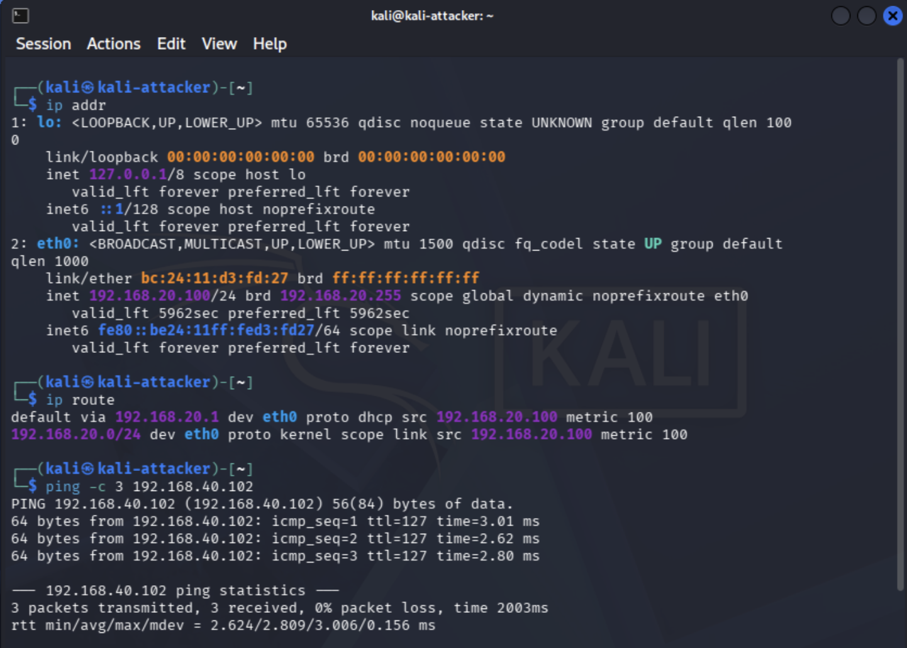
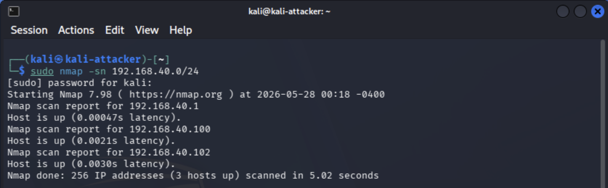
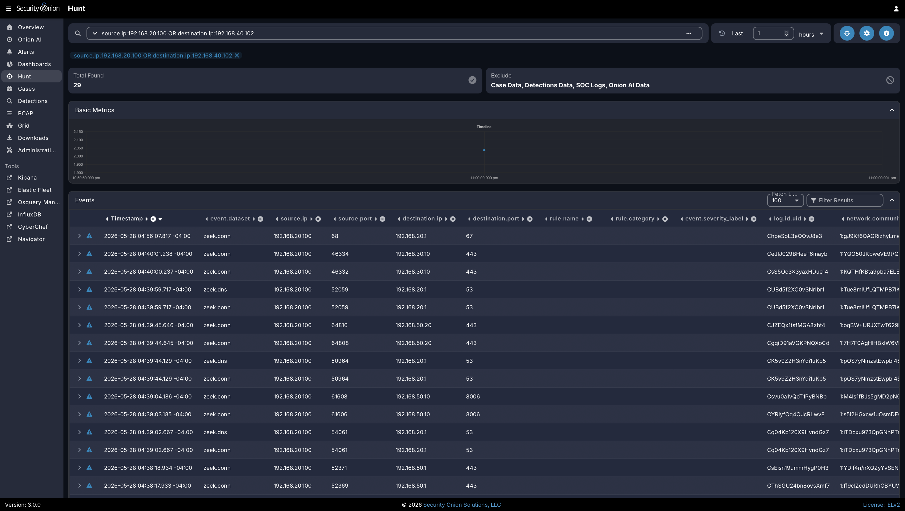
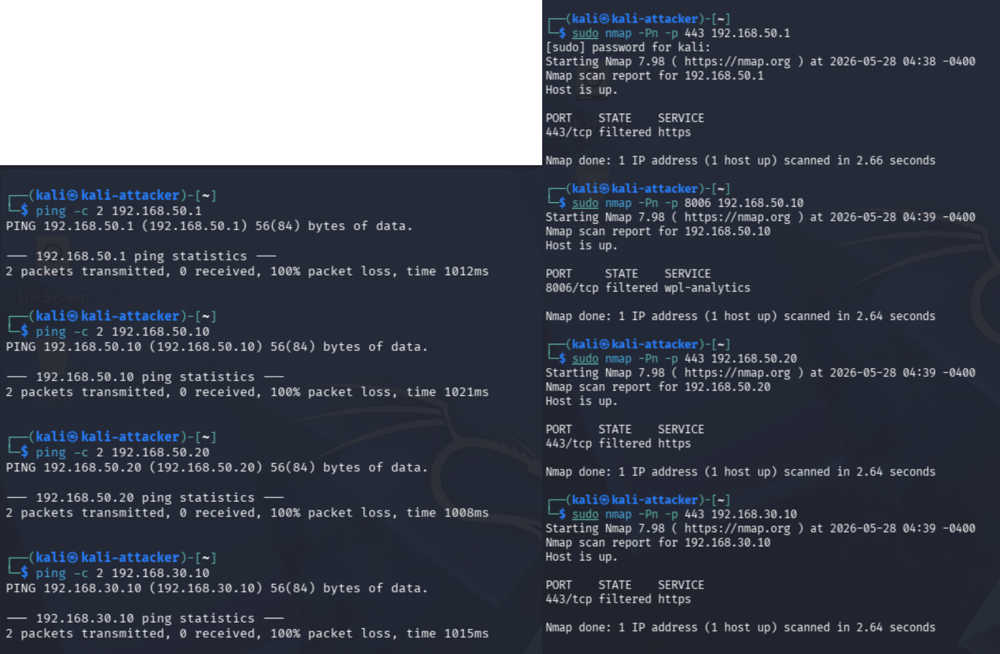

# Project 6: Service Enumeration and Exposure Review

## Objective

This project documents a controlled service enumeration and exposure review inside the homelab environment. The goal is to identify reachable hosts, enumerate exposed services, validate expected network segmentation behavior, and document whether the observed exposure matches the intended design of the lab.

This project builds on the earlier segmentation, monitoring, Proxmox, and Security Onion projects by shifting from infrastructure setup into active validation. Instead of assuming that firewall rules, VLANs, and services are configured correctly, this project uses attacker-style discovery from the Kali VM to confirm what is actually visible on the network.

## Business & Security Value

Service enumeration is a common early step in both legitimate security assessments and real-world attacks. From a defender's perspective, reviewing exposed services helps answer several important questions:

- Which systems are reachable from a given network segment?
- Which ports and services are exposed?
- Are management interfaces restricted to the correct VLAN?
- Are unnecessary services running?
- Do firewall rules prevent access where expected?
- Does Security Onion capture and log the scanning activity?

This type of review supports vulnerability management, attack surface reduction, firewall validation, and blue-team monitoring. It also demonstrates the ability to think like both an attacker and defender while staying within a controlled lab scope.

## Lab Environment

| Component | Role | Notes |
| --- | --- | --- |
| Kali Linux VM | Enumeration host | Used to run discovery and service enumeration commands |
| Victim VLAN | Target network | Contains intentionally monitored lab systems |
| Admin VLAN | Management network | Used for restricted access to administrative interfaces |
| Security Onion | Monitoring platform | Used to observe scan traffic and validate network visibility |
| pfSense | Firewall/router | Enforces VLAN segmentation and access control rules |
| Netgear GS108T | Managed switch | Provides VLAN tagging and traffic mirroring |
| Proxmox | Virtualization host | Hosts core lab VMs including Kali and Security Onion |

## Scope & Rules of Engagement

This project was performed only inside the local homelab environment.

### In Scope

- Lab-owned VLANs and systems
- Kali VM enumeration activity
- Internal IP ranges assigned to the homelab
- Service discovery against approved lab targets
- Security Onion monitoring and evidence review
- Firewall rule validation between lab segments

### Out of Scope

- Public IP scanning
- Third-party systems
- ISP-owned infrastructure
- Employer systems
- Internet-wide enumeration
- Unauthorized exploitation

## Methodology

The project follows a basic enumeration workflow:

1. Confirm Kali is on the expected attacker network.
2. Identify the target subnet or approved host range.
3. Run basic host discovery.
4. Enumerate open TCP services on approved targets.
5. Perform limited service/version detection.
6. Compare observed exposure against expected firewall and VLAN behavior.
7. Review Security Onion for scan visibility.
8. Document findings, screenshots, and lessons learned.

## Commands Used

> Replace the sample IP ranges below with the actual lab ranges used during testing.

### Confirm Kali Network Placement

```bash
ip addr
ip route
ping -c 4 <target-ip>
```

### Host Discovery

```bash
sudo nmap -sn <target-subnet>
```

Example:

```bash
sudo nmap -sn 192.168.40.0/24
```

### Basic TCP Port Scan

```bash
sudo nmap -sS -Pn <target-ip>
```

### Service and Version Detection

```bash
sudo nmap -sV -Pn <target-ip>
```

### Full TCP Port Review

```bash
sudo nmap -p- -Pn <target-ip>
```

### Combined Targeted Scan

```bash
sudo nmap -sS -sV -O -Pn -oA project6-service-enumeration <target-ip>
```

### Optional: Save Output for Evidence

```bash
mkdir -p evidence/nmap-output
sudo nmap -sS -sV -Pn <target-ip> -oA evidence/nmap-output/service-enumeration-<target-name>
```

## Expected Results

The expected outcome is not necessarily that every scan finds open services. The goal is to validate that the network behaves as designed.

Expected observations may include:

- Kali can reach approved victim systems.
- Kali cannot reach restricted management interfaces unless explicitly allowed.
- Administrative services are not broadly exposed to attacker or victim networks.
- Security Onion can observe scan traffic from mirrored ports or monitored interfaces.
- Firewall rules block traffic that should not cross VLAN boundaries.
- Any discovered services are documented and reviewed.

## Findings

| Target | IP Address | Open Ports / Result | Service Notes | Expected? | Action Needed |
| --- | --- | --- | --- | --- | --- |
| Kali Attacker VM | 192.168.20.100 | N/A | Confirmed attacker VLAN placement with default route through 192.168.20.1 | Yes | None |
| Victim VLAN Discovery | 192.168.40.0/24 | 3 hosts discovered | Host discovery identified 192.168.40.1, 192.168.40.100, and 192.168.40.102 as live hosts | Yes | None |
| Victim Host | 192.168.40.102 | 1000 filtered TCP ports | Host reachable from Kali, but no common TCP services exposed during service enumeration | Yes | None |
| pfSense/Admin Gateway | 192.168.50.1 | 443/tcp filtered; ICMP blocked | Admin interface was not directly reachable from the attacker VLAN | Yes | None |
| Proxmox Management | 192.168.50.10 | 8006/tcp filtered; ICMP blocked | Proxmox web management interface was restricted from the attacker VLAN | Yes | None |
| iDRAC/Management Host | 192.168.50.20 | 443/tcp filtered; ICMP blocked | Management interface was restricted from the attacker VLAN | Yes | None |
| Security Onion Management | 192.168.30.10 | 443/tcp filtered; ICMP blocked | Security Onion management interface was not directly reachable from the attacker VLAN | Yes | None |
| Security Onion Monitoring | N/A | Zeek connection logs observed | Hunt results confirmed activity from Kali was visible in Security Onion | Yes | None |

## Evidence Collected

Screenshots and output files were added to the `evidence/` folder to document attacker placement, service enumeration results, firewall behavior, Security Onion visibility, and saved Nmap output.

| Evidence ID | File Name | Description |
| --- | --- | --- |
| E01 | [`kali-network-placement.png`](evidence/kali-network-placement.png) | Shows Kali on the attacker VLAN with IP address 192.168.20.100, default route through 192.168.20.1, and successful ping to the victim host |
| E02 | [`host-discovery-scan.png`](evidence/host-discovery-scan.png) | Shows Nmap host discovery against 192.168.40.0/24 identifying three live hosts on the victim VLAN |
| E03 | [`service-enumeration-filtered-results.png`](evidence/service-enumeration-filtered-results.png) | Shows Nmap service enumeration against 192.168.40.102 with the host up and 1000 TCP ports filtered |
| E04 | [`security-onion-scan-visibility.png`](evidence/security-onion-scan-visibility.png) | Shows Security Onion Hunt results confirming Zeek connection logs for activity from the Kali attacker VM |
| E05 | [`restricted-management-test.png`](evidence/restricted-management-test.png) | Shows management systems returning ICMP failures and filtered management ports from the attacker VLAN |
| E06 | [`nmap-output-files.png`](evidence/nmap-output-files.png) | Shows saved Nmap output files in `.nmap`, `.gnmap`, and `.xml` formats |
| E07 | [`rules-vlan20-attacker-final.png`](evidence/rules-vlan20-attacker-final.png) | Shows ATTACK VLAN firewall rules allowing victim lab testing while blocking unauthorized private/internal network access |
| E08 | [`nmap-output/`](evidence/nmap-output/) | Contains saved service enumeration and full TCP scan output files for raw evidence retention |

## Evidence Screenshots

### E01 - Kali Network Placement



### E02 - Host Discovery Scan



### E03 - Service Enumeration Filtered Results


### E04 - Security Onion Scan Visibility



### E05 - Restricted Management Test



### E06 - Saved Nmap Output Files


### E07 - ATTACK VLAN Firewall Rules


## Security Onion Validation

Security Onion should be used to confirm that enumeration activity is visible to the monitoring stack where expected.

Security Onion Hunt confirmed visibility into traffic from the Kali attacker VM (`192.168.20.100`). Zeek connection logs showed activity from the attacker VLAN, including attempted connections to management and lab infrastructure systems. This validated that the monitoring stack was receiving and indexing relevant scan and connection metadata.

Items to review:

- Source IP of the Kali VM
- Destination IP of the scanned host
- Connection attempts across multiple ports
- Zeek connection logs
- Alerts or notices generated by scan behavior
- Timeline of scan activity compared to command execution time

Useful Security Onion views may include:

- Alerts
- Hunt
- Dashboards
- Zeek logs
- Connection metadata

## Defensive Review

After enumeration, each exposed service should be reviewed using the following questions:

- Is this service required?
- Is the service exposed only to the correct VLAN?
- Is authentication required?
- Is the service patched?
- Should access be limited to the Admin VLAN?
- Should the service be disabled, firewalled, or monitored more closely?
- Would this exposure make sense in a real enterprise environment?

The review confirmed that the victim host was reachable from the attacker VLAN for lab testing, but common TCP services were filtered. Management interfaces for pfSense, Proxmox, iDRAC, and Security Onion were not directly accessible from the attacker VLAN. This matches the intended design: attacker systems can interact with approved victim lab targets, while administrative services remain restricted.

## Remediation and Hardening Notes

Potential remediation actions may include:

- Disabling unnecessary services
- Restricting management ports to the Admin VLAN
- Adding or tightening pfSense firewall rules
- Moving systems to the correct VLAN
- Updating vulnerable or outdated services
- Adding detection logic for repeated scan behavior
- Documenting accepted risk for intentionally exposed lab services

No immediate remediation was required based on the observed results. The filtered management ports and blocked ICMP responses indicate that segmentation controls are working as intended. Future hardening could include periodic re-testing after firewall changes, adding alert logic for repeated scan behavior, and reviewing any newly introduced services before allowing access from the attacker VLAN.

## Lessons Learned

This project reinforces that network diagrams and firewall rules should be validated with real testing. Enumeration provides a practical way to confirm what an attacker could see from a specific network position, while Security Onion provides visibility into whether that behavior is being monitored.

Key takeaways:

- Segmentation must be tested, not assumed.
- Management interfaces should not be reachable from attacker or victim networks.
- Nmap output provides useful technical evidence for exposure review.
- Security Onion can help validate monitoring coverage during active testing.
- A good homelab portfolio should show both offensive validation and defensive analysis.

## Project Status

- [x] Confirm Kali network placement
- [x] Identify approved target subnet or host range
- [x] Run host discovery
- [x] Run service enumeration
- [x] Save Nmap output files
- [x] Test restricted management access
- [x] Review Security Onion logs
- [x] Capture screenshots
- [x] Document findings
- [x] Add remediation notes
- [x] Update main portfolio README

## Portfolio Summary

Project 6 demonstrates practical exposure review using controlled service enumeration inside a segmented cybersecurity homelab. Kali was used from the attacker VLAN to discover approved victim VLAN hosts, enumerate exposed services, and test access to restricted management systems. The results showed that the victim host was reachable for lab testing while common TCP services and management interfaces remained filtered or blocked. Security Onion Hunt confirmed visibility into attacker VLAN activity through Zeek connection logs, connecting offensive reconnaissance techniques with defensive monitoring and hardening validation.