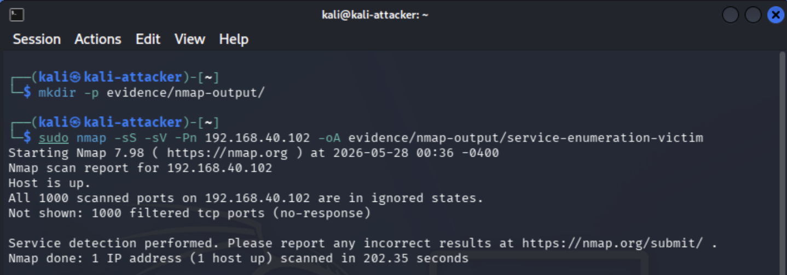

# Project 06: Service Enumeration and Exposure Review

## Overview

This project documents a controlled service enumeration and exposure review inside the segmented cybersecurity homelab. The goal was to identify reachable hosts, enumerate exposed services, validate expected network segmentation behavior, and document whether the observed exposure matched the intended lab design.

This project builds on the earlier segmentation, monitoring, Proxmox, and Security Onion projects by shifting from infrastructure setup into active validation. Instead of assuming that firewall rules, VLANs, and services are configured correctly, this project uses attacker-style discovery from the Kali VM to confirm what is actually visible from the Attacker VLAN.

The project reinforces practical skills related to service enumeration, Nmap output review, firewall validation, attack surface analysis, Security Onion visibility, and defensive exposure review.

## Lab Environment

| Component | Purpose |
|---|---|
| Kali Linux VM | Enumeration host used to run discovery and service enumeration commands |
| Victim VLAN | Target network containing approved lab systems |
| Admin VLAN | Restricted management network for administrative interfaces |
| Security Onion | Monitoring platform used to observe scan traffic and validate network visibility |
| pfSense | Firewall/router enforcing VLAN segmentation and access control rules |
| Netgear GS108T | Managed switch providing VLAN tagging and traffic mirroring |
| Proxmox | Virtualization host for Kali, Security Onion, and lab workloads |

## Objectives

- Confirm Kali network placement on the Attacker VLAN.
- Discover approved live hosts on the Victim VLAN.
- Enumerate exposed services from the attacker perspective.
- Validate that restricted management interfaces are not reachable from the Attacker VLAN.
- Confirm that Security Onion captures and logs scan activity.
- Retain Nmap output files for repeatable evidence and future review.
- Document findings, exposure decisions, and remediation notes in a professional format.

## Network / System Scope

| Item | Details |
|---|---|
| Attacker System | Kali Linux VM |
| Attacker IP | `192.168.20.100` |
| Attacker VLAN Gateway | `192.168.20.1` |
| Victim VLAN | `192.168.40.0/24` |
| Victim Host | `192.168.40.102` |
| Restricted Management Targets | pfSense, Proxmox, iDRAC, and Security Onion management interfaces |
| Monitoring Platform | Security Onion Hunt and Zeek connection logs |
| Firewall Enforcement | pfSense ATTACK VLAN rules |
| Validation Method | IP validation, host discovery, Nmap service enumeration, management access testing, Security Onion Hunt review, and saved scan output files |

## Implementation Summary

The review began by confirming that Kali was correctly placed on the Attacker VLAN with IP `192.168.20.100`, a default route through `192.168.20.1`, and reachability to the approved victim host. Nmap host discovery was then performed against the Victim VLAN to identify live hosts from the attacker perspective.

Service enumeration was performed against the approved victim host `192.168.40.102`. The host was reachable, but common TCP ports were filtered, indicating that the endpoint or firewall policy was limiting exposed services. Additional testing confirmed that pfSense, Proxmox, iDRAC, and Security Onion management interfaces were filtered or unreachable from the Attacker VLAN.

Security Onion Hunt was reviewed to confirm that Zeek connection logs captured activity from the Kali attacker VM. Nmap output files were also saved in `.nmap`, `.gnmap`, and `.xml` formats to preserve technical evidence for future review.

## Exposure Review Workflow

Service enumeration is a common early step in both legitimate security assessments and real-world attacks. From a defender perspective, exposure review helps determine which systems are reachable, which ports are exposed, and whether management interfaces are properly restricted.

The workflow for this project followed the sequence below:

```text
Kali VM on Attacker VLAN
        |
        | Host discovery and service enumeration
        v
Approved Victim VLAN targets
        |
        | Scan traffic mirrored / logged
        v
Security Onion Hunt and Zeek connection logs
        |
        v
Exposure review and remediation decision
```

This process connected offensive validation with defensive review by comparing what Kali could see with what the security monitoring stack recorded.

## Key Findings

| Target | IP Address | Open Ports / Result | Service Notes | Expected? | Action Needed |
|---|---|---|---|---|---|
| Kali Attacker VM | `192.168.20.100` | N/A | Confirmed attacker VLAN placement with default route through `192.168.20.1` | Yes | None |
| Victim VLAN Discovery | `192.168.40.0/24` | 3 hosts discovered | Host discovery identified `192.168.40.1`, `192.168.40.100`, and `192.168.40.102` as live hosts | Yes | None |
| Victim Host | `192.168.40.102` | 1000 filtered TCP ports | Host reachable from Kali, but no common TCP services exposed during service enumeration | Yes | None |
| pfSense/Admin Gateway | `192.168.50.1` | 443/tcp filtered; ICMP blocked | Admin interface was not directly reachable from the Attacker VLAN | Yes | None |
| Proxmox Management | `192.168.50.10` | 8006/tcp filtered; ICMP blocked | Proxmox web management interface was restricted from the Attacker VLAN | Yes | None |
| iDRAC/Management Host | `192.168.50.20` | 443/tcp filtered; ICMP blocked | Management interface was restricted from the Attacker VLAN | Yes | None |
| Security Onion Management | `192.168.30.10` | 443/tcp filtered; ICMP blocked | Security Onion management interface was not directly reachable from the Attacker VLAN | Yes | None |
| Security Onion Monitoring | N/A | Zeek connection logs observed | Hunt results confirmed activity from Kali was visible in Security Onion | Yes | None |

## Evidence

| # | Evidence | Description |
|---|---|---|
| 01 | [Kali Network Placement](evidence/01-kali-network-placement.png) | Shows Kali on the Attacker VLAN with IP `192.168.20.100`, default route through `192.168.20.1`, and successful ping to the victim host. |
| 02 | [Host Discovery Scan](evidence/02-host-discovery-scan.png) | Shows Nmap host discovery against `192.168.40.0/24` identifying three live hosts on the Victim VLAN. |
| 03 | [Service Enumeration Filtered Results](evidence/03-service-enumeration-filtered-results.png) | Shows Nmap service enumeration against `192.168.40.102` with the host up and 1000 TCP ports filtered. |
| 04 | [Security Onion Scan Visibility](evidence/04-security-onion-scan-visibility.png) | Shows Security Onion Hunt results confirming Zeek connection logs for activity from the Kali attacker VM. |
| 05 | [Restricted Management Test](evidence/05-restricted-management-test.png) | Shows management systems returning ICMP failures and filtered management ports from the Attacker VLAN. |
| 06 | [Nmap Output Files](evidence/06-nmap-output-files.png) | Shows a terminal listing of saved Nmap output files in `.nmap`, `.gnmap`, and `.xml` formats. |
| 07 | [ATTACK VLAN Firewall Rules](evidence/07-rules-vlan20-attacker-final.png) | Shows ATTACK VLAN firewall rules allowing victim lab testing while blocking unauthorized private/internal network access. |

## Key Evidence

### Kali Network Placement


This screenshot confirms Kali was operating from the Attacker VLAN with the expected IP address, route, and victim reachability before service enumeration began.

### Host Discovery Scan


This screenshot shows Nmap host discovery against the Victim VLAN, identifying the live systems visible from the attacker perspective.

### Service Enumeration Filtered Results



This screenshot shows that the approved victim host was reachable from Kali, but common TCP ports were filtered during service enumeration.

### Restricted Management Test


This screenshot shows management interfaces returning ICMP failures or filtered management ports from the Attacker VLAN, confirming that administrative services were not broadly exposed.

## Security Onion Validation

Security Onion Hunt confirmed visibility into traffic from the Kali attacker VM `192.168.20.100`. Zeek connection logs showed activity from the Attacker VLAN, including attempted connections to management and lab infrastructure systems.

This validated that the monitoring stack was receiving and indexing relevant scan and connection metadata. The Security Onion evidence connected the attacker-side enumeration activity with defender-side visibility.

## Defensive Review

After enumeration, each exposed service was reviewed using the following questions:

- Is this service required?
- Is the service exposed only to the correct VLAN?
- Is authentication required?
- Is the service patched?
- Should access be limited to the Admin VLAN?
- Should the service be disabled, firewalled, or monitored more closely?
- Would this exposure make sense in a real enterprise environment?

The review confirmed that the victim host was reachable from the Attacker VLAN for lab testing, but common TCP services were filtered. Management interfaces for pfSense, Proxmox, iDRAC, and Security Onion were not directly accessible from the Attacker VLAN. This matched the intended design: attacker systems can interact with approved victim lab targets, while administrative services remain restricted.

## Remediation and Hardening Notes

No immediate remediation was required based on the observed results. The filtered management ports and blocked ICMP responses indicate that segmentation controls were working as intended.

Potential future hardening actions include periodic re-testing after firewall changes, adding alert logic for repeated scan behavior, and reviewing any newly introduced services before allowing access from the Attacker VLAN.

## Validation

The project was validated through attacker placement checks, host discovery, service enumeration, restricted management testing, Security Onion log review, saved Nmap output, and pfSense firewall rule review.

Validation confirmed the following:

- Kali was confirmed on the Attacker VLAN with IP `192.168.20.100` and default route through `192.168.20.1`.
- Nmap host discovery identified three live hosts on `192.168.40.0/24`.
- The victim host `192.168.40.102` was reachable, but common TCP services were filtered.
- pfSense, Proxmox, iDRAC, and Security Onion management interfaces were filtered or unreachable from the Attacker VLAN.
- Security Onion Hunt showed Zeek connection logs for Kali attacker activity.
- Nmap output was saved in `.nmap`, `.gnmap`, and `.xml` formats.
- pfSense ATTACK VLAN rules supported controlled victim access while restricting unauthorized private/internal network access.

## Challenges and Lessons Learned

This project reinforced that network diagrams and firewall rules should be validated with real testing. Enumeration provides a practical way to confirm what an attacker could see from a specific network position, while Security Onion provides visibility into whether that behavior is being monitored.

The project also showed that filtered results are still meaningful. A host can be reachable while exposing no common TCP services to the attacker. In this case, the victim system remained available for lab testing while the administrative interfaces remained restricted.

A key lesson was that exposure review should include both allowed targets and restricted management systems. Testing only the victim network would not prove that management services were protected from the Attacker VLAN.

## Security Relevance

This project demonstrates how service enumeration and exposure review support real-world security operations. Attackers often enumerate reachable systems and services before attempting exploitation. Defenders can use the same techniques to validate segmentation, identify unnecessary exposure, and confirm that monitoring tools are observing suspicious activity.

The project also demonstrates why management interfaces should be isolated from attacker and user-facing networks. Services such as firewall dashboards, hypervisor consoles, iDRAC, and SIEM management portals are high-value administrative targets and should only be reachable from approved management paths.

## Business Value

This project provides business value by showing how exposure review can reduce attack surface and improve operational confidence. Confirming that only expected systems are reachable helps reduce risk before vulnerabilities or misconfigurations are exploited.

In an enterprise environment, this type of work helps teams:

- Identify reachable systems and exposed services from specific network segments.
- Validate that management interfaces are restricted to approved networks.
- Reduce attack surface by confirming unnecessary services are not exposed.
- Support vulnerability management and firewall review processes.
- Improve detection confidence by confirming scan activity appears in monitoring tools.
- Document evidence that segmentation and exposure controls were tested.

## Portfolio Summary

This project demonstrates practical exposure review using controlled service enumeration inside a segmented cybersecurity homelab. Kali was used from the Attacker VLAN to discover approved Victim VLAN hosts, enumerate exposed services, and test access to restricted management systems.

The results showed that the victim host was reachable for lab testing while common TCP services and management interfaces remained filtered or blocked. Security Onion Hunt confirmed visibility into Attacker VLAN activity through Zeek connection logs, connecting offensive reconnaissance techniques with defensive monitoring and hardening validation.