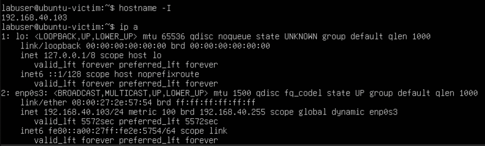
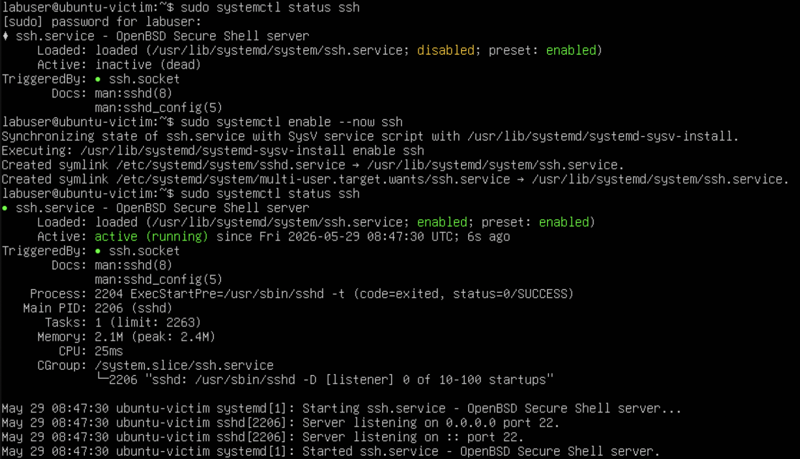
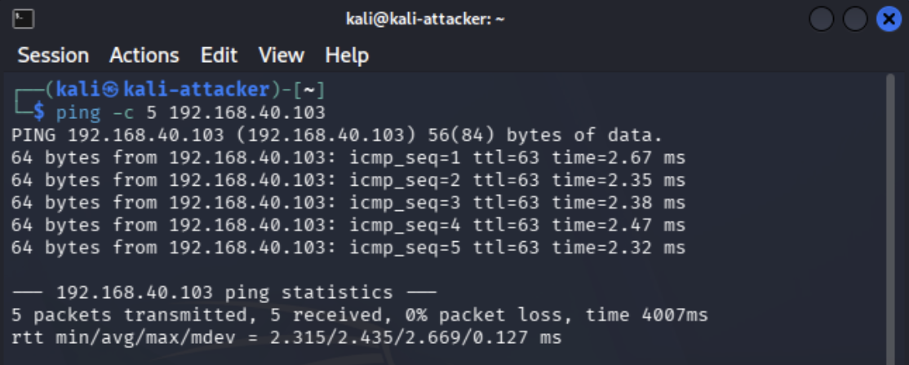
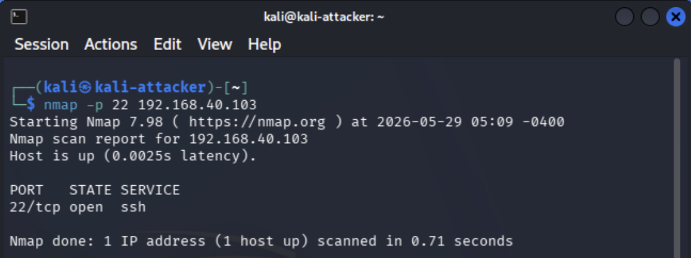
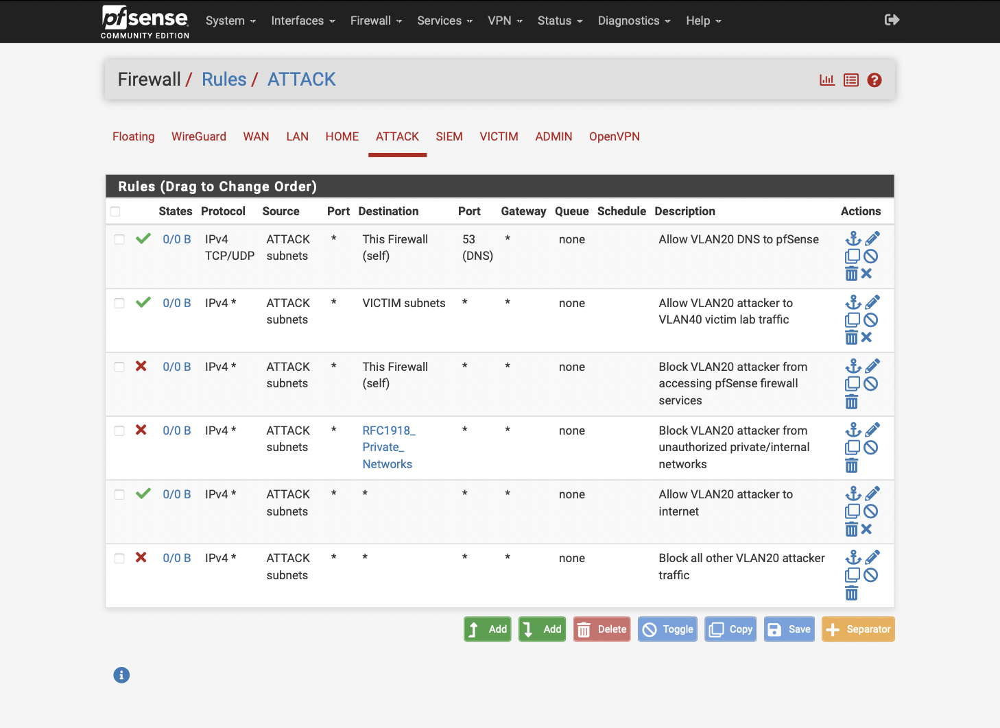

# Project 7: SSH Brute-Force Detection

## Objective

This project demonstrates how a segmented cybersecurity homelab can be used to generate, observe, and document SSH brute-force activity in a controlled environment. The goal is to simulate repeated SSH authentication attempts from an attacker system against a victim system, then validate that the activity can be observed through network traffic and Security Onion logging.

This project builds on the earlier homelab portfolio projects by using the established VLAN architecture, mirrored switch traffic, pfSense firewall controls, and Security Onion monitoring stack to detect suspicious authentication behavior.

## Business and Security Value

SSH brute-force attacks are a common initial-access technique used against exposed Linux servers, network appliances, cloud workloads, and administrative interfaces. Even when an attack is unsuccessful, repeated login attempts may indicate scanning, credential stuffing, password guessing, or compromised internal systems.

This project shows practical blue-team value by demonstrating the ability to:

- Generate controlled attack traffic in an isolated lab environment
- Observe attacker-to-victim SSH authentication attempts
- Validate that monitoring infrastructure receives relevant traffic
- Document brute-force behavior with clear evidence
- Connect offensive activity to defensive detection and investigation workflows
- Strengthen understanding of segmentation, logging, and alert validation

## Lab Environment

| Component | Purpose |
|---|---|
| Kali Linux | Attacker system used to generate SSH authentication attempts |
| Ubuntu Victim VM | Linux target system running OpenSSH Server on VLAN 40 |
| Security Onion | SIEM / NSM platform used to observe and investigate activity |
| pfSense | Firewall and VLAN segmentation control point |
| Netgear GS108T | Managed switch used for VLANs and port mirroring |
| Proxmox / Homelab Server | Virtualization platform for lab workloads |
| Raspberry Pi 5 | Admin jump host / remote-access support system |

## Network Segmentation

This project uses the existing segmented homelab architecture.

| VLAN | Name | Purpose |
|---|---|---|
| VLAN 20 | Attacker | Kali Linux attack system |
| VLAN 30 | SIEM | Security Onion management and monitoring components |
| VLAN 40 | Victim | Target system receiving SSH attempts |
| VLAN 50 | Admin | Administrative access and management systems |

Traffic is intentionally generated between the attacker and victim networks. Security Onion visibility depends on the switch mirroring configuration and the monitoring interface receiving the relevant traffic path.

## Scope and Rules of Engagement

This project was performed only within a private, isolated homelab environment. No public systems, third-party networks, or unauthorized hosts were targeted.

Allowed activity:

- Scanning and testing lab-owned systems
- Generating repeated SSH login attempts against the victim system
- Capturing screenshots and command output for portfolio documentation
- Reviewing Security Onion logs and dashboards for related activity

Out of scope:

- Testing public IP addresses
- Targeting real third-party systems
- Attempting unauthorized access
- Using valid credentials that do not belong to the lab owner
- Running brute-force activity outside the lab environment

## Validation and Evidence

SSH brute-force detection was validated through attacker placement checks, victim placement checks, SSH service validation, controlled authentication attempts, endpoint log review, packet capture, Security Onion investigation, and pfSense rule review.

| Validation Area | Result | Evidence |
|---|---|---|
| Kali attacker placement | Passed - Kali was confirmed on the attacker VLAN with IP `192.168.20.100` | [01-kali-attacker-ip.png](evidence/01-kali-attacker-ip.png) |
| Ubuntu victim placement | Passed - The Ubuntu victim VM was confirmed on the victim VLAN with IP `192.168.40.103` | [02-ubuntu-victim-ip.png](evidence/02-ubuntu-victim-ip.png) |
| SSH service validation | Passed - OpenSSH was enabled and listening on the Ubuntu victim | [03-victim-ssh-service-status.png](evidence/03-victim-ssh-service-status.png) |
| Attacker-to-victim connectivity | Passed - Kali successfully reached the Ubuntu victim across the approved lab path | [04-kali-to-victim-connectivity-test.png](evidence/04-kali-to-victim-connectivity-test.png) |
| SSH port validation | Passed - Nmap confirmed TCP/22 was open on the Ubuntu victim | [05-ssh-port-validation.png](evidence/05-ssh-port-validation.png) |
| Controlled brute-force simulation | Passed - Hydra generated controlled failed SSH authentication attempts using a small local password list | [06-controlled-ssh-bruteforce-test.png](evidence/06-controlled-ssh-bruteforce-test.png) |
| Victim authentication logs | Passed - Ubuntu authentication logs recorded repeated failed SSH login attempts from the Kali attacker IP | [07-victim-auth-log-failed-passwords.png](evidence/07-victim-auth-log-failed-passwords.png) |
| Packet-level SSH visibility | Passed - tcpdump confirmed SSH traffic between the attacker and victim systems on TCP/22 | [08-tcpdump-ssh-traffic.png](evidence/08-tcpdump-ssh-traffic.png) |
| Security Onion investigation | Passed - Security Onion Hunt showed Zeek SSH events, Zeek connection events, and Suricata SSH scan alerts | [09-security-onion-ssh-search-results.png](evidence/09-security-onion-ssh-search-results.png) |
| pfSense rule review | Passed - pfSense allowed controlled lab traffic from VLAN 20 to the VICTIM subnet for the test | [10-pfsense-controlled-test-rule.png](evidence/10-pfsense-controlled-test-rule.png) |

## Implementation Summary

The test workflow began by confirming Kali attacker placement on VLAN 20 and Ubuntu victim placement on VLAN 40. The victim SSH service was validated locally, and TCP/22 exposure was confirmed from Kali. A controlled Hydra test was then performed using a small local password list to generate failed SSH authentication attempts without attempting unauthorized access. The activity was validated in Ubuntu authentication logs, packet capture output, Security Onion Hunt results, and pfSense firewall rule evidence.

## Evidence Summary

The following evidence documents the controlled SSH brute-force detection test and provides clickable links to each evidence file.

| ID | Evidence | What It Demonstrates |
|---|---|---|
| 01 | [01-kali-attacker-ip.png](evidence/01-kali-attacker-ip.png) | Shows Kali attacker VM IP address on the attacker VLAN (`192.168.20.100`) |
| 02 | [02-ubuntu-victim-ip.png](evidence/02-ubuntu-victim-ip.png) | Shows Ubuntu victim VM IP address on the victim VLAN (`192.168.40.103`) |
| 03 | [03-victim-ssh-service-status.png](evidence/03-victim-ssh-service-status.png) | Confirms SSH was enabled and actively listening on the Ubuntu victim |
| 04 | [04-kali-to-victim-connectivity-test.png](evidence/04-kali-to-victim-connectivity-test.png) | Shows successful ICMP connectivity from Kali to the Ubuntu victim |
| 05 | [05-ssh-port-validation.png](evidence/05-ssh-port-validation.png) | Shows Nmap validation confirming TCP/22 open on the Ubuntu victim |
| 06 | [06-controlled-ssh-bruteforce-test.png](evidence/06-controlled-ssh-bruteforce-test.png) | Shows a controlled Hydra test using a small password list against the Ubuntu victim over SSH |
| 07 | [07-victim-auth-log-failed-passwords.png](evidence/07-victim-auth-log-failed-passwords.png) | Shows Ubuntu authentication logs recording repeated failed SSH login attempts from the Kali attacker IP |
| 08 | [08-tcpdump-ssh-traffic.png](evidence/08-tcpdump-ssh-traffic.png) | Shows tcpdump output confirming SSH traffic between the attacker and victim systems on TCP/22 |
| 09 | [09-security-onion-ssh-search-results.png](evidence/09-security-onion-ssh-search-results.png) | Shows Security Onion Hunt results with Zeek SSH/connection events and Suricata SSH scan alerts |
| 10 | [10-pfsense-controlled-test-rule.png](evidence/10-pfsense-controlled-test-rule.png) | Shows the pfSense ATTACK VLAN rule allowing controlled lab traffic from VLAN 20 to the VICTIM subnet |

## Key Findings

- Kali attacker IP: `192.168.20.100`
- Ubuntu victim IP: `192.168.40.103`
- TCP/22 was confirmed open on the Ubuntu victim.
- Controlled Hydra authentication attempts generated repeatable failed-login telemetry.
- Ubuntu `/var/log/auth.log` provided strong endpoint evidence of failed SSH authentication attempts.
- tcpdump confirmed SSH traffic between the attacker and victim systems.
- Security Onion Hunt displayed Zeek SSH events, Zeek connection events, and Suricata SSH scan alerts.
- pfSense rule evidence confirmed the traffic path was intentionally allowed for controlled lab testing.

## Key Evidence

The screenshots below highlight the most important SSH brute-force detection evidence while the table above preserves links to the full evidence set.

**Kali Attacker IP**

**Ubuntu Victim IP**

**Victim SSH Service Status**

**Kali-to-Victim Connectivity Test**

**SSH Port Validation**

**Controlled SSH Brute-Force Test**

**Victim Authentication Logs**

**tcpdump SSH Traffic Capture**

**Security Onion SSH Investigation**

**pfSense Controlled Test Rule**

## Detection Notes

SSH brute-force behavior may appear in multiple places depending on the available telemetry.

| Data Source | What to Look For |
|---|---|
| Victim authentication logs | Repeated failed password attempts from the same source IP |
| Zeek SSH logs | SSH sessions between attacker and victim |
| Suricata alerts | Possible brute-force or suspicious SSH signatures |
| Firewall logs | Allowed or blocked connections to TCP/22 |
| Packet capture | TCP traffic between attacker and victim on port 22 |
| Security Onion Hunt | Zeek SSH/connection events and Suricata SSH scan alerts during the test window |

## MITRE ATT&CK Mapping

| Tactic | Technique | Description |
|---|---|---|
| Credential Access | T1110 - Brute Force | Repeated password attempts against SSH authentication |
| Discovery | T1046 - Network Service Discovery | Validation of SSH service availability with tools such as Nmap or netcat |
| Initial Access | T1021.004 - Remote Services: SSH | SSH is commonly targeted as a remote administrative service |

## Lessons Learned

This project reinforces several practical security concepts:

- Network segmentation helps control where attack traffic can travel
- Firewall rules should be explicit and limited to approved test paths
- Security Onion visibility depends on correct mirroring and sensor placement
- Endpoint authentication logs provide strong evidence for failed login attempts
- Network logs and endpoint logs are more valuable when correlated together
- Brute-force detection should consider source IP, destination IP, username, count, and time window

## Remediation and Hardening Considerations

Common defenses against SSH brute-force attacks include:

- Disable password-based SSH authentication where possible
- Require SSH key-based authentication
- Restrict SSH access to trusted admin networks
- Use firewall rules to limit TCP/22 exposure
- Implement account lockout or rate-limiting controls
- Monitor failed login attempts
- Use tools such as Fail2ban where appropriate
- Alert on repeated failed authentication attempts from the same source
- Review exposed administrative services regularly

## Portfolio Summary

This project demonstrates a controlled SSH brute-force detection workflow inside a segmented cybersecurity homelab. It combines attacker simulation, Ubuntu victim authentication logs, packet-level validation, pfSense firewall segmentation, tcpdump verification, and Security Onion investigation to show how suspicious authentication behavior can be detected and documented.

The project strengthens the overall homelab portfolio by moving beyond basic network validation and into practical detection engineering, blue-team investigation, and adversary-emulation documentation.