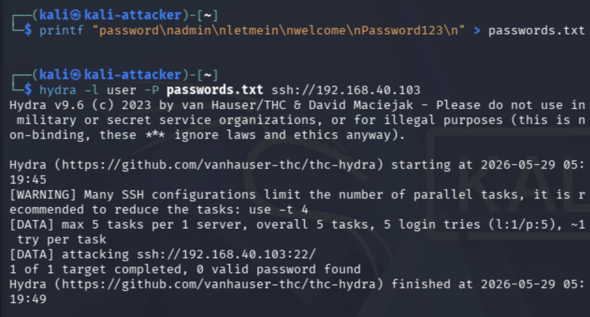
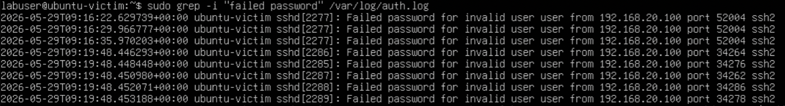
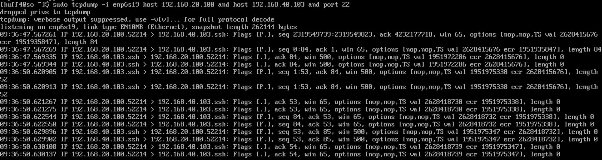
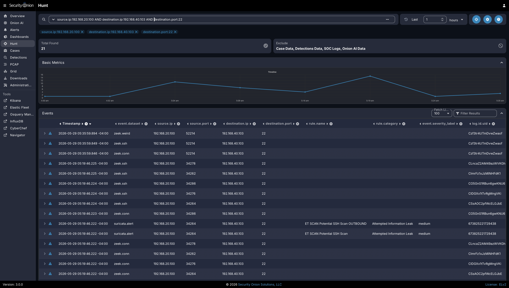

# Project 07: SSH Brute-Force Detection
# Project 07: SSH Brute-Force Detection

## Overview

This project demonstrates how a segmented cybersecurity homelab can be used to generate, observe, and document SSH brute-force activity in a controlled environment. The goal was to simulate repeated SSH authentication attempts from an attacker system against a victim system, then validate that the activity could be observed through endpoint logs, packet capture, firewall rules, and Security Onion investigation data.

This project builds on the earlier homelab portfolio projects by using the established VLAN architecture, mirrored switch traffic, pfSense firewall controls, and Security Onion monitoring stack to detect suspicious authentication behavior.

The project reinforces practical skills related to SSH security, brute-force detection, endpoint log review, packet capture validation, Security Onion Hunt analysis, firewall rule validation, and adversary-emulation documentation.

## Lab Environment

| Component | Purpose |
|---|---|
| Kali Linux | Attacker system used to generate controlled SSH authentication attempts |
| Ubuntu Victim VM | Linux target system running OpenSSH Server on VLAN 40 |
| Security Onion | SIEM / NSM platform used to observe and investigate activity |
| pfSense | Firewall and VLAN segmentation control point |
| Netgear GS108T | Managed switch used for VLANs and port mirroring |
| Proxmox / Homelab Server | Virtualization platform for lab workloads |
| Raspberry Pi 5 | Admin jump host and remote-access support system |

## Objectives

- Confirm Kali attacker placement on VLAN 20.
- Confirm Ubuntu victim placement on VLAN 40.
- Validate that OpenSSH was running and listening on the victim system.
- Confirm attacker-to-victim connectivity across the approved lab path.
- Validate TCP/22 exposure from Kali using Nmap.
- Generate controlled failed SSH authentication attempts using Hydra and a small local password list.
- Confirm failed SSH login evidence in Ubuntu authentication logs.
- Confirm packet-level SSH visibility with `tcpdump`.
- Confirm Security Onion visibility through Hunt results, Zeek events, and Suricata alerts.
- Review pfSense rule evidence showing that the traffic path was intentionally allowed for controlled lab testing.

## Network / System Scope

| Item | Details |
|---|---|
| Attacker System | Kali Linux VM |
| Attacker VLAN | VLAN 20 |
| Attacker IP | `192.168.20.100` |
| Victim System | Ubuntu Victim VM |
| Victim VLAN | VLAN 40 |
| Victim IP | `192.168.40.103` |
| Target Service | OpenSSH Server on TCP/22 |
| Monitoring Platform | Security Onion |
| Firewall Enforcement | pfSense ATTACK VLAN rule allowing controlled access to the VICTIM subnet |
| Validation Method | IP checks, service status review, Nmap, Hydra, Ubuntu auth logs, tcpdump, Security Onion Hunt, and pfSense rule review |

## Implementation Summary

The test workflow began by confirming Kali attacker placement on VLAN 20 and Ubuntu victim placement on VLAN 40. The victim SSH service was validated locally, and TCP/22 exposure was confirmed from Kali using Nmap.

A controlled Hydra test was performed using a small local password list to generate failed SSH authentication attempts against the Ubuntu victim. The test was limited to the private homelab and was performed only against an approved lab-owned system.

The activity was validated from multiple perspectives. Ubuntu authentication logs confirmed repeated failed SSH login attempts from the Kali attacker IP. `tcpdump` confirmed packet-level SSH traffic between the attacker and victim systems. Security Onion Hunt showed Zeek SSH events, Zeek connection events, and Suricata SSH scan alerts. pfSense rule evidence confirmed that the attacker-to-victim traffic path was intentionally allowed for controlled testing.

## Detection Workflow

SSH brute-force behavior may appear in multiple telemetry sources depending on the environment. In this project, the activity was reviewed from the attacker, victim, network, firewall, and SIEM perspectives.

```text
Kali attacker on VLAN 20
        |
        | Hydra SSH authentication attempts
        v
Ubuntu victim on VLAN 40
        |
        | endpoint logs + mirrored traffic
        v
Ubuntu auth.log / tcpdump / Security Onion Hunt
        |
        v
Detection validation and documentation
```

This workflow demonstrates how offensive activity can be used safely to validate defensive visibility and investigation paths.

## Detection Notes

| Data Source | What to Look For |
|---|---|
| Victim authentication logs | Repeated failed password attempts from the same source IP |
| Zeek SSH logs | SSH sessions between attacker and victim |
| Zeek connection logs | Repeated TCP/22 connections between the same source and destination |
| Suricata alerts | Possible SSH scan, brute-force, or suspicious SSH signatures |
| Firewall logs | Allowed or blocked connections to TCP/22 |
| Packet capture | TCP traffic between attacker and victim on port 22 |
| Security Onion Hunt | Zeek SSH/connection events and Suricata SSH scan alerts during the test window |

## MITRE ATT&CK Mapping

| Tactic | Technique | Description |
|---|---|---|
| Credential Access | T1110 - Brute Force | Repeated password attempts against SSH authentication |
| Discovery | T1046 - Network Service Discovery | Validation of SSH service availability with tools such as Nmap or netcat |
| Initial Access | T1021.004 - Remote Services: SSH | SSH is commonly targeted as a remote administrative service |

## Evidence

| # | Evidence | Description |
|---|---|---|
| 01 | [Kali Attacker IP](evidence/01-kali-attacker-ip.png) | Shows Kali attacker VM IP address on the Attacker VLAN with IP `192.168.20.100`. |
| 02 | [Ubuntu Victim IP](evidence/02-ubuntu-victim-ip.png) | Shows Ubuntu victim VM IP address on the Victim VLAN with IP `192.168.40.103`. |
| 03 | [Victim SSH Service Status](evidence/03-victim-ssh-service-status.png) | Confirms OpenSSH was enabled and actively listening on the Ubuntu victim. |
| 04 | [Kali-to-Victim Connectivity Test](evidence/04-kali-to-victim-connectivity-test.png) | Shows successful ICMP connectivity from Kali to the Ubuntu victim across the approved lab path. |
| 05 | [SSH Port Validation](evidence/05-ssh-port-validation.png) | Shows Nmap validation confirming TCP/22 open on the Ubuntu victim. |
| 06 | [Controlled SSH Brute-Force Test](evidence/06-controlled-ssh-bruteforce-test.png) | Shows a controlled Hydra test using a small password list against the Ubuntu victim over SSH. |
| 07 | [Victim Auth Log Failed Passwords](evidence/07-victim-auth-log-failed-passwords.png) | Shows Ubuntu authentication logs recording repeated failed SSH login attempts from the Kali attacker IP. |
| 08 | [tcpdump SSH Traffic](evidence/08-tcpdump-ssh-traffic.png) | Shows tcpdump output confirming SSH traffic between the attacker and victim systems on TCP/22. |
| 09 | [Security Onion SSH Search Results](evidence/09-security-onion-ssh-search-results.png) | Shows Security Onion Hunt results with Zeek SSH events, Zeek connection events, and Suricata SSH scan alerts. |
| 10 | [pfSense Controlled Test Rule](evidence/10-pfsense-controlled-test-rule.png) | Shows the pfSense ATTACK VLAN rule allowing controlled lab traffic from VLAN 20 to the VICTIM subnet. |

## Key Evidence

### Controlled SSH Brute-Force Test



This screenshot shows the controlled Hydra test from Kali against the Ubuntu victim over SSH. The test used a small local password list and was performed only against an approved lab-owned target.

### Victim Authentication Logs



This screenshot shows Ubuntu authentication logs recording repeated failed SSH login attempts from the Kali attacker IP. This provides strong endpoint evidence that the brute-force activity occurred.

### tcpdump SSH Traffic Capture



This screenshot confirms packet-level SSH traffic between the attacker and victim systems on TCP/22, validating that the activity was visible at the network layer.

### Security Onion SSH Investigation



This screenshot shows Security Onion Hunt results containing Zeek SSH events, Zeek connection events, and Suricata SSH scan alerts related to the controlled brute-force activity.

## Remediation and Hardening Considerations

Common defenses against SSH brute-force attacks include:

- Disable password-based SSH authentication where possible.
- Require SSH key-based authentication.
- Restrict SSH access to trusted admin networks.
- Use firewall rules to limit TCP/22 exposure.
- Implement account lockout or rate-limiting controls.
- Monitor failed login attempts.
- Use tools such as Fail2ban where appropriate.
- Alert on repeated failed authentication attempts from the same source.
- Review exposed administrative services regularly.

## Validation

SSH brute-force detection was validated through attacker placement checks, victim placement checks, SSH service validation, controlled authentication attempts, endpoint log review, packet capture, Security Onion investigation, and pfSense rule review.

Validation confirmed the following:

- Kali was confirmed on the Attacker VLAN with IP `192.168.20.100`.
- The Ubuntu victim VM was confirmed on the Victim VLAN with IP `192.168.40.103`.
- OpenSSH was enabled and listening on the Ubuntu victim.
- Kali successfully reached the Ubuntu victim across the approved lab path.
- Nmap confirmed TCP/22 was open on the Ubuntu victim.
- Hydra generated controlled failed SSH authentication attempts using a small local password list.
- Ubuntu authentication logs recorded repeated failed SSH login attempts from the Kali attacker IP.
- `tcpdump` confirmed SSH traffic between the attacker and victim systems on TCP/22.
- Security Onion Hunt showed Zeek SSH events, Zeek connection events, and Suricata SSH scan alerts.
- pfSense allowed controlled lab traffic from VLAN 20 to the VICTIM subnet for the test.

## Challenges and Lessons Learned

This project reinforced that brute-force detection is strongest when endpoint, network, firewall, and SIEM evidence are reviewed together. The Ubuntu victim authentication logs provided direct evidence of failed login attempts, while `tcpdump` and Security Onion confirmed network-layer visibility.

The project also reinforced the importance of controlled testing. The Hydra activity was limited to a small local password list, an approved victim system, and a private homelab environment. This allowed realistic detection validation without targeting unauthorized systems.

A key lesson was that authentication-based detections benefit from context. Source IP, destination IP, username, count, time window, and service exposure all help determine whether repeated failed login attempts represent normal behavior, misconfiguration, or malicious activity.

## Security Relevance

This project demonstrates how SSH brute-force detection supports real-world cybersecurity operations. SSH is commonly used for remote administration, and exposed SSH services are frequently targeted by password guessing, credential stuffing, and automated scanning.

The project also demonstrates how defenders can correlate endpoint authentication logs with network telemetry. Combining victim logs, Security Onion events, packet captures, and firewall evidence provides a stronger investigation trail than any single data source alone.

## Business Value

This project provides business value by showing how authentication attack detection can reduce the risk of unauthorized access. Repeated failed login attempts may be an early warning sign of brute-force activity, exposed administrative services, weak password controls, or compromised internal systems.

In an enterprise environment, this type of work helps teams:

- Detect suspicious authentication behavior earlier.
- Identify exposed administrative services such as SSH.
- Validate that monitoring tools collect relevant authentication and network telemetry.
- Support incident triage with endpoint logs, SIEM events, firewall rules, and packet evidence.
- Improve hardening decisions such as key-based authentication, network restrictions, and rate limiting.
- Document repeatable detection evidence for future alert tuning and incident response.

## Portfolio Summary

This project demonstrates a controlled SSH brute-force detection workflow inside a segmented cybersecurity homelab. It combines attacker simulation, Ubuntu victim authentication logs, packet-level validation, pfSense firewall segmentation, tcpdump verification, and Security Onion investigation to show how suspicious authentication behavior can be detected and documented.

The project strengthens the overall homelab portfolio by moving beyond basic network validation and into practical detection engineering, blue-team investigation, and adversary-emulation documentation.