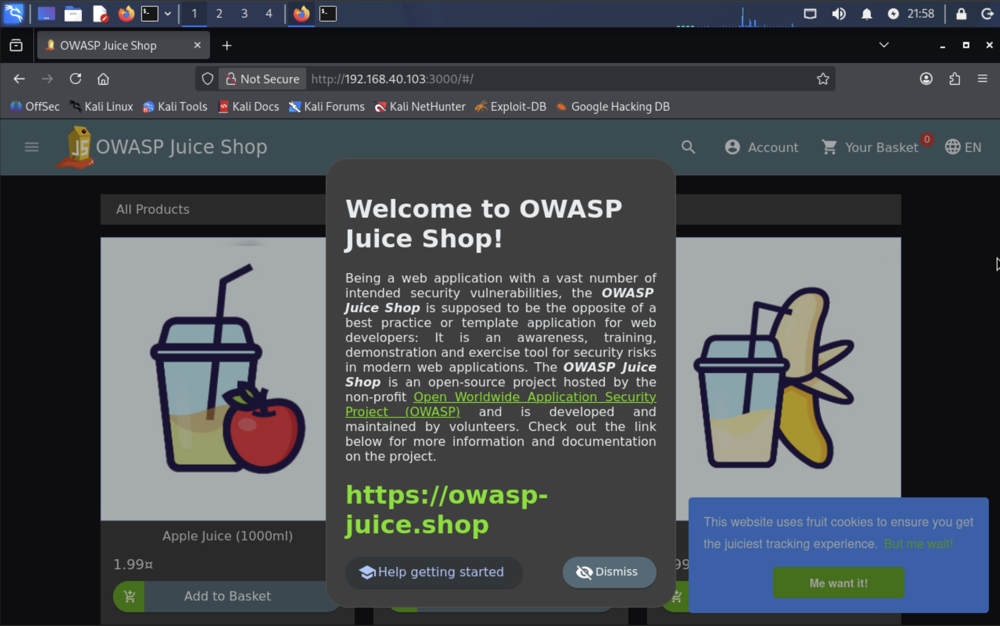
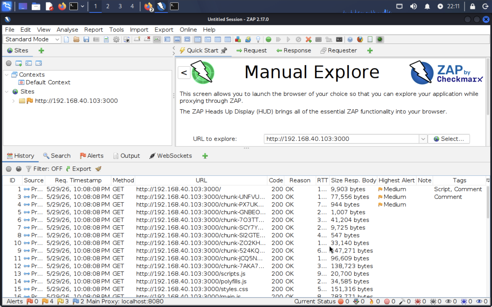
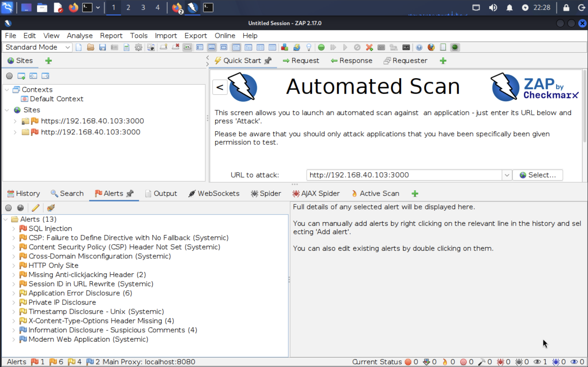
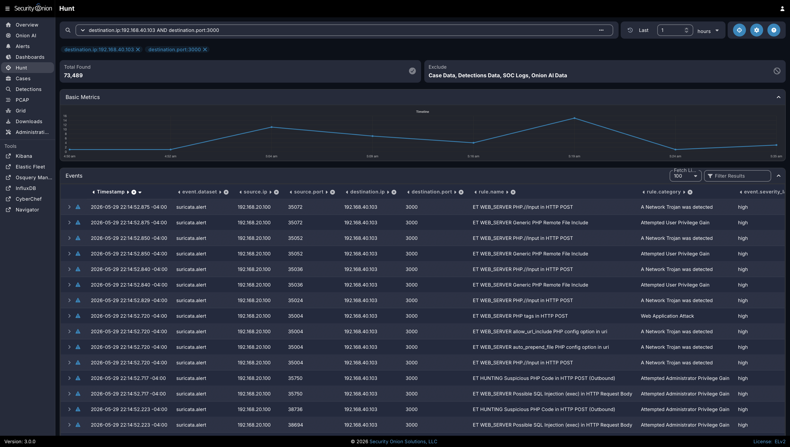

# Project 08: Web Application Scanning with OWASP ZAP and Juice Shop

## Overview

This project documents the setup and validation of a controlled web application security testing lab using OWASP ZAP and OWASP Juice Shop. The goal was to safely practice web application reconnaissance, vulnerability scanning, proxy-based testing, alert review, and SIEM visibility inside the isolated homelab environment.

This project builds on the previous network segmentation, SIEM deployment, traffic mirroring, and attack-detection projects by adding a vulnerable web application target and a dedicated web application scanning workflow.

The project reinforces practical skills related to web application testing, proxy-based traffic inspection, vulnerability scanning, Docker-based target deployment, OWASP ZAP alert review, Security Onion visibility, and evidence-based documentation.

## Lab Environment

| Component | Purpose |
|---|---|
| pfSense | Firewall, VLAN routing, segmentation, and traffic control |
| Proxmox | Virtualization platform for lab systems |
| Kali Linux | Attacker/testing workstation running OWASP ZAP and browser-based testing tools |
| OWASP ZAP | Web application proxy and vulnerability scanner |
| OWASP Juice Shop | Intentionally vulnerable web application target hosted in the lab |
| Ubuntu Victim Host | Docker host used to run Juice Shop |
| Security Onion | SIEM and network visibility platform used to observe web scanning traffic |
| Managed Switch | VLAN tagging and traffic mirroring |
| Raspberry Pi 5 | Bastion host and secure remote access point |

## Objectives

- Deploy OWASP Juice Shop inside the lab environment.
- Validate Docker service operation on the Ubuntu victim host.
- Confirm that Juice Shop is running and reachable on port `3000`.
- Confirm that Kali can reach the Juice Shop web application.
- Launch OWASP ZAP on Kali.
- Browse Juice Shop through ZAP to capture baseline HTTP traffic.
- Run a safe automated ZAP scan against the lab-hosted Juice Shop target.
- Review discovered alerts and categorize findings by severity.
- Confirm that Security Onion can observe related web scanning traffic.
- Generate and document a ZAP report for review.

## Network / System Scope

| Item | Details |
|---|---|
| Testing Workstation | Kali Linux |
| Web Testing Tool | OWASP ZAP |
| Target Application | OWASP Juice Shop |
| Target Hosting Method | Docker on Ubuntu victim host |
| Target Port | TCP/3000 |
| Monitoring Platform | Security Onion |
| Firewall Control | pfSense web testing rule path |
| Validation Method | Docker validation, browser testing, curl/ping checks, ZAP proxy history, ZAP automated scan, ZAP alert review, Security Onion visibility, pfSense rule review, and exported report evidence |

## Implementation Summary

OWASP Juice Shop was hosted inside the lab as an intentionally vulnerable web application target. The Ubuntu victim host ran Juice Shop in Docker and exposed the application on port `3000` for controlled testing from Kali.

Kali was used as the web application testing workstation. OWASP ZAP provided proxy-based traffic inspection, browser-assisted exploration, automated scanning, alert review, and report generation. After network access to Juice Shop was confirmed, browser traffic was proxied through ZAP and baseline HTTP requests were captured in the ZAP history view.

A safe automated scan was then run against the Juice Shop target. ZAP identified multiple expected findings for an intentionally vulnerable training application, including SQL injection-related alerts, missing security headers, content security policy issues, cross-domain misconfiguration, information disclosure, and application error disclosure.

Security Onion was reviewed to confirm that web scanning traffic and related Suricata alerts were visible from the defensive monitoring side of the lab. pfSense rule evidence was also captured to document the allowed lab traffic path used for the web application testing workflow.

## Web Application Testing Workflow

The web application testing workflow connected offensive application testing with defensive network visibility.

```text
Kali Linux
    |
    | Browser traffic proxied through OWASP ZAP
    v
OWASP ZAP
    |
    | Manual browsing and automated scan traffic
    v
OWASP Juice Shop on Ubuntu victim host
    |
    | Web traffic observed through monitoring path
    v
Security Onion / Suricata / Hunt visibility
```

This workflow demonstrates how a vulnerable application can be safely tested inside a segmented lab while preserving visibility for defensive monitoring and investigation.

## ZAP Findings Review

The ZAP alert results were reviewed as training data rather than production findings. Because Juice Shop is intentionally vulnerable, the presence of web application findings was expected and useful for learning how to interpret scanner output.

| Finding Category | Security Relevance |
|---|---|
| SQL injection-related alerts | Indicates possible unsafe input handling and database query exposure |
| Missing security headers | Indicates missing browser-side protections such as content and framing controls |
| Content Security Policy issues | Indicates weak or missing controls for limiting browser-executed content |
| Cross-domain misconfiguration | Indicates potential trust or access-control issues between origins |
| Information disclosure | Indicates the application may reveal details useful to attackers |
| Application error disclosure | Indicates the application may expose implementation or debugging details |

## Evidence

| # | Evidence | Description |
|---|---|---|
| 01 | [Docker Service Validation](evidence/01-docker-installed.png) | Shows Docker installed and running on the Ubuntu victim host. |
| 02 | [Juice Shop Running in Docker](evidence/02-juice-shop-running-docker.png) | Shows Juice Shop running in Docker and listening on port `3000`. |
| 03a | [Kali Access to Juice Shop](evidence/03a-kali-access-to-juice-shop.png) | Shows Kali successfully reaching Juice Shop using ping and curl. |
| 03b | [Juice Shop Browser Access](evidence/03b-kali-access-to-juice-shop.png) | Shows Juice Shop loaded successfully in the Kali browser. |
| 04 | [OWASP ZAP Launched](evidence/04-zap-launched.png) | Shows OWASP ZAP opened successfully on Kali. |
| 05 | [ZAP HUD Juice Shop Browser](evidence/05-zap-hud-juice-shop-browser.png) | Shows ZAP HUD enabled while manually browsing Juice Shop. |
| 06 | [ZAP History Capturing Juice Shop](evidence/06-zap-history-capturing-juice-shop.png) | Shows ZAP capturing HTTP requests and responses from Juice Shop browsing. |
| 07 | [ZAP Scan Running](evidence/07-zap-scan-running.png) | Shows automated scanning completed against the Juice Shop target. |
| 08 | [ZAP Alerts Summary](evidence/08-zap-alerts-summary.png) | Shows ZAP findings, including SQL injection-related alerts and security header findings. |
| 09 | [Security Onion Web Scan Visibility](evidence/09-security-onion-web-scan-visibility.png) | Shows Security Onion observing web scanning traffic and related Suricata alerts. |
| 10 | [pfSense Web Testing Rule](evidence/10-pfsense-web-testing-rule.png) | Shows firewall rule evidence for the web application testing traffic path. |
| 11 | [ZAP Generated Report](evidence/11-zap-generated-report.png) | Shows a ZAP-generated report exported for review. |

## Key Evidence

### Juice Shop Target Application



This screenshot shows Juice Shop loaded successfully in the Kali browser, confirming that the vulnerable web application target was reachable from the testing workstation.

### ZAP Proxy History



This screenshot shows OWASP ZAP capturing HTTP requests and responses from browser activity against Juice Shop. This validates the proxy-based traffic inspection workflow.

### ZAP Alert Results



This screenshot shows ZAP alert output for the Juice Shop target, including expected web application security findings from the intentionally vulnerable application.

### Security Onion Detection Visibility



This screenshot shows Security Onion observing web scanning traffic and related Suricata alerts, confirming that the offensive web testing activity was visible from the defensive monitoring side of the lab.

## Remediation Concepts

Although Juice Shop is intentionally vulnerable, the findings from ZAP map to real-world remediation practices such as:

- Adding missing security headers.
- Improving input validation.
- Enforcing secure authentication behavior.
- Reducing information disclosure.
- Hardening application configuration.
- Monitoring suspicious web activity in SIEM tools.

## Validation

Web application scanning was validated through target deployment, attacker connectivity, ZAP launch, proxy-based browsing, automated scan execution, alert review, firewall rule review, Security Onion visibility, and ZAP report generation.

Validation confirmed the following:

- Docker was installed and running on the Ubuntu victim host.
- Juice Shop was running in Docker and listening on port `3000`.
- Kali successfully reached Juice Shop using ping, curl, and browser access.
- OWASP ZAP launched successfully on Kali.
- ZAP HUD was enabled while manually browsing Juice Shop.
- ZAP captured HTTP requests and responses from Juice Shop browsing.
- Automated ZAP scanning completed against the Juice Shop target.
- ZAP identified multiple expected web application findings.
- Security Onion observed web scanning traffic and related Suricata alerts.
- pfSense rule evidence confirmed the lab traffic path for web application testing.
- A ZAP-generated report was exported for review.

## Challenges and Lessons Learned

This project reinforced the importance of combining vulnerability discovery with detection validation. Running a scanner is only one part of the workflow. A stronger security process also confirms whether the activity is visible to monitoring tools and whether defenders can identify the behavior in logs.

The project also showed how a single web application scan can create useful evidence across multiple layers of the lab, including Docker on the victim host, browser access from Kali, ZAP proxy history, ZAP alert output, pfSense rule validation, and Security Onion detections.

A key lesson was that scanner findings require interpretation. Automated tools can identify possible weaknesses, but analysts still need to understand severity, context, exploitability, and whether the finding applies to the environment being reviewed.

## Security Relevance

This project demonstrates how web application scanning supports real-world application security, vulnerability management, and defensive monitoring. Web applications are common attack surfaces, and tools such as OWASP ZAP help identify weaknesses such as injection risks, weak headers, information disclosure, and configuration issues.

The project also demonstrates why application testing should be connected to detection engineering. Security teams benefit when vulnerability testing activity is visible in SIEM/NDR platforms because it allows defenders to understand scanner behavior, tune alerts, and distinguish expected testing from suspicious activity.

## Business Value

This project provides business value by showing how web application scanning can identify potential weaknesses before attackers exploit them. It also demonstrates how security monitoring can validate that testing activity is visible to defenders.

In an enterprise environment, this type of work helps teams:

- Identify web application weaknesses during testing.
- Validate scanner output and prioritize findings by severity and context.
- Confirm that security monitoring tools observe web attack patterns.
- Support collaboration between application security, SOC, infrastructure, and firewall teams.
- Improve reporting through exported scan results and documented evidence.
- Build repeatable testing workflows for application security validation.

## Portfolio Summary

This project demonstrates a controlled web application scanning workflow using OWASP ZAP and OWASP Juice Shop inside a segmented cybersecurity homelab. Juice Shop was deployed as an intentionally vulnerable lab target, Kali was used as the testing workstation, and ZAP was used for proxy-based inspection, automated scanning, alert review, and report generation.

The project connects offensive testing, vulnerability management, and blue-team monitoring by validating that Security Onion observed the related web scanning activity. This adds an application security component to the portfolio while continuing to reinforce safe testing, segmentation, SIEM visibility, and professional documentation.