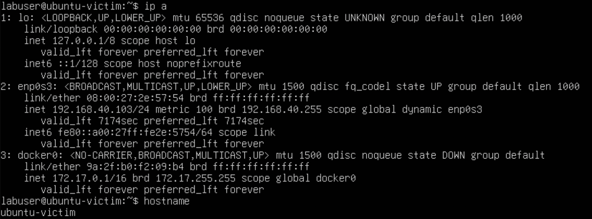
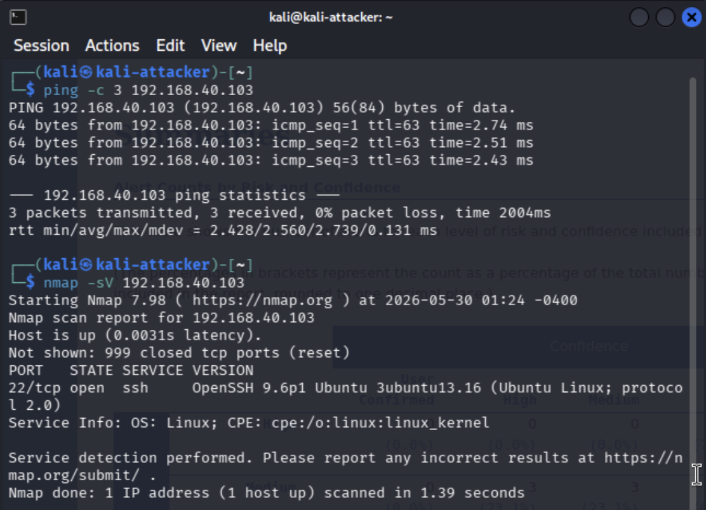
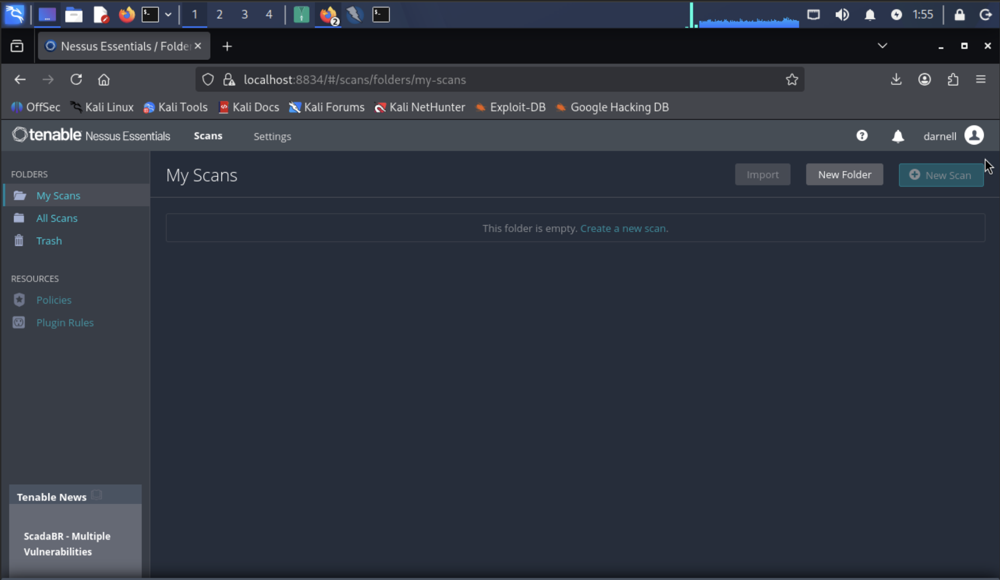
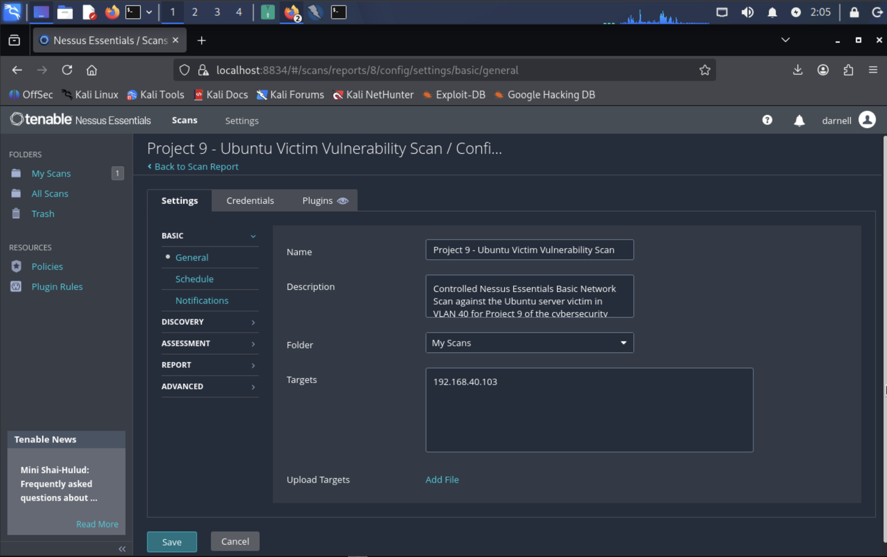
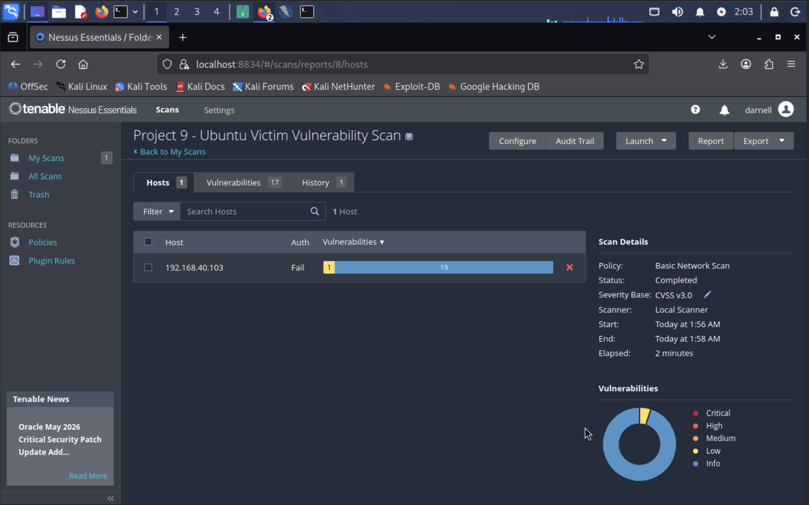
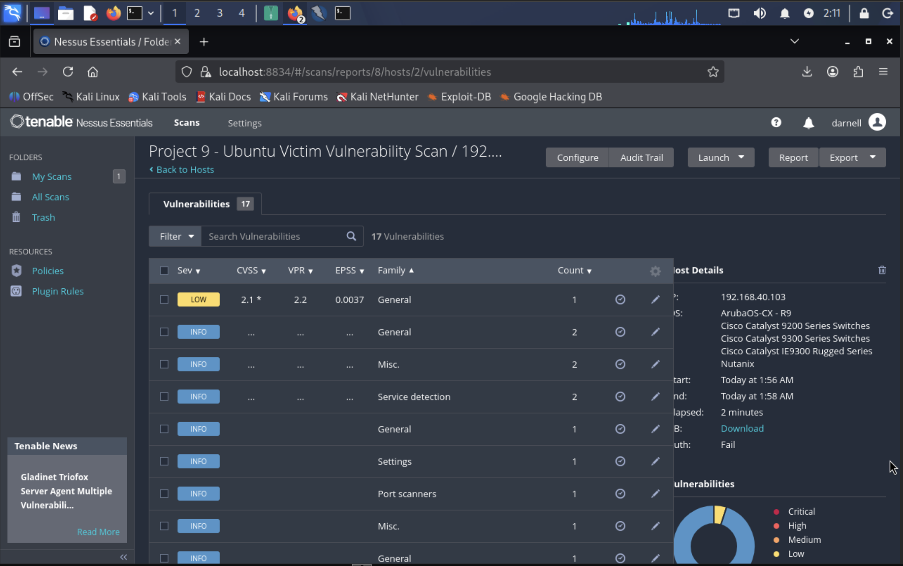
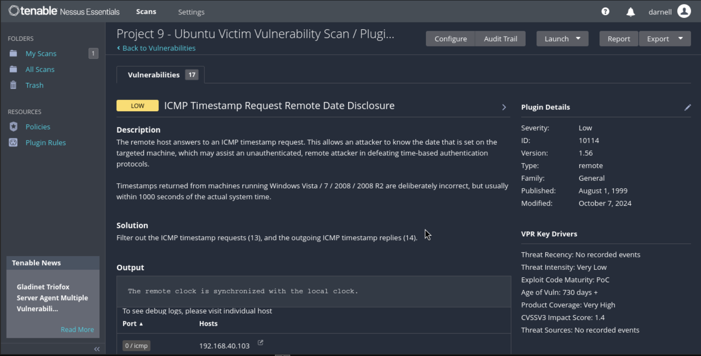
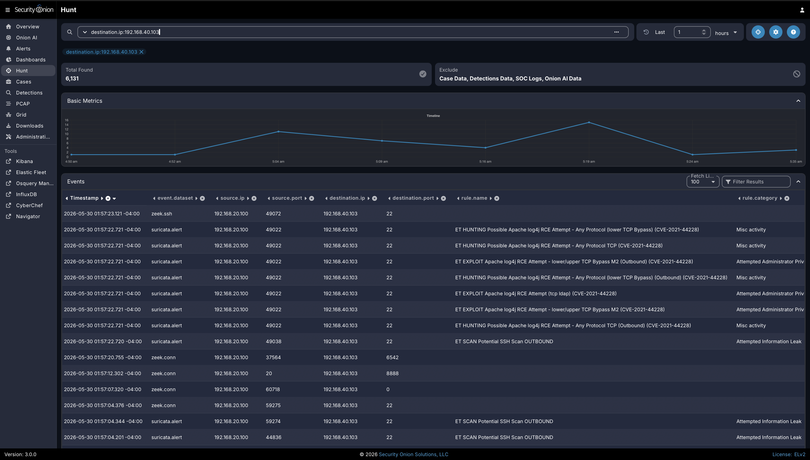
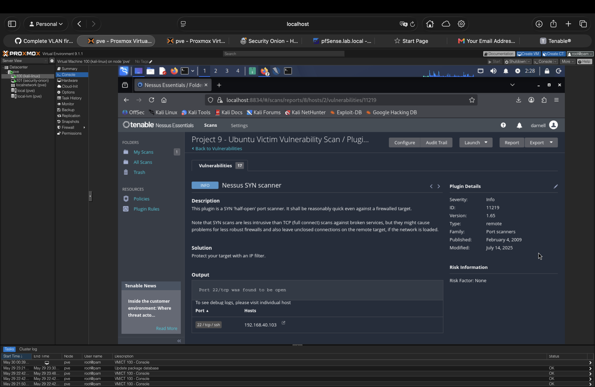

# Project 9: Vulnerability Scanning and Reporting

## Objective

This project focuses on performing a vulnerability assessment inside the segmented homelab environment and documenting the results in a professional reporting format. The goal is to demonstrate the ability to identify exposed services, run authenticated or unauthenticated vulnerability scans, review findings, prioritize risk, and recommend realistic remediation steps.

This project builds on the previous network segmentation, SIEM visibility, reconnaissance detection, and brute-force detection projects. Instead of only validating that traffic is visible, this project documents how vulnerability scanning activity appears in the lab and how scan results can be turned into actionable security recommendations.

## Lab Environment

The vulnerability scanning workflow will use the existing homelab architecture:

- **Attacker / Scanner VLAN:** Kali Linux or Nessus scanner system
- **Victim VLAN:** Ubuntu Server victim and/or Windows victim VM
- **SIEM VLAN:** Security Onion sensor and management interface
- **Admin VLAN:** Management access through the Raspberry Pi bastion host
- **Firewall:** pfSense enforcing VLAN segmentation and access rules
- **Switch:** Managed switch with mirrored traffic forwarded to Security Onion

## Validation Goals

This project demonstrated the following:

- A vulnerability scan was launched against the controlled Ubuntu Server victim system.
- The target system was intentionally scoped to a single lab-owned IP address to avoid scanning unrelated home devices.
- Scan results were reviewed and summarized from Nessus Essentials.
- Findings were prioritized by severity and business/security impact.
- Remediation recommendations were documented for the low-severity and informational findings reviewed.
- Security Onion visibility was reviewed for vulnerability scanning traffic.
- Evidence was captured and linked in this README.

## Tools Used

- **Nessus Essentials** — vulnerability scanning and reporting
- **Kali Linux** — attacker/scanner workstation if needed
- **Ubuntu Server Victim** — controlled scan target
- **Security Onion** — network monitoring and alert review
- **pfSense** — firewall segmentation and access control
- **Proxmox** — virtualization platform for lab systems
- **Raspberry Pi 5** — bastion host for secure administrative access

## Scope and Rules of Engagement

The scan scope for this project was limited to lab-owned systems only. The primary scan target was the Ubuntu Server victim at `192.168.40.103`, and the Kali attacker/scanner system at `192.168.20.100` was used to launch the scan through Nessus Essentials.

Out of scope:

- Personal devices outside the lab scope
- Work devices
- ISP equipment
- Smart home devices
- Public internet targets
- Any system not intentionally included in the project

## Business and Security Value

Vulnerability scanning is a core part of vulnerability management, exposure review, and risk-based remediation planning. This project demonstrates how to scope a scan safely, review scan output, prioritize findings, document remediation recommendations, and validate scanner activity from a monitoring perspective.

By limiting the scan to a controlled Ubuntu victim system, the project shows how vulnerability assessment can be performed without scanning unrelated home devices or systems outside the approved lab scope.

## Validation and Evidence

Vulnerability scanning and reporting were validated through target identification, scanner-to-target connectivity, Nessus setup, scan configuration, scan execution, vulnerability review, Security Onion visibility, and plugin-level finding review.

| Validation Area | Result | Evidence |
|---|---|---|
| Target identification | Passed - The Ubuntu victim IP address, interface details, and hostname were documented | [01-target-ip.png](evidence/01-target-ip.png) |
| Scanner-to-target connectivity | Passed - Kali successfully reached the victim and identified SSH with Nmap | [02-target-reachable.png](evidence/02-target-reachable.png) |
| Nessus Essentials access | Passed - Nessus Essentials was installed and accessible on Kali | [03-nessus-dashboard.png](evidence/03-nessus-dashboard.png) |
| Scan scope configuration | Passed - The Nessus scan was limited to the Ubuntu victim IP address | [04-scan-config.png](evidence/04-scan-config.png) |
| Scan execution | Passed - The Nessus Basic Network Scan completed against the Ubuntu victim | [05-scan-completed.png](evidence/05-scan-completed.png) |
| Severity review | Passed - Nessus vulnerability severity results were reviewed and summarized | [06-severity-summary.png](evidence/06-severity-summary.png) |
| Low-severity finding review | Passed - ICMP Timestamp Request Remote Date Disclosure was reviewed and documented | [07-top-finding-details.png](evidence/07-top-finding-details.png) |
| Security Onion visibility | Passed - Security Onion Hunt showed scan traffic and alerts from Kali to the Ubuntu victim | [08-security-onion-scan-traffic.png](evidence/08-security-onion-scan-traffic.png) |
| Informational plugin review | Passed - Nessus SYN scanner plugin details confirmed that port `22/tcp` was discovered open | [09-nessus-syn-scanner.png](evidence/09-nessus-syn-scanner.png) |

## Implementation Summary

Nessus Essentials was installed and accessed from the Kali attacker/scanner system. The scan was scoped to the Ubuntu Server victim at `192.168.40.103` to avoid unrelated systems. After confirming scanner-to-target connectivity, a Nessus Basic Network Scan was configured and executed. Scan results were reviewed by severity, key findings were documented, remediation guidance was written for the reviewed low-severity and informational findings, and Security Onion was used to confirm scanner-to-victim visibility.

## Evidence Summary

The following evidence documents the completed vulnerability scanning and reporting workflow. A separate Nessus PDF report was not included because the scan results and key findings are documented directly in this README.

| ID | Evidence | What It Demonstrates |
|---|---|---|
| 01 | [01-target-ip.png](evidence/01-target-ip.png) | Shows the Ubuntu victim IP address, interface details, and hostname |
| 02 | [02-target-reachable.png](evidence/02-target-reachable.png) | Shows Kali successfully reaching the victim with ping and identifying SSH with Nmap |
| 03 | [03-nessus-dashboard.png](evidence/03-nessus-dashboard.png) | Shows Nessus Essentials installed and accessible on Kali |
| 04 | [04-scan-config.png](evidence/04-scan-config.png) | Shows the Nessus scan configuration limited to the Ubuntu victim IP address |
| 05 | [05-scan-completed.png](evidence/05-scan-completed.png) | Shows completed Nessus Basic Network Scan results for the Ubuntu victim |
| 06 | [06-severity-summary.png](evidence/06-severity-summary.png) | Shows the Nessus vulnerability list and severity summary |
| 07 | [07-top-finding-details.png](evidence/07-top-finding-details.png) | Shows the low-severity ICMP Timestamp Request Remote Date Disclosure finding details |
| 08 | [08-security-onion-scan-traffic.png](evidence/08-security-onion-scan-traffic.png) | Shows Security Onion Hunt results with scan traffic and alerts from Kali to the Ubuntu victim |
| 09 | [09-nessus-syn-scanner.png](evidence/09-nessus-syn-scanner.png) | Shows the informational Nessus SYN scanner plugin details confirming port `22/tcp` was discovered open |

## Key Evidence

The screenshots below highlight the most important vulnerability scanning and reporting evidence while the table above preserves links to the full evidence set.

**Target Identification**

**Scanner-to-Target Connectivity**

**Nessus Essentials Dashboard**

**Nessus Scan Configuration**

**Completed Nessus Scan**

**Vulnerability Summary**

**Low-Severity Finding Details**

**Security Onion Scan Visibility**

**Informational Finding Details**

## Key Findings

The Nessus Basic Network Scan identified one low-severity vulnerability and multiple informational findings on the Ubuntu victim. The scan was intentionally unauthenticated, which is why the Nessus host summary showed authentication as failed. This scan still provided useful network-based visibility into exposed services and scanner behavior.

| Severity | Finding | Affected Host | Recommended Remediation | Status |
|---|---|---|---|---|
| Low | ICMP Timestamp Request Remote Date Disclosure | `192.168.40.103` | Filter inbound ICMP timestamp requests and outbound ICMP timestamp replies at the host firewall or pfSense firewall where appropriate. | Reviewed |
| Info | Nessus SYN Scanner | `192.168.40.103` | Confirm that SSH on `22/tcp` is intentionally exposed only to approved lab systems. Restrict access with pfSense and/or UFW rules if broader access is not required. | Reviewed |

## Remediation and Hardening Considerations

For this scan, the primary low-severity issue was ICMP timestamp disclosure. The most practical remediation is to restrict ICMP timestamp request and reply traffic where it is not needed. The informational SYN scanner finding confirmed that SSH was reachable on `22/tcp`, which is expected for this lab but should remain limited to authorized management or attacker/scanner systems.

Potential future remediation or hardening actions include:

- Applying missing security updates
- Disabling unnecessary services
- Removing unused packages
- Restricting access with host-based firewall rules
- Validating pfSense firewall rules between VLANs
- Reviewing default or weak configurations
- Re-scanning after remediation to confirm improvement

## Skills Demonstrated

This project demonstrates:

- Vulnerability scanning methodology
- Safe scan scoping in a segmented lab
- Nessus Essentials usage
- Vulnerability prioritization
- Risk-based remediation planning
- SIEM validation of scanning activity
- Security documentation and reporting
- Professional evidence collection for a cybersecurity portfolio

## Project Status

| Area | Status |
|---|---|
| Scan target and IP address confirmed | Complete |
| Nessus scan scope configured | Complete |
| Vulnerability scan completed | Complete |
| Scan summary evidence captured | Complete |
| Key findings reviewed | Complete |
| Security Onion visibility validated | Complete |
| Remediation recommendations documented | Complete |
| Scan results documented directly in README | Complete |
| Evidence screenshots embedded and linked | Complete |
| Main portfolio README updated | Complete |

## Portfolio Summary

Project 9 documents a controlled vulnerability scanning and reporting workflow inside the homelab. Nessus Essentials was installed on the Kali attacker/scanner system and used to run a Basic Network Scan against the Ubuntu victim at `192.168.40.103`. The scan identified one low-severity ICMP timestamp disclosure issue and multiple informational findings, including confirmation that SSH was reachable on `22/tcp`. Security Onion also captured scanner-to-victim activity, including Zeek connection logs and Suricata alerts, confirming that vulnerability scanning activity was visible to the SIEM.