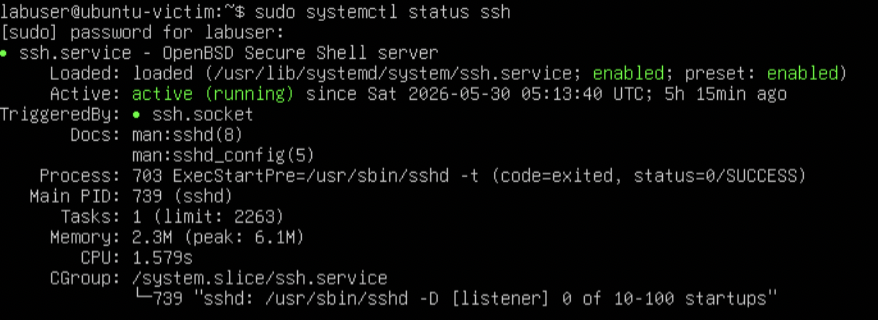

# Project 10: Linux Endpoint Telemetry Collection

## Objective

This project focuses on collecting and validating Linux endpoint telemetry from a monitored Ubuntu system inside the homelab. The goal is to generate realistic endpoint activity, confirm that Linux host logs are being produced locally, and prepare those logs for visibility inside the Security Onion monitoring environment.

This project builds on the previous network detection projects by shifting the focus from network-based evidence to endpoint-based evidence. Instead of only relying on packet captures, firewall logs, and Security Onion network visibility, this project documents what can be observed directly from a Linux host.

## Lab Environment

| Component | Purpose |
| --- | --- |
| Ubuntu Server Victim | Linux endpoint used to generate authentication and system telemetry |
| Kali Linux Attacker | System used to generate test activity against the Ubuntu endpoint |
| Security Onion | SIEM / monitoring platform used for log analysis and detection validation |
| pfSense | Firewall and VLAN segmentation between lab networks |
| Proxmox | Virtualization platform hosting lab virtual machines |
| Raspberry Pi 5 | Bastion host used for secure access into the lab |
| MacBook Air M2 | Primary administration workstation |

## Validation Goals

- Confirm that the Ubuntu endpoint is producing useful security telemetry.
- Review Linux authentication logs such as SSH login attempts and failed authentication events.
- Generate controlled activity from Kali against the Ubuntu endpoint.
- Validate local Linux log visibility before relying on SIEM ingestion.
- Document endpoint telemetry evidence in a repeatable, portfolio-ready format.
- Prepare the environment for future endpoint log forwarding into Security Onion.

## Business and Security Value

Endpoint telemetry is critical for investigating authentication activity, remote access events, and potential compromise attempts. Network monitoring can show that communication occurred, but endpoint logs provide host-level context such as usernames, authentication outcomes, service names, timestamps, and source IP addresses.

This project demonstrates the value of validating local Linux telemetry before relying on centralized log ingestion. By reviewing authentication logs directly on the Ubuntu endpoint, the project establishes a reliable baseline for future SIEM forwarding, alerting, and correlation work.

## Scope and Rules of Engagement

Testing was limited to authorized systems inside the isolated homelab environment. The Kali attacker VM was used to generate controlled SSH activity against the Ubuntu endpoint, and the Ubuntu host logs were reviewed locally.

Out of scope:

- Public internet targets
- Third-party systems
- Unauthorized login attempts
- Password spraying or brute-force activity outside the lab
- Production systems

## Validation and Evidence

Linux endpoint telemetry was validated through endpoint placement checks, SSH service validation, controlled successful and failed SSH activity, authentication log review, and a clean endpoint telemetry summary.

| Validation Area | Result | Evidence |
|---|---|---|
| Ubuntu endpoint placement | Passed - The Ubuntu endpoint hostname and VLAN 40 IP address `192.168.40.103` were confirmed | [01-ubuntu-endpoint-ip.png](evidence/01-ubuntu-endpoint-ip.png) |
| SSH service validation | Passed - OpenSSH was enabled and actively running on the Ubuntu endpoint | [02-ssh-service-status.png](evidence/02-ssh-service-status.png) |
| Kali network test activity | Passed - Kali successfully reached the Ubuntu endpoint over ICMP | [03-kali-test-activity.png](evidence/03-kali-test-activity.png) |
| Successful SSH telemetry | Passed - A successful SSH login from Kali to the Ubuntu endpoint was generated and validated | [04-successful-ssh-login.png](evidence/04-successful-ssh-login.png) |
| Failed SSH telemetry | Passed - Controlled failed SSH login attempts were generated from Kali using invalid and incorrect credentials | [05-failed-ssh-login.png](evidence/05-failed-ssh-login.png) |
| Authentication log review | Passed - `/var/log/auth.log` showed accepted logins, failed passwords, invalid users, and the Kali source IP `192.168.20.100` | [06-auth-log-review.jpeg](evidence/06-auth-log-review.jpeg) |
| Endpoint telemetry summary | Passed - A clean terminal summary documented endpoint identity, SSH status, failed SSH attempts, and successful SSH logins | [07-endpoint-telemetry-summary.png](evidence/07-endpoint-telemetry-summary.png) |

## Implementation Summary

The workflow began by confirming the Ubuntu endpoint hostname, IP address, and SSH service status. Kali was then used to generate controlled network activity and SSH authentication events against the Ubuntu endpoint. Both successful and failed login attempts were produced so the endpoint logs could be reviewed for accepted sessions, failed passwords, invalid users, source IP addresses, timestamps, and SSH daemon activity. The project intentionally focused on local endpoint telemetry rather than SIEM ingestion so the host-level logging baseline could be validated first.

## Key Findings

| Finding | Result | Notes |
| --- | --- | --- |
| Ubuntu endpoint reachable | Complete | Kali successfully reached the Ubuntu endpoint at `192.168.40.103`. |
| SSH service enabled | Complete | The OpenSSH server service was enabled and running on the Ubuntu endpoint. |
| Successful SSH telemetry observed | Complete | The Ubuntu endpoint recorded accepted SSH logins for `labuser` from `192.168.20.100`. |
| Failed SSH telemetry observed | Complete | The Ubuntu endpoint recorded failed SSH attempts for invalid user `testuser` and failed password attempts for `labuser`. |
| Authentication logs reviewed | Complete | `/var/log/auth.log` showed accepted logins, failed passwords, invalid user activity, source IPs, timestamps, and SSH daemon activity. |
| Security Onion ingestion validated | Not included | This project focused on local Linux endpoint telemetry. SIEM ingestion can be completed in a later project. |

## Detection Notes

Linux authentication logs provide valuable endpoint telemetry that can help identify suspicious activity such as brute-force attempts, unauthorized login attempts, and unusual remote access patterns.

Important SSH-related log indicators include:

- `Accepted password`
- `Accepted publickey`
- `Failed password`
- `Invalid user`
- Repeated failed attempts from the same source IP
- Successful login after multiple failures

These events are especially useful when correlated with network traffic, firewall logs, and SIEM alerts.

## Evidence Summary

The following evidence documents the completed Linux endpoint telemetry validation workflow and provides clickable links to each evidence file.

| ID | Evidence | What It Demonstrates |
| --- | --- | --- |
| 01 | [01-ubuntu-endpoint-ip.png](evidence/01-ubuntu-endpoint-ip.png) | Shows the Ubuntu endpoint hostname and IP addresses, including the VLAN 40 address `192.168.40.103` |
| 02 | [02-ssh-service-status.png](evidence/02-ssh-service-status.png) | Confirms the OpenSSH server service was enabled and actively running on the Ubuntu endpoint |
| 03 | [03-kali-test-activity.png](evidence/03-kali-test-activity.png) | Shows Kali successfully reaching the Ubuntu endpoint over ICMP |
| 04 | [04-successful-ssh-login.png](evidence/04-successful-ssh-login.png) | Shows a successful SSH login from Kali to the Ubuntu endpoint with user, hostname, and interface details |
| 05 | [05-failed-ssh-login.png](evidence/05-failed-ssh-login.png) | Shows controlled failed SSH login attempts from Kali using invalid and incorrect credentials |
| 06 | [06-auth-log-review.jpeg](evidence/06-auth-log-review.jpeg) | Shows `/var/log/auth.log` entries for accepted SSH logins, failed SSH attempts, invalid users, and source IP `192.168.20.100` |
| 07 | [07-endpoint-telemetry-summary.png](evidence/07-endpoint-telemetry-summary.png) | Provides a clean terminal summary of hostname, IP address, SSH status, failed SSH attempts, and successful SSH logins |

## Key Evidence

The screenshots below highlight the most important Linux endpoint telemetry evidence while the table above preserves links to the full evidence set.

**Ubuntu Endpoint Identity**

**SSH Service Status**

**Successful SSH Login**

**Authentication Log Review**

**Endpoint Telemetry Summary**

## Lessons Learned

This project demonstrates the importance of validating endpoint-level telemetry before relying only on network monitoring. Network traffic can show that communication occurred, but Linux authentication logs provide additional context such as usernames, authentication results, service names, and timestamps.

The collected logs showed that the Ubuntu endpoint captured both successful and failed SSH activity from Kali at `192.168.20.100`. This confirmed that the endpoint could provide useful host-level context such as usernames, source IP addresses, authentication outcomes, and SSH daemon activity.

By combining endpoint telemetry with Security Onion and network-based monitoring, the homelab becomes more realistic and better aligned with real SOC workflows.

## Project Status

| Area | Status |
|---|---|
| Ubuntu endpoint IP address confirmed | Complete |
| SSH service validated | Complete |
| Kali test activity generated | Complete |
| Successful SSH login activity generated | Complete |
| Failed SSH login activity generated | Complete |
| Linux authentication logs reviewed | Complete |
| Endpoint telemetry summary captured | Complete |
| Evidence screenshots captured and linked | Complete |
| Findings documented | Complete |