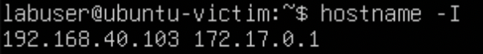
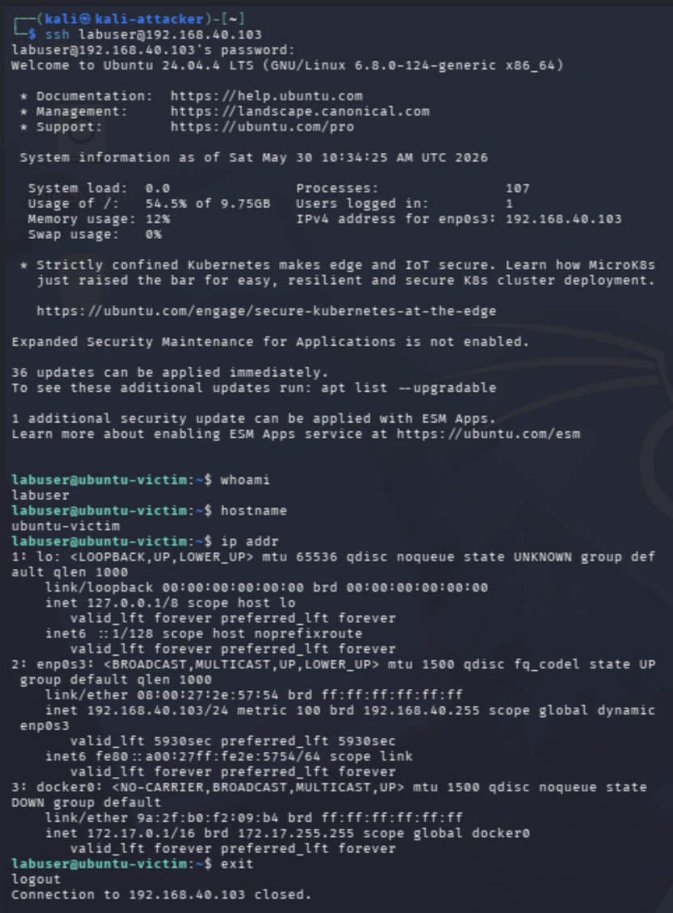
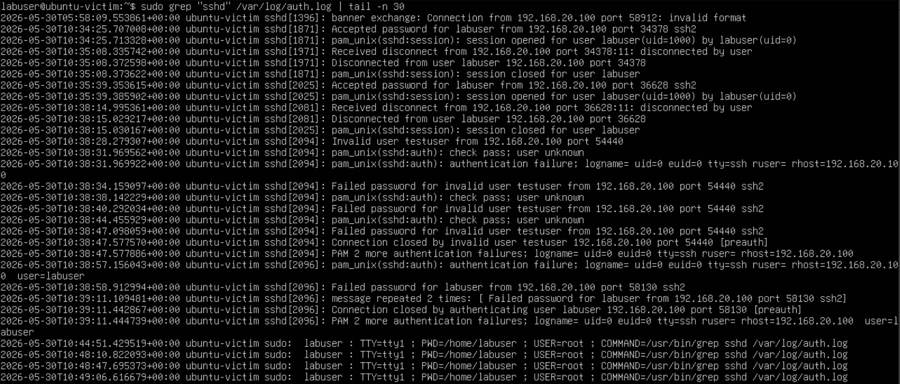
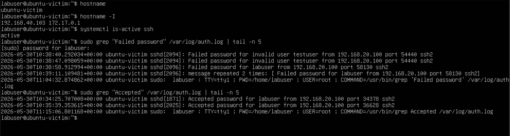

# Project 10: Linux Endpoint Telemetry Collection

## Overview

This project documents Linux endpoint telemetry collection from a monitored Ubuntu system inside the segmented cybersecurity homelab. The goal was to generate realistic host activity, confirm that Linux authentication and system logs were produced locally, and establish a reliable endpoint telemetry baseline before depending on centralized SIEM ingestion.

This project builds on the earlier network-focused detection projects by shifting from packet captures, firewall logs, and Security Onion network visibility to host-level evidence from the Linux endpoint itself.

The project reinforces practical skills related to Linux log review, SSH authentication telemetry, endpoint investigation, failed-login analysis, successful-login validation, local evidence collection, and documentation of host-based security events.

## Lab Environment

| Component | Purpose |
|---|---|
| Ubuntu Server Victim | Linux endpoint used to generate authentication and system telemetry |
| Kali Linux Attacker | System used to generate controlled SSH and network activity against the Ubuntu endpoint |
| Security Onion | Monitoring platform used in the broader lab for future log analysis and detection validation |
| pfSense | Firewall and VLAN segmentation between lab networks |
| Proxmox | Virtualization platform hosting lab virtual machines |
| Raspberry Pi 5 | Bastion host used for secure access into the lab |
| MacBook Air M2 | Primary administration workstation |

## Objectives

- Confirm the Ubuntu endpoint hostname and VLAN 40 IP address.
- Validate that OpenSSH was enabled and running on the Ubuntu endpoint.
- Generate controlled network activity from Kali to the Ubuntu endpoint.
- Generate a successful SSH login from Kali to the Ubuntu endpoint.
- Generate controlled failed SSH login attempts using invalid and incorrect credentials.
- Review `/var/log/auth.log` for accepted logins, failed passwords, invalid users, timestamps, and source IP addresses.
- Create a clean endpoint telemetry summary documenting identity, service status, and SSH authentication activity.
- Establish a local Linux telemetry baseline before future SIEM forwarding.

## Network / System Scope

| Item | Details |
|---|---|
| Endpoint System | Ubuntu Server victim |
| Endpoint VLAN | VLAN 40 |
| Endpoint IP | `192.168.40.103` |
| Attacker System | Kali Linux |
| Attacker IP | `192.168.20.100` |
| Target Service | OpenSSH Server |
| Primary Log Source | `/var/log/auth.log` |
| Authentication Events | Successful SSH login, failed password attempts, and invalid user attempts |
| SIEM Ingestion | Not included in this project; local endpoint telemetry was validated first |
| Validation Method | Host identity check, SSH service review, Kali connectivity test, successful SSH login, failed SSH login attempts, authentication log review, and endpoint telemetry summary |

## Implementation Summary

The workflow began by confirming the Ubuntu endpoint hostname, IP address, and SSH service status. Kali was then used to generate controlled network activity and SSH authentication events against the Ubuntu endpoint.

Both successful and failed login attempts were produced so the endpoint logs could be reviewed for accepted sessions, failed passwords, invalid users, source IP addresses, timestamps, and SSH daemon activity. The project intentionally focused on local endpoint telemetry instead of SIEM ingestion so the host-level logging baseline could be validated first.

After the authentication activity was generated, `/var/log/auth.log` was reviewed and a clean endpoint telemetry summary was captured to document the host identity, SSH service state, failed SSH attempts, and successful SSH logins.

## Endpoint Telemetry Workflow

Linux endpoint telemetry provides host-level context that network monitoring alone cannot always provide. Network traffic can show that communication occurred, but endpoint logs can show which user account was involved, whether authentication succeeded or failed, and which service processed the event.

```text
Kali attacker at 192.168.20.100
        |
        | SSH login attempts
        v
Ubuntu endpoint at 192.168.40.103
        |
        | local authentication telemetry
        v
/var/log/auth.log
        |
        v
Endpoint telemetry review and summary
```

This workflow validates that the Linux endpoint itself can provide meaningful security evidence before forwarding logs to a SIEM in a later project.

## Detection Notes

Linux authentication logs provide valuable endpoint telemetry that can help identify suspicious activity such as brute-force attempts, unauthorized login attempts, and unusual remote access patterns.

Important SSH-related log indicators include:

- `Accepted password`
- `Accepted publickey`
- `Failed password`
- `Invalid user`
- Repeated failed attempts from the same source IP
- Successful login after multiple failures

These events are especially useful when correlated with network traffic, firewall logs, and SIEM alerts.

## Evidence

| # | Evidence | Description |
|---|---|---|
| 01 | [Ubuntu Endpoint IP](evidence/01-ubuntu-endpoint-ip.png) | Shows the Ubuntu endpoint hostname and IP addresses, including the VLAN 40 address `192.168.40.103`. |
| 02 | [SSH Service Status](evidence/02-ssh-service-status.png) | Confirms the OpenSSH server service was enabled and actively running on the Ubuntu endpoint. |
| 03 | [Kali Test Activity](evidence/03-kali-test-activity.png) | Shows Kali successfully reaching the Ubuntu endpoint over ICMP. |
| 04 | [Successful SSH Login](evidence/04-successful-ssh-login.png) | Shows a successful SSH login from Kali to the Ubuntu endpoint with user, hostname, and interface details. |
| 05 | [Failed SSH Login](evidence/05-failed-ssh-login.png) | Shows controlled failed SSH login attempts from Kali using invalid and incorrect credentials. |
| 06 | [Authentication Log Review](evidence/06-auth-log-review.png) | Shows `/var/log/auth.log` entries for accepted SSH logins, failed SSH attempts, invalid users, and source IP `192.168.20.100`. |
| 07 | [Endpoint Telemetry Summary](evidence/07-endpoint-telemetry-summary.png) | Provides a clean terminal summary of hostname, IP address, SSH status, failed SSH attempts, and successful SSH logins. |

## Key Evidence

### Ubuntu Endpoint Identity



This screenshot confirms the Ubuntu endpoint hostname and VLAN 40 IP address, establishing the monitored Linux host used for endpoint telemetry validation.

### Successful SSH Login



This screenshot shows a successful SSH login from Kali to the Ubuntu endpoint, providing controlled authentication activity for log review.

### Authentication Log Review



This screenshot shows `/var/log/auth.log` entries for accepted logins, failed passwords, invalid users, and the Kali source IP address. This provides the strongest endpoint evidence for the project.

### Endpoint Telemetry Summary



This screenshot provides a clean summary of the endpoint identity, SSH service state, failed SSH attempts, and successful SSH logins.

## Validation

Linux endpoint telemetry was validated through endpoint placement checks, SSH service validation, controlled successful and failed SSH activity, authentication log review, and endpoint telemetry summary evidence.

Validation confirmed the following:

- The Ubuntu endpoint hostname and VLAN 40 IP address `192.168.40.103` were confirmed.
- OpenSSH was enabled and actively running on the Ubuntu endpoint.
- Kali successfully reached the Ubuntu endpoint over ICMP.
- A successful SSH login from Kali to the Ubuntu endpoint was generated and validated.
- Controlled failed SSH login attempts were generated from Kali using invalid and incorrect credentials.
- `/var/log/auth.log` showed accepted logins, failed passwords, invalid users, timestamps, and the Kali source IP `192.168.20.100`.
- A clean endpoint telemetry summary documented endpoint identity, SSH status, failed SSH attempts, and successful SSH logins.

## Challenges and Lessons Learned

This project reinforced the importance of validating endpoint-level telemetry before relying only on network monitoring. Network traffic can show that communication occurred, but Linux authentication logs provide additional context such as usernames, authentication results, service names, timestamps, and source IP addresses.

The collected logs showed that the Ubuntu endpoint captured both successful and failed SSH activity from Kali at `192.168.20.100`. This confirmed that the endpoint could provide useful host-level context such as usernames, source IP addresses, authentication outcomes, and SSH daemon activity.

A key lesson was that endpoint logs and network telemetry answer different investigation questions. Endpoint logs explain what happened on the host, while network telemetry explains how systems communicated. Combining both creates a more complete detection and investigation workflow.

## Security Relevance

This project demonstrates how Linux endpoint telemetry supports real-world security monitoring and incident response. Authentication logs can reveal failed login attempts, invalid usernames, successful access, suspicious source IPs, and unusual remote access behavior.

The project also demonstrates why local validation matters before forwarding logs to a SIEM. If logs are not generated correctly on the endpoint, centralized collection and alerting will not be reliable.

## Business Value

This project provides business value by showing how endpoint telemetry improves investigation quality and reduces blind spots. Host logs help security teams determine whether access attempts succeeded, which accounts were targeted, and whether additional response actions are needed.

In an enterprise environment, this type of work helps teams:

- Investigate successful and failed authentication activity.
- Identify suspicious SSH login attempts and invalid user activity.
- Validate endpoint logging before centralizing logs in a SIEM.
- Correlate endpoint evidence with firewall, network, and SIEM data.
- Improve incident response by preserving host-level context.
- Build repeatable documentation for endpoint telemetry validation.

## Portfolio Summary

This project demonstrates the ability to collect and validate Linux endpoint telemetry inside a segmented cybersecurity homelab. The Ubuntu endpoint generated successful and failed SSH authentication events from Kali, and `/var/log/auth.log` confirmed accepted logins, failed passwords, invalid users, timestamps, and source IP context.

The project adds host-level visibility to the broader portfolio by showing how endpoint logs complement network monitoring, firewall validation, and Security Onion investigation workflows. It establishes a local Linux telemetry baseline that can support future SIEM forwarding, alerting, and correlation projects.