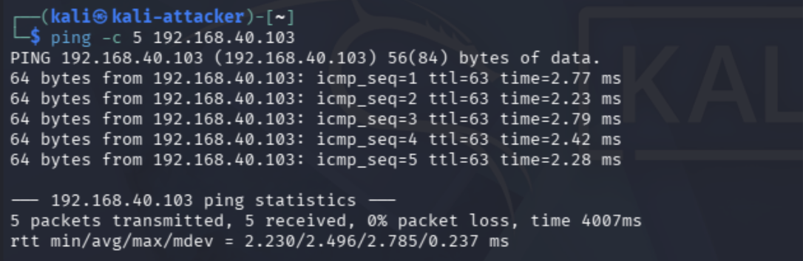
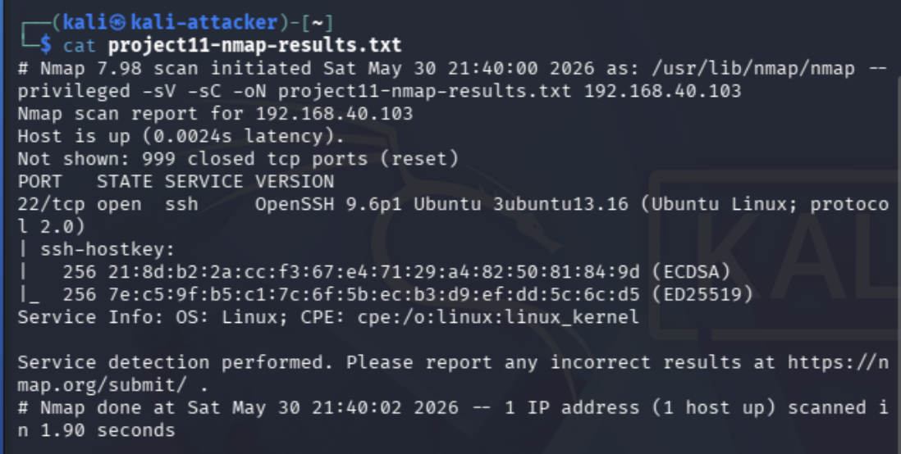
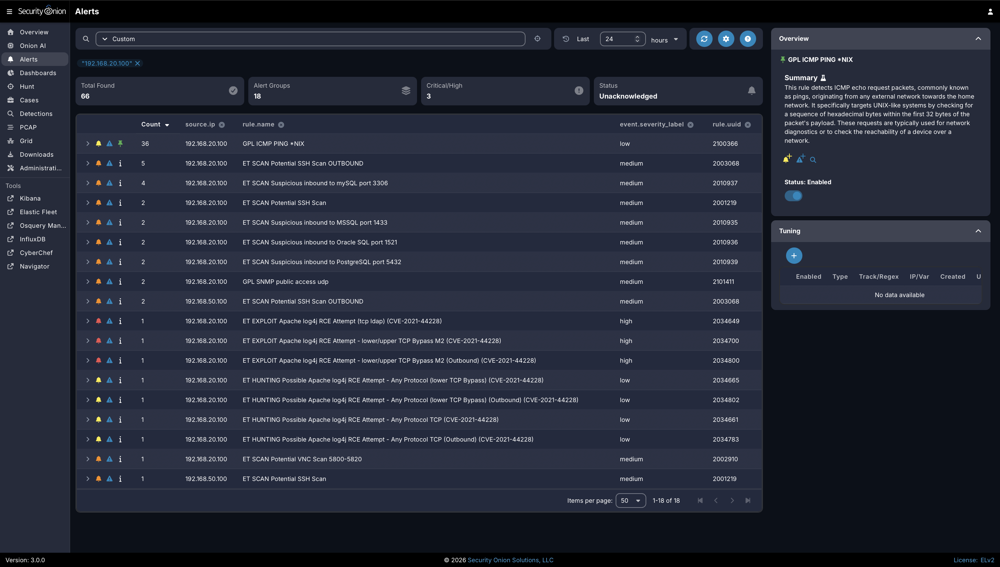
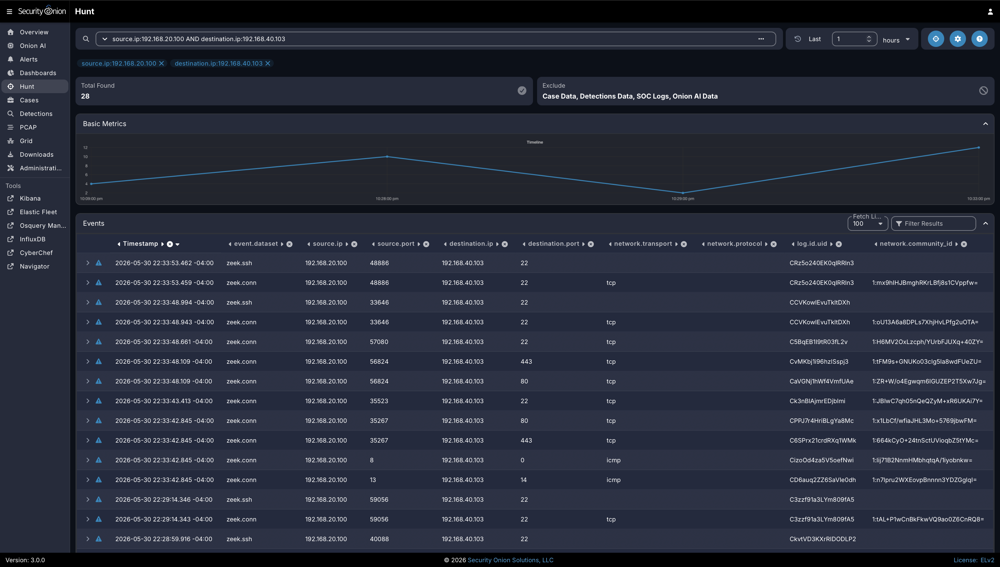
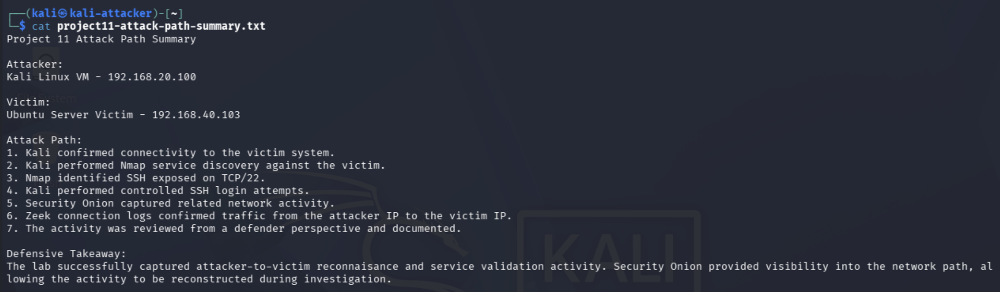

# Project 11: Attack Path Validation

## Overview

This project documents a controlled attacker-to-victim path inside the segmented cybersecurity homelab. The goal was to validate a realistic attack sequence from the Kali attacker VLAN to the Ubuntu victim VLAN and confirm that each major stage could be observed, investigated, and explained from a defender perspective.

This project builds on earlier reconnaissance, brute-force, vulnerability scanning, endpoint telemetry, firewall segmentation, and Security Onion visibility projects by chaining several activities together into a single attack-path validation workflow.

The project reinforces practical skills related to attack-path validation, service enumeration, SSH access validation, SIEM investigation, Zeek log review, Suricata alert review, pfSense segmentation context, and defensive timeline reconstruction.

## Lab Environment

| Component | Purpose |
|---|---|
| Kali Linux VM | Attacker system located in the Attacker VLAN |
| Ubuntu Server Victim | Target host located in the Victim VLAN |
| Security Onion | SIEM, NIDS, detection, and investigation platform |
| pfSense | Firewall and VLAN segmentation enforcement |
| Netgear Managed Switch | VLAN trunking and traffic mirroring |
| Raspberry Pi 5 | Bastion host and remote access jump point |
| MacBook Air M2 | Administrator workstation |

## Objectives

- Confirm Kali attacker placement on VLAN 20.
- Confirm Ubuntu victim placement on VLAN 40.
- Validate attacker-to-victim connectivity.
- Perform controlled service discovery against the victim host.
- Validate the exposed SSH service path on TCP/22.
- Generate controlled SSH authentication activity from the attacker system.
- Confirm Security Onion alert visibility tied to the attacker source IP.
- Confirm Zeek connection and SSH log visibility in Security Onion Hunt.
- Review pfSense segmentation context for the allowed lab path.
- Reconstruct the attack path from attacker-side evidence and defender-side telemetry.

## Network / System Scope

| Item | Details |
|---|---|
| Attacker System | Kali Linux VM |
| Attacker VLAN | VLAN 20 |
| Attacker IP | `192.168.20.100` |
| Victim System | Ubuntu Server victim |
| Victim VLAN | VLAN 40 |
| Victim IP | `192.168.40.103` |
| Exposed Service | SSH on TCP/22 |
| Service Version | OpenSSH `9.6p1 Ubuntu 3ubuntu13.16` |
| Monitoring Platform | Security Onion |
| Firewall Context | pfSense rules allowing the controlled attacker-to-victim lab path while restricting unauthorized internal access |
| Validation Method | IP validation, ICMP testing, Nmap service discovery, SSH validation, Security Onion alerts, Zeek Hunt logs, pfSense rule review, and attack path reconstruction |

## Implementation Summary

The attack path began with Kali attacker placement validation on VLAN 20 and Ubuntu victim placement validation on VLAN 40. After confirming attacker-to-victim connectivity, Nmap service discovery was performed against the victim and identified SSH exposed on TCP/22.

The SSH service was then validated with controlled failed login attempts and an authorized successful login using the lab account. Security Onion was used to review alerts and Zeek logs tied to the attacker IP, while pfSense rule evidence provided segmentation context for the allowed lab path.

The final evidence reconstructed the activity from both attacker and defender perspectives, showing how a simple sequence of reconnaissance, service discovery, SSH validation, and SIEM review can be documented as an end-to-end attack-path validation.

## Attack Path Workflow

The completed attack path followed a controlled and realistic flow:

```text
Kali attacker on VLAN 20
        |
        | ICMP validation and Nmap service discovery
        v
Ubuntu victim on VLAN 40
        |
        | SSH validation and controlled authentication attempts
        v
Security Onion alerts / Zeek connection logs
        |
        | pfSense segmentation context
        v
Attack path reconstruction and defensive analysis
```

This workflow validated not only that the attacker path worked, but also that the activity could be investigated from the defender side.

## Attack Path Stages

| Stage | Activity | Defensive Evidence |
|---|---|---|
| Reconnaissance | Kali confirmed connectivity to the Ubuntu victim using ICMP | Attacker command output and network visibility |
| Service Enumeration | Nmap identified SSH exposed on TCP/22 | Nmap output and Security Onion visibility |
| Controlled Access Validation | SSH failed attempts and an authorized successful login were performed | SSH validation evidence and Security Onion logs |
| Detection and Investigation | Security Onion alerts and Hunt results were reviewed | Suricata alert evidence and Zeek connection/SSH logs |
| Segmentation Review | pfSense rule evidence was reviewed for VLAN20-to-VLAN40 lab access | Firewall rule context showing the allowed test path |
| Reconstruction | Activity was summarized from attacker and defender evidence | Final attack-path reconstruction screenshot |

## Evidence

| # | Evidence | Description |
|---|---|---|
| 01a | [Victim IP Address](evidence/01a-victim-ip-address.png) | Shows the Ubuntu victim system at `192.168.40.103` on the Victim VLAN. |
| 01b | [Attacker IP Address](evidence/01b-attacker-ip-address.png) | Shows the Kali attacker system at `192.168.20.100` on the Attacker VLAN. |
| 02 | [Attacker-to-Victim Connectivity](evidence/02-attacker-to-victim-connectivity.png) | Shows successful ICMP connectivity from Kali to the Ubuntu victim. |
| 03 | [Nmap Service Discovery](evidence/03-nmap-service-discovery.png) | Shows SSH exposed on TCP/22 with OpenSSH service details. |
| 04 | [SSH Service Validation](evidence/04-ssh-service-validation.png) | Shows failed SSH attempts and a successful login using the authorized lab account. |
| 05 | [Controlled Attack Activity](evidence/05-controlled-attack-activity.png) | Shows focused SSH scanning and failed authentication activity from the attacker system. |
| 06 | [Security Onion Alerts](evidence/06-security-onion-alerts.png) | Shows Security Onion alerts associated with the attacker source IP. |
| 07 | [Zeek Connection Logs](evidence/07-zeek-connection-logs.png) | Shows Zeek SSH and connection logs from attacker to victim over TCP/22. |
| 08 | [pfSense Segmentation Rule](evidence/08-pfsense-segmentation-rule.png) | Shows VLAN20 attacker rules allowing lab victim traffic while blocking unauthorized internal access. |
| 09 | [Attack Path Reconstruction](evidence/09-attack-path-reconstruction.png) | Shows the final written attack path summary and defensive takeaway. |

## Key Evidence

### Attacker-to-Victim Connectivity



This screenshot confirms the attacker system could reach the victim host over the approved lab path before additional validation was performed.

### Nmap Service Discovery



This screenshot shows Nmap identifying SSH exposed on TCP/22 and reporting the OpenSSH service details for the Ubuntu victim.

### Security Onion Alerts



This screenshot shows Security Onion alerts associated with the attacker source IP, confirming defender-side visibility into the controlled activity.

### Zeek Connection Logs



This screenshot shows Zeek connection and SSH logs from the Kali attacker to the Ubuntu victim over TCP/22, supporting timeline reconstruction and investigation.

### Attack Path Reconstruction



This screenshot summarizes the full attack path and defensive takeaway, tying attacker-side actions to Security Onion and firewall evidence.

## Defensive Analysis

This project demonstrated that a simple attacker workflow can be investigated from a defender perspective when network visibility is properly configured. The activity did not need to be destructive to be useful. A controlled sequence of ping, Nmap scanning, SSH validation, and authentication attempts was enough to generate evidence across multiple defensive layers.

Security Onion provided visibility into attacker-to-victim traffic. Zeek logs were especially useful for reconstruction because they showed source IP, destination IP, destination port, dataset, and timestamps. Suricata alerts helped identify scan-like behavior from the attacker source IP. pfSense segmentation rules provided important context by showing that the Attacker VLAN was intentionally restricted and only allowed toward the Victim VLAN lab path.

## Validation

Attack path validation was completed by confirming endpoint placement, attacker-to-victim connectivity, controlled reconnaissance, exposed SSH service validation, detectable SSH activity, Security Onion alert visibility, Zeek connection visibility, pfSense segmentation context, and attack path reconstruction.

Validation confirmed the following:

- The Kali attacker VM used IP address `192.168.20.100` in VLAN 20.
- The Ubuntu victim system used IP address `192.168.40.103` in VLAN 40.
- ICMP connectivity from Kali to the victim succeeded with `0%` packet loss.
- Nmap identified SSH exposed on TCP/22.
- The victim was running OpenSSH `9.6p1 Ubuntu 3ubuntu13.16`.
- Controlled SSH authentication attempts generated observable activity.
- Security Onion generated alerts associated with the attacker IP address.
- Security Onion Hunt confirmed Zeek `conn` and `ssh` logs between the attacker and victim.
- pfSense rules showed that VLAN20 attacker traffic was intentionally allowed to the VLAN40 victim lab while broader unauthorized internal access remained blocked.

## Challenges and Lessons Learned

This project reinforced that attack-path validation is stronger when it combines attacker-side actions with defender-side evidence. Command output from Kali showed what the attacker performed, while Security Onion and pfSense evidence showed how the activity appeared to defenders.

The project also showed the value of chaining smaller activities together. Connectivity testing, Nmap service discovery, SSH validation, alert review, Zeek log review, and firewall context were each useful on their own, but together they created a stronger end-to-end validation story.

A key lesson was that firewall context matters during investigation. Alerts and logs show that activity occurred, but firewall rules help explain whether the traffic path was expected, intentionally allowed, or suspicious.

## Security Relevance

This project demonstrates how attack-path validation supports real-world detection engineering and incident response. Security teams often need to understand not only whether an alert fired, but how an attacker moved through the environment, which systems were involved, which services were exposed, and whether the traffic path should have been allowed.

The project also demonstrates the importance of timeline reconstruction. Zeek connection logs, Suricata alerts, endpoint/service validation, and firewall context help defenders move from isolated events to a complete explanation of attacker behavior.

## Business Value

This project provides business value by showing how controlled attack-path validation can improve monitoring confidence and incident response readiness. Validating the full path from attacker activity to defender visibility helps teams identify monitoring gaps, confirm segmentation behavior, and improve documentation.

In an enterprise environment, this type of work helps teams:

- Validate that approved security tests are visible to monitoring tools.
- Confirm whether segmentation controls support or restrict expected traffic paths.
- Reconstruct attack activity using multiple evidence sources.
- Improve detection engineering and alert triage workflows.
- Support communication between SOC, network, firewall, and infrastructure teams.
- Document end-to-end security validation in a repeatable format.

## Portfolio Summary

This project validated a controlled attack path from the Kali attacker VM in VLAN 20 to the Ubuntu victim system in VLAN 40. The attack path began with connectivity testing, continued through Nmap service discovery, and then moved into SSH service validation and controlled authentication attempts.

The victim exposed SSH on TCP/22, with Nmap identifying OpenSSH `9.6p1 Ubuntu 3ubuntu13.16`. The activity generated useful defensive telemetry in Security Onion. Alerts were observed for attacker-source activity, and Security Onion Hunt confirmed Zeek `conn` and `ssh` logs between `192.168.20.100` and `192.168.40.103` over TCP/22.

This project tied together earlier portfolio work by combining VLAN segmentation, firewall context, reconnaissance, service validation, SIEM investigation, and defensive timeline reconstruction. The completed evidence demonstrates the ability to validate attacker behavior while also explaining how that behavior can be detected and investigated from a defender perspective.