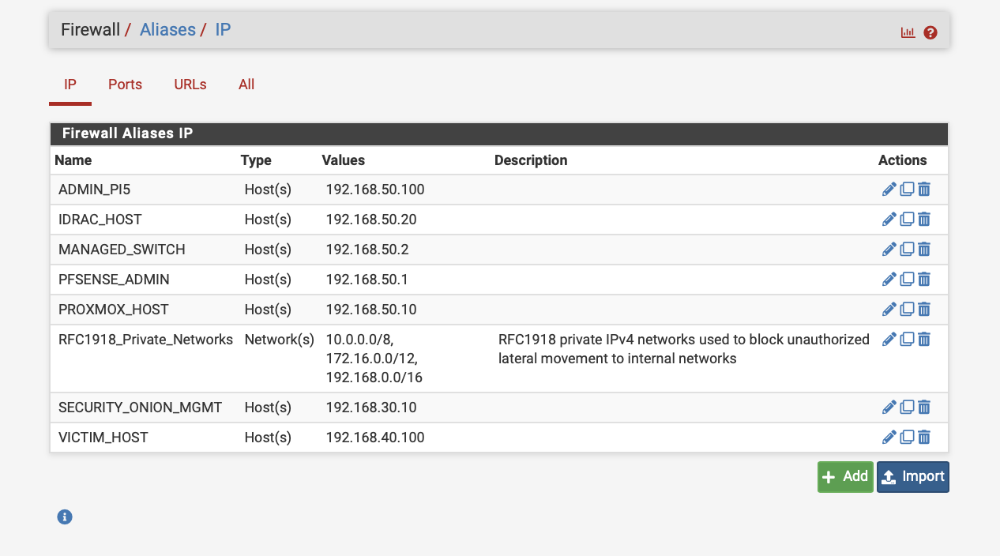
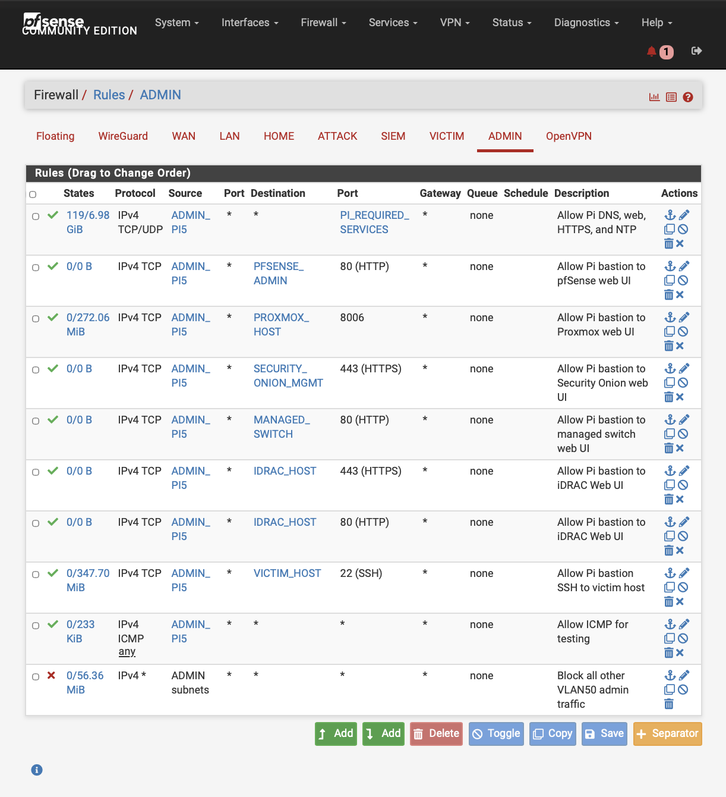
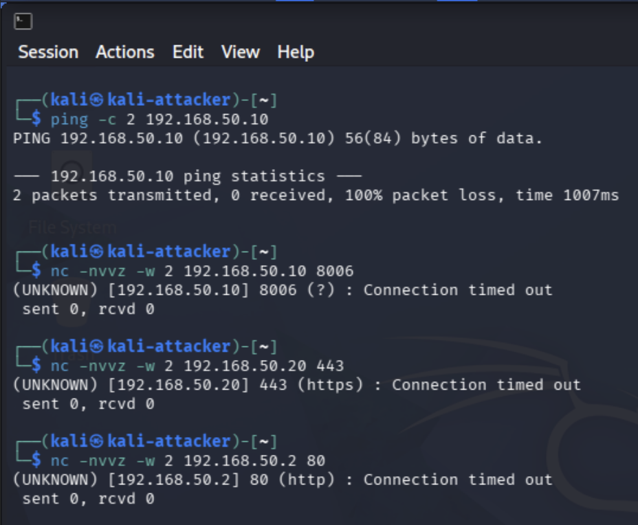
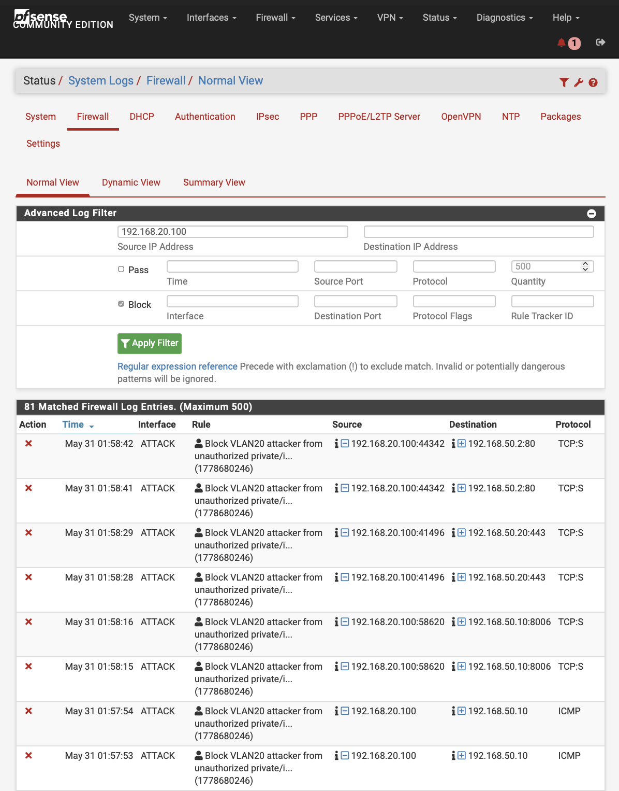

# Project 12: pfSense Firewall Hardening

## Overview

This project documents the hardening of the pfSense firewall that separates and protects the segmented cybersecurity homelab. The goal was to move beyond basic VLAN connectivity and validate the firewall controls that reduce unnecessary access, protect management interfaces, support controlled lab testing, and provide clear evidence of blocked traffic.

The firewall is responsible for enforcing separation between the Home, Attacker, Victim, SIEM, and Admin networks. This project reviewed firewall rules, aliases, management access paths, blocked traffic behavior, and approved administrative access to confirm that the final firewall configuration matched the intended security design.

The project reinforces practical skills related to pfSense administration, firewall alias design, VLAN-based access control, management-plane protection, rule ordering, logged block rules, bastion-based administration, and firewall log validation.

## Lab Environment

| Component | Purpose |
|---|---|
| pfSense Firewall | Core firewall and routing device for the homelab |
| Protectli Appliance | Hardware platform running pfSense |
| Netgear Managed Switch | VLAN trunking and port segmentation |
| Proxmox Server | Virtualization host for lab VMs |
| Security Onion | SIEM and network monitoring platform |
| Kali Linux | Attacker/testing system on the ATTACK VLAN |
| Victim Systems | Systems used to validate controlled lab traffic |
| Raspberry Pi Bastion | Trusted administrative access point |
| MacBook Air | Primary workstation used for browser-based management access |

## Objectives

- Review pfSense firewall rules for each VLAN.
- Use firewall aliases to simplify rule management and documentation.
- Confirm that management access is restricted to trusted administrative systems.
- Reduce unnecessary inter-VLAN communication.
- Validate that Home VLAN devices cannot freely access lab networks.
- Validate that Attacker VLAN systems cannot access firewall or management interfaces.
- Confirm that approved administrative access still works through the Raspberry Pi bastion and trusted admin path.
- Capture evidence showing firewall rules, aliases, blocked traffic, and successful administrative access.
- Document the final firewall hardening state in a repeatable portfolio format.

## Network / System Scope

| Item | Details |
|---|---|
| Firewall Platform | pfSense Community Edition on Protectli appliance |
| Home VLAN | VLAN 10 / regular home devices and wireless clients |
| Attacker VLAN | VLAN 20 / Kali Linux and offensive testing systems |
| SIEM VLAN | VLAN 30 / Security Onion management and monitoring |
| Victim VLAN | VLAN 40 / target systems used for detection and validation projects |
| Admin VLAN | VLAN 50 / management systems, bastion access, Proxmox, iDRAC, and firewall administration |
| Trusted Admin Path | MacBook Air through Raspberry Pi bastion on the Admin VLAN |
| Protected Management Interfaces | pfSense, Proxmox, Security Onion, iDRAC, and managed switch interfaces |
| Validation Method | Alias review, VLAN rule review, approved admin access testing, blocked management testing, and firewall log review |

## Implementation Summary

The firewall hardening process focused on simplifying rule management with aliases, reviewing each VLAN rule set, reducing unnecessary inter-VLAN access, restricting management interfaces to trusted administrative paths, and validating both approved and blocked traffic.

Firewall aliases were created for important management systems, protected hosts, victim systems, and private network ranges. This made the firewall rules easier to read and reduced reliance on raw IP addresses in the rule base.

Each VLAN rule set was reviewed with a specific security purpose. The Home, SIEM, and Victim VLANs were limited to necessary access. The Attacker VLAN was allowed to reach approved victim systems for controlled lab testing while remaining blocked from management infrastructure. The Admin VLAN was hardened around the Raspberry Pi bastion, allowing approved management access while denying unnecessary traffic.

The final validation confirmed that approved administrative access worked, unauthorized Attacker VLAN access to management resources was blocked, and pfSense firewall logs captured denied traffic.

## Firewall Alias Design

Firewall aliases were used to make rules easier to read, manage, and document. Instead of relying only on raw IP addresses, important management systems and protected network ranges were assigned descriptive names.

| Alias | Purpose |
|---|---|
| `ADMIN_PI5` | Raspberry Pi bastion host used for trusted administrative access |
| `PFSENSE_ADMIN` | pfSense admin interface |
| `PROXMOX_HOST` | Proxmox management interface |
| `IDRAC_HOST` | Dell server iDRAC management interface |
| `MANAGED_SWITCH` | Managed switch web interface |
| `SECURITY_ONION_MGMT` | Security Onion management interface |
| `VICTIM_HOST` | Victim host used for lab validation |
| `RFC1918_Private_Networks` | Private IPv4 ranges used to block unauthorized internal and lateral movement |

## Firewall Rule Review

| VLAN | Firewall Hardening Summary |
|---|---|
| HOME | Allows DNS and internet access while blocking access to pfSense firewall services and unauthorized private/internal networks. |
| ATTACK | Allows Kali Linux to reach approved victim systems for lab testing while blocking access to pfSense firewall services and unauthorized internal networks. |
| SIEM | Allows DNS and internet access while blocking unnecessary access to pfSense firewall services and unauthorized private/internal networks. |
| VICTIM | Allows DNS and internet access while blocking access to pfSense firewall services and unauthorized private/internal networks. |
| ADMIN | Uses the Raspberry Pi bastion as the trusted source for specific management services and includes a final block rule for unnecessary Admin VLAN traffic. |

## Management Access Model

The hardened firewall configuration uses the Raspberry Pi bastion as the trusted administrative access point. Instead of allowing broad access to firewall, hypervisor, SIEM, switch, or iDRAC management interfaces, administrative paths are limited to approved systems and aliases.

```text
MacBook Air
    |
    | trusted admin workflow
    v
Raspberry Pi Bastion on Admin VLAN 50
    |
    | approved management access
    v
pfSense / Proxmox / Security Onion / Managed Switch / iDRAC
```

This model reduces management-plane exposure and helps prevent attacker or victim systems from becoming a path into sensitive infrastructure.

## Evidence

| # | Evidence | Description |
|---|---|---|
| 01 | [pfSense Firewall Aliases](evidence/01-pfsense-firewall-aliases.png) | Shows aliases for management hosts, victim systems, and private network blocking. |
| 02 | [HOME VLAN Rules](evidence/02-home-vlan-rules.png) | Shows HOME VLAN DNS, internal-blocking, internet, and default-block rules. |
| 03 | [ATTACK VLAN Rules](evidence/03-attacker-vlan-rules.png) | Shows controlled ATTACK-to-VICTIM access and blocked internal/management access. |
| 04 | [SIEM VLAN Rules](evidence/04-siem-vlan-rules.png) | Shows SIEM VLAN restrictions and internet access. |
| 05 | [VICTIM VLAN Rules](evidence/05-victim-vlan-rules.png) | Shows victim network restrictions and internet access. |
| 06 | [ADMIN VLAN Rules](evidence/06-admin-vlan-rules.png) | Shows Pi-bastion-based management access and final block rule. |
| 07 | [Approved Admin Access](evidence/07-approved-admin-access.png) | Shows successful access to the pfSense dashboard through the trusted path. |
| 08 | [Blocked Management Access](evidence/08-blocked-management-access.png) | Shows Kali ATTACK VLAN management access attempts timing out. |
| 09 | [Firewall Log Denied Traffic](evidence/09-firewall-log-denied-traffic.png) | Shows pfSense blocking ATTACK VLAN traffic to Admin VLAN targets. |

## Key Evidence

### Firewall Alias Design



This screenshot shows the pfSense aliases used to simplify rule management and make protected hosts, management systems, victim systems, and private network ranges easier to reference.

### ATTACK VLAN Rules


This screenshot shows the ATTACK VLAN rule set allowing controlled victim lab testing while blocking unauthorized access to management and private/internal networks.

### ADMIN VLAN Rules



This screenshot shows the Admin VLAN rule set built around the Raspberry Pi bastion and approved management destinations.

### Blocked Management Access



This screenshot shows Kali ATTACK VLAN attempts to access protected management resources timing out, confirming that management access was not broadly exposed.

### Firewall Denied Traffic Logs



This screenshot shows pfSense firewall logs capturing denied ATTACK VLAN traffic to protected Admin VLAN destinations.

## Validation

pfSense firewall hardening was validated through alias review, VLAN rule review, approved administrative access testing, blocked management access testing, and firewall log review.

Validation confirmed the following:

- Firewall aliases were created for management hosts, victim systems, and private network blocking.
- HOME VLAN rules allowed DNS and internet access while blocking unauthorized internal access.
- ATTACK VLAN rules allowed controlled victim testing while blocking management and unauthorized internal access.
- SIEM VLAN rules restricted unnecessary internal access while preserving required connectivity.
- VICTIM VLAN rules blocked access to pfSense services and unauthorized private/internal networks.
- ADMIN VLAN rules restricted management access around the Raspberry Pi bastion and specific approved services.
- pfSense dashboard access succeeded through the trusted administrative path.
- Kali ATTACK VLAN attempts to reach protected Admin VLAN resources timed out.
- pfSense logs showed denied ATTACK VLAN traffic to protected Admin VLAN destinations.

## Challenges and Lessons Learned

This project reinforced the importance of firewall rule order, explicit allow rules, and logged block rules. The ATTACK VLAN rule order was especially important because Kali needed controlled access to the VICTIM VLAN while still being blocked from protected internal and management networks.

A key takeaway was that pfSense block rules must have logging enabled if denied traffic needs to appear clearly in the firewall logs. After enabling logging on the ATTACK VLAN block rules, the firewall logs provided strong evidence that unauthorized management access was being denied.

The project also demonstrated why aliases are useful in firewall administration. Named aliases made the rule base easier to read, easier to maintain, and easier to document in a professional format.

## Security Relevance

This project demonstrates how firewall hardening supports real-world network security operations. VLANs alone do not provide meaningful security unless firewall rules enforce least-privilege communication between zones.

The project also demonstrates the importance of protecting the management plane. Firewall dashboards, hypervisors, SIEM consoles, switch management interfaces, and iDRAC should not be reachable from attacker, victim, or general user networks. Restricting these services to a trusted admin path reduces lateral movement risk and protects high-value infrastructure.

## Business Value

This project provides business value by showing how firewall hardening can reduce exposure, limit lateral movement, protect management interfaces, and improve auditability. Clear firewall rules, named aliases, and logged block events help both technical teams and leadership understand how access is controlled.

In an enterprise environment, this type of work helps teams:

- Enforce least-privilege access between network zones.
- Protect administrative interfaces from unauthorized networks.
- Reduce lateral movement risk after endpoint compromise.
- Simplify firewall rule management with aliases.
- Validate blocked traffic with firewall logs.
- Document firewall controls in a repeatable and reviewable format.

## Portfolio Summary

This project demonstrates pfSense firewall hardening inside a segmented cybersecurity homelab. The final rule set uses aliases, VLAN-based access control, trusted bastion access, and logged block rules to protect management infrastructure while preserving approved lab testing paths.

The HOME, ATTACK, SIEM, VICTIM, and ADMIN VLANs were reviewed and hardened. Kali on the ATTACK VLAN retained controlled access to approved victim systems, while attempts to reach protected Admin VLAN resources were blocked and logged. The project adds firewall administration, segmentation validation, and management-plane protection to the broader homelab portfolio.