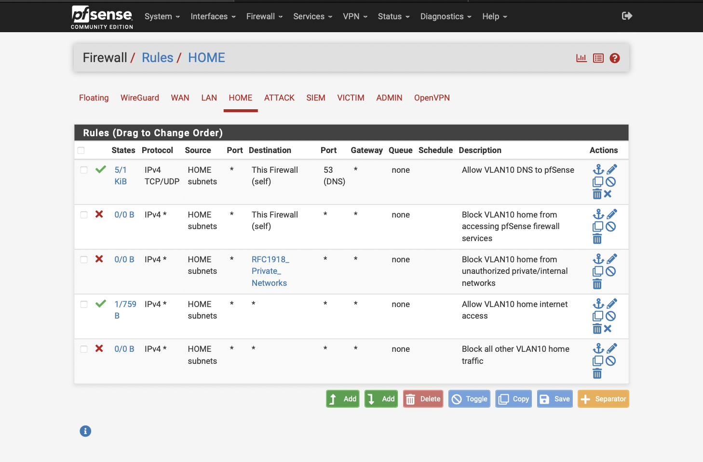
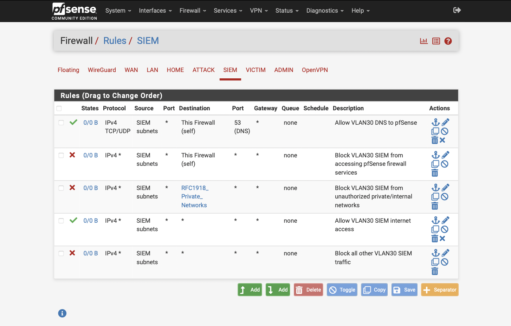

# Project 12: pfSense Firewall Hardening

## Project Status

**Status:** Complete  
**Portfolio Category:** Network Security / Firewall Administration  
**Primary Tool:** pfSense  
**Environment:** Cybersecurity Homelab

## Objective

This project focused on hardening the pfSense firewall that separates and protects the homelab environment. The goal was to move beyond basic VLAN connectivity and document the security controls that make the lab safer, more segmented, and easier to manage.

The firewall is responsible for enforcing separation between the home network, attacker network, victim network, SIEM network, and admin network. This project documents the process of reviewing firewall rules, using aliases, reducing unnecessary access, protecting management interfaces, validating blocked traffic, and confirming that approved administrative access still works.

## Lab Environment

The firewall hardening work was performed inside the existing cybersecurity homelab environment.

| Component | Purpose |
| --- | --- |
| pfSense Firewall | Core firewall and routing device for the homelab |
| Protectli Appliance | Hardware platform running pfSense |
| Netgear Managed Switch | VLAN trunking and port segmentation |
| Proxmox Server | Virtualization host for lab VMs |
| Security Onion | SIEM and network monitoring platform |
| Kali Linux | Attacker/testing system on the ATTACK VLAN |
| Victim Systems | Systems used to validate controlled lab traffic |
| Raspberry Pi Bastion | Trusted administrative access point |
| MacBook Air | Primary workstation used for browser-based management access |

## Network Segmentation

The firewall rules are built around the existing VLAN design.

| VLAN | Network Role | Purpose |
| --- | --- | --- |
| VLAN 10 | HOME | Regular home devices and wireless clients |
| VLAN 20 | ATTACK | Kali Linux and offensive testing systems |
| VLAN 30 | SIEM | Security Onion management and monitoring |
| VLAN 40 | VICTIM | Target systems used for detection and validation projects |
| VLAN 50 | ADMIN | Management systems, bastion access, Proxmox, iDRAC, and firewall administration |

## Validation Goals

- Review existing pfSense firewall rules for each VLAN.
- Use firewall aliases to simplify rule management.
- Confirm that management access is restricted to trusted administrative systems.
- Reduce unnecessary inter-VLAN communication.
- Validate that home devices cannot freely access lab networks.
- Validate that attacker systems cannot access firewall or management interfaces.
- Confirm that required access paths still work through the Raspberry Pi bastion and approved admin path.
- Capture evidence showing firewall rules, aliases, blocked traffic, and successful administrative access.
- Document the final firewall hardening state in a repeatable portfolio format.

## Business and Security Value

Firewall hardening is a core network security control that reduces unnecessary exposure, limits lateral movement, and protects sensitive management interfaces. In this project, pfSense was used to enforce segmented access between home, attacker, victim, SIEM, and admin networks.

This project demonstrates practical firewall administration skills including alias design, VLAN-based rule review, management-plane protection, bastion-based administration, blocked-path validation, and firewall log analysis.

## Tools and Technologies

- pfSense Community Edition
- VLANs
- Firewall aliases
- Inter-VLAN firewall rules
- ICMP testing
- Netcat
- SSH
- Tailscale / bastion access path
- Security Onion
- Kali Linux
- Proxmox
- Managed switch trunking

## Implementation Summary

The firewall hardening process focused on simplifying rule management with aliases, reviewing each VLAN rule set, reducing unnecessary inter-VLAN access, restricting management interfaces to trusted administrative paths, and validating both approved and blocked traffic. The final design preserved required lab functionality while improving management-plane isolation and visibility into denied traffic.

### Firewall Alias Design

Firewall aliases were used to make rules easier to read, manage, and document. Instead of relying only on raw IP addresses, important management systems and protected network ranges were assigned descriptive names.

| Alias | Purpose |
| --- | --- |
| `ADMIN_PI5` | Raspberry Pi bastion host used for trusted administrative access |
| `PFSENSE_ADMIN` | pfSense admin interface |
| `PROXMOX_HOST` | Proxmox management interface |
| `IDRAC_HOST` | Dell server iDRAC management interface |
| `MANAGED_SWITCH` | Managed switch web interface |
| `SECURITY_ONION_MGMT` | Security Onion management interface |
| `VICTIM_HOST` | Victim host used for lab validation |
| `RFC1918_Private_Networks` | Private IPv4 ranges used to block unauthorized internal/lateral movement |

### Firewall Rule Review

#### HOME VLAN Rules

The HOME VLAN was configured to allow DNS and internet access while blocking access to the pfSense firewall services and unauthorized private/internal networks. This prevents regular home devices from freely accessing lab infrastructure.

#### ATTACK VLAN Rules

The ATTACK VLAN was configured to allow Kali Linux to reach approved victim systems for lab testing while blocking access to pfSense firewall services and unauthorized internal networks. This allows controlled offensive testing without exposing management infrastructure.

#### SIEM VLAN Rules

The SIEM VLAN was configured to allow DNS and internet access while blocking unnecessary access to pfSense firewall services and unauthorized private/internal networks. Security Onion management access is handled through the trusted admin path rather than being broadly exposed.

#### VICTIM VLAN Rules

The VICTIM VLAN was configured to allow DNS and internet access while blocking access to pfSense firewall services and unauthorized private/internal networks. This helps prevent victim systems from becoming a path into management infrastructure.

#### ADMIN VLAN Rules

The ADMIN VLAN rules were hardened around the Raspberry Pi bastion. The Pi is allowed to reach specific management services such as pfSense, Proxmox, Security Onion, the managed switch, iDRAC, and SSH to the victim host. A final block rule denies all other Admin VLAN traffic.

## Validation and Evidence

pfSense firewall hardening was validated through alias review, VLAN rule review, approved administrative access testing, blocked management access testing, and firewall log review.

| Validation Area | Result | Evidence |
|---|---|---|
| Firewall alias review | Passed - Aliases were created for management hosts, victim systems, and private network blocking | [01-pfsense-firewall-aliases.png](evidence/01-pfsense-firewall-aliases.png) |
| HOME VLAN rule review | Passed - HOME VLAN rules allowed DNS/internet access while blocking unauthorized internal access | [02-home-vlan-rules.png](evidence/02-home-vlan-rules.png) |
| ATTACK VLAN rule review | Passed - ATTACK VLAN rules allowed controlled victim testing while blocking management and unauthorized internal access | [03-attacker-vlan-rules.png](evidence/03-attacker-vlan-rules.png) |
| SIEM VLAN rule review | Passed - SIEM VLAN rules restricted unnecessary internal access while preserving required connectivity | [04-siem-vlan-rules.png](evidence/04-siem-vlan-rules.png) |
| VICTIM VLAN rule review | Passed - VICTIM VLAN rules blocked access to pfSense services and unauthorized private/internal networks | [05-victim-vlan-rules.png](evidence/05-victim-vlan-rules.png) |
| ADMIN VLAN rule review | Passed - ADMIN VLAN rules restricted management access around the Raspberry Pi bastion and specific approved services | [06-admin-vlan-rules.png](evidence/06-admin-vlan-rules.png) |
| Approved admin access | Passed - pfSense dashboard access succeeded through the trusted administrative path | [07-approved-admin-access.png](evidence/07-approved-admin-access.png) |
| Blocked management access | Passed - Kali ATTACK VLAN attempts to reach protected Admin VLAN resources timed out | [08-blocked-management-access.png](evidence/08-blocked-management-access.png) |
| Firewall log validation | Passed - pfSense logs showed denied ATTACK VLAN traffic to protected Admin VLAN destinations | [09-firewall-log-denied-traffic.png](evidence/09-firewall-log-denied-traffic.png) |

## Evidence Summary

| ID | Evidence | What It Demonstrates |
|---|---|---|
| 01 | [01-pfsense-firewall-aliases.png](evidence/01-pfsense-firewall-aliases.png) | Shows aliases for management hosts, victim systems, and private network blocking |
| 02 | [02-home-vlan-rules.png](evidence/02-home-vlan-rules.png) | Shows HOME VLAN DNS, internal-blocking, internet, and default-block rules |
| 03 | [03-attacker-vlan-rules.png](evidence/03-attacker-vlan-rules.png) | Shows controlled ATTACK-to-VICTIM access and blocked internal/management access |
| 04 | [04-siem-vlan-rules.png](evidence/04-siem-vlan-rules.png) | Shows SIEM VLAN restrictions and internet access |
| 05 | [05-victim-vlan-rules.png](evidence/05-victim-vlan-rules.png) | Shows victim network restrictions and internet access |
| 06 | [06-admin-vlan-rules.png](evidence/06-admin-vlan-rules.png) | Shows Pi-bastion-based management access and final block rule |
| 07 | [07-approved-admin-access.png](evidence/07-approved-admin-access.png) | Shows successful access to the pfSense dashboard through the trusted path |
| 08 | [08-blocked-management-access.png](evidence/08-blocked-management-access.png) | Shows Kali ATTACK VLAN management access attempts timing out |
| 09 | [09-firewall-log-denied-traffic.png](evidence/09-firewall-log-denied-traffic.png) | Shows pfSense blocking ATTACK VLAN traffic to Admin VLAN targets |

## Key Evidence

The screenshots below highlight the most important firewall hardening evidence while the table above preserves links to the full evidence set.

**Firewall Alias Design**

**ATTACK VLAN Rules**

**ADMIN VLAN Rules**

**Blocked Management Access**

**Firewall Denied Traffic Logs**

## Key Findings

The firewall hardening was successful. The final rule set enforces the following behavior:

- The HOME VLAN can reach DNS and the internet but cannot freely access lab networks.
- The ATTACK VLAN can reach the VICTIM VLAN for controlled lab testing.
- The ATTACK VLAN is blocked from pfSense firewall services and unauthorized private/internal networks.
- The SIEM VLAN is restricted from unnecessary internal access.
- The VICTIM VLAN is prevented from accessing management infrastructure.
- The ADMIN VLAN uses the Raspberry Pi bastion as the trusted source for specific management services.
- pfSense logs confirm that unauthorized ATTACK VLAN traffic to Admin VLAN resources is blocked.

## Skills Demonstrated

- pfSense firewall administration
- Firewall alias design
- VLAN-based network segmentation
- Inter-VLAN access control
- Management plane protection
- Bastion-based administrative access
- Firewall rule ordering
- Traffic validation using `ping` and `nc`
- Firewall log analysis
- Evidence-based cybersecurity documentation
- Defensive network architecture

## Lessons Learned

This project reinforced the importance of firewall rule order, explicit allow rules, and logged block rules. The ATTACK VLAN rule order was especially important because Kali needed controlled access to the VICTIM VLAN while still being blocked from protected internal and management networks.

A key takeaway was that pfSense block rules must have logging enabled if their denied traffic needs to appear clearly in the firewall logs. After enabling logging on the ATTACK VLAN block rules, the firewall logs provided strong evidence that unauthorized management access was being denied.

The project also demonstrated why aliases are useful in firewall administration. Named aliases made the rule base easier to read and made the final documentation more professional.

## Project Status

| Area | Status |
|---|---|
| Firewall rules reviewed for each VLAN | Complete |
| Firewall aliases documented | Complete |
| Management access restricted to approved systems | Complete |
| Unauthorized ATTACK VLAN access blocked | Complete |
| Approved admin access validated | Complete |
| Firewall logs captured showing denied traffic | Complete |
| Evidence screenshots captured and linked | Complete |
| Final results and lessons learned documented | Complete |

## Future Enhancements

This hardened firewall configuration supports future projects involving controlled attack paths, SIEM detections, vulnerability scanning, incident response validation, and more advanced network monitoring.