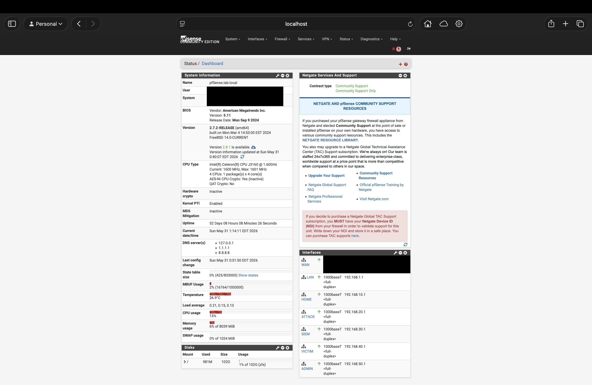

# Project 12: pfSense Firewall Hardening

## Project Status

**Status:** Complete  
**Portfolio Category:** Network Security / Firewall Administration  
**Primary Tool:** pfSense  
**Environment:** Cybersecurity Homelab

## Overview

This project focused on hardening the pfSense firewall that separates and protects the homelab environment. The goal was to move beyond basic VLAN connectivity and document the security controls that make the lab safer, more segmented, and easier to manage.

The firewall is responsible for enforcing separation between the home network, attacker network, victim network, SIEM network, and admin network. This project documents the process of reviewing firewall rules, using aliases, reducing unnecessary access, protecting management interfaces, validating blocked traffic, and confirming that approved administrative access still works.

## Lab Environment

The firewall hardening work was performed inside the existing cybersecurity homelab environment.

| Component | Purpose |
| --- | --- |
| pfSense Firewall | Core firewall and routing device for the homelab |
| Protectli Appliance | Hardware platform running pfSense |
| Netgear Managed Switch | VLAN trunking and port segmentation |
| Proxmox Server | Virtualization host for lab VMs |
| Security Onion | SIEM and network monitoring platform |
| Kali Linux | Attacker/testing system on the ATTACK VLAN |
| Victim Systems | Systems used to validate controlled lab traffic |
| Raspberry Pi Bastion | Trusted administrative access point |
| MacBook Air | Primary workstation used for browser-based management access |

## Network Segmentation

The firewall rules are built around the existing VLAN design.

| VLAN | Network Role | Purpose |
| --- | --- | --- |
| VLAN 10 | HOME | Regular home devices and wireless clients |
| VLAN 20 | ATTACK | Kali Linux and offensive testing systems |
| VLAN 30 | SIEM | Security Onion management and monitoring |
| VLAN 40 | VICTIM | Target systems used for detection and validation projects |
| VLAN 50 | ADMIN | Management systems, bastion access, Proxmox, iDRAC, and firewall administration |

## Objectives

- Review existing pfSense firewall rules for each VLAN.
- Use firewall aliases to simplify rule management.
- Confirm that management access is restricted to trusted administrative systems.
- Reduce unnecessary inter-VLAN communication.
- Validate that home devices cannot freely access lab networks.
- Validate that attacker systems cannot access firewall or management interfaces.
- Confirm that required access paths still work through the Raspberry Pi bastion and approved admin path.
- Capture evidence showing firewall rules, aliases, blocked traffic, and successful administrative access.
- Document the final firewall hardening state in a repeatable portfolio format.

## Tools and Technologies

- pfSense Community Edition
- VLANs
- Firewall aliases
- Inter-VLAN firewall rules
- ICMP testing
- Netcat
- SSH
- Tailscale / bastion access path
- Security Onion
- Kali Linux
- Proxmox
- Managed switch trunking

## Firewall Alias Design

Firewall aliases were used to make rules easier to read, manage, and document. Instead of relying only on raw IP addresses, important management systems and protected network ranges were assigned descriptive names.

| Alias | Purpose |
| --- | --- |
| `ADMIN_PI5` | Raspberry Pi bastion host used for trusted administrative access |
| `PFSENSE_ADMIN` | pfSense admin interface |
| `PROXMOX_HOST` | Proxmox management interface |
| `IDRAC_HOST` | Dell server iDRAC management interface |
| `MANAGED_SWITCH` | Managed switch web interface |
| `SECURITY_ONION_MGMT` | Security Onion management interface |
| `VICTIM_HOST` | Victim host used for lab validation |
| `RFC1918_Private_Networks` | Private IPv4 ranges used to block unauthorized internal/lateral movement |


## Firewall Rule Review

### HOME VLAN Rules

The HOME VLAN was configured to allow DNS and internet access while blocking access to the pfSense firewall services and unauthorized private/internal networks. This prevents regular home devices from freely accessing lab infrastructure.


### ATTACK VLAN Rules

The ATTACK VLAN was configured to allow Kali Linux to reach approved victim systems for lab testing while blocking access to pfSense firewall services and unauthorized internal networks. This allows controlled offensive testing without exposing management infrastructure.


### SIEM VLAN Rules

The SIEM VLAN was configured to allow DNS and internet access while blocking unnecessary access to pfSense firewall services and unauthorized private/internal networks. Security Onion management access is handled through the trusted admin path rather than being broadly exposed.


### VICTIM VLAN Rules

The VICTIM VLAN was configured to allow DNS and internet access while blocking access to pfSense firewall services and unauthorized private/internal networks. This helps prevent victim systems from becoming a path into management infrastructure.


### ADMIN VLAN Rules

The ADMIN VLAN rules were hardened around the Raspberry Pi bastion. The Pi is allowed to reach specific management services such as pfSense, Proxmox, Security Onion, the managed switch, iDRAC, and SSH to the victim host. A final block rule denies all other Admin VLAN traffic.


## Validation

### Approved Admin Access

Approved administrative access was validated by successfully reaching the pfSense dashboard through the trusted management path. This confirms that firewall hardening did not break legitimate administration.



### Blocked Management Access from ATTACK VLAN

Blocked access was tested from the Kali attacker system on the ATTACK VLAN. Kali attempted to reach protected Admin VLAN resources, including Proxmox, iDRAC, and the managed switch. The connection attempts timed out, confirming that unauthorized management access was denied.

Test examples:

```bash
ping -c 2 192.168.50.10
nc -nvvz -w 2 192.168.50.10 8006
nc -nvvz -w 2 192.168.50.20 443
nc -nvvz -w 2 192.168.50.2 80
```


### Firewall Log Validation

pfSense firewall logs confirmed that traffic from the ATTACK VLAN source `192.168.20.100` was blocked when attempting to reach Admin VLAN management systems. The logs show denied traffic to protected destinations including Proxmox, iDRAC, the managed switch, and pfSense.


## Evidence Summary

| Evidence Item | Description | Link |
| --- | --- | --- |
| Firewall aliases | Shows aliases for management hosts and private network blocking | [View Evidence](evidence/01-pfsense-firewall-aliases.png) |
| HOME VLAN rules | Shows HOME VLAN DNS, internal-blocking, internet, and default-block rules | [View Evidence](evidence/02-home-vlan-rules.png) |
| ATTACK VLAN rules | Shows controlled ATTACK-to-VICTIM access and blocked internal access | [View Evidence](evidence/03-attacker-vlan-rules.png) |
| SIEM VLAN rules | Shows SIEM VLAN restrictions and internet access | [View Evidence](evidence/04-siem-vlan-rules.png) |
| VICTIM VLAN rules | Shows victim network restrictions and internet access | [View Evidence](evidence/05-victim-vlan-rules.png) |
| ADMIN VLAN rules | Shows Pi-bastion-based management access and final block rule | [View Evidence](evidence/06-admin-vlan-rules.png) |
| Approved admin access | Shows successful access to the pfSense dashboard through the trusted path | [View Evidence](evidence/07-approved-admin-access.png) |
| Blocked management access | Shows Kali ATTACK VLAN management access attempts timing out | [View Evidence](evidence/08-blocked-management-access.png) |
| Firewall denied logs | Shows pfSense blocking ATTACK VLAN traffic to Admin VLAN targets | [View Evidence](evidence/09-firewall-log-denied-traffic.png) |

## Results

The firewall hardening was successful. The final rule set enforces the following behavior:

- The HOME VLAN can reach DNS and the internet but cannot freely access lab networks.
- The ATTACK VLAN can reach the VICTIM VLAN for controlled lab testing.
- The ATTACK VLAN is blocked from pfSense firewall services and unauthorized private/internal networks.
- The SIEM VLAN is restricted from unnecessary internal access.
- The VICTIM VLAN is prevented from accessing management infrastructure.
- The ADMIN VLAN uses the Raspberry Pi bastion as the trusted source for specific management services.
- pfSense logs confirm that unauthorized ATTACK VLAN traffic to Admin VLAN resources is blocked.

## Skills Demonstrated

- pfSense firewall administration
- Firewall alias design
- VLAN-based network segmentation
- Inter-VLAN access control
- Management plane protection
- Bastion-based administrative access
- Firewall rule ordering
- Traffic validation using `ping` and `nc`
- Firewall log analysis
- Evidence-based cybersecurity documentation
- Defensive network architecture

## Lessons Learned

This project reinforced the importance of firewall rule order, explicit allow rules, and logged block rules. The ATTACK VLAN rule order was especially important because Kali needed controlled access to the VICTIM VLAN while still being blocked from protected internal and management networks.

A key takeaway was that pfSense block rules must have logging enabled if their denied traffic needs to appear clearly in the firewall logs. After enabling logging on the ATTACK VLAN block rules, the firewall logs provided strong evidence that unauthorized management access was being denied.

The project also demonstrated why aliases are useful in firewall administration. Named aliases made the rule base easier to read and made the final documentation more professional.

## Project Completion Criteria

- [x] Firewall rules reviewed for each VLAN.
- [x] Firewall aliases documented.
- [x] Management access restricted to approved systems.
- [x] Unauthorized ATTACK VLAN access blocked.
- [x] Approved admin access validated.
- [x] Firewall logs captured showing denied traffic.
- [x] Evidence screenshots captured and linked.
- [x] README updated with final results and lessons learned.

## Next Steps

This hardened firewall configuration supports future projects involving controlled attack paths, SIEM detections, vulnerability scanning, incident response validation, and more advanced network monitoring.