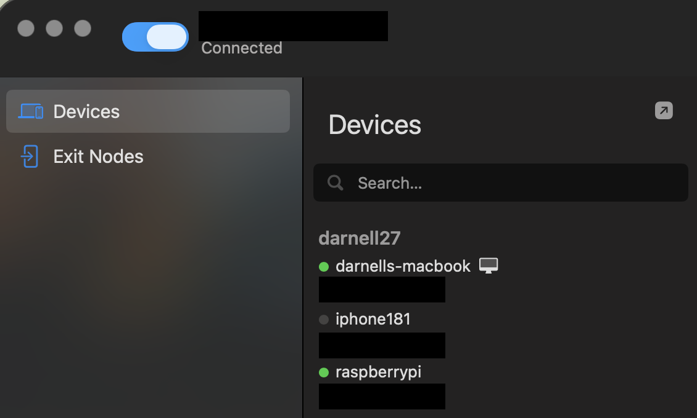
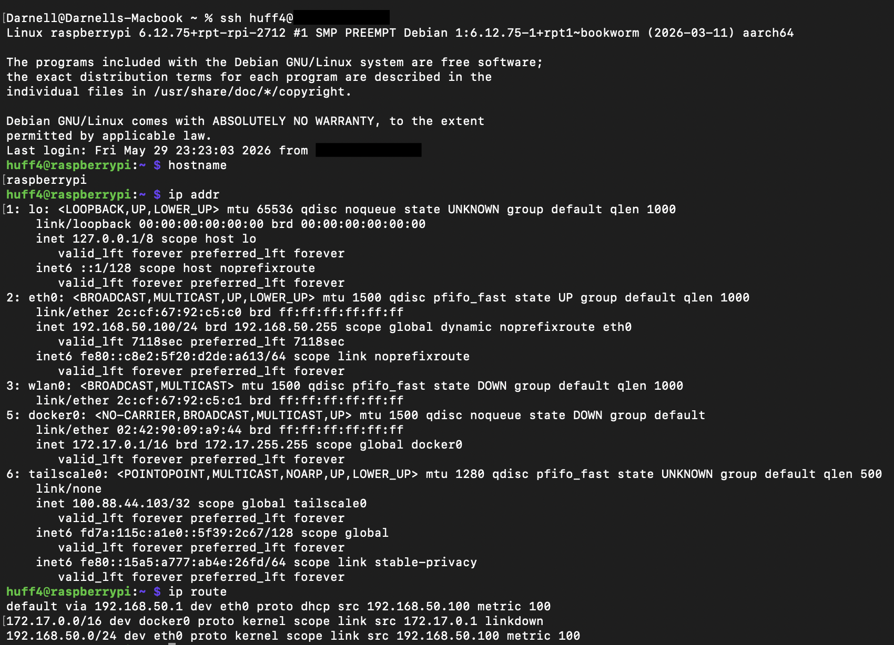
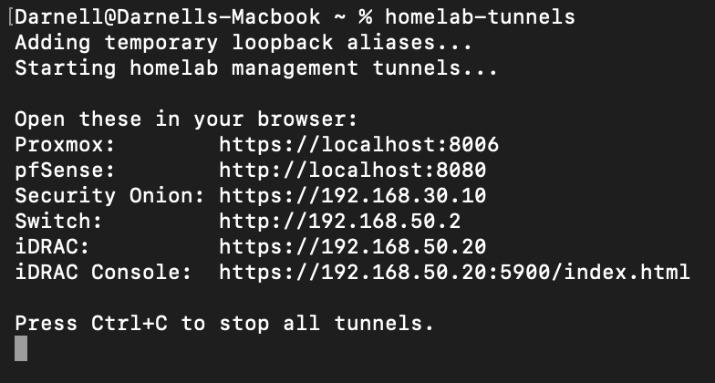
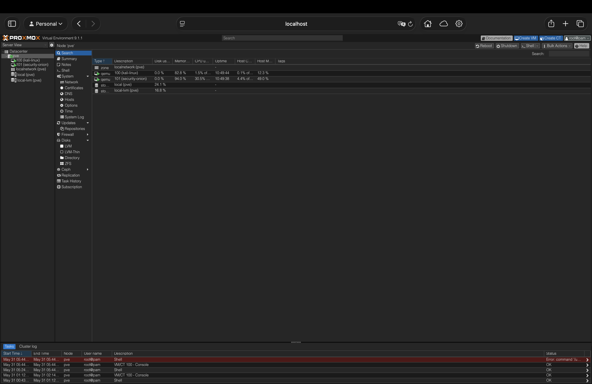
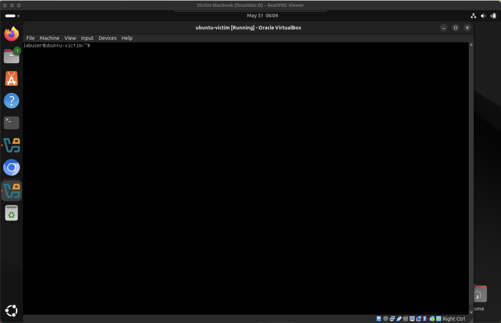
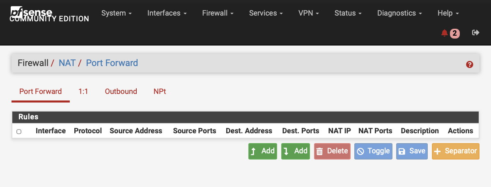

# Project 13: Bastion Host and Tailscale Remote Access

## Objective

This project documents the deployment of a secure remote-access path into the cybersecurity homelab using a Raspberry Pi 5 as a bastion host and Tailscale as the private access overlay. The goal of this project is to avoid exposing lab services directly to the internet while still allowing secure remote administration of critical systems from a trusted workstation.

The bastion host provides a controlled entry point into the Admin VLAN, while Tailscale provides encrypted remote connectivity using identity-based access. From the trusted MacBook workstation, administrative services such as pfSense, Proxmox, Security Onion, iDRAC, the managed switch, and VNC-accessible lab systems are reached through scripted SSH tunnels rather than direct public exposure.

This project strengthens the homelab by demonstrating secure remote administration, segmentation-aware access control, and practical bastion-host design.

## Validation Goals

- Deploy a Raspberry Pi 5 as a dedicated bastion host on the Admin VLAN.
- Use Tailscale to securely access the bastion host from a trusted remote workstation.
- Avoid exposing internal management services directly to the public internet.
- Use SSH tunneling to access sensitive administrative web interfaces.
- Validate access to pfSense, Proxmox, Security Onion, iDRAC, switch management, and VNC/SSH services through the bastion workflow.
- Document the access architecture, validation steps, and evidence collected.

## Business and Security Value

Secure remote administration is a common requirement for infrastructure teams, but exposing management interfaces directly to the internet creates unnecessary risk. This project demonstrates a safer remote-access model by combining a bastion host, Tailscale private overlay networking, SSH tunneling, and VLAN-based management-plane isolation.

The design keeps sensitive services such as pfSense, Proxmox, Security Onion, iDRAC, switch management, and VNC access private while still allowing controlled administration from a trusted workstation.

## Lab Environment

| Component | Role |
| --- | --- |
| Raspberry Pi 5 | Bastion host, Tailscale node, Omada controller host |
| Tailscale | Secure private overlay network for remote access |
| MacBook Air M2 | Trusted administrator workstation |
| pfSense / Protectli | Firewall and VLAN routing |
| Dell PowerEdge R730xd | Proxmox virtualization host |
| Security Onion | SIEM and network security monitoring platform |
| Netgear Managed Switch | VLAN and port-mirroring infrastructure |
| iDRAC | Out-of-band server management |
| Victim MacBook / VMs | Internal lab systems accessed through controlled paths |

## Network Placement

The bastion host is placed on the Admin VLAN so that it can reach internal management interfaces while remaining isolated from general home and lab traffic.

| VLAN | Purpose | Example Systems |
| --- | --- | --- |
| VLAN 10 | Home network | Personal devices and wireless clients |
| VLAN 20 | Attacker network | Kali Linux |
| VLAN 30 | SIEM network | Security Onion management |
| VLAN 40 | Victim network | Victim MacBook and test VMs |
| VLAN 50 | Admin / Management | Raspberry Pi bastion, Proxmox, pfSense, switch, iDRAC |

## Access Design

The remote-access design follows this general flow:

```text
Trusted MacBook
    |
    | Tailscale encrypted connection
    v
Raspberry Pi 5 Bastion Host - Admin VLAN
    |
    | SSH tunnels / internal admin access
    v
pfSense, Proxmox, Security Onion, iDRAC, Switch, VNC, SSH Targets
```

This design keeps management services private and reachable only through the authenticated Tailscale connection and bastion-host workflow.

## Security Controls Implemented

- Tailscale is used instead of direct port forwarding from the public internet.
- The Raspberry Pi 5 acts as a controlled access point into the Admin VLAN.
- Administrative interfaces remain on internal VLANs instead of being publicly exposed.
- SSH tunneling is used for sensitive web management portals.
- A reusable tunnel script starts multiple management tunnels at once and applies temporary loopback aliases for services that are easier to access by their internal IP addresses.
- Firewall rules restrict access between Home, Attacker, Victim, SIEM, and Admin VLANs.
- Access is limited to trusted administrator devices and internal management paths.

## Scope and Rules of Engagement

Testing was limited to authorized homelab systems and trusted administrator devices. No management services were exposed directly to the public internet as part of this project.

Out of scope:

- Public port forwarding for management services
- Third-party systems
- Unauthorized remote access
- Work devices or production systems
- Public internet targets

## Validation and Evidence

Bastion and Tailscale access was validated through Tailscale device verification, SSH access to the bastion, internal reachability testing, scripted tunnel execution, management interface access, VNC tunnel access, and confirmation that public management port forwarding was not configured.

| Validation Area | Result | Evidence |
|---|---|---|
| Tailscale device validation | Passed - The trusted MacBook and Raspberry Pi bastion appeared online in the Tailscale device list | [01-tailscale-devices.png](evidence/01-tailscale-devices.png) |
| SSH access over Tailscale | Passed - The MacBook successfully connected to the Raspberry Pi bastion over the Tailscale IP | [02-ssh-to-bastion-over-tailscale.png](evidence/02-ssh-to-bastion-over-tailscale.png) |
| Bastion internal reachability | Passed - The bastion reached pfSense, Proxmox, Security Onion, switch management, and iDRAC on internal management paths | [03-bastion-internal-reachability.png](evidence/03-bastion-internal-reachability.png) |
| Scripted management tunnels | Passed - The `homelab-tunnels` script started tunnels for Proxmox, pfSense, Security Onion, switch, and iDRAC access | [04-homelab-tunnel-script-running.png](evidence/04-homelab-tunnel-script-running.png) |
| Proxmox tunnel access | Passed - Proxmox was reached through the localhost SSH tunnel | [05-proxmox-tunnel-access.png](evidence/05-proxmox-tunnel-access.png) |
| pfSense tunnel access | Passed - pfSense was reached through the localhost SSH tunnel | [06-pfsense-tunnel-access.png](evidence/06-pfsense-tunnel-access.png) |
| Security Onion tunnel access | Passed - Security Onion was reached through the bastion tunnel workflow | [07-security-onion-tunnel-access.png](evidence/07-security-onion-tunnel-access.png) |
| iDRAC tunnel access | Passed - Dell iDRAC was reached through the bastion tunnel workflow | [08-idrac-tunnel-access.png](evidence/08-idrac-tunnel-access.png) |
| Switch tunnel access | Passed - Netgear switch management was reached through the bastion tunnel workflow | [09-switch-tunnel-access.png](evidence/09-switch-tunnel-access.png) |
| VNC tunnel script | Passed - The `victim-vnc` tunnel script was used to reach the victim MacBook through the Pi jump host | [10-victim-vnc-tunnel-script.png](evidence/10-victim-vnc-tunnel-script.png) |
| VNC access through bastion | Passed - RealVNC successfully reached the victim MacBook and Ubuntu victim VM through the bastion workflow | [11-victim-vnc-through-bastion.png](evidence/11-victim-vnc-through-bastion.png) |
| No public management forwarding | Passed - pfSense NAT evidence showed no public management port forwarding rules | [12-no-public-management-port-forwarding.png](evidence/12-no-public-management-port-forwarding.png) |

## Implementation Summary

The Raspberry Pi 5 was placed on the Admin VLAN and configured as the controlled bastion host for remote homelab administration. Tailscale provided private encrypted connectivity between the trusted MacBook and the Raspberry Pi without requiring public inbound port forwarding. From the MacBook, scripted SSH tunnels were used to reach internal management services including pfSense, Proxmox, Security Onion, iDRAC, and the managed switch. A separate VNC tunnel workflow provided controlled graphical access to internal lab systems. Final validation confirmed that management access worked through the bastion path and that pfSense did not expose public management port forwarding rules.

## Evidence Summary

| ID | Evidence | What It Demonstrates |
|---|---|---|
| 01 | [01-tailscale-devices.png](evidence/01-tailscale-devices.png) | Shows the trusted MacBook and Raspberry Pi bastion online in Tailscale |
| 02 | [02-ssh-to-bastion-over-tailscale.png](evidence/02-ssh-to-bastion-over-tailscale.png) | Shows a successful SSH session from the MacBook to the Raspberry Pi over the Tailscale IP |
| 03 | [03-bastion-internal-reachability.png](evidence/03-bastion-internal-reachability.png) | Shows the bastion host reaching pfSense, Proxmox, Security Onion, switch management, and iDRAC |
| 04 | [04-homelab-tunnel-script-running.png](evidence/04-homelab-tunnel-script-running.png) | Shows scripted management tunnels running for Proxmox, pfSense, Security Onion, switch, and iDRAC access |
| 05 | [05-proxmox-tunnel-access.png](evidence/05-proxmox-tunnel-access.png) | Shows Proxmox accessed through the localhost SSH tunnel |
| 06 | [06-pfsense-tunnel-access.png](evidence/06-pfsense-tunnel-access.png) | Shows pfSense accessed through the localhost SSH tunnel |
| 07 | [07-security-onion-tunnel-access.png](evidence/07-security-onion-tunnel-access.png) | Shows Security Onion accessed through the bastion tunnel workflow |
| 08 | [08-idrac-tunnel-access.png](evidence/08-idrac-tunnel-access.png) | Shows Dell iDRAC accessed through the bastion tunnel workflow |
| 09 | [09-switch-tunnel-access.png](evidence/09-switch-tunnel-access.png) | Shows Netgear managed switch accessed through the bastion tunnel workflow |
| 10 | [10-victim-vnc-tunnel-script.png](evidence/10-victim-vnc-tunnel-script.png) | Shows the VNC tunnel script running from the MacBook through the Pi jump host to the victim MacBook |
| 11 | [11-victim-vnc-through-bastion.png](evidence/11-victim-vnc-through-bastion.png) | Shows successful RealVNC access to the victim MacBook and Ubuntu victim VM through the bastion workflow |
| 12 | [12-no-public-management-port-forwarding.png](evidence/12-no-public-management-port-forwarding.png) | Shows the pfSense NAT page with no public management port forwarding rules |

## Key Evidence

The screenshots below highlight the most important bastion and Tailscale remote-access evidence while the table above preserves links to the full evidence set.

**Tailscale Device Validation**



**SSH to Bastion Over Tailscale**



**Scripted Management Tunnels**



**Proxmox Tunnel Access**



**VNC Through Bastion**



**No Public Management Port Forwarding**



## Key Findings

This project successfully establishes a secure remote-access model for the homelab. The Raspberry Pi 5 bastion host provides a single controlled access point into the Admin VLAN, while Tailscale provides encrypted access from a trusted workstation without requiring public inbound firewall rules for management services.

The completed design improves the security of the homelab by keeping administrative interfaces private, limiting access paths, and creating a repeatable workflow for remotely managing segmented infrastructure.

The final workflow uses two repeatable scripts: one script for management tunnels to Proxmox, pfSense, Security Onion, iDRAC, and the managed switch, and a second script for VNC access to the victim MacBook. This makes the remote administration process faster, more consistent, and easier to document.

## Skills Demonstrated

- Bastion host deployment
- Secure remote administration
- Tailscale private overlay networking
- SSH tunneling
- SSH jump host workflows
- Scripted remote-access automation
- VLAN-aware access control
- Firewall segmentation
- Management-plane isolation
- Secure homelab architecture
- Documentation and evidence collection

## Lessons Learned

- Bastion hosts reduce exposure by centralizing administrative access.
- Tailscale simplifies secure remote connectivity without traditional VPN complexity.
- SSH tunnels allow sensitive web interfaces to remain private while still being remotely reachable.
- Management services should remain isolated from home, attacker, and victim networks.
- Remote access should be validated from both a usability and security perspective.

## Project Status

| Area | Status |
|---|---|
| Raspberry Pi bastion placed on Admin VLAN | Complete |
| Tailscale remote access validated | Complete |
| SSH access to bastion validated | Complete |
| Bastion internal reachability validated | Complete |
| Scripted management tunnels validated | Complete |
| pfSense, Proxmox, Security Onion, iDRAC, and switch access validated | Complete |
| VNC access through bastion validated | Complete |
| Public management port forwarding review completed | Complete |
| Evidence screenshots captured and linked | Complete |

## Future Enhancements

Future improvements could include adding SSH config aliases, documenting the tunnel scripts in a dedicated scripts folder, and applying stricter Tailscale ACLs for device-level access control.