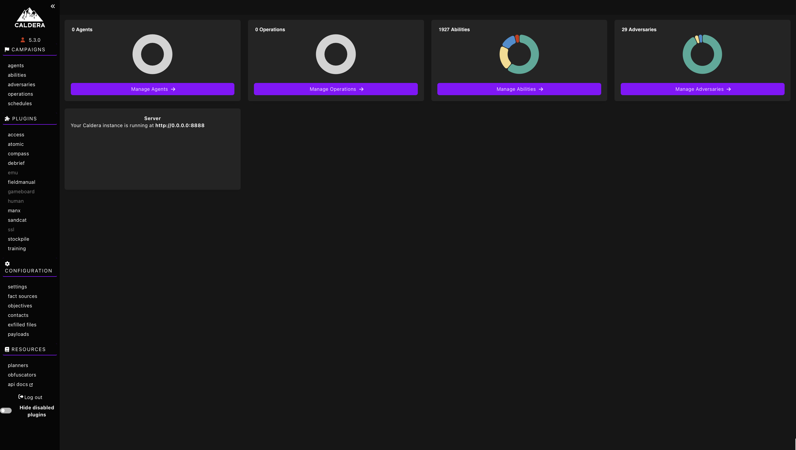
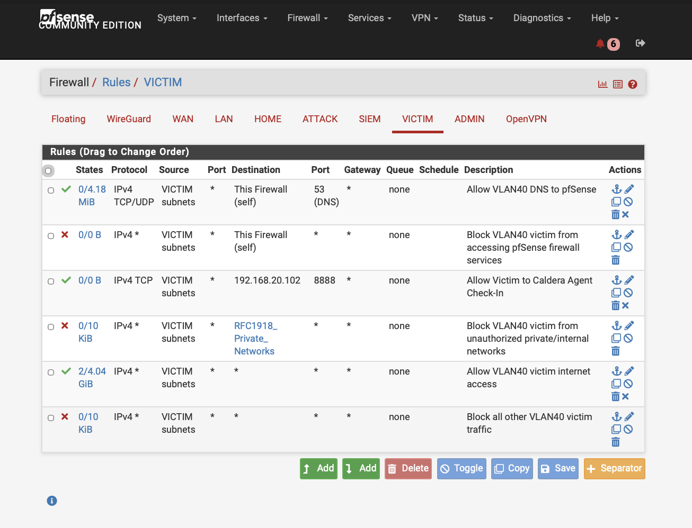
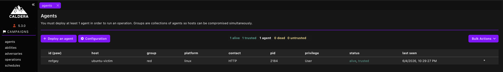
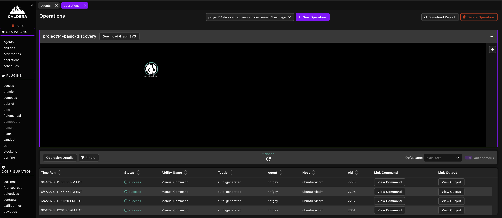
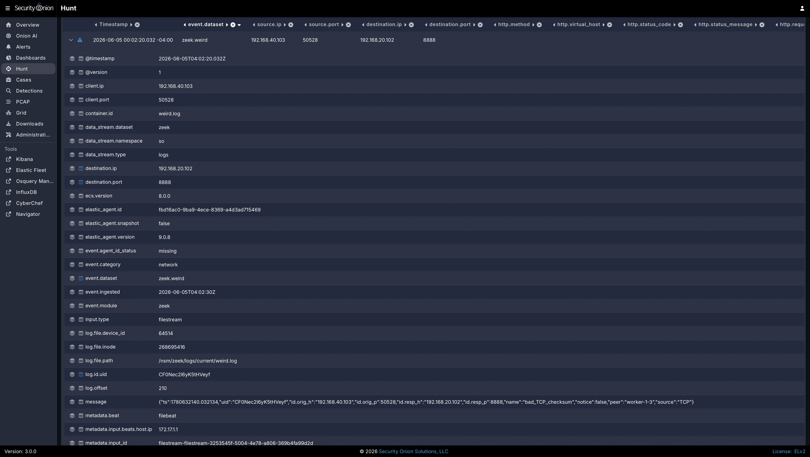

# Project 14: MITRE ATT&CK Emulation with Caldera

## Overview

This project documents the deployment of MITRE Caldera inside the segmented cybersecurity homelab and validates a controlled adversary-emulation workflow against an approved Ubuntu victim system. The goal was to deploy Caldera, establish a Sandcat agent connection, execute a safe non-destructive discovery operation, and confirm that the resulting activity was visible in Security Onion.

This project builds on earlier work involving VLAN segmentation, pfSense firewall validation, Security Onion visibility, SSH detection, vulnerability scanning, endpoint telemetry, attack-path validation, and secure bastion access. Instead of only generating manual traffic, Caldera was used to run repeatable discovery activity through an agent-based emulation workflow.

The project reinforces practical skills related to MITRE ATT&CK awareness, Caldera deployment, adversary emulation, controlled agent execution, least-privilege firewall access, SSH tunneling through a bastion host, Zeek telemetry review, Security Onion Hunt analysis, and safe attack-and-detect validation.

## Lab Environment

| Component | Purpose |
|---|---|
| MITRE Caldera | Adversary emulation platform hosted on Ubuntu Server |
| Caldera Ubuntu Server | Caldera server deployed on the attacker/testing VLAN |
| Ubuntu Victim | Approved endpoint target for the Sandcat agent and discovery operation |
| Security Onion | SIEM/NDR platform used for Hunt, Zeek logs, and traffic validation |
| pfSense | Firewall and inter-VLAN traffic control |
| Netgear Managed Switch | VLAN tagging and traffic mirroring |
| Raspberry Pi 5 | Bastion host, Omada controller, and Tailscale access point |
| M2 MacBook Air | Administrative workstation used to access Caldera through an SSH tunnel |

## Objectives

- Deploy MITRE Caldera inside the segmented homelab.
- Access the Caldera web interface through the existing Raspberry Pi bastion and SSH tunnel workflow.
- Configure a least-privilege firewall path from the victim VLAN to the Caldera server.
- Deploy a Sandcat agent to an approved Ubuntu victim system.
- Run a safe, non-destructive discovery operation.
- Validate Caldera agent communication and command execution.
- Confirm Security Onion visibility into victim-to-Caldera traffic.
- Document the activity in a consistent portfolio-ready format.

## Network / System Scope

| Item | Details |
|---|---|
| Caldera Server | `192.168.20.102` on the Attacker VLAN |
| Ubuntu Victim | `192.168.40.103` on the Victim VLAN |
| Caldera Web/API Port | TCP `8888` |
| MacBook Tunnel Port | Localhost TCP `8222` |
| Caldera Dashboard Access | `http://localhost:8222` from the MacBook through the Raspberry Pi bastion |
| Agent Callback Address | `http://192.168.20.102:8888` |
| Firewall Access | Victim-to-Caldera TCP `8888` allowed; broader private-network access remained restricted |
| Monitoring Platform | Security Onion Hunt and Zeek telemetry |
| Validation Method | Server deployment, dependency installation, tunnel access, victim preparation, firewall rule validation, Sandcat check-in, Caldera operation execution, and Security Onion Hunt review |

## Implementation Summary

An Ubuntu Server VM named `caldera` was deployed on the attacker/testing VLAN with IP address `192.168.20.102`. Required packages were installed, the Caldera repository was cloned, and a reusable startup script was created so the Caldera service could be started consistently.

The Caldera web interface was not exposed directly to the home network. Instead, the MacBook accessed Caldera through an SSH tunnel using the Raspberry Pi bastion host. The local MacBook tunnel forwarded `localhost:8222` to the Caldera server on TCP `8888`.

The Ubuntu victim at `192.168.40.103` was prepared as the approved endpoint target. A pfSense rule allowed the victim VLAN to reach only the Caldera server on TCP `8888` for agent check-in. ICMP remained blocked while TCP application access succeeded, confirming a least-privilege design.

A Sandcat agent was launched from the Ubuntu victim and successfully checked in to Caldera. A safe manual discovery operation named `project14-basic-discovery` was then executed using non-destructive commands to collect hostname, user, kernel, and network/interface information.

Security Onion Hunt confirmed visibility into the victim-to-Caldera traffic. Zeek telemetry showed HTTP, connection, file, DNS, software, and weird logs, with the strongest evidence showing HTTP POST traffic from the victim to the Caldera server over TCP `8888` with successful `200 OK` responses.

## Emulation Workflow

The completed Caldera workflow followed a controlled attack-and-detect pattern:

```text
MacBook Admin Workstation
        |
        | SSH tunnel through Raspberry Pi bastion
        v
Caldera Server on VLAN 20 - 192.168.20.102:8888
        |
        | Sandcat agent callback over TCP 8888
        v
Ubuntu Victim on VLAN 40 - 192.168.40.103
        |
        | Mirrored traffic / Zeek telemetry
        v
Security Onion Hunt and flow review
```

This workflow validated that the existing segmentation, bastion access model, firewall rule structure, and monitoring stack could support safe adversary-emulation activity.

## Caldera Operation Summary

| Stage | Activity | Result |
|---|---|---|
| Server Deployment | Caldera deployed on Ubuntu Server in VLAN 20 | Successful |
| Tunnel Access | MacBook accessed Caldera through Raspberry Pi bastion tunnel | Successful |
| Victim Preparation | Ubuntu victim confirmed at `192.168.40.103` | Successful |
| Firewall Access | Victim allowed to reach Caldera on TCP `8888` only | Successful |
| Agent Deployment | Sandcat agent launched from the Ubuntu victim | Successful |
| Operation Execution | Safe manual discovery operation executed | Successful |
| Monitoring Review | Security Onion Hunt showed Zeek telemetry for victim-to-Caldera communication | Successful |

## Evidence

| # | Evidence | Description |
|---|---|---|
| 01 | [Caldera Ubuntu Server Installed on VLAN 20](evidence/01-caldera-ubuntu-installed-vlan20.png) | Shows the Caldera Ubuntu server deployed on VLAN 20. |
| 02 | [Caldera Dependencies Installed](evidence/02-caldera-dependencies-installed.png) | Shows required Caldera dependencies installed. |
| 03 | [Caldera Repository Cloned](evidence/03-caldera-repository-cloned.png) | Shows the Caldera repository cloned locally. |
| 04 | [Caldera Start Script Created](evidence/04-caldera-start-script-created.png) | Shows the reusable Caldera startup script. |
| 05 | [Caldera Server Running](evidence/05-caldera-server-running.png) | Shows the Caldera server running successfully. |
| 06 | [Caldera Tunnel Script Created](evidence/06-caldera-tunnel-script-created.png) | Shows the MacBook tunnel script used to access Caldera through the bastion. |
| 07 | [Caldera Dashboard](evidence/07-caldera-dashboard.png) | Shows the Caldera web dashboard accessed through the local tunnel. |
| 08 | [Victim System Prepared](evidence/08-victim-system-prepared.png) | Shows the approved Ubuntu victim system prepared for the Caldera agent. |
| 09 | [pfSense Victim-to-Caldera Rule](evidence/09-pfsense-victim-to-caldera-rule.png) | Shows the pfSense rule allowing controlled victim-to-Caldera TCP `8888` access. |
| 10 | [Victim-to-Caldera Connectivity](evidence/10-victim-to-caldera-connectivity.png) | Shows TCP `8888` connectivity from the victim to Caldera while ICMP remained blocked. |
| 11 | [Caldera Agent Command on Victim](evidence/11-caldera-agent-command-on-victim.png) | Shows the Caldera Sandcat agent command executed on the Ubuntu victim. |
| 12 | [Caldera Agent Check-In](evidence/12-caldera-agent-check-in.png) | Shows the Caldera agent successfully checked in to the server. |
| 13 | [Basic Operation Configured](evidence/13-basic-operation-configured.png) | Shows the safe discovery operation configuration. |
| 14 | [Basic Operation Completed](evidence/14-basic-operation-completed.png) | Shows the discovery operation completed successfully. |
| 15 | [Basic Operation Command Output](evidence/15-basic-operation-command-output.png) | Shows command output and facts collected from the victim. |
| 16 | [Security Onion Caldera IP Hunt](evidence/16-security-onion-caldera-ip-hunt.png) | Shows Security Onion Hunt results for the Caldera server IP. |
| 17 | [Security Onion Victim IP Hunt](evidence/17-security-onion-victim-ip-hunt.png) | Shows Security Onion Hunt results for the Ubuntu victim IP. |
| 18 | [Security Onion Flow Evidence](evidence/18-security-onion-flow-or-pcap-evidence.png) | Shows detailed victim-to-Caldera flow evidence in Security Onion. |

## Key Evidence

### Caldera Dashboard Through Tunnel



This screenshot shows the Caldera dashboard accessed through the MacBook localhost tunnel and Raspberry Pi bastion workflow.

### Controlled Victim-to-Caldera Firewall Rule



This screenshot shows the pfSense rule allowing the Ubuntu victim to reach the Caldera server on TCP `8888` while keeping broader access restricted.

### Caldera Agent Check-In



This screenshot shows the Sandcat agent successfully checking in to the Caldera server from the approved Ubuntu victim.

### Basic Discovery Operation Completed



This screenshot shows the safe discovery operation completed successfully against the approved victim system.

### Basic Operation Command Output


This screenshot shows command output and host facts collected from the Ubuntu victim during the safe discovery operation.

### Security Onion Flow Evidence



This screenshot shows victim-to-Caldera traffic in Security Onion, including Zeek visibility into TCP `8888` HTTP communication.

## Validation

MITRE Caldera emulation was validated through Caldera server deployment, dependency installation, repository setup, tunnel-based dashboard access, victim preparation, least-privilege firewall access, Sandcat agent check-in, non-destructive operation execution, and Security Onion visibility review.

Validation confirmed the following:

- The Caldera Ubuntu server was deployed on VLAN 20 with IP `192.168.20.102`.
- Required Caldera dependencies were installed on the Ubuntu server.
- The Caldera repository was cloned and prepared for use.
- A reusable Caldera start script was created and the server started successfully.
- Caldera was accessed from the MacBook through the Raspberry Pi bastion tunnel.
- The Ubuntu victim was confirmed on the victim VLAN with IP `192.168.40.103`.
- pfSense allowed victim-to-Caldera TCP `8888` while ICMP remained blocked.
- The Caldera Sandcat agent launched from the Ubuntu victim and checked in successfully.
- A safe discovery operation was configured, executed, and completed successfully.
- Security Onion Hunt showed Caldera and victim traffic, including Zeek telemetry for TCP `8888` HTTP communication.

## Challenges and Lessons Learned

This project reinforced the importance of safe boundaries when performing adversary emulation. Caldera was used only inside the isolated homelab, the agent was deployed only to the approved Ubuntu victim, and the operation was limited to non-destructive discovery commands.

The project also showed the value of least-privilege firewall access. The victim did not need broad inter-VLAN access to communicate with Caldera. A single specific rule allowing TCP `8888` to the Caldera server was enough for the agent to check in and return results.

Several practical lessons came from the deployment process. Caldera exposed multiple listening ports, and the working web UI path required tunneling to TCP `8888` rather than TCP `2222`. A reusable MacBook tunnel script simplified access, and the server-side start script made it easier to restart Caldera consistently. A `curl -I` test returned `405 Method Not Allowed`, but the response still proved TCP connectivity because the Caldera server replied and indicated allowed methods.

Security Onion provided useful visibility into the agent traffic through Zeek HTTP, connection, file, software, and weird logs. The observed Zeek `weird` event with checksum-related messaging was likely influenced by virtualization, checksum offload, or mirrored traffic behavior and did not prevent visibility.

## Security Relevance

This project demonstrates how adversary emulation supports detection engineering and blue-team validation. Caldera provides a repeatable way to simulate ATT&CK-style behaviors, execute controlled commands, and observe the resulting telemetry in tools such as Security Onion.

The project also demonstrates why controlled emulation should be paired with segmentation and monitoring. Agent communication, command execution, and result traffic should be intentionally scoped, observable, and documented so defenders can understand what happened and how it appeared in logs.

## Business Value

This project provides business value by showing how a security team can safely validate detection coverage using controlled adversary emulation. Instead of waiting for real attacker behavior, teams can generate known activity, verify monitoring visibility, and improve detection logic in a controlled way.

In an enterprise environment, this type of work helps teams:

- Validate detection coverage for ATT&CK-style activity.
- Safely test security monitoring tools without destructive behavior.
- Improve collaboration between SOC, firewall, endpoint, and infrastructure teams.
- Confirm whether segmentation supports approved testing while blocking unnecessary access.
- Build repeatable attack-and-detect workflows.
- Support incident response exercises and detection engineering improvements.

## Portfolio Summary

This project successfully introduced MITRE Caldera into the homelab and validated that it can support controlled adversary-emulation activity. A Sandcat agent was deployed to an approved Ubuntu victim, a safe discovery operation was executed, and Security Onion confirmed visibility into the resulting victim-to-Caldera traffic.

The project confirmed that the existing segmentation, firewall rule structure, bastion access model, and Security Onion monitoring design can support safe attack simulation and blue-team analysis. It adds adversary emulation, ATT&CK-aligned testing preparation, agent-based command execution, and detection-engineering readiness to the broader homelab portfolio.