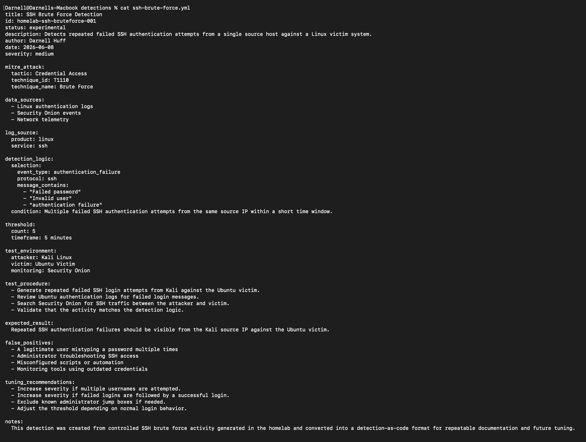
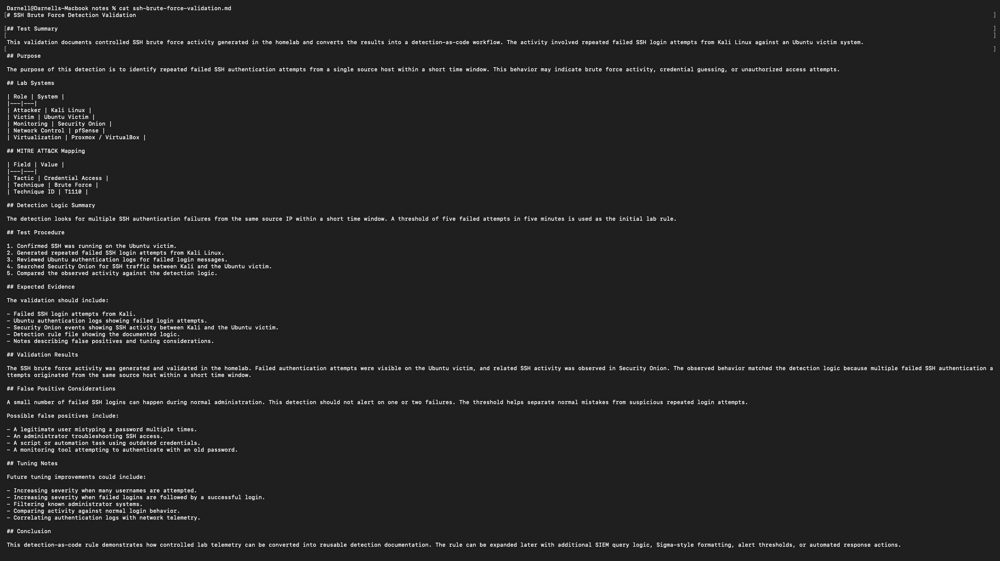
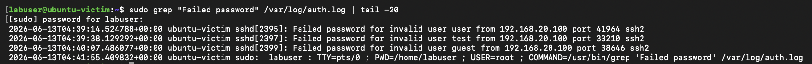
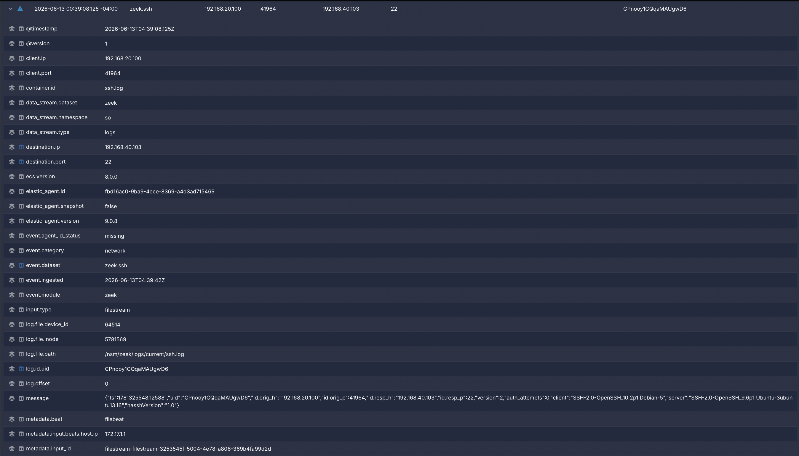
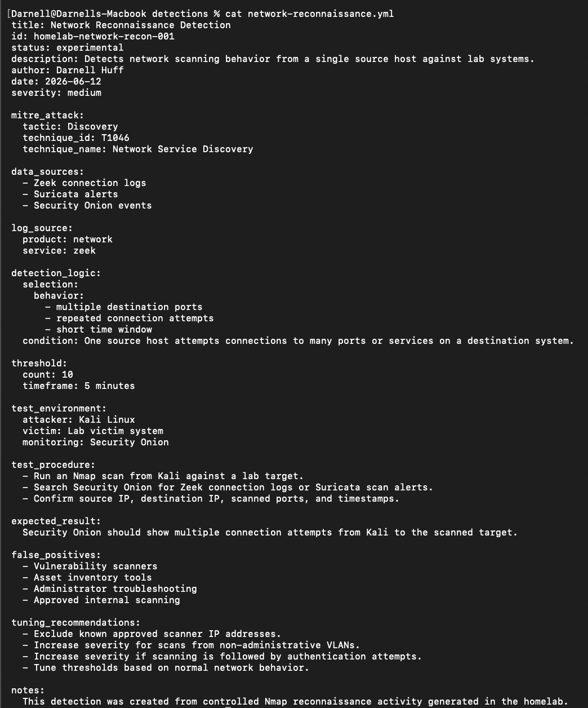
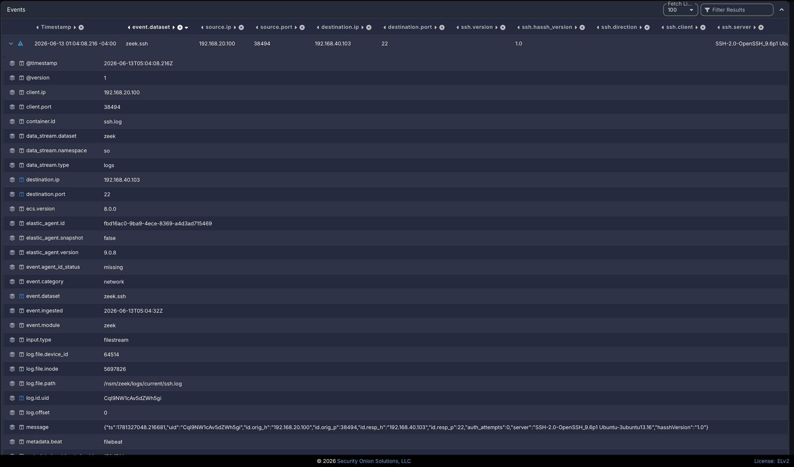

# Project 15: Detection-as-Code Rule Development

## Overview

This project demonstrates a detection-as-code workflow inside the cybersecurity homelab. Instead of creating security detections as one-off searches inside a SIEM, this project documents detections as structured rule files that can be reviewed, tested, tuned, and version-controlled.

The project focuses on two controlled attacker behaviors generated in the lab: SSH brute-force activity and network reconnaissance. Each behavior was mapped to MITRE ATT&CK, translated into detection logic, validated against lab telemetry, and documented with false-positive and tuning considerations.

The project reinforces practical skills related to detection engineering, detection-as-code documentation, SIEM validation, Linux authentication log review, network telemetry analysis, MITRE ATT&CK mapping, false-positive analysis, rule tuning, and GitHub-based version control.

## Lab Environment

| Component | Purpose |
|---|---|
| Kali Linux | Generates SSH brute-force and reconnaissance activity |
| Ubuntu Victim | Receives SSH login attempts and produces authentication logs |
| Security Onion | Provides network visibility, event search, Zeek telemetry, and validation evidence |
| pfSense | Segments lab VLANs and controls traffic between systems |
| Proxmox | Hosts core lab infrastructure and virtual machines |
| GitHub | Stores detection files, notes, screenshots, and documentation |

## Objectives

- Create a structured detection-as-code workflow.
- Write reusable detection files for common attacker behaviors.
- Validate detections using controlled lab-generated activity.
- Map detections to MITRE ATT&CK techniques.
- Document expected telemetry, false positives, and tuning recommendations.
- Show how Security Onion and endpoint logs can support detection engineering.
- Build a foundation for future detections involving Caldera, Active Directory, honeypots, and automated response logic.

## Network / System Scope

| Item | Details |
|---|---|
| Attacker System | Kali Linux |
| Victim System | Ubuntu victim |
| Monitoring Platform | Security Onion |
| Endpoint Log Source | Ubuntu authentication logs |
| Network Log Sources | Zeek, Suricata, and Security Onion Hunt data |
| Detection Format | Structured YAML-style rule documentation |
| Version Control | GitHub repository documentation and evidence |
| Detection Use Cases | SSH brute force and network reconnaissance |
| MITRE ATT&CK Techniques | T1110 Brute Force and T1046 Network Service Discovery |
| Validation Method | Controlled attacker activity, endpoint log review, Security Onion event review, detection rule review, and tuning documentation |

## Implementation Summary

The detection-as-code workflow began by selecting two common attacker behaviors that had already been generated and validated in earlier homelab projects: SSH brute-force activity and Nmap-based network reconnaissance. Each behavior was mapped to MITRE ATT&CK and documented as a structured detection rule.

The SSH brute-force detection used repeated failed SSH authentication attempts from Kali against the Ubuntu victim. Validation evidence included the detection rule file, validation notes, Ubuntu SSH service status, Kali failed SSH attempts, Ubuntu authentication logs, and Security Onion SSH event details.

The network reconnaissance detection used Nmap scan activity from Kali against a lab target. Validation evidence included the reconnaissance rule file, Kali scan output, Security Onion Hunt results, and detailed reconnaissance-related event fields.

Both detections included logic summaries, expected data sources, validation steps, false-positive considerations, and tuning recommendations. This created a repeatable process for moving from lab-generated activity to documented detection logic.

## Detection-as-Code Workflow

Detection-as-code means security detections are managed like code. A detection should have a clear purpose, defined logic, known data sources, validation steps, expected results, and tuning notes.

```text
Controlled attacker behavior
        |
        | map behavior to MITRE ATT&CK
        v
Structured detection rule file
        |
        | validate against endpoint and network telemetry
        v
Security Onion / Ubuntu logs
        |
        | document false positives and tuning notes
        v
Version-controlled detection-as-code evidence
```

This approach makes detections easier to review, improve, reuse, and explain. It also creates stronger documentation because the rule is not only represented as a SIEM search or alert; it is tied to a repeatable engineering process.

## Detection Coverage

| Detection | Behavior | Data Sources | MITRE ATT&CK Mapping |
|---|---|---|---|
| SSH Brute Force Detection | Multiple failed SSH login attempts from Kali to the Ubuntu victim | Ubuntu auth logs and Security Onion events | T1110 - Brute Force |
| Network Reconnaissance Detection | Nmap scan activity from Kali against a lab target | Zeek, Suricata, and Security Onion events | T1046 - Network Service Discovery |

## Detection 1: SSH Brute Force

### Objective

Detect repeated failed SSH authentication attempts from a single source host against a Linux victim system.

### ATT&CK Mapping

| Field | Value |
|---|---|
| Tactic | Credential Access |
| Technique | Brute Force |
| Technique ID | T1110 |

### Detection Logic Summary

The detection looks for multiple failed SSH authentication attempts from the same source IP within a short time window. A threshold is used to avoid alerting on normal user mistakes, such as one or two incorrect password attempts.

### Validation Method

- Confirm SSH is running on the Ubuntu victim.
- Generate repeated failed SSH login attempts from Kali Linux.
- Review Ubuntu authentication logs for failed login messages.
- Search Security Onion for SSH traffic between Kali and the Ubuntu victim.
- Confirm that the activity matches the detection logic.

### Expected Result

The Ubuntu victim should show failed SSH authentication attempts in its logs, and Security Onion should show SSH traffic between the Kali attacker and Ubuntu victim.

### False Positive Considerations

- A legitimate user mistyping a password multiple times.
- Administrator troubleshooting SSH access.
- Misconfigured scripts or automation.
- Monitoring tools using outdated credentials.

### Tuning Recommendations

- Increase severity if multiple usernames are attempted.
- Increase severity if failed logins are followed by a successful login.
- Exclude approved administrator jump boxes if needed.
- Adjust thresholds based on normal authentication behavior.

## Detection 2: Network Reconnaissance

### Objective

Detect network scanning activity from a single source host against a lab target.

### ATT&CK Mapping

| Field | Value |
|---|---|
| Tactic | Discovery |
| Technique | Network Service Discovery |
| Technique ID | T1046 |

### Detection Logic Summary

The detection looks for one source host attempting connections to multiple ports or services on a destination system within a short time window. This behavior is commonly associated with scanning or service discovery.

### Validation Method

- Run an Nmap scan from Kali Linux against a lab target.
- Search Security Onion for network events between the Kali host and target system.
- Review event details for source IP, destination IP, protocol, ports, and timestamps.
- Confirm that the observed behavior matches the detection logic.

### Expected Result

Security Onion should show multiple connection attempts from Kali to the scanned target. Depending on the scan type and available telemetry, the activity may appear in Zeek connection logs, Suricata alerts, or general Security Onion event data.

### False Positive Considerations

- Approved vulnerability scanners.
- Asset inventory tools.
- Administrator troubleshooting.
- Internal monitoring or discovery tools.

### Tuning Recommendations

- Exclude known approved scanner IP addresses.
- Increase severity for scanning from non-administrative VLANs.
- Increase severity if scanning is followed by authentication attempts.
- Tune thresholds based on normal network behavior.

## Evidence

| # | Evidence | Description |
|---|---|---|
| 01 | [SSH Brute Force Rule File](evidence/01-ssh-brute-force-rule-file.png) | Shows the SSH brute-force detection rule file, including MITRE mapping, detection logic, threshold, false positives, and tuning notes. |
| 02 | [SSH Brute Force Validation Notes](evidence/02-ssh-brute-force-validation-notes.png) | Shows validation notes documenting the test summary, expected evidence, validation result, and tuning considerations. |
| 03 | [Ubuntu Victim SSH Service](evidence/03-ubuntu-victim-ssh-service.png) | Confirms the Ubuntu victim IP address and verifies that the SSH service was active and listening. |
| 04 | [Kali Failed SSH Attempts](evidence/04-kali-failed-ssh-attempts.png) | Shows failed SSH login attempts generated from Kali against the Ubuntu victim. |
| 05 | [Ubuntu Auth Log Failures](evidence/05-ubuntu-auth-log-failures.png) | Shows Ubuntu authentication logs recording failed login attempts from the Kali source IP. |
| 06 | [Security Onion SSH Events](evidence/06-security-onion-ssh-events.png) | Shows Security Onion Hunt results for SSH activity between Kali and the Ubuntu victim. |
| 07 | [Security Onion SSH Event Details](evidence/07-security-onion-ssh-event-details.png) | Shows detailed Zeek SSH event fields, including source IP, destination IP, destination port, and SSH metadata. |
| 08 | [Network Reconnaissance Rule File](evidence/08-network-reconnaissance-rule-file.png) | Shows the network reconnaissance detection rule file with MITRE T1046 mapping and detection logic. |
| 09 | [Kali Nmap Scan](evidence/09-kali-nmap-scan.png) | Shows an Nmap service scan from Kali against the Ubuntu victim. |
| 10 | [Security Onion Recon Events](evidence/10-security-onion-recon-events.png) | Shows Security Onion Hunt results containing high-volume Zeek connection activity from Kali to the victim after the scan. |
| 11 | [Security Onion Recon Event Details](evidence/11-security-onion-recon-event-details.png) | Shows detailed Security Onion event fields for reconnaissance-related network telemetry. |

## Key Evidence

### SSH Brute Force Rule File



This screenshot shows the structured SSH brute-force detection rule with MITRE mapping, detection logic, thresholds, false-positive considerations, and tuning notes.

### SSH Brute Force Validation Notes



This screenshot shows the validation notes used to connect the detection rule to the expected telemetry and lab-generated activity.

### Ubuntu Authentication Log Failures



This screenshot shows endpoint authentication evidence for failed SSH login attempts from the Kali source IP.

### Security Onion SSH Event Details



This screenshot shows detailed Security Onion/Zeek SSH event fields that support detection validation.

### Network Reconnaissance Rule File



This screenshot shows the structured network reconnaissance rule file with MITRE T1046 mapping and detection logic.

### Security Onion Reconnaissance Event Details



This screenshot shows detailed reconnaissance-related network telemetry from Security Onion after the Nmap scan.

## Validation

Detection-as-code rule development was validated through structured rule files, controlled attacker activity, endpoint authentication logs, Security Onion telemetry, validation notes, MITRE mapping, false-positive review, and tuning documentation.

Validation confirmed the following:

- SSH brute-force activity was successfully generated from Kali against the Ubuntu victim.
- Ubuntu authentication logs confirmed failed login attempts from the Kali source IP.
- Security Onion showed SSH-related Zeek telemetry between Kali and the Ubuntu victim.
- The SSH brute-force rule included MITRE T1110 mapping, logic summary, thresholding, false positives, and tuning notes.
- Nmap reconnaissance generated high-volume connection telemetry visible in Security Onion.
- Security Onion showed reconnaissance-related Zeek connection activity and detailed event fields.
- The network reconnaissance rule included MITRE T1046 mapping, logic summary, false positives, and tuning notes.
- Endpoint logs and network telemetry provided complementary evidence for detection validation.
- Structured rule files made the detections easier to review, tune, and reuse.

## Challenges and Lessons Learned

This project reinforced that detection engineering is more than writing an alert. A strong detection requires a clear objective, reliable data sources, validation evidence, false-positive awareness, documented tuning recommendations, and a repeatable testing method.

The SSH brute-force detection demonstrated how endpoint authentication logs and Security Onion network telemetry can be used together to validate repeated failed login activity. The network reconnaissance detection demonstrated how scanning behavior can produce a large number of observable connection events even when only a small number of services are open on the target.

A key lesson was that detections are easier to improve when the logic, validation steps, expected results, false positives, and tuning guidance are documented together. This creates a stronger foundation for future detection engineering work than storing screenshots or SIEM searches alone.

## Security Relevance

This project demonstrates how detection-as-code supports real-world detection engineering and SOC maturity. Treating detections as version-controlled artifacts helps teams review logic, test against known activity, tune false positives, and preserve institutional knowledge.

The project also demonstrates why detections should be mapped to known attacker behaviors. MITRE ATT&CK mapping helps connect lab activity to real-world tactics and techniques, making the detections easier to explain and prioritize.

## Business Value

This project provides business value by showing how detection engineering can become more repeatable, reviewable, and maintainable. Detection-as-code improves consistency and reduces reliance on undocumented one-off SIEM searches.

In an enterprise environment, this type of work helps teams:

- Standardize detection logic and documentation.
- Improve detection review and tuning processes.
- Preserve knowledge about data sources, expected behavior, and false positives.
- Validate detections against known controlled activity.
- Map detections to ATT&CK techniques for reporting and prioritization.
- Support version control, peer review, and long-term detection maintenance.

## Portfolio Summary

This project demonstrates a detection engineering workflow using controlled attacker activity, structured detection files, and SIEM validation. SSH brute-force and Nmap reconnaissance activity were generated from Kali Linux, validated through Ubuntu authentication logs and Security Onion telemetry, and documented as reusable detection-as-code rules with MITRE ATT&CK mapping, false-positive considerations, and tuning recommendations.

The project adds detection-as-code, version-controlled rule documentation, validation methodology, and detection-tuning awareness to the broader homelab portfolio. It also creates a foundation for future detections involving Caldera, Active Directory, honeypots, vulnerability scanners, web application testing, and automated response logic.