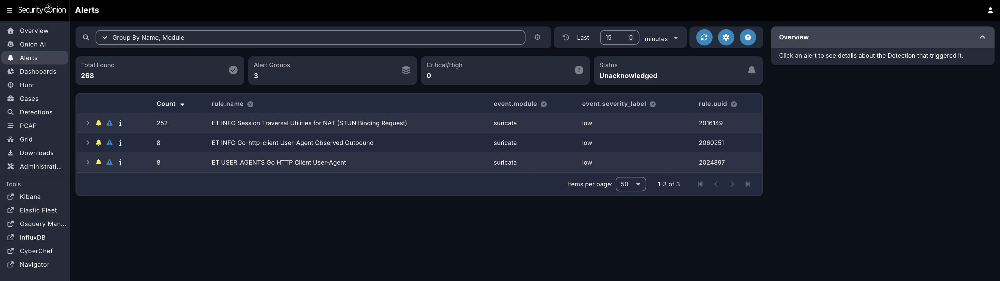
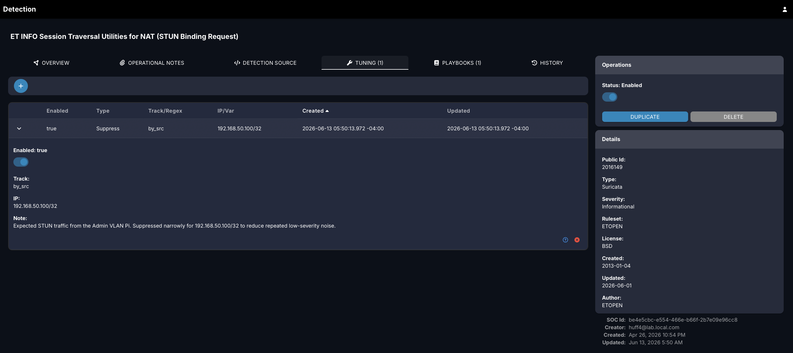
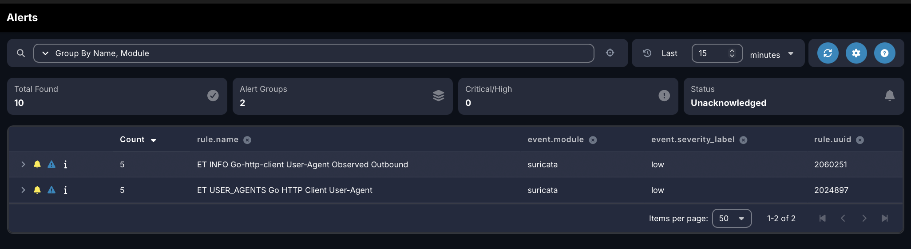
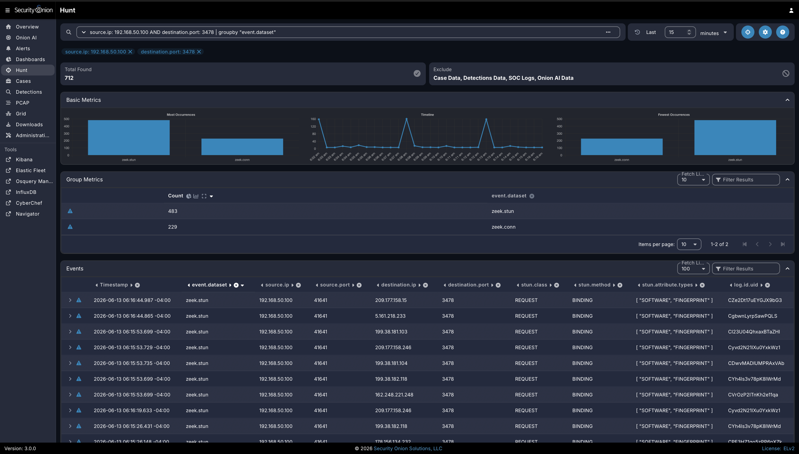

# Project 16: Security Onion Rule Tuning and Alert Validation

## Overview

This project documents a practical Security Onion alert tuning workflow inside the cybersecurity homelab. The goal was to review a repeated low-severity Suricata alert, confirm that the activity was expected, apply a narrow tuning change, and validate that the alert noise was reduced without removing underlying network visibility.

Security Onion generated repeated STUN/NAT traversal alerts from the Raspberry Pi on the Admin VLAN. Instead of disabling the detection globally, the tuning decision was scoped only to the known internal source IP `192.168.50.100/32`.

The project reinforces practical skills related to SIEM alert review, Suricata rule context, Security Onion tuning, source-based suppression, alert validation, Hunt analysis, network telemetry review, and analyst documentation.

## Lab Environment

| Component | Purpose |
|---|---|
| Security Onion | SIEM and network security monitoring platform used for alert review, tuning, and validation |
| Raspberry Pi 5 | Admin VLAN host generating expected STUN/NAT traversal traffic |
| pfSense | Firewall and routing layer for segmented lab traffic |
| Netgear Managed Switch | Provides VLAN separation and mirrored traffic visibility |
| Proxmox | Virtualization platform hosting core lab systems |
| Admin VLAN | Management network containing the Raspberry Pi and administrative services |

## Objectives

- Review repeated low-severity Security Onion alerts.
- Confirm the alert source, destination, destination port, rule name, rule UUID, and event module.
- Identify whether the activity was expected or suspicious.
- Apply a narrow source-based suppression instead of disabling the detection globally.
- Validate that the repeated alert no longer appeared in the recent alert view.
- Confirm that the underlying traffic remained searchable in Security Onion Hunt.
- Document the tuning decision, scope, validation evidence, and security rationale.

## Network / System Scope

| Item | Details |
|---|---|
| Alert Source | Raspberry Pi 5 on Admin VLAN |
| Source IP | `192.168.50.100` |
| Tuning Scope | Source-based suppression for `192.168.50.100/32` |
| Alert Name | ET INFO Session Traversal Utilities for NAT STUN Binding Request |
| Rule UUID | `2016149` |
| Event Module | Suricata |
| Severity | Low |
| Destination Port | UDP/TCP `3478` context for STUN/NAT traversal activity |
| Monitoring Platform | Security Onion Alerts, Detections, and Hunt |
| Validation Method | Alert review, source/destination review, rule lookup, source-based suppression, recent-alert validation, and Hunt validation |

## Implementation Summary

Security Onion was generating repeated low-severity alerts for STUN/NAT traversal traffic from the Raspberry Pi on the Admin VLAN. The alert was reviewed before any tuning change was made. The review confirmed the alert name, rule UUID, event module, severity, source IP, destination context, and destination port.

The source IP `192.168.50.100` was confirmed as the Raspberry Pi on the Admin VLAN. Because the source was known and the activity was expected, a narrow source-based suppression was applied only for `192.168.50.100/32`. The rule was not disabled globally.

After the suppression was applied, the Security Onion Alerts page was reviewed again and the repeated STUN alert no longer appeared in the recent 15-minute alert window. Security Onion Hunt was then used to confirm that related STUN and connection records remained searchable, proving that visibility was retained even though the repeated alert noise was reduced.

## Alert Tuning Workflow

The completed tuning workflow followed a controlled review-and-validate process:

```text
Repeated Security Onion alert
        |
        | review alert name, rule UUID, source, destination, and port
        v
Confirm known internal source
        |
        | apply narrow source-based suppression
        v
Validate alert noise reduction
        |
        | confirm traffic remains visible in Hunt
        v
Document tuning decision and scope
```

This workflow demonstrates that alert tuning should be based on evidence, scoped narrowly, and validated after the change.

## Tuning Decision

| Field | Value |
|---|---|
| Alert Name | ET INFO Session Traversal Utilities for NAT STUN Binding Request |
| Rule UUID | `2016149` |
| Event Module | Suricata |
| Severity | Low |
| Source IP | `192.168.50.100` |
| Source Host | Raspberry Pi on Admin VLAN |
| Destination Port | `3478` |
| Tuning Type | Suppress |
| Tuning Scope | Source-based suppression for `192.168.50.100/32` |
| Global Rule Disabled | No |
| Visibility Preserved | Yes, traffic remained searchable in Security Onion Hunt |

## Evidence

| # | Evidence | Description |
|---|---|---|
| 01 | [Security Onion Alert Baseline](evidence/01-security-onion-alert-baseline.png) | Shows repeated STUN Binding Request alerts before tuning. |
| 02 | [Alert Details Before Tuning](evidence/02-alert-details-before-tuning.png) | Shows the selected Suricata detection and rule context before tuning. |
| 03 | [Traffic Source Review](evidence/03-traffic-source-review.png) | Shows source and destination review identifying the Admin VLAN Raspberry Pi, external destination, and STUN port `3478`. |
| 04 | [Rule Tuning Change](evidence/04-rule-tuning-change.png) | Shows the source-based suppression applied for `192.168.50.100/32`. |
| 05 | [Alert Validation After Tuning](evidence/05-alert-validation-after-tuning.png) | Shows the Alerts view after tuning with the STUN alert no longer appearing in the recent 15-minute window. |
| 06 | [Final Alert Review](evidence/06-final-alert-review.png) | Shows Hunt validation confirming STUN and connection records remained searchable after alert tuning. |

## Key Evidence

### Baseline Alert Review



This screenshot shows repeated STUN Binding Request alerts before any tuning change was applied.

### Traffic Source Review


This screenshot shows the source and destination context used to confirm that the alert was tied to the known Raspberry Pi on the Admin VLAN.

### Source-Based Suppression



This screenshot shows the source-based suppression applied for `192.168.50.100/32`, limiting the tuning change to the known Admin VLAN Raspberry Pi.

### Alert Validation After Tuning



This screenshot shows the recent Security Onion Alerts view after tuning, confirming that the repeated STUN alert no longer appeared in the recent 15-minute window.

### Hunt Validation



This screenshot shows that STUN and connection records remained searchable in Security Onion Hunt after the alert suppression was applied.

## Validation

Security Onion rule tuning was validated through baseline alert review, alert detail review, source and destination analysis, rule lookup, source-based suppression, recent alert review, and Hunt validation.

Validation confirmed the following:

- Security Onion generated repeated low-severity STUN Binding Request alerts before tuning.
- The alert was tied to Suricata rule UUID `2016149`.
- The source IP `192.168.50.100` was confirmed as the Raspberry Pi on the Admin VLAN.
- The alert involved STUN/NAT traversal traffic using destination port `3478` context.
- A source-based suppression was applied only to `192.168.50.100/32`.
- The Suricata rule was not disabled globally.
- The repeated STUN alert no longer appeared in the recent 15-minute alert view after tuning.
- Security Onion Hunt still showed related STUN and connection records after the tuning change.

## Challenges and Lessons Learned

This project reinforced that alert tuning should be deliberate and evidence-based. A repeated alert should not be suppressed simply because it is noisy. The source, destination, rule, severity, traffic type, and environment context should be reviewed before making a tuning decision.

The project also showed the importance of narrow tuning scope. Disabling the rule globally would have reduced noise but could also hide similar STUN activity from other systems. A source-based suppression limited the change to a known internal host while preserving the rule for the rest of the environment.

A key lesson was that alert suppression and visibility are not the same thing. The alert was suppressed for a known source, but Security Onion Hunt still retained searchable telemetry. This distinction matters because analysts may still need to investigate historical traffic even when an alert is tuned.

## Security Relevance

This project demonstrates how alert tuning supports real-world SOC operations. High alert volume can reduce analyst effectiveness, but overly broad suppression can create blind spots. Effective tuning balances noise reduction with continued detection and investigation capability.

The project also demonstrates why tuning decisions should be documented. Analysts, engineers, and future reviewers need to understand what was tuned, why it was tuned, what scope was used, and how the change was validated.

## Business Value

This project provides business value by showing how alert tuning can improve signal quality without sacrificing visibility. Reducing repeated low-value alerts helps analysts focus on higher-priority events while preserving the ability to search and investigate underlying telemetry.

In an enterprise environment, this type of work helps teams:

- Reduce alert fatigue and analyst workload.
- Preserve detection coverage by avoiding overly broad suppressions.
- Improve SOC triage quality through scoped tuning decisions.
- Document tuning rationale for audit and knowledge transfer.
- Validate that alert behavior changes as expected after tuning.
- Maintain searchable telemetry for future investigations.

## Portfolio Summary

This project demonstrates a practical Security Onion alert tuning workflow inside a monitored homelab environment. A repeated low-severity STUN alert from the Admin VLAN Raspberry Pi was reviewed, scoped, and suppressed using a narrow source-based tuning entry.

Rather than disabling the detection globally, the tuning was limited to `192.168.50.100/32`, a known internal host. Security Onion Alerts confirmed that the repeated alert no longer appeared in the recent alert window, while Security Onion Hunt confirmed that the underlying STUN and connection telemetry remained searchable after tuning. This project adds alert-quality improvement, detection tuning, and analyst decision-making to the broader homelab portfolio.