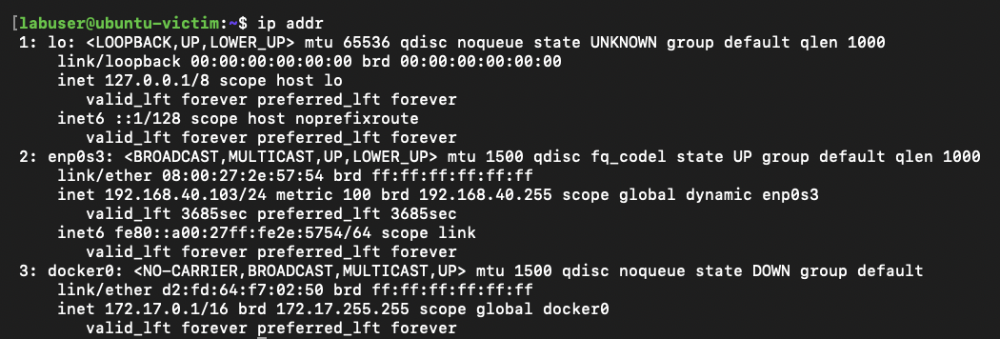

# Project 17: Multi-Source Log Correlation

## Overview

This project focuses on correlating security activity across multiple log sources in the homelab environment. The goal is to generate controlled activity from an attacker system, observe how that activity appears across the firewall, SIEM, and victim system, and document how each source contributes to the investigation.

In real environments, a single alert rarely tells the full story. Analysts often need to compare firewall logs, SIEM alerts, packet-level data, endpoint logs, and system activity to determine what happened. This project demonstrates that workflow by using pfSense, Security Onion, Kali Linux, and a victim system to validate activity across more than one source.

This lab is designed to show how source IPs, destination IPs, ports, timestamps, firewall actions, and SIEM events can be reviewed together to build a clear investigation timeline.

## Lab Environment

| Component | Purpose |
| --- | --- |
| pfSense | Firewall used to enforce VLAN rules, log allowed or blocked traffic, and provide network-level visibility |
| Proxmox | Virtualization platform hosting lab systems used during the investigation |
| Security Onion | SIEM and network security monitoring platform used to review alerts, hunt data, and packet-level context |
| Kali Linux | Attacker system used to generate controlled test activity |
| Victim System | Target system used to receive or respond to the controlled activity |
| Raspberry Pi | Bastion host used for remote access and tunnel-based management of lab systems |
| Managed Switch | Provides VLAN connectivity and mirrored traffic visibility for Security Onion |
| Administrative Workstation | System used to access pfSense, Security Onion, Proxmox, and supporting lab interfaces |

## Project Goals

The goals of this project are to:

- Generate controlled security activity from Kali Linux toward a victim system.
- Confirm that the activity is visible from more than one source.
- Review pfSense logs to identify firewall-level visibility.
- Review Security Onion alerts, hunt data, or packet details for SIEM-level visibility.
- Review victim-system logs or service output to confirm host-level activity where applicable.
- Correlate timestamps, IP addresses, ports, protocols, and event details across the available evidence.
- Document the investigation in a format that supports repeatability and analyst handoff.

## Implementation Summary

This project will use a controlled lab scenario to show how the same activity can be validated from multiple perspectives.

The planned workflow is:

1. Confirm Kali Linux, the victim system, pfSense, Security Onion, and required management access are available.
2. Generate controlled activity from Kali Linux toward the victim system.
3. Capture the attacker-side command output or test results.
4. Review pfSense firewall logs for matching source, destination, port, protocol, rule action, and timestamp details.
5. Review Security Onion for related alerts, hunt records, packet data, or network metadata.
6. Review victim-system logs, service logs, or command output when host-level evidence is available.
7. Compare the available records to determine whether the same activity can be traced across the environment.
8. Document the final investigation timeline and validation results.

## Evidence

| Evidence ID | Evidence Description | Source |
| --- | --- | --- |
| 01 | Kali attacker IP address and connectivity to the Ubuntu victim confirmed | `evidence/01a-lab-systems-confirmed.png` |
| 02 | Ubuntu victim IP address confirmed on the VLAN40 victim network | `evidence/01b-lab-systems-confirmed.png` |
| 03 | Controlled Nmap scan generated from Kali Linux against the Ubuntu victim | `evidence/02-kali-nmap-scan.png` |
| 04 | pfSense firewall logs showing allowed VLAN20 attacker traffic to the VLAN40 victim | `evidence/03-pfsense-firewall-logs.png` |
| 05 | Security Onion Hunt results showing Kali-to-victim traffic across Zeek and Suricata data | `evidence/04-security-onion-hunt-results.png` |
| 06 | Ubuntu victim auth logs showing SSH connection activity from Kali | `evidence/05-victim-system-validation.png` |
| 07 | Final validation documented in README correlation summary | `README.md` |

## Screenshots

### Kali Attacker IP and Connectivity Confirmed

This screenshot shows the Kali attacker system using IP address `192.168.20.100` on the attacker VLAN. It also confirms connectivity from Kali to the Ubuntu victim system at `192.168.40.103` using a successful ping test. The timestamp provides the starting point for the investigation window.

### Ubuntu Victim IP Confirmed

This screenshot shows the Ubuntu victim system using IP address `192.168.40.103` on the victim VLAN. This confirms the target system used during the correlation test.

### Controlled Activity from Kali Linux

This screenshot shows a controlled Nmap scan from Kali Linux against the Ubuntu victim system at `192.168.40.103`. The scan identified TCP port `22` as open and detected OpenSSH running on the Ubuntu host.

### pfSense Firewall Log Evidence

This screenshot shows pfSense firewall logs for traffic from `192.168.20.100` to `192.168.40.103`. The entries show allowed TCP traffic on the ATTACK interface matching the rule `Allow VLAN20 attacker to VLAN40 victim lab traffic`, confirming firewall-level visibility into the scan.

### Security Onion Alert or Hunt Evidence

This screenshot shows Security Onion Hunt results filtered for traffic from `192.168.20.100` to `192.168.40.103`. The results include Zeek connection records, Suricata alerts, and Zeek SSH records, confirming SIEM and network-level visibility into the same activity.

### Victim-System Validation

This screenshot shows the Ubuntu victim system's SSH authentication log filtered for `192.168.20.100`. The log entries show SSH connection activity from the Kali attacker system, confirming host-level visibility on the victim.

## Validation

The activity was validated by correlating evidence from Kali Linux, pfSense, Security Onion, and the Ubuntu victim system.

At approximately Jun 13, 2026 21:37 EDT, Kali Linux generated a controlled Nmap scan from `192.168.20.100` against the Ubuntu victim system at `192.168.40.103`.

Kali confirmed the activity by showing an Nmap SYN scan and service detection scan against the victim system. The scan identified TCP port `22` as open and detected OpenSSH running on the Ubuntu host.

pfSense confirmed firewall-level visibility by logging allowed TCP traffic from `192.168.20.100` to `192.168.40.103` on the ATTACK interface. The traffic matched the rule `Allow VLAN20 attacker to VLAN40 victim lab traffic`, confirming that inter-VLAN attacker-to-victim traffic was visible at the firewall.

Security Onion confirmed SIEM and network-level visibility by showing related traffic from `192.168.20.100` to `192.168.40.103` in Hunt. The results included Zeek connection records, Suricata alerts, and Zeek SSH records during the same activity window.

The Ubuntu victim system confirmed host-level visibility through `/var/log/auth.log`, which showed SSH connection activity from `192.168.20.100`.

Together, these sources confirm that the same controlled activity was observed across the attacker system, firewall, SIEM, and victim system. This validates that multi-source log correlation can be used to build a clear investigation timeline.

## Lessons Learned

This project reinforces the importance of validating security activity across multiple sources instead of relying on a single alert or log entry.

Expected lessons from this project include:

- Firewall logs are useful for confirming network flow, rule action, and traffic direction.
- SIEM data provides additional context through alerts, hunt records, packet details, and network metadata.
- Host-level logs can help confirm whether activity actually reached or affected the target system.
- Timestamps are critical when building an investigation timeline.
- Correlating multiple sources improves confidence during alert triage and incident analysis.

## Business Value

Multi-source log correlation is a core security operations skill. In a real SOC or incident response environment, analysts must often determine whether an alert represents normal activity, blocked traffic, a failed attempt, or a successful interaction with a system.

This project demonstrates the ability to compare firewall logs, SIEM evidence, attacker activity, and victim-system data to reach a supported conclusion. It also shows practical documentation skills by presenting the investigation in a way that another analyst, engineer, or stakeholder could understand and reproduce.

## Portfolio Summary

This project demonstrates multi-source log correlation in a segmented cybersecurity homelab. Controlled Nmap activity was generated from Kali Linux and reviewed across pfSense, Security Onion, and the Ubuntu victim system to validate what occurred and where it was observed.

The project highlights practical SOC investigation skills, including evidence collection, timestamp comparison, network log review, SIEM analysis, and host-level validation. Once completed, it will provide a clear example of how multiple data sources can be used together to support alert triage and incident analysis.
