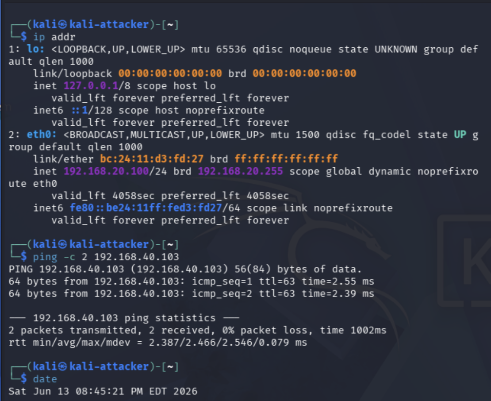
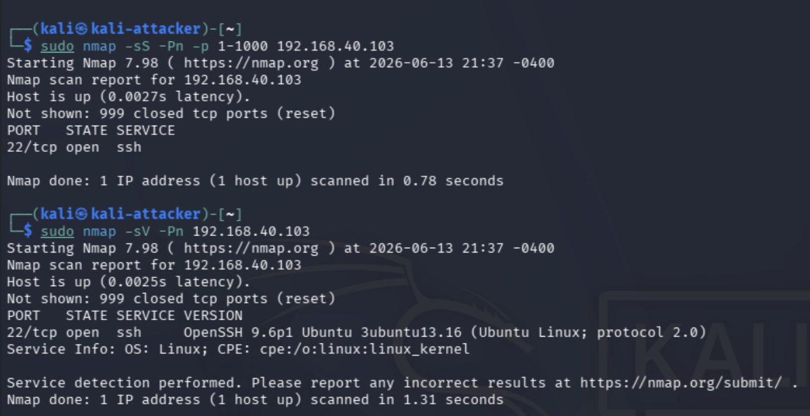
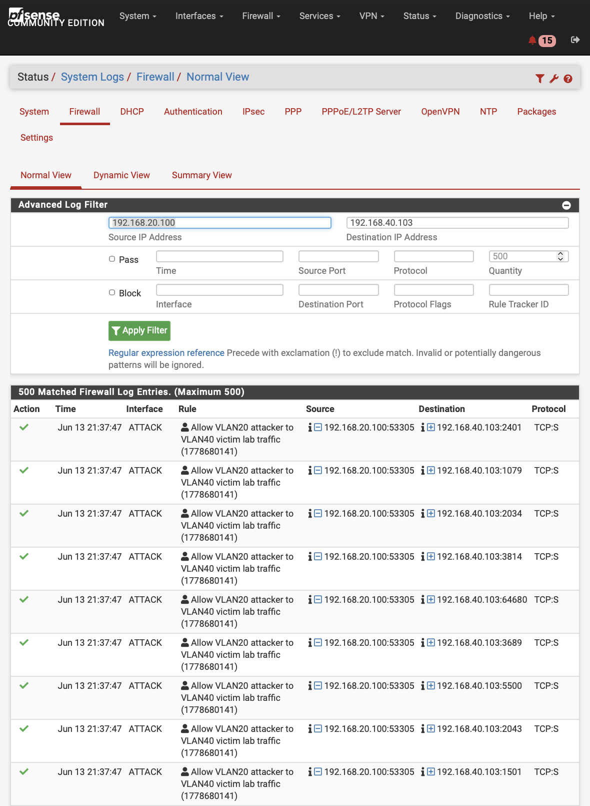
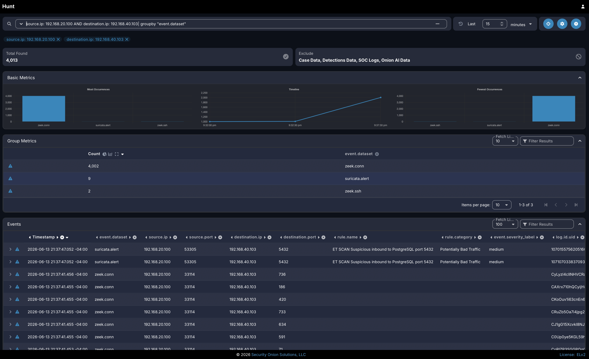
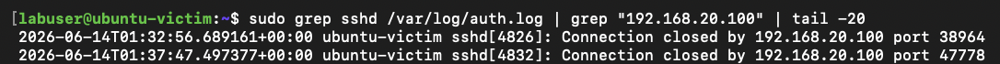

# Project 17: Multi-Source Log Correlation

## Overview

This project documents a multi-source log correlation workflow inside the segmented cybersecurity homelab. The goal was to generate controlled activity from an attacker system, review how that same activity appeared across firewall, SIEM, and victim-system evidence, and build a clear investigation timeline from multiple sources.

In real environments, a single alert rarely tells the full story. Analysts often need to compare firewall logs, SIEM alerts, packet-level data, endpoint logs, and system activity to determine what happened. This project demonstrates that workflow by using Kali Linux, pfSense, Security Onion, and an Ubuntu victim system to validate the same activity from several perspectives.

The project reinforces practical skills related to SOC investigation, multi-source log correlation, firewall log review, Security Onion Hunt analysis, Zeek and Suricata visibility, endpoint log review, timestamp comparison, evidence validation, and analyst handoff documentation.

## Lab Environment

| Component | Purpose |
|---|---|
| Kali Linux | Attacker system used to generate controlled test activity |
| Ubuntu Victim | Target system used to receive and log the controlled activity |
| pfSense | Firewall used to enforce VLAN rules and log allowed attacker-to-victim traffic |
| Security Onion | SIEM and network security monitoring platform used to review Hunt data, Zeek records, and Suricata alerts |
| Proxmox | Virtualization platform hosting lab systems used during the investigation |
| Raspberry Pi | Bastion host used for remote access and tunnel-based management of lab systems |
| Managed Switch | Provides VLAN connectivity and mirrored traffic visibility for Security Onion |
| Administrative Workstation | System used to access pfSense, Security Onion, Proxmox, and supporting lab interfaces |

## Objectives

- Generate controlled activity from Kali Linux toward an Ubuntu victim system.
- Confirm that the activity is visible from more than one source.
- Review pfSense logs to identify firewall-level visibility.
- Review Security Onion Hunt results for SIEM and network-level visibility.
- Review Ubuntu victim authentication logs for host-level activity.
- Correlate timestamps, IP addresses, ports, protocols, rule actions, and event details across available evidence.
- Build a clear investigation timeline that could be handed off to another analyst.
- Document the correlation workflow in a repeatable portfolio-ready format.

## Network / System Scope

| Item | Details |
|---|---|
| Attacker System | Kali Linux |
| Attacker IP | `192.168.20.100` |
| Attacker VLAN | VLAN 20 |
| Victim System | Ubuntu victim |
| Victim IP | `192.168.40.103` |
| Victim VLAN | VLAN 40 |
| Controlled Activity | Nmap scan and SSH-related connection activity |
| Exposed Service | SSH on TCP/22 |
| Firewall Source | pfSense ATTACK interface logs |
| SIEM Source | Security Onion Hunt, Zeek connection records, Zeek SSH records, and Suricata alerts |
| Endpoint Source | Ubuntu `/var/log/auth.log` |
| Validation Method | Attacker command output, firewall logs, Security Onion Hunt results, victim auth logs, and final correlation summary |

## Implementation Summary

The correlation workflow began by confirming the Kali attacker IP address and Ubuntu victim IP address. Kali was then used to generate controlled activity against the Ubuntu victim, including a targeted Nmap scan that identified SSH exposed on TCP/22.

After the attacker-side activity was captured, pfSense firewall logs were reviewed for matching traffic from `192.168.20.100` to `192.168.40.103`. The pfSense logs showed allowed TCP traffic on the ATTACK interface matching the rule `Allow VLAN20 attacker to VLAN40 victim lab traffic`.

Security Onion Hunt was then reviewed for the same source and destination pair. The results included Zeek connection records, Suricata alerts, and Zeek SSH records, confirming SIEM and network-level visibility into the activity.

Finally, the Ubuntu victim's authentication logs were reviewed for activity tied to the Kali source IP. This confirmed host-level visibility and completed the attacker-to-firewall-to-SIEM-to-victim correlation workflow.

## Correlation Workflow

The completed correlation workflow followed a multi-source investigation process:

```text
Kali attacker activity
        |
        | Nmap scan and SSH-related traffic
        v
pfSense firewall logs
        |
        | allowed inter-VLAN traffic and rule context
        v
Security Onion Hunt
        |
        | Zeek connection logs, Zeek SSH logs, and Suricata alerts
        v
Ubuntu victim auth logs
        |
        | host-level SSH connection activity
        v
Final investigation timeline
```

This workflow demonstrates how multiple evidence sources can be used together to answer what happened, where it was observed, and how confident the analyst should be in the conclusion.

## Correlation Summary

At approximately Jun 13, 2026 21:37 EDT, Kali Linux generated controlled Nmap activity from `192.168.20.100` against the Ubuntu victim at `192.168.40.103`.

Kali confirmed the activity by showing an Nmap SYN scan and service detection scan against the victim system. The scan identified TCP port `22` as open and detected OpenSSH running on the Ubuntu host.

pfSense confirmed firewall-level visibility by logging allowed TCP traffic from `192.168.20.100` to `192.168.40.103` on the ATTACK interface. The traffic matched the rule `Allow VLAN20 attacker to VLAN40 victim lab traffic`, confirming that inter-VLAN attacker-to-victim traffic was visible at the firewall.

Security Onion confirmed SIEM and network-level visibility by showing related traffic from `192.168.20.100` to `192.168.40.103` in Hunt. The results included Zeek connection records, Suricata alerts, and Zeek SSH records during the same activity window.

The Ubuntu victim system confirmed host-level visibility through `/var/log/auth.log`, which showed SSH connection activity from `192.168.20.100`.

Together, these sources confirm that the same controlled activity was observed across the attacker system, firewall, SIEM, and victim system. This validates that multi-source log correlation can be used to build a clear investigation timeline.

## Evidence

| # | Evidence | Description |
|---|---|---|
| 01a | [Kali Attacker IP and Connectivity](evidence/01a-lab-systems-confirmed.png) | Shows the Kali attacker IP address and successful connectivity to the Ubuntu victim. |
| 01b | [Ubuntu Victim IP](evidence/01b-lab-systems-confirmed.png) | Shows the Ubuntu victim IP address on the VLAN 40 victim network. |
| 02 | [Controlled Nmap Scan](evidence/02-kali-nmap-scan.png) | Shows controlled Nmap activity from Kali Linux against the Ubuntu victim. |
| 03 | [pfSense Firewall Logs](evidence/03-pfsense-firewall-logs.png) | Shows allowed VLAN20 attacker traffic to the VLAN40 victim in pfSense logs. |
| 04 | [Security Onion Hunt Results](evidence/04-security-onion-hunt-results.png) | Shows Kali-to-victim traffic across Zeek and Suricata data in Security Onion Hunt. |
| 05 | [Victim System Validation](evidence/05-victim-system-validation.png) | Shows Ubuntu victim authentication logs with SSH connection activity from Kali. |

## Key Evidence

### Kali Attacker IP and Connectivity



This screenshot shows the Kali attacker system using IP address `192.168.20.100` on the attacker VLAN. It also confirms connectivity from Kali to the Ubuntu victim system at `192.168.40.103` using a successful ping test.

### Controlled Nmap Activity



This screenshot shows a controlled Nmap scan from Kali Linux against the Ubuntu victim system. The scan identified TCP port `22` as open and detected OpenSSH running on the Ubuntu host.

### pfSense Firewall Log Evidence



This screenshot shows pfSense firewall logs for traffic from `192.168.20.100` to `192.168.40.103`. The entries show allowed TCP traffic on the ATTACK interface matching the rule `Allow VLAN20 attacker to VLAN40 victim lab traffic`.

### Security Onion Hunt Evidence



This screenshot shows Security Onion Hunt results filtered for traffic from `192.168.20.100` to `192.168.40.103`. The results include Zeek connection records, Suricata alerts, and Zeek SSH records.

### Victim-System Validation



This screenshot shows the Ubuntu victim system's SSH authentication log filtered for `192.168.20.100`, confirming host-level visibility on the victim.

## Validation

Multi-source log correlation was validated by comparing attacker-side activity, pfSense firewall logs, Security Onion Hunt results, and Ubuntu victim authentication logs.

Validation confirmed the following:

- Kali Linux used IP address `192.168.20.100` on the attacker VLAN.
- The Ubuntu victim used IP address `192.168.40.103` on the victim VLAN.
- Kali successfully reached the victim and generated controlled Nmap activity.
- Nmap identified SSH open on TCP/22.
- pfSense logged allowed TCP traffic from the attacker to the victim on the ATTACK interface.
- pfSense rule context confirmed that the traffic matched the allowed VLAN20-to-VLAN40 lab path.
- Security Onion Hunt showed related Zeek connection records, Suricata alerts, and Zeek SSH records.
- Ubuntu `/var/log/auth.log` showed SSH connection activity from the Kali attacker IP.
- The same source IP, destination IP, and destination service were visible across multiple sources.

## Challenges and Lessons Learned

This project reinforced the importance of validating security activity across multiple sources instead of relying on a single alert or log entry. Firewall logs, SIEM data, and endpoint logs each provided a different part of the investigation story.

pfSense was useful for confirming traffic direction, rule action, and inter-VLAN firewall context. Security Onion added network-level context through Hunt results, Zeek records, and Suricata alerts. The Ubuntu victim logs confirmed that the activity reached the target system and appeared at the host level.

A key lesson was that timestamps, source IPs, destination IPs, ports, protocols, and rule names must be compared carefully when building an investigation timeline. Multi-source correlation increases confidence because it allows the analyst to confirm that different tools are describing the same activity.

## Security Relevance

This project demonstrates how multi-source log correlation supports real-world SOC investigations and incident response. Analysts often need to determine whether an alert represents blocked traffic, allowed traffic, reconnaissance, authentication activity, or successful interaction with a target system.

The project also demonstrates why multiple visibility layers matter. Firewall logs explain how traffic moved through segmentation controls, SIEM telemetry shows network and alert context, and endpoint logs confirm what happened on the target host.

## Business Value

This project provides business value by showing how security teams can use multiple sources of evidence to reach stronger conclusions during alert triage and incident analysis. Better correlation reduces uncertainty, improves investigation quality, and supports clearer communication with technical and non-technical stakeholders.

In an enterprise environment, this type of work helps teams:

- Reconstruct security events using multiple evidence sources.
- Validate whether traffic was blocked, allowed, or successful.
- Improve SOC triage accuracy and investigation confidence.
- Support incident response timelines and analyst handoff.
- Identify monitoring gaps between firewall, SIEM, and endpoint logs.
- Communicate findings clearly using evidence-backed documentation.

## Portfolio Summary

This project demonstrates multi-source log correlation in a segmented cybersecurity homelab. Controlled Nmap activity was generated from Kali Linux and reviewed across pfSense, Security Onion, and the Ubuntu victim system to validate what occurred and where it was observed.

The project highlights practical SOC investigation skills, including evidence collection, timestamp comparison, firewall log review, SIEM analysis, Zeek and Suricata visibility, and host-level validation. It provides a clear example of how multiple data sources can be used together to support alert triage and incident analysis.
