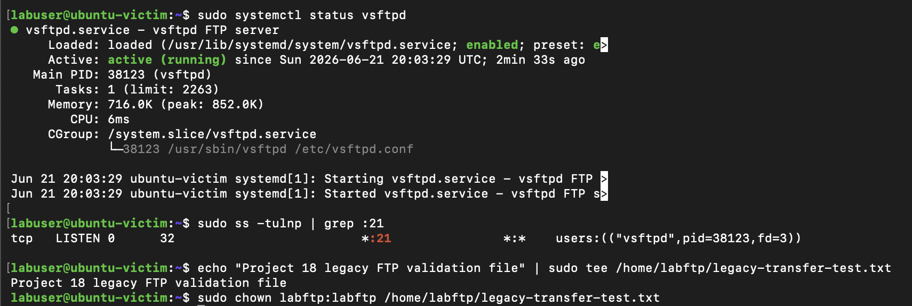
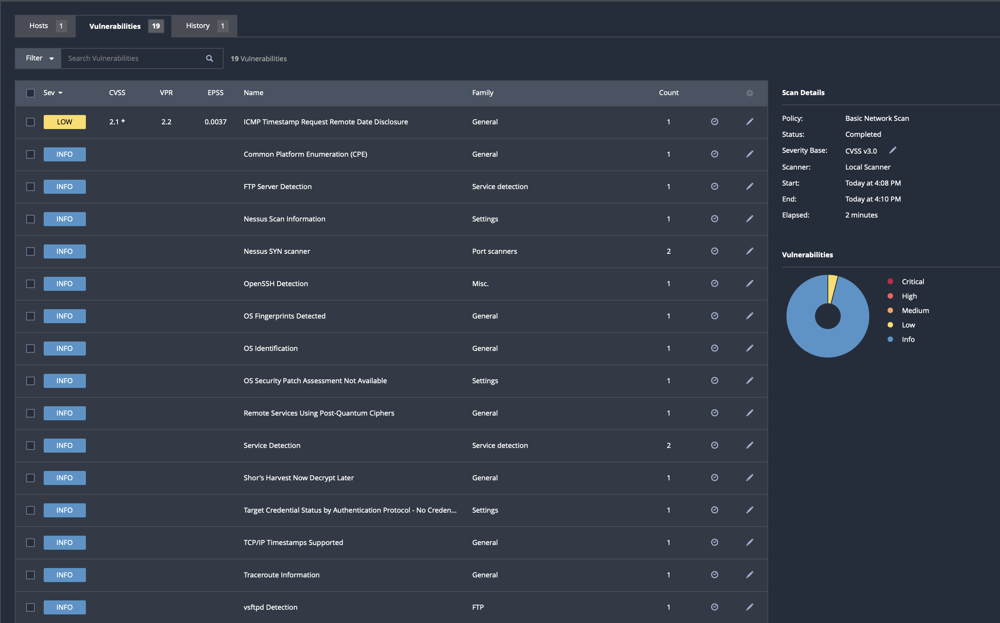
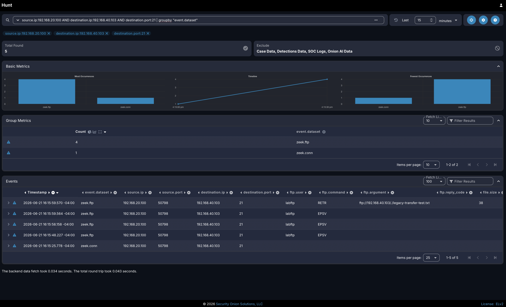
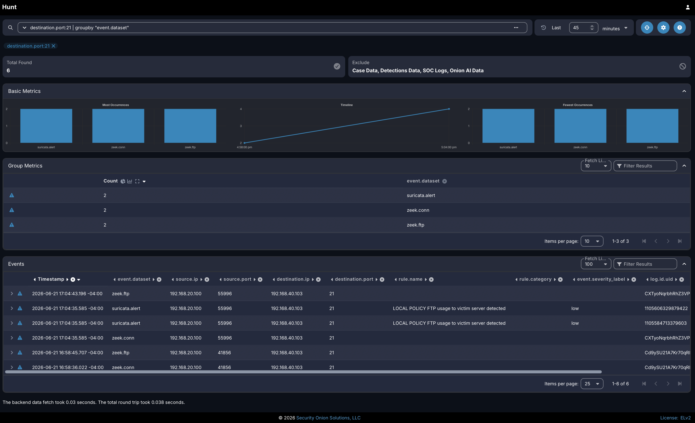
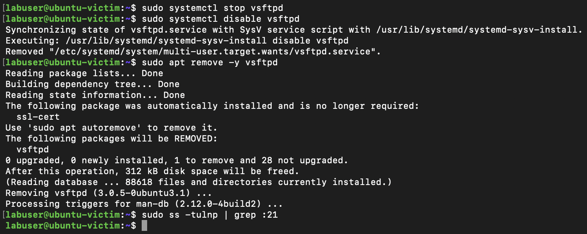
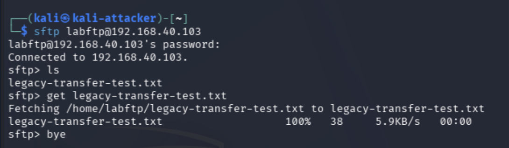
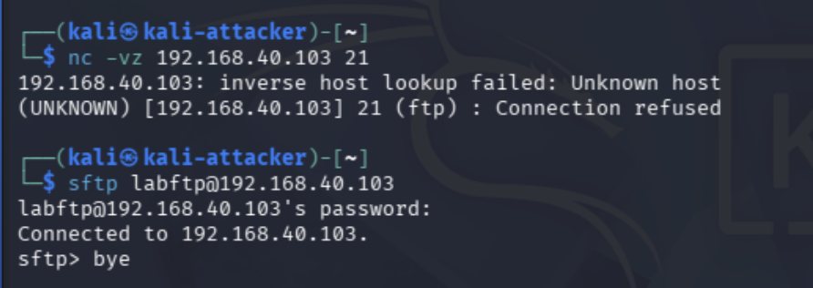

# Project 18: Incident Response Capstone

## Overview

This project serves as the capstone for the cybersecurity homelab portfolio. The goal of this project is to perform a more advanced incident response investigation by combining multiple tools, evidence sources, and defensive controls developed throughout the previous projects.

The project focuses on a multi-stage simulated incident involving suspicious activity from the attacker VLAN toward a victim system. The investigation will include alert review, firewall log validation, network traffic correlation, host-level validation, vulnerability context, containment review, and final incident reporting. This project is designed to demonstrate how a security analyst can move beyond a single alert and build a complete incident timeline using evidence from multiple systems.

## Lab Environment

The lab environment used for this project includes the segmented homelab network built throughout the portfolio.

| Component | Purpose |
| --- | --- |
| pfSense | Firewall, VLAN segmentation, traffic control, and log review |
| Proxmox | Virtualization platform for lab systems |
| Security Onion | SIEM, alert review, packet visibility, and event investigation |
| Kali Linux | Attacker system used to generate controlled suspicious activity |
| Victim System | Target system used for validation and investigation |
| Raspberry Pi | Bastion host, remote access, and administrative access support |
| Managed Switch | VLAN trunking, port mirroring, and network visibility |

## Project Objectives

The objectives of this project are to:

- Simulate a controlled security incident inside the homelab environment.
- Detect suspicious activity using Security Onion and firewall visibility.
- Validate the source, destination, and nature of the activity.
- Correlate evidence across network, firewall, and host-level data.
- Build an incident timeline using multiple evidence sources.
- Include vulnerability or exposure context where applicable.
- Document the investigation process in a professional incident response format.
- Summarize the business and security value of incident response procedures.

## Tools and Technologies

- pfSense
- Security Onion
- Proxmox
- Kali Linux
- Nessus vulnerability scan results or prior vulnerability context
- Ubuntu or Windows victim system
- Raspberry Pi bastion host
- Tailscale and SSH tunneling
- Managed switch port mirroring
- Zeek and Suricata data within Security Onion
- Markdown and GitHub documentation

## Incident Scenario

A controlled multi-stage incident scenario will be generated from the attacker VLAN toward a victim system. The activity will be reviewed from the perspective of a security analyst responding to a suspicious event inside a segmented network.

The scenario will simulate the following activity chain:

1. Reconnaissance from Kali against the victim system.
2. Service or vulnerability discovery using Nmap and/or Nessus context.
3. Suspicious access attempt or probing activity against an exposed service.
4. Detection and investigation in Security Onion.
5. Firewall log validation in pfSense.
6. Host-level review on the victim system.
7. Containment review using firewall rules and segmentation controls.
8. Final incident timeline and lessons learned.

The final incident scenario will include:

- Source system: Kali Linux on the attacker VLAN
- Destination system: Victim host on the victim VLAN
- Detection source: Security Onion alerts, Hunt data, Zeek/Suricata records, and pfSense logs
- Supporting context: Nessus results, host validation, and firewall segmentation review
- Investigation focus: Timeline development, network behavior, alert context, firewall visibility, host impact, and containment validation
- Final outcome: Documented incident report with findings, response actions, and recommended improvements

## Incident Response Workflow

The investigation will follow a structured incident response workflow.

### 1. Preparation

The lab environment was already segmented using VLANs, firewall rules, port mirroring, and SIEM visibility. These controls provide the foundation for detecting and investigating suspicious activity.

### 2. Detection

Suspicious activity will be identified using Security Onion alerts, hunt queries, dashboards, or pfSense firewall logs.

Evidence to capture:

- Security Onion alert or hunt result
- pfSense firewall log showing related traffic
- Source and destination IP addresses
- Timestamp of the activity

### 3. Analysis

The event will be reviewed to determine what happened, which systems were involved, whether the activity represents expected lab behavior or suspicious activity, and whether any known service exposure or vulnerability context increases the risk of the event.

Evidence to capture:

- Security Onion event details
- Network connection details
- Related Zeek or Suricata data
- Nessus or service exposure context, if applicable
- Firewall log correlation
- Host-level validation, if available

### 4. Containment

Containment actions will be documented to show how the activity could be limited or blocked using firewall rules or segmentation controls.

Evidence to capture:

- Existing firewall rule that limits the activity
- New or adjusted firewall rule, if needed
- Validation that unwanted traffic is blocked or controlled

### 5. Eradication and Recovery

Because this is a controlled lab scenario, eradication and recovery will focus on confirming that the suspicious activity has stopped and that the affected system remains available.

Evidence to capture:

- Stopped attack or test activity
- Victim system status
- Service availability validation
- Any cleanup steps performed

### 6. Lessons Learned

The final section of the investigation will summarize what was observed, how the evidence was correlated, and what security improvements could be made.

## Evidence

| Evidence Item | Description | Screenshot |
| --- | --- | --- |
| Incident Generation | Kali activity showing the controlled reconnaissance or probing activity | `evidence/01-incident-generation.png` |
| Detection Event | Security Onion alert, hunt result, or dashboard showing the suspicious activity | `evidence/02-detection-event.png` |
| Event Details | Detailed Security Onion event view showing protocol, source, destination, and alert context | `evidence/03-event-details.png` |
| Network Correlation | Zeek, Suricata, or Hunt data correlating the network activity | `evidence/04-network-correlation.png` |
| Firewall Log Validation | pfSense log showing related source and destination traffic | `evidence/05-firewall-log-validation.png` |
| Vulnerability Context | Nessus finding, service exposure, or supporting scan context related to the victim system | `evidence/06-vulnerability-context.png` |
| Host Validation | Victim system evidence showing service activity, logs, or system status | `evidence/07-host-validation.png` |
| Containment Validation | Firewall rule, blocked traffic, segmentation rule, or validation that activity was controlled | `evidence/08-containment-validation.png` |
| Incident Timeline | Final timeline showing detection, analysis, validation, containment, and outcome | `evidence/09-incident-timeline.png` |
| Final Incident Notes | Summary notes showing the completed incident response analysis | `evidence/10-final-incident-notes.png` |

## Screenshots

Screenshots will be added as the project is completed.

### Incident Generation


### Detection Event


### Event Details


### Network Correlation


### Firewall Log Validation


### Vulnerability Context


### Host Validation


### Containment Validation


### Incident Timeline


### Final Incident Notes


## Validation

This project will be considered complete when the following items are documented:

- Suspicious activity was generated in a controlled manner.
- The activity was detected in Security Onion or pfSense.
- Source and destination systems were identified.
- A timeline was created to show the sequence of activity.
- Vulnerability or service exposure context was reviewed where applicable.
- Network and firewall evidence were correlated.
- Host-level validation was captured where applicable.
- Containment or control steps were documented.
- A final incident response summary was completed.

## Business Value

Incident response is a critical security function because it allows an organization to detect, investigate, contain, and learn from suspicious activity. This project demonstrates the ability to follow a structured investigation process rather than relying on a single alert or isolated log entry.

By correlating firewall logs, SIEM data, network evidence, vulnerability context, and host validation, this project reflects the type of analysis used in SOC, incident response, and security operations environments. It also shows how clear documentation supports handoffs, escalation, remediation, and long-term security improvement.

## Portfolio Summary

This project demonstrates the ability to perform an advanced incident response workflow in a segmented homelab environment. It brings together the core skills developed throughout the portfolio, including network segmentation, SIEM investigation, firewall validation, vulnerability context review, host validation, adversary simulation, containment analysis, and professional documentation.

Project highlights include controlled multi-stage incident simulation, alert review, network traffic analysis, firewall log correlation, vulnerability context review, host validation, incident timeline development, containment validation, and final incident reporting.
# Project 18: Vulnerability Discovery, Detection, and Remediation Capstone

## Overview

This project demonstrates a full vulnerability management and remediation workflow using a segmented cybersecurity homelab. A legacy FTP service was intentionally deployed on a victim server to simulate an insecure business file transfer process. The service was discovered with Nessus, validated through manual testing from Kali Linux, monitored with Security Onion, and confirmed through pfSense firewall logs.

After validating the risk and visibility of the insecure service, FTP was removed from the victim system and replaced with SFTP over SSH. A post-remediation Nessus scan and connectivity test confirmed that FTP was no longer exposed while encrypted file transfer remained available.

This project serves as the capstone for the portfolio by combining vulnerability discovery, business risk analysis, network monitoring, firewall validation, detection engineering, remediation, and post-remediation verification.

## Lab Environment

| Component | Purpose |
| --- | --- |
| pfSense | Firewall, VLAN routing, segmentation, and traffic log validation |
| Proxmox | Virtualization platform hosting lab systems |
| Security Onion | Network security monitoring, Zeek/Suricata visibility, and custom detection validation |
| Kali Linux | Client system used to validate FTP and SFTP access |
| Nessus Scanner | Vulnerability scanner used to identify and validate exposed services |
| Ubuntu Victim Server | Target system configured with legacy FTP and later remediated with SFTP |
| Managed Switch | VLAN trunking and mirrored traffic delivery to Security Onion |
| Raspberry Pi Bastion | Remote administrative access through Tailscale and SSH tunneling |

## Project Objectives

- Intentionally configure a vulnerable legacy FTP service on a victim server.
- Use Nessus to discover and document the exposed FTP service.
- Explain the business purpose and risk of the legacy file transfer workflow.
- Validate FTP usage from Kali Linux.
- Confirm Security Onion visibility into FTP activity using Zeek and Suricata data.
- Validate the traffic path with pfSense firewall logs.
- Create a custom Security Onion detection for FTP connections to the victim server.
- Remove the insecure FTP service from the victim server.
- Replace FTP with SFTP over SSH.
- Run a post-remediation Nessus scan to confirm the insecure service was removed.
- Validate that FTP is no longer reachable while SFTP remains functional.

## Tools and Technologies

- pfSense CE
- Security Onion
- Nessus Essentials
- Kali Linux
- Ubuntu Server
- vsftpd
- OpenSSH / SFTP
- Zeek
- Suricata
- Proxmox
- Tailscale / SSH tunneling
- Markdown / GitHub

## Business Service Context

The victim server was configured to simulate a legacy internal file transfer server. In many organizations, FTP may remain in use because older applications, scripts, or operational workflows depend on simple file transfer methods.

Although FTP can support business operations, it introduces security risk because authentication and file transfer activity are not encrypted. This means usernames, commands, file names, and transferred data may be visible to network monitoring tools or attackers with access to the same network path.

The approved remediation for this project was to retire FTP and replace it with SFTP over SSH. SFTP supports the same general business need of transferring files while providing encrypted authentication and encrypted data transfer.

## Vulnerability and Risk Summary

Nessus identified that the victim server exposed FTP on TCP port 21. The scan detected the FTP service and confirmed the FTP banner associated with `vsftpd 3.0.5`. While the Nessus finding was informational, the presence of FTP still represented an insecure protocol exposure because FTP does not encrypt authentication or file transfer activity.

The risk was validated by using Kali Linux to authenticate to the FTP service, list the remote directory, and retrieve a test file. Security Onion confirmed the concern by recording FTP metadata such as the source IP, destination IP, destination port, FTP username, FTP command, and file transfer argument.

In a production environment, this type of visibility could represent unnecessary exposure of operational details or sensitive file transfer activity. The appropriate remediation was to remove FTP and replace it with an encrypted file transfer method.

## Implementation Summary

The victim server was configured with `vsftpd` to simulate a legacy FTP workflow. A test user and file were created to validate that the service could be used for file transfer.

Nessus was then used to scan the victim server from the Admin VLAN. The scan identified the FTP service and confirmed the exposed service on TCP port 21. Kali Linux was used to connect to the victim over FTP, authenticate with the lab test account, list available files, and retrieve the test file.

Security Onion was used to validate network visibility into the FTP activity. Hunt results showed Zeek FTP and connection logs containing the FTP session metadata. A custom Security Onion detection was also created to alert when FTP connections were observed against the victim server.

pfSense firewall logs were used to validate that the FTP testing occurred across the expected VLAN path between the attacker VLAN and the victim VLAN.

## Detection and Monitoring

Security Onion provided visibility into the FTP traffic generated during the test. Zeek records showed FTP activity from Kali to the victim server, including the FTP user, FTP command, destination port, and file transfer metadata.

A custom Suricata detection was created in Security Onion to alert when FTP connections were made to the victim server. The rule was designed as a policy-style detection to identify any future FTP usage against the host after FTP was no longer approved.

Detection objective:

```text
FTP is no longer an approved file transfer method for the victim server. Any future FTP connection to this host should generate a policy alert and be investigated.
```

Custom detection logic:

```text
Alert on TCP connections to the victim server over destination port 21.
```

This detection supports the post-remediation monitoring goal by helping identify whether the insecure legacy service or protocol returns in the environment.

## Remediation Summary

The FTP service was stopped, disabled, and removed from the victim server. After removal, the system was checked to confirm that TCP port 21 was no longer listening.

SFTP over SSH was used as the secure replacement. This preserved the business function of transferring files while using encrypted authentication and encrypted file transfer. Kali Linux was used to connect to the victim server over SFTP and retrieve the same test file that had previously been transferred with FTP.

## Validation Summary

Post-remediation validation confirmed that FTP was no longer reachable on TCP port 21. A follow-up Nessus scan no longer showed the FTP service findings that were present during the initial scan. Kali validation also confirmed that FTP connections were refused while SFTP remained functional.

The final validation demonstrated that the insecure legacy service was removed, the secure replacement was working, and monitoring existed to detect any future FTP usage against the victim server.

## Evidence

| Evidence | Description |
| --- | --- |
| [01-vulnerable-ftp-service.png](evidence/01-vulnerable-ftp-service.png) | Shows `vsftpd` running on the victim server, TCP port 21 listening, and the legacy transfer test file created. |
| [02-nessus-initial-ftp-finding.png](evidence/02-nessus-initial-ftp-finding.png) | Shows the initial Nessus scan results identifying FTP-related findings on the victim server. |
| [03-vulnerability-risk-details.png](evidence/03-vulnerability-risk-details.png) | Shows Nessus plugin details confirming the FTP service banner and service exposure on TCP port 21. |
| [04-ftp-usage-from-kali.png](evidence/04-ftp-usage-from-kali.png) | Shows Kali successfully authenticating to FTP, listing files, and downloading the legacy transfer test file. |
| [05-security-onion-ftp-traffic.png](evidence/05-security-onion-ftp-traffic.png) | Shows Security Onion Hunt results with Zeek FTP metadata, including source, destination, username, command, and file transfer details. |
| [06-pfsense-ftp-log-validation.png](evidence/06-pfsense-ftp-log-validation.png) | Shows pfSense firewall logs validating FTP traffic across the expected attacker-to-victim VLAN path. |
| [07-security-onion-ftp-detection-rule.png](evidence/07-security-onion-ftp-detection-rule.png) | Shows the custom Security Onion detection rule created to identify FTP connections to the victim server. |
| [08-security-onion-ftp-alert-validation.png](evidence/08-security-onion-ftp-alert-validation.png) | Shows Security Onion alert validation confirming the custom FTP detection triggered successfully. |
| [09-remediation-disable-ftp.png](evidence/09-remediation-disable-ftp.png) | Shows FTP being stopped, disabled, removed, and verified as no longer listening on TCP port 21. |
| [10-secure-sftp-replacement.png](evidence/10-secure-sftp-replacement.png) | Shows SFTP successfully replacing FTP for encrypted file transfer. |
| [11-nessus-remediation-rescan.png](evidence/11-nessus-remediation-rescan.png) | Shows the post-remediation Nessus scan confirming the FTP service findings were removed. |
| [12-post-remediation-connectivity-validation.png](evidence/12-post-remediation-connectivity-validation.png) | Shows FTP connection refusal and successful SFTP connectivity after remediation. |

## Key Screenshots

### Legacy FTP Service Configured



### Initial Nessus FTP Finding



### Security Onion FTP Visibility



### Security Onion FTP Detection Validation



### FTP Remediation and Removal



### Secure SFTP Replacement



### Post-Remediation Validation



## Skills Demonstrated

- Vulnerability discovery and validation
- Vulnerability management lifecycle
- Business risk analysis
- Legacy protocol assessment
- Network traffic analysis
- Security Onion Hunt analysis
- Zeek FTP log interpretation
- Suricata detection creation
- pfSense firewall log validation
- Secure service replacement
- Post-remediation scanning
- Technical documentation

## Business Value

This project demonstrates the ability to identify an insecure legacy service, explain its business purpose, evaluate the security risk, validate the exposure with multiple tools, remediate the issue, and confirm that a secure replacement is functional.

The workflow reflects real vulnerability management and security operations practices. Rather than only identifying a finding, the project follows the issue through detection, analysis, remediation, monitoring, and verification. This type of process supports risk reduction, audit readiness, incident response handoffs, and operational security improvement.

## Portfolio Summary

This capstone project brings together several major areas of the homelab portfolio: segmentation, vulnerability scanning, network monitoring, firewall validation, detection engineering, remediation, and secure replacement of legacy services.

The project began with an intentionally deployed FTP service that represented a realistic legacy business workflow. Nessus identified the exposed service, Kali validated that it could be used, Security Onion confirmed network visibility, and pfSense validated the traffic path. The insecure service was then removed and replaced with SFTP. Final validation confirmed that FTP was no longer reachable while secure file transfer remained available.

This project demonstrates a complete security engineering workflow from discovery through remediation and post-remediation validation.